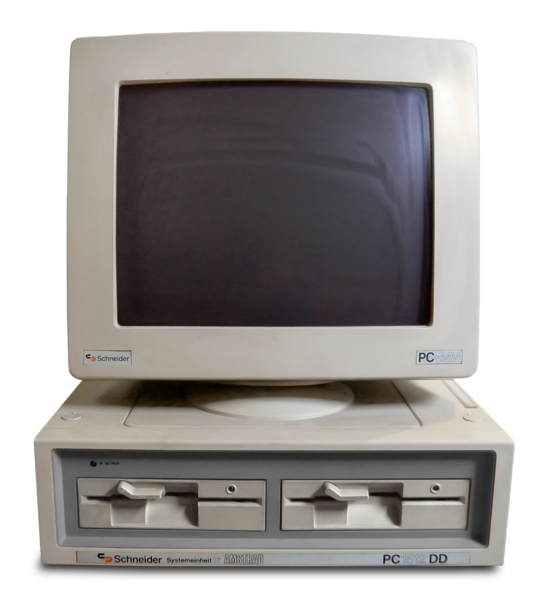
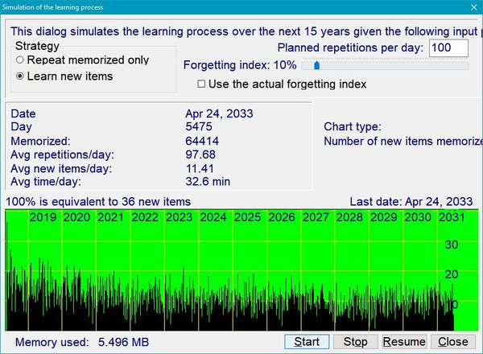
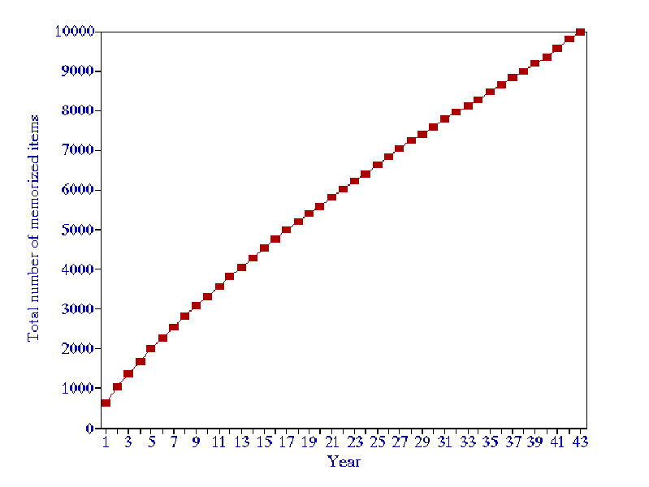
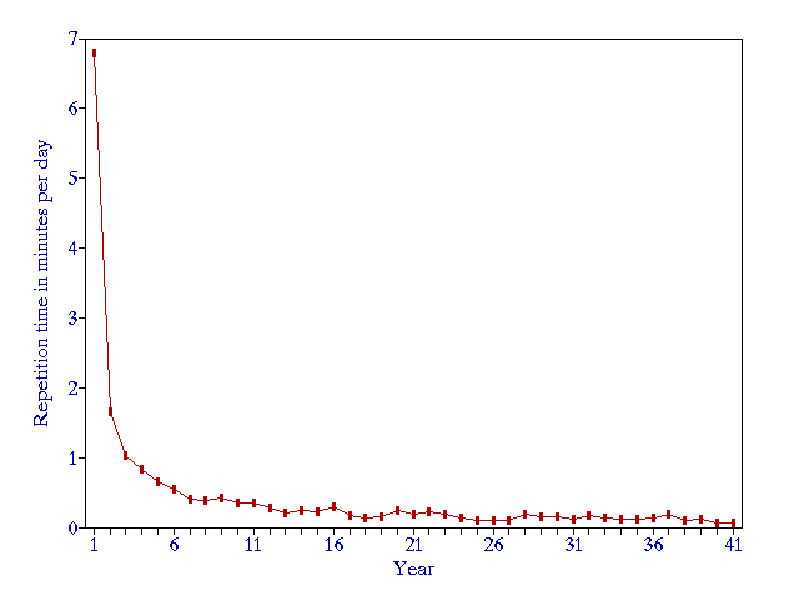
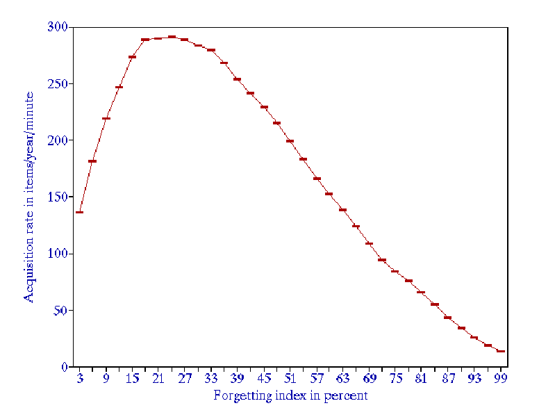
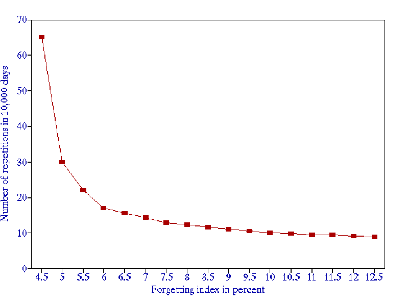
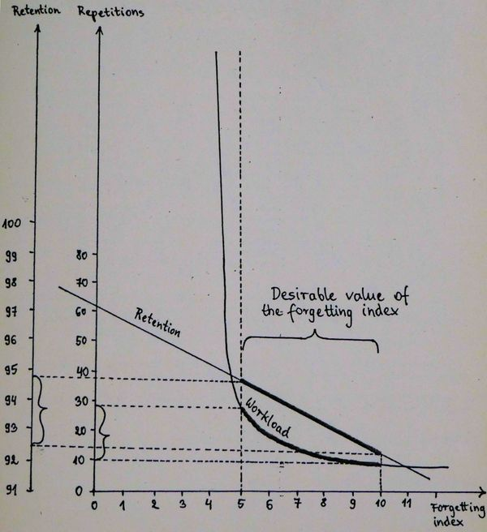

# 1986: First steps of SuperMemo

# 1986：SuperMemo 的第一步

[TOC=2,5]

## SuperMemo on paper 

## 纸上的 SuperMemo

On Feb 22, 1984, at the age of 22, I computed that, it would take me 26 years to [master the essential English vocabulary](https://supermemo.guru/wiki/Learning_English). If my learning rate did not improve, if I did not invest more time, I would need to wait till the decrepit age of 48. This seemed like eternity. With the arrival of [SuperMemo on paper](https://supermemo.guru/wiki/SuperMemo_on_paper) that statistic improved dramatically overnight. Today, in [SuperMemo](https://supermemo.guru/wiki/SuperMemo), the standard is 40,000 words in 4 years at 40 min/day (see: [Advanced English](https://supermemo.guru/wiki/Advanced_English)). For me, **the waiting time for fluent English has been cut short 7-fold**.

1984 年 2 月 22 日，我在 22 岁的时候计算出，我需要 26 年的时间才能掌握基本的英语词汇。如果我的学习率没有提高，如果我不投入更多的时间，我就需要等到 48 岁高龄。这似乎是永远。随着纸上的 SuperMemo 的到来，这一统计数据在一夜之间得到显著改善。今天，在 SuperMemo 中，这个标准是 4 万单词，在 4 年 中每天 40分钟（见：高级英语)。对我来说，**达到流利英语的时间缩短了 7 倍**。

In summer 1985, using [SuperMemo on paper](https://supermemo.guru/wiki/SuperMemo_on_paper), I started learning with great enthusiasm. For the first time ever, I knew that all investment in learning would pay. Nothing could slip through the cracks. This early enthusiasm makes me wonder why I did not share my good news with others.

在 1985 年夏天，通过使用 [SuperMemo on paper](https://supermemo.guru/wiki/SuperMemo_on_paper)(纸上的 SuperMemo），我开始以极大的热情学习。我第一次知道，所有的学习投资都会有回报。任何东西都不能从缝里溜出去。这种早期的热情让我想知道为什么我没有和别人分享我的好消息。

[SuperMemo](https://supermemo.guru/wiki/SuperMemo) wasn't a "secret weapon" that many users employ to impress others. I just thought that science must have answered all questions related to efficient learning. My impression was that I only patched my own poor access to western literature with a bit of my own research. My naivete of the time was astronomical. My English wasn't good enough to understand news from the west. America was for me a land of super-humans who do super-science, land on the moon, do all major discoveries, and will soon cure cancer and become immortal. At the same time, it was a land of Reagan who could blast Poland off the surface of the earth with his Pershing or Cruise missiles (deployed in Europe in 1979). That gave me a couple of nightmares. Nuclear missiles might have been the only major source of stress for me in the early 1980s. I often ponder amazing inconsistencies in the brains of toddlers and kids. To me, the naivete of my early twenties tells me I must have been a late bloomer with very uneven development. Ignorance of English translated to the ignorance of the world. I was a young adult with areas of strength, and areas of incredible ignorance. In that context, [spaced repetition](https://supermemo.guru/wiki/Spaced_repetition) looks like a child of a need combined with ignorance, self-confidence, and [passion](https://supermemo.guru/wiki/Passion_and_memory).

SuperMemo 并不是许多用户用来给别人留下深刻印象的“秘密武器”。我只是想，科学一定已经回答了所有与高效学习有关的问题。我的印象是，我只是用自己的一点研究，弥补了自己接触西方文学的不足。我当时太天真了。我的英语不够好，听不懂西方的新闻。对我来说，美国是一个超级人类的国度，他们从事超级科学，登上月球，进行所有重大发现，很快就能治愈癌症，长生不老。与此同时，那里是里根的土地，他可以用他的潘兴(Pershing)导弹或巡航导弹(1979 年部署在欧洲)将波兰炸出地球表面。这让我做了几个噩梦。上世纪 80 年代初，核导弹可能是我唯一的主要压力来源。我经常思考幼儿和儿童大脑中惊人的不一致性。对我来说，20 岁出头的天真告诉我，我一定是一个大器晚成的人，发展很不平衡。不懂英语就等于不懂世界。我是一个年轻的成年人，有自己的长处，也有令人难以置信的无知。在这种情况下，[间隔重复](https://supermemo.guru/wiki/Spaced_repetition)看起来就像一个需要无知、自信和激情的孩子。

## University: computer science 

## 大学：计算机科学

In October 1985, I started my 5 years course in computer science at the University of Technology (Poznan). I lost my passion for the university in the first week of learning. Instead of programming, we were subjected to excruciatingly boring lectures in introductory topics: math, physics, electronics, etc. With a busy schedule, I might have easily become a [SuperMemo](https://supermemo.guru/wiki/SuperMemo) dropout. Luckily, my love for biochemistry and my need for English would not let me slow down. I continued my [repetitions](https://supermemo.guru/wiki/Repetition), adding new pages of knowledge from time to time. Most of all, I had a new dream: to have my own computer and to do some programming on my own. One of the first things I wanted to implement was SuperMemo. I would keep my pages on the computer, and have them scheduled for review automatically.

1985 年 10 月，我在(Poznan)理工大学开始了为期 5 年的计算机科学课程。在学习的第一周，我失去了对大学的热情。我们没有学习编程，而是学习了一些极其枯燥的入门课程：数学、物理、电子等。在繁忙的日程安排下，我可能很容易成为 [SuperMemo](https://supermemo.guru/wiki/SuperMemo) 的辍学生。幸运的是，我对生物化学的热爱和对英语的需要并没有让我放慢脚步。我继续我的[重复](https://supermemo.guru/wiki/repeat)，不时地添加新的知识页。最重要的是，我有了一个新的梦想：拥有自己的电脑，自己编程。我想要实现的第一个东西是 SuperMemo。我会把我的知识页保存在电脑上，并安排它们自动复习。

I casually mentioned my "super-learning method" to my high school friend [Andrzej "Mike" Kubiak](https://supermemo.guru/wiki/Mike_Kubiak) only in summer 1987 (Aug 29). We played football and music together. I finally showed him how to use SuperMemo on Nov 14, 1987. It took 836 days (2 years 3 months and 2 weeks) for me to recruit the [first user of SuperMemo](https://supermemo.guru/wiki/Exponential_adoption_of_spaced_repetition). Mike was later my guinea pig in trying out [SuperMemo](https://supermemo.guru/wiki/SuperMemo) in procedural learning. He kept practicing computer-generated rhythms using a SuperMemo-like schedule. For Mike, SuperMemo was a love at first sight. His vocabulary rocketed. He remained faithful for many years up to a point when the quality of his English outstripped the need for further learning. He is a yogi. His trip to India, and regular use of English have consolidated the necessary knowledge for life.

直到 1987 年夏天(8 月 29 日)，我才偶然向我的高中朋友 [Andrzej "Mike" Kubiak](https://supermemo.guru/wiki/Mike_Kubiak) 提到我的"超级学习方法"。我们一起踢足球和听音乐。我终于在 1987 年 11 月 14 日向他展示了如何使用 SuperMemo。我花了 836 天(2 年 3 个月 2 周)的时间招到了第一个 SuperMemo 用户。Mike 后来是我在程序学习中尝试 [SuperMemo](https://supermemo.guru/wiki/SuperMemo) 的小白鼠。他一直在用类似 SuperMemo 的时间表练习电脑生成的节奏。对 Mike 来说，SuperMemo 让他一见钟情。他的词汇量飙升。他保持了多年的忠诚，直到他的英语水平超过了进一步学习的需要。他是个瑜伽哲学专家。他的印度之行和经常使用英语巩固了生活所必需的知识。

## ZX Spectrum

## ZX Spectrum

In 1986 and 1987, I kept thinking about implementing [SuperMemo](https://supermemo.guru/wiki/SuperMemo) in software more and more often. Strangely, initially, I did not think much about the problem of separating pages into individual [flashcards](https://supermemo.guru/wiki/Item). This illustrates how close-minded we can be when falling into a routine of doing the same things daily. To get to the status of 2018, SuperMemo had to undergo dozens of breakthroughs and similarly obvious microsteps. It all seems so simple and obvious in hindsight. However, there are hidden limits to human thinking that prevented [incremental reading](https://supermemo.guru/wiki/Incremental_reading) from emerging a decade earlier. Only a fraction of those limits come from technology.

在 1986 年和 1987 年，我越来越多地考虑在软件中实现 [SuperMemo](https://supermemo.guru/wiki/SuperMemo)。奇怪的是，一开始，我并没有过多考虑将页分割成单独的[抽认卡](https://supermemo.guru/wiki/Item)。这说明，当我们陷入每天做同样事情的例行公事时，我们的思维是多么封闭。要想进入 2018 年的状态，SuperMemo 必须经历几十次突破，以及类似的明显的微步骤。事后看来，这一切似乎都那么简单明了。然而，人类思维存在着一些隐藏的限制，阻碍了 10 年前出现的[渐进阅读](https://supermemo.guru/wiki/Incremental_reading)。这些限制中只有一小部分来自技术。

In my first year at the university, I had very little time and energy to spare. Most of my time I invested in getting my first computer: ZX Spectrum(Jan 1986). I borrowed one from a friend for a day in Fall 1985, and was totally floored with the magic. I started programming "on paper" long before I got the toy. My first program was for "planning the day". It was a precursor of [Plan](https://supermemo.guru/wiki/Plan). The program was ready to type in into the computer when I turned on my ZX Spectrumfor the first time on Jan 4, 1986. As of that day, I spent most of my days on programming, ignoring school, and writing my programs on paper even during classes.

在大学的第一年，我几乎没有多余的时间和精力。我的大部分时间都花在买第一台电脑上：ZX Spectrum(1986 年 1 月)。1985 年秋天的一天，我从一个朋友那里借了一台，我完全被它的魔力迷住了。早在我得到这个玩具之前，我就开始“在纸上”编程了。我的第一个程序是“计划一天”。它是 Plan 的前身。1986 年 1 月 4 日，当我第一次打开 ZX Spectrum时，程序已经准备好输入计算机了。从那天起，我的大部分时间都花在编程上，不去上学，甚至在课堂上也把程序写在纸上。

> **Figure:** ZX Spectrum 8-bit microcomputer. SuperMemo could not be implemented on ZX Spectrumas the computer lacked disk storage. All programs and data had to be loaded in from a cassette tape
>
> **图：** ZX Spectrum 8 位微机。由于计算机缺乏磁盘存储，无法在 ZX Spectrum上实现 SuperMemo。所有程序和数据都必须从盒式磁带中装入

## The Army 

## 军队生活

Early 1986 was marred by the threat of [conscription](https://supermemo.guru/wiki/Conscription). I thought that 5 more years of university meant 5 more years of freedom. However, The Army had different ideas. For the Polish communist army, the second major did not count. I had to bend over backwards to avoid the military service. My anger was tripled by the fact that I would never ever contemplate 12 months of separation from my best new friend: ZX Spectrum. I told the men in uniform that they really do not want to have an angry man with a gun in their ranks. Luckily, in the mess of the communist bureaucracy, I managed to slip the net, and continue my education. To this day, I am particularly sensitive to the issues of freedom. Conscription isn't much different from slavery. It was not the type of conscription in the name of combating fascism. It was a conscription for mindless drills, goosestep, early alarms, hot meals in a hurry, and stress. If this was to serve the readiness of Communist Bloc, this would be a readiness of [Good Soldier Švejk Army](https://en.wikipedia.org/wiki/The_Good_Soldier_Švejk). Today, millions of kids are sent to school in a similar conscription-like effort verging on slavery. Please read my *"I would never send my kids to school"* for my take on the coercive trample of the [human rights of children](https://supermemo.guru/wiki/Education_as_a_human_right). I am sure that some of my sentiments have been shaped by the sense of enslavement from 1986.

1986 年初，征兵的威胁破坏了这一进程。我以为再上 5 年大学就意味着再多 5 年的自由。然而，军队有不同的想法。对于波兰共产党军队来说，第二专业不算数。我不得不拼命避免服兵役。我从来没有想过要和我最好的新朋友 ZX Spectrum 分开 12 个月，这让我的愤怒翻了三倍。我告诉那些穿制服的人，他们真的不想看到一个拿着枪的愤怒的人站在他们的队伍里。幸运的是，在共产主义官僚主义的混乱中，我设法逃脱了惩罚，继续我的学业。直到今天，我对自由问题仍然特别敏感。征兵制和奴隶制没有太大不同。这不是以打击法西斯主义的名义进行的征兵。这是一种征兵制，要进行盲目的操练、鸡皮疙瘩、早早地拉响警报、匆匆忙忙地吃热腾腾的饭，还要承受巨大的压力。如果这是为共产主义集团的准备，这将是一个准备的优秀士兵什维克军队。今天，数以百万计的孩子被送进学校，类似于奴隶制度。请阅读我的*“我永远不会送我的孩子上学”*，我对强制践踏儿童人权的看法。我相信我的一些情绪是从 1986 年开始就被奴役的感觉所塑造的。

On the day when the radioactive cloud from Chernobyl passed over Poznan, Poland, I was busy walking point to point across the vast city visiting military and civilian offices in my effort to avoid the military service. I succeeded! The summer of 1986 was one of the sunniest ever. I spent my days on programming, jogging, learning with [SuperMemo](https://supermemo.guru/wiki/SuperMemo) ([on paper](https://supermemo.guru/wiki/SuperMemo_on_paper)), swimming, football, and more programming.

当切尔诺贝利的放射性云团经过波兰波兹南的那一天，我正忙着在这座巨大的城市里一个接一个地走动，参观军事和文职办公室，以避免服兵役。我成功了！1986 年夏天是有史以来阳光最充足的夏天之一。我每天都在编程、慢跑、用 [SuperMemo](https://supermemo.guru/wiki/SuperMemo) 学习、游泳、足球，以及更多的编程。

## Summer 1986 

## 1986 年的夏天

My appetite for new software was insatiable. I wrote a program for musical composition, for predicting the outcomes of the World Cup, for tic-tac-toe in 3D, for writing school tests, and many more. I got a few jobs from the Department of Biochemistry (Adam Mickiewicz University). My hero, Prof. Augustyniak, needed software for simulating the melting of DNA, and for fast search of tRNA genes (years later that led to a [peer review](https://supermemo.guru/wiki/Peer_review) publication). He also commissioned a program for regression analysis that later inspired progress in [SuperMemo](https://supermemo.guru/wiki/SuperMemo) (esp. Algorithms SM-6 and SM-8).

我对新软件的欲望是无止境的。我写程序，为了音乐作曲、预测世界杯结果、3D 井字游戏、写学校的考试等等。我在生物化学系( Adam Mickiewicz 大学)找到了几份工作。我心目中的英雄，Augustyniak 教授，需要一种软件来模拟 DNA 的融化，以及对 tRNA 基因的快速搜索(几年后，这篇论文发表在了同行评议上)。他还委托了一个用于回归分析的程序，这个程序后来启发了 [SuperMemo](https://supermemo.guru/wiki/SuperMemo)(特别是算法 SM-6 和 SM-8)的发展。

While programming, I had SuperMemo at the back of my mind all the time, however, all my software was characterized by the absence of any database. The programs had to be read from a cassette tape which was a major drag (it did not bother me back in 1986). It was simpler to keep my SuperMemo knowledge on paper. I started dreaming of a bigger computer. However, in Communist Poland, the cost was out of reach. Once I computed that an IBM PC would cost as much as my mom's lifetime wages in the communist system. As late as in 1989, during a student training, I could not afford a visit in a toilet in the Netherlands because it was so astronomically expensive when compared with wages in Poland. In those days, I was able to live abroad on a diet of a single banana per day.

在编程的时候，我的脑子里一直有 SuperMemo，但是，我所有的软件都没有任何数据库。这些程序必须从磁带上读取，这是一个主要的阻碍(这在 1986 年并没有困扰我)。把我的 SuperMemo 知识写在纸上要简单得多。我开始梦想有一台更大的电脑。然而，在共产主义的波兰，成本是无法承受的。有一次，我计算出一台 IBM 个人电脑的成本相当于我母亲在共产主义制度下的终身工资。直到 1989 年，在一次学生培训期间，我还买不起荷兰的厕所，因为与波兰的工资相比，荷兰的厕所贵得离谱。在那些日子里，我每天只吃一根香蕉就能在国外生活。

## My first personal computer: Amstrad PC 1512

## 我的第一台私人电脑：Amstrad PC 1512

My whole family pulled in resources. My cousin, Dr Garbatowski, arranged a special foreign currency account for Deutsch Mark transfers. By some hard-to-explain miracle, I was able to afford DM 1000 Amstrad PC 1512 from Germany. The computer was not smuggled as it was once reported in the press. My failed smuggling effort came two years earlier in a quest to get ZX Spectrum. My friends from Zaire were to buy it for me in West Berlin. In the end, I bought second-hand ZX Spectrumin Poland, at a good price, from someone who thought he was selling "just a keyboard".

我们全家都动用了资源。我的堂兄 Garbatowski 博士为德国马克转账安排了一个特殊的外汇账户。由于某种难以解释的奇迹，我能够买得起 1000 德国马克 的 Amstrad 个人电脑 1512。这台电脑并不像媒体曾经报道的那样是走私来的。我失败的走私行动是在两年前为了获得 ZX Spectrum 而进行的。我在 Zaire 的朋友打算在西柏林给我买。最后，我在波兰以很好的价格从一个人那里买了二手的 ZX Spectrum，他认为自己卖的“只是一个键盘”。

> **Figure:** Amstrad PC-1512 DD. My version had only one diskette drive. Operating system MS-DOS had to be loaded from one diskette, Turbo Pascal 3.0 from another diskette, SuperMemo from yet another. Until I had my first hard drive in 1991, my English collection had to be split into 3000-item portions. My 39,000 items had to be kept on 13 diskettes. I had many more for other areas of knowledge. On Jan 21, 1997, SuperMemo World has tracked down that original PC and bought it back from its owner: Jarek Kantecki. The PC was fully functional for the whole decade. It is now buried somewhere in dusty archives of the company. Perhaps we will publish its picture at some point. The presented picture comes from Wikipedia
>
> **图：** Amstrad PC-1512 DD。我的版本只有一个磁盘驱动器。操作系统 MS-DOS 必须从一个磁盘加载，Turbo Pascal 3.0 必须从另一个磁盘加载，SuperMemo 必须从另一个磁盘加载。直到 1991 年我有了自己的第一个硬盘，我的英语集合不得不分成 3000 个部分。我的 39000 条项目被保存在13个磁盘上。我有很多其他领域的知识。1997 年 1 月 21 日，SuperMemo World 找到了那台最初的个人电脑，并从它的主人 Jarek Kantecki 手中买了回来。这台个人电脑在整整十年里功能齐全。现在它被埋在公司尘封的档案中。也许我们会在某个时候发布它的照片。图片来自维基百科

My German Amstrad-Schneider PC 1512 was ordered from a Polish company Olech. Olech was to deliver it in June 1987. They did it in September. This cost me the whole summer of stress. Some time later, [Krzysztof Biedalak](https://supermemo.guru/wiki/Krzysztof_Biedalak) ordered a PC from a Dutch company Colgar and never got a PC or money back. If this happened to me, I would have lost my trust in humanity. This would have killed SuperMemo. This might have killed my passion for computers. Biedalak, on the other hand, stoically got back to hard work and earned his money back and more. That would be one of the key personality differences between me and Biedalak. [Stress resilience](https://supermemo.guru/wiki/Stress_resilience) should be one of the components of development. I developed my stress resilience late with self-discipline training (e.g. [winter swimming](https://supermemo.guru/wiki/Winter_swimming), marathons, etc.). Having lost his money, Biedalak did not complain. He got it back in no time. Soon I was envious of his new shiny PC. His hard work and determination in achieving goals was always a key to the company's survival. It was his own privately earned money that helped [SuperMemo World](https://supermemo.guru/wiki/SuperMemo_World) survive the first months. He did not get a gift from his parents. He could always do things on his own.

我的德国 Amstrad-Schneider PC 1512 是从一家波兰公司 Olech 订购的。1987 年 6 月，Olech 公司将交付这款产品。他们在九月份做的。这让我整个夏天都很紧张。过了一段时间，[Krzysztof Biedalak](https://supermemo.guru/wiki/Krzysztof_Biedalak) 从一家荷兰公司 Colgar 订购了一台 PC，但一直没收到一台 PC 或退款。如果这件事发生在我身上，我就失去了对人类的信任。这将扼杀 SuperMemo。这可能扼杀了我对电脑的热情。另一方面，Biedalak 坚忍地继续努力工作，挣回了更多的钱。这将是我和 Biedalak 之间的主要性格差异之一。[压力恢复力](https://supermemo.guru/wiki/_resilience)应该是开发的组成部分之一。我通过自律训练(例如：[冬泳](https://supermemo.guru/wiki/Winter_swimming)、马拉松等)，培养了自己的抗压能力。Biedalak 丢了钱，但他没有抱怨。他很快就把它拿了回来。很快我就嫉妒起他那台闪闪发光的新电脑来。他的努力工作和实现目标的决心一直是公司生存的关键。正是他自己的私人收入帮助 [SuperMemo World](https://supermemo.guru/wiki/SuperMemo_World) 熬过了最初的几个月。他没有从父母那里得到礼物。他总是能独立做事。

## Simulating the learning process 

## 模拟学习过程

On Feb 22, 1986, using my ZX Spectrum, I wrote a program to simulate long-term learning process with [SuperMemo](https://supermemo.guru/wiki/SuperMemo). I was worried that with the build-up of material, the learning process would slow down significantly. However, my preliminary results were pretty counterintuitive: the progress is almost linear. There isn't much slow down in learning beyond the very initial period.

1986 年 2 月 22 日，我使用 ZX Spectrum 编写了一个程序，用 [SuperMemo](https://supermemo.guru/wiki/SuperMemo) 模拟长期学习过程。我担心随着材料的积累，学习过程会明显放缓。然而，我的初步结果与直觉相反：进展几乎是线性的。在最初的学习阶段之后，学习的速度不会慢很多。

On Feb 25, 1986, I extended the simulation program by new functions that would answer "*burning questions about memory*". The program would run on Spectrum over 5 days until I could get full results for 80 years of learning. It confirmed my original findings.

1986 年 2 月 25 日，我扩展了模拟程序，增加了一些新功能，可以回答“关于记忆的迫切问题”。这个程序将在 Spectrum 上运行 5 天，直到我可以获得 80 年学习的全部结果。它证实了我最初的发现。

On Mar 23, 1986, I managed to write the same simulation program in Pascal which was a compiled language. This time, I could run 80 years simulation in just 70 minutes. I got the same results. Today, SuperMemo still makes it possible to run similar simulations. The same procedure takes just a second or two.

1986 年 3 月 23 日，我成功地用 Pascal 编写了同样的仿真程序，Pascal 是一种编译语言。这一次，我可以在 70 分钟内运行 80 年的模拟。我得到了同样的结果。今天，SuperMemo 仍然可以运行类似的模拟。同样的过程只需要一两秒钟。

> **Figure:** SuperMemo makes it possible to simulate the course of learning over 15 years using real data collected during repetitions.
>
> **图：** SuperMemo 可以使用在重复过程中收集的真实数据模拟 15 年以上的学习过程

Some of the results of that simulation are valid today. Below I present some of the original findings. Some might have been amended in [1990](https://supermemo.guru/wiki/Optimization_of_learning) or [1994](https://supermemo.guru/wiki/Economics_of_learning).
该模拟的一些结果今天仍然有效。下面我将介绍一些最初的发现。有些可能在 [1990](https://supermemo.guru/wiki/Optimization_of_learning) 或 [1994](https://supermemo.guru/wiki/Economics_of_learning) 中进行了修改。

### Learning curve is almost linear

### 学习曲线几乎是线性的

The learning curve obtained by using the model of a [spaced repetition](https://supermemo.guru/wiki/Spaced_repetition) process, except for the very initial period, is almost linear:

使用间隔重复模型得到的学习曲线除初始阶段外，几乎是线性的：

> **Figure:** Learning curve for a generic material, forgetting index equal to 10%, and daily working time of 1 minute.
>
> **图：** 一般材料的学习曲线，遗忘系数为 10%，每天学习时间为 1 分钟。

### New items take 5% of the time 

### 新的项目需要 5% 的时间

In a long-term process, for the [forgetting index](https://supermemo.guru/wiki/Forgetting_index) equal to 10%, and for a fixed daily working time, the average time spent on memorizing new items is only 5% of the total time spent on repetitions. This value is almost independent of the size of the learning material.

在一个长期的过程中，[遗忘系数](https://supermemo.guru/wiki/Forgetting_index)等于 10%，并且每日学习时间固定，则平均花费在记忆新事物上的时间仅占总重复时间的 5%。这个值几乎与学习材料的多少无关。

### Speed of learning 

### 学习速度

According to the simulation, the number of items memorized in consecutive years when working one minute per day can be approximated with the following equation:

根据模拟，每天学习一分钟，连续几年记忆的项目数可以用以下公式近似：

> NewItems=aar\*(3\*e^(-0.3*year)+1)
>
> where:
>
> - NewItems - items memorized in consecutive years when working one minute per day,
>
> - year - ordinal number of the year,
>
> - aar - asymptotic acquisition rate, i.e. the minimum learning rate reached after many years of repetitions (usually about 200 items/year/min)
>
> 
>NewItems=aar\*(3\*e^(-0.3*year)+1)
> 
>式中：
> 
>- NewItems - 每天学习一分钟，连续几年记住的东西
> - year - 年数
> - aar - 渐进习得率，即经过多年重复(通常为 200 项/年/分钟)后达到的最低学习率
> 

In a long-term process, for the [forgetting index](https://supermemo.guru/wiki/Forgetting_index) equal to 10%, the average rate of learning for generic material can be approximated to 200-300 items/year/min, i.e. one minute of learning per day results in the acquisition of 200-300 items per year. Users of [SuperMemo](https://supermemo.guru/wiki/SuperMemo) usually report the average rate of learning from 50-2000 items/year/min.

在一个长期的过程，遗忘系数等于 10%，学习一般材料的平均学习率可以近似为 200 - 300 项/年/分钟，即每天一分钟的学习导致每年 200 - 300 项的习得。[SuperMemo](https://supermemo.guru/wiki/SuperMemo) 的用户通常报告平均学习速度为 50 - 2000 项/年/分钟。

### Workload 

### 学习负荷

For a generic material and the [forgetting index](https://supermemo.guru/wiki/Forgetting_index) of about 10%, the function of time required daily for repetitions per item can roughly be approximated using the formula:

对于一般材料和大约 10% 的[遗忘系数](https://supermemo.guru/wiki/Forgetting_index)，可以大致用公式近似出每项每天重复所需时间的函数:

> time=1/500*year-1.5+1/30000
>
>where:
>
> - time - average daily time spent for repetitions per item in a given year (in minutes),
>- year - year of the process.
> 
> 时间=1/500*年-1.5+1/30000
>
> 上式中：
>
> - 时间 - 在某一年里，每个项目每天重复的平均时间(以分钟为单位)
>- 年 - 进程的年数
> 

As the time necessary for repetitions of a single item is almost independent of the total size of the learned material, the above formula may be used to approximate the workload for learning material of any size. For example, the total workload for a 3000-element collection in the first year will be 3000/500*1+3000/30000=6.1 (min/day).

由于单个项目的重复所需要的时间几乎与学习材料的总长度无关，所以可以用上面的公式来近似任何长度的学习材料的学习负荷。例如，第一年 3000 个项目集合的总将是 3000/500*1+3000/30000=6.1 (分钟/天)。

> **Figure:** Workload, in minutes per day, in a generic 3000-item learning material, for the forgetting index equal to 10%.
>
> **图：** 学习负荷，以分钟为单位，在一般的 3000 项学习材料，遗忘系数等于 10%。

### Optimum forgetting index 

### 最佳遗忘系数

The greatest overall [knowledge acquisition rate](https://supermemo.guru/wiki/Knowledge_acquisition_rate) is obtained for the [forgetting index](https://supermemo.guru/wiki/Forgetting_index) of about 20-30%. This results from the trade-off between reducing the repetition workload and increasing the relearning workload as the forgetting index progresses upward. In other words, high values of the forgetting index result in longer [intervals](https://supermemo.guru/wiki/Interval), but the gain is offset by an additional workload coming from a greater number of forgotten [items](https://supermemo.guru/wiki/Item) that have to be relearned.

当[遗忘系数](https://supermemo.guru/wiki/Forgetting_index)约为 20 - 30%时，总的[知识获取率](https://supermemo.guru/wiki/Knowledge_acquisition_rate)最高。这是由于随着遗忘系数的上升，减少重复的学习负荷和增加重新学习的学习负荷之间的权衡。换句话说，更大的遗忘系数导致更长的[间隔](https://supermemo.guru/wiki/Interval)，但是必须重新学习的大量遗忘[项目](https://supermemo.guru/wiki/Item)带来的额外学习负荷抵消了这一收益。

For the forgetting index greater than 20%, the positive effect of long intervals on memory resulting from the [spacing effect](https://supermemo.guru/wiki/Spacing_effect) is offset by an increasing number of forgotten items.

对于遗忘系数大于 20% 的情况，[间隔效应](https://supermemo.guru/wiki/Spacing_effect)所产生的长时间间隔对记忆的积极影响被越来越多的遗忘项所抵消。

> **Figure:** Dependence of the knowledge acquisition rate on the forgetting index.
>
> **图：** 知识习得率与遗忘系数的关系

When the [forgetting index](https://supermemo.guru/wiki/Forgetting_index) drops below 5%, the repetition workload increases rapidly (see the figure above). The recommended value of the forgetting index used in the practice of learning is 6-14%.

当[遗忘系数](https://supermemo.guru/wiki/Forgetting_index)降到 5% 以下时，重复学习负荷会迅速增加(见上图)。在学习实践中，遗忘系数的推荐值为 6-14%。

> **Figure:** Trade-off between the knowledge retention (forgetting index) and the workload (number of repetitions of an average item in 10,000 days).
>
> **图：** 知识保留(遗忘系数)与学习负荷(平均 10000 天内重复一项的次数)之间的权衡

In later years, the value of the optimum [forgetting index](https://supermemo.guru/wiki/Forgetting_index) was found to differ depending on the tools used (e.g. [Algorithm SM-17](https://supermemo.guru/wiki/Algorithm_SM-17)).

在后来的几年里，人们发现最佳[遗忘系数](https://supermemo.guru/wiki/Forgetting_index)的值会因使用的工具而不同(例如[Algorithm SM-17](https://supermemo.guru/wiki/Algorithm_SM-17))。

For example, using the model of intermittent learning, I argued that the optimum might fall in 5-10% range:

例如，使用间歇学习模型，我认为最优值可能在 5-10% 范围内:

> ***Fig. 11.2. Workload-retention trade-off:*** *On one hand, if forgetting index is lower than 5%, then the workload increases dramatically without substantially affecting the retention. On the other, above forgetting index of 10%, workload hardly changes while retention steadily falls down. Obviously, the workload-retention trade-off corresponds directly to the compromise between the acquisition rate and retention. By increasing the availability of time X times (by decreasing the workload X times), one can increase the acquisition rate X times (compare Chapter 5). Note, that the relation of the forgetting index and retention in this model is almost linear.* (source: [Optimization of learning](https://supermemo.guru/wiki/Optimization_of_learning): *Model of intermittent learning*, [Piotr Wozniak](https://supermemo.guru/wiki/Piotr_Wozniak), 1990)
>
> **图 11.2.学习负荷-保留率权衡：** 一方面，如果遗忘系数低于 5%，那么学习负荷就会显著增加，而对记忆没有显著影响。另一方面，超过 10% 的遗忘系数，学习负荷几乎没有变化，而保留率却在稳步下降。显然，学习负荷-保留率权衡直接对应了习得率和保持率之间的折衷。通过增加 X 倍的时间可用性(减少学习负荷 X 倍)，就可以增加习得率 X 倍(比较第 5 章)。注意，该模型中遗忘系数与保留率的关系几乎是线性的。(来源：[优化学习](https://supermemo.guru/wiki/Optimization_of_learning)：*间歇学习模型*，[Piotr Wozniak](https://supermemo.guru/wiki/Piotr_Wozniak)， 1990)

### Memory capacity 

### 记忆容量

My models of learning made me pretty pessimistic about the maximum lifetime capacity of human memory. By 1990, I stated I doubt I will ever see anyone with over million [SuperMemo items](https://supermemo.guru/wiki/Item) in memory (assuming SuperMemo-level recall):

我的学习模式让我对人类一生中记忆的最大容量相当悲观。到 1990 年，我说我怀疑我将永远不会看到任何人在记忆中有超过百万的 [SuperMemo 项目](https://supermemo.guru/wiki/Item)(假设有 SuperMemo 级别的回忆率)：

The maximum lifetime capacity of the human brain to acquire new knowledge by means of learning procedures based on [spaced repetition](https://supermemo.guru/wiki/Spaced_repetition) can be estimated as no more than several million [items](https://supermemo.guru/wiki/Item). As nobody is likely to spend all his life on learning, I doubt I will ever see anyone with a million items in his memory

人类大脑通过基于[间隔重复](https://supermemo.guru/wiki/Spaced_repetition)的学习过程获取新知识的最大寿命容量可以估计为不超过几百万个[项目](https://supermemo.guru/wiki/Item)。因为没有人可能把他的一生都花在学习上，我怀疑我将永远不会看到任何人在他的记忆中有一百万个项目