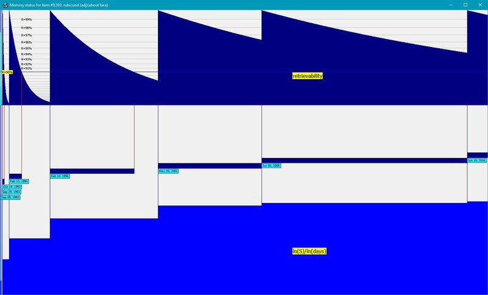
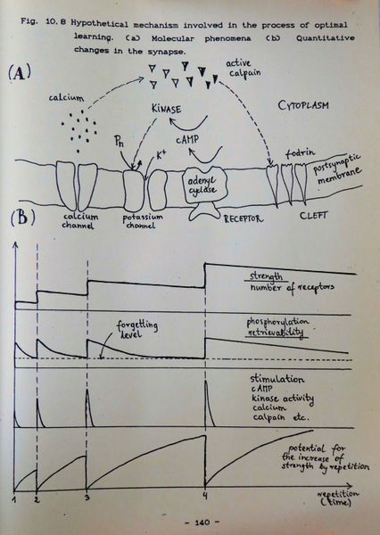

# 1988: Two component of memory

# 1988：记忆的两个组成成分

[TOC=2,5]

[Two-component model of long-term memory](https://supermemo.guru/wiki/Two-component_model_of_long-term_memory) lays at the foundation of [SuperMemo](https://supermemo.guru/wiki/SuperMemo), and is expressed explicitly in [Algorithm SM-17](https://supermemo.guru/wiki/Algorithm_SM-17). It differentiates between how [stable](https://supermemo.guru/wiki/Stability) knowledge is in long term memory storage, and how [easy it is to retrieve](https://supermemo.guru/wiki/Retrievability). This remains a little known and quintessential fact of the theory of learning that one can be fluent and still remember poorly.

[长期记忆的双组分模型](https://supermemo.guru/wiki/Two-component_model_of_long-term_memory)是 [SuperMemo](https://supermemo.guru/wiki/SuperMemo) 的基础，并在 [SM-17 算法](https://supermemo.guru/wiki/Algorithm_SM-17)中明确表示。它区分了知识在长期记忆存储中的稳定性和提取的难易程度。这仍然是学习理论中一个鲜为人知的典型事实，即一个人可以流利，但记忆力仍然很差。

Fluency is a poor measure of learning in the long term

从长远来看，流利度并不能很好地衡量学习效果。

## Components of long-term memory

## 长期记忆的组成成分

For many years, memory researchers used the term *strength of memory*. It was supposed to reflect how well things are remembered.

多年来，记忆研究人员一直使用“记忆强度”这个词。它应该反映出人们对事物的记忆有多好。

My work over [spaced repetition](https://supermemo.guru/wiki/Spaced_repetition) in the mid 1980s lead to a quick realization that one variable, *strength*, is not enough to describe the status of a piece of knowledge stored in long-term memory. We need two variables that separate the strength from the ease with which a fact can be retrieved from memory.

上世纪 80 年代中期，我对[间隔重复](https://supermemo.guru/wiki/Spaced_repetition)的研究让我很快意识到，一个*强度*变量不足以描述存储在长期记忆中的知识的状态。我们需要两个变量来区分事实从记忆中提取的难易程度。

I concluded that the status of a piece of knowledge stored in long-term memory can be described by two variables that I named: [stability](https://supermemo.guru/wiki/Stability) and [retrievability](https://supermemo.guru/wiki/Retrievability). Stability of memory tells you how long the memory can last in the storage. Retrievability tells you how easy it is to recall a piece of knowledge. Those two variables used to be conflated in memory research.

我的结论是，存储在长期记忆中的知识的状态可以用两个变量来描述：[稳定性](https://supermemo.guru/wiki/Stability)和[可提取性](https://supermemo.guru/wiki/Retrievability)。记忆的稳定性告诉您记忆在存储中可以持续多长时间。可提取性告诉你回忆一段知识是多么容易。在记忆研究中，这两个变量常常被混为一谈。

Amazingly, three decades after my observations, the idea of two components of memory is still to permeate mainstream memory research. In 2018, most of papers ignore the separation between the two variables and still rely on a single concept of *memory strength*. This leads to monumental confusion and slow progress in research.

令人惊讶的是，在我观察了三十年之后，记忆的两个组成成分的概念仍然在渗透主流的记忆研究。2018 年，大多数论文忽略了这两个变量的分离，仍然依赖于单一的“记忆强度”概念。这导致了巨大的困惑和研究进展缓慢。

## Origins of the two component model of memory

## 记忆双组分模型的起源

I first described the idea of the [two components of long-term memory](https://supermemo.guru/wiki/Two_component_model_of_memory) in a paper for my computer simulations class on Jan 9, 1988. In an unrelated line of reasoning, in the same paper, I concluded that different circuits must be involved in [declarative](https://supermemo.guru/wiki/Declarative_learning) and [procedural learning](https://supermemo.guru/wiki/Procedural_learning).

1988 年 1 月 9 日，我在计算机模拟课上的一篇论文中首次描述了[长期记忆的两个组成成分](https://supermemo.guru/wiki/Two_component_model_of_memory)。在同一篇论文中，我用了一种不相关的推理方法，得出结论：[陈述性学习](https://supermemo.guru/wiki/programural_learning)和[过程性学习](https://supermemo.guru/wiki/programural_learning)一定涉及不同的回路。

If you pause for a minute, the whole idea of the two components should be pretty obvious. If you take two [memories](https://supermemo.guru/wiki/Item) right after a review, one with a short [optimum interval](https://supermemo.guru/wiki/Optimum_interval), and the other with a long optimum interval, the memory status of the two must differ. Both can be recalled perfectly (maximum [retrievability](https://supermemo.guru/wiki/Retrievability)) and they also need to differ in how long they can last in memory (different [stability](https://supermemo.guru/wiki/Stability)). I was surprised I could not find any literature on the subject. However, if the literature has no mention of the existence of the [optimum interval](https://supermemo.guru/wiki/Optimum_interval) in [spaced repetition](https://supermemo.guru/wiki/Spaced_repetition), this seemingly obvious conclusion might be hiding behind another seemingly obvious idea: the [progression of increasing interval in optimally spaced review](https://supermemo.guru/wiki/Birth_of_SuperMemo). This is a lovely illustration how human progress is incremental and agonizingly slow. We are notoriously bad at thinking out of the box. The darkest place is under the candlestick. This weakness can be broken with an explosion of communication on the web. I advocate less [peer review](https://supermemo.guru/wiki/Peer_review), and more bold hypothesizing. I speak of a fantastic example coming from [Robin Clarke's paper in reference to Alzheimer's](https://supermemo.guru/wiki/Bad_learning_contributes_to_Alzheimer's). Strict peer review is reminiscent of [Prussian schooling](https://supermemo.guru/wiki/Prussian_education_system): in the quest for perfection, we lose our creativity, then humanity, and ultimately the pleasure of life.

如果您停下来思考一分钟，那么双组分的整个思想应该是非常显然的。如果你在复习后马上取两段记忆，一段最佳时间间隔很短，另一段最佳时间间隔很长，那么这两段记忆的记忆状态必然不同。两者都可以被完美地回忆(最大的可提取性)，它们还需要在记忆中持续的时间上有所不同(不同的稳定性)。我很惊讶我找不到任何关于这个主题的文献。然而，如果文献中没有提及在间隔重复中存在最优间隔，那么这个看似明显的结论可能隐藏在另一个看似明显的概念背后：在最优间隔复习中间隔递增的级数。这是一个可爱的例子，说明人类的进步是渐进的，而且缓慢得令人痛苦。我们是出了名的不善于创新。烛台下最暗。这一弱点可以通过网络交流的爆炸来打破。我主张少一些同行审查，多一些大胆的假设。我提到了 Robin Clarke 关于阿尔茨海默病的论文中的一个很好的例子。严格的同行审查让人想起普鲁士的学校教育：在追求完美的过程中，我们失去了创造力，失去了人性，最终失去了生活的乐趣。

When I first presented my ideas to my teacher Dr Katulski on Feb 19, 1988, he was not too impressed, but he gave me a pass for computer simulations credit. Incidentally, a while later, Katulski became one of the first users of [SuperMemo 1.0 for DOS](https://supermemo.guru/wiki/SuperMemo_1.0_for_DOS).

1988 年 2 月 19 日，当我第一次向我的老师 Katulski 博士提出我的想法时，他并没有给我留下太深刻的印象，但他给了我一张计算机模拟学分的通行证。顺便说一句，不久之后，Katulski 成为 [SuperMemo 1.0 for DOS](https://supermemo.guru/wiki/SuperMemo_1.0_for_DOS) 的首批用户之一。

In my [Master's Thesis](https://supermemo.guru/wiki/Master's_Thesis) (1990), I added a slightly more formal proof of the existence of the two components (see [next](https://supermemo.guru/wiki/History_of_spaced_repetition_(print)#Proof)). That part of my thesis remained unnoticed.

在我的[硕士论文](https://supermemo.guru/wiki/Master's_Thesis)(1990)中，我添加了一个稍微正式的证明，证明这两个组件的存在(参见[下一节](https://supermemo.guru/wiki/History_of_spaced_repetition_(print)#Proof))。我论文的那一部分没有引起注意。

In 1994, J. Kowalski [wrote in Enter](http://www.super-memory.com/articles/kowal.htm), Poland:

1994年，J.Kowalski 在波兰恩特写道：

> We got to the point where the evolutionary interpretation of memory indicates that it works using the principles of increasing intervals and the [spacing effect](https://supermemo.guru/wiki/Spacing_effect). Is there any proof for this model of memory apart from the evolutionary speculation? In his Doctoral Dissertation, Wozniak discussed widely molecular aspects of memory and has presented a hypothetical model of changes occurring in the synapse in the process of learning. The novel element presented in the thesis was the distinction between the [stability](https://supermemo.guru/wiki/Stability) and [retrievability](https://supermemo.guru/wiki/Retrievability) of memory traces. This could not be used to support the validity of [SuperMemo](https://supermemo.guru/wiki/SuperMemo) because of the simple fact that it was SuperMemo itself that laid the groundwork for the hypothesis. However, an increasing molecular evidence seems to coincide with the stability-retrievability model providing, at the same time, support for the correctness of assumptions leading to SuperMemo. In plain terms, retrievability is a property of memory which determines the level of efficiency with which synapses can fire in response to the stimulus, and thus elicit the learned action. The lower the retrievability the less you are likely to recall the correct response to a question. On the other hand, stability reflects the history of earlier repetitions and determines the extent of time in which memory traces can be sustained. The higher the stability of memory, the longer it will take for the retrievability to drop to the zero level, i.e. to the level where memories are permanently lost. According to Wozniak, when we learn something for the first time we experience a slight increase in the stability and retrievability in synapses involved in coding the particular stimulus-response association. In time, retrievability declines rapidly; the phenomenon equivalent to forgetting. At the same time, the stability of memory remains at the approximately same level. However, if we repeat the association before retrievability drops to zero, retrievability regains its initial value, while stability increases to a new level, substantially higher than at primary learning. Before the next repetition takes place, due to increased stability, retrievability decreases at a slower pace, and the inter-repetition interval might be much longer before forgetting takes place. Two other important properties of memory should also be noted: (1) repetitions have no power to increase the stability at times when retrievability is high (spacing effect), (2) upon forgetting, stability declines rapidly
>
> 我们已经到了这样一个阶段，对记忆的进化解释表明，它使用的原理是增加间隔和[间隔效应](https://supermemo.guru/wiki/Spacing_effect)。除了进化论的推测外，还有什么证据可以证明这种记忆模型吗？在他的博士论文中，Wozniak 广泛地讨论了记忆的分子层面，并提出了一个假设模型，描述了学习过程中突触发生的变化。本文提出的新元素是记忆痕迹的[稳定性](https://supermemo.guru/wiki/Stability)和[可提取性](https://supermemo.guru/wiki/Retrievability)之间的区别。这不能用来支持 [SuperMemo](https://supermemo.guru/wiki/SuperMemo) 的有效性，因为一个简单的事实是，正是 SuperMemo 本身奠定了假设的基础。然而，越来越多的分子层面证据似乎与稳定性-可提取性模型相吻合，同时，该模型为导向 SuperMemo 的假设的正确性提供了支持。简单地说，可提取性是记忆的一种属性，它决定了突触对刺激反应的效率水平，从而引发学习行为。可提取性越低，您就越不可能回忆起对问题的正确回答。另一方面，稳定性反映了早期重复的历史，并决定了记忆痕迹能够维持的时间范围。记忆的稳定性越高，可提取性下降到零，即下降到记忆永久遗忘所需的时间就越长。根据 Wozniak 的说法，当我们第一次学习某样东西的时候，我们会在编码特定刺激反应关联的突触中体验到稳定性和可提取性的轻微提高。随着时间的推移，可提取性迅速下降；相当于遗忘的现象。同时，记忆的稳定性保持在大致相同的水平。然而，如果我们在可提取性下降到零之前重复这种关联，可提取性将恢复其初始值，而稳定性将增加到一个新的水平，显著高于初次学习时的水平。在下一次重复发生之前，由于稳定性的提高，可提取性以较慢的速度下降，在遗忘发生之前，重复之间的间隔可能要长得多。记忆的另外两个重要特性也应该注意到：(1) 当可提取性高时，重复不能增加稳定性(间隔效应)，(2) 遗忘时，稳定性迅速下降

## Peer review publication (1995)

## 同行评议刊物 (1995)

We published our ideas with Drs [Janusz Murakowski](https://supermemo.guru/wiki/Janusz_Murakowski) and [Edward Gorzelanczyk](https://supermemo.guru/wiki/Edward_Gorzelanczyk) in [1995](http://super-memory.com/english/2vm.htm). Murakowski perfected the mathematical proof. Gorzelanczyk fleshed out the molecular model. We have not heard much enthusiasm or feedback from the scientific community. The idea of two components of memory is like wine, the older it gets, the better it tastes. We keep wondering when it will receive a wider recognition. After all, we do not live in [Mendel](https://en.wikipedia.org/wiki/Gregor_Mendel)'s time to keep a good gem hidden in some obscure archive. There are [millions of users](https://supermemo.guru/wiki/Exponential_adoption_of_spaced_repetition) of [spaced repetition](https://supermemo.guru/wiki/Spaced_repetition) and even if 0.1% got interested in the theory, they would hear of our two components. Today, even the [newest algorithm](https://supermemo.guru/wiki/Algorithm_SM-17) in [SuperMemo](https://supermemo.guru/wiki/SuperMemo) is based on the two-component model and it works like a charm. Ironically, users tend to flock to [simpler solutions](https://supermemo.guru/wiki/Algorithm_SM-2), where all the mechanics of human memory remain hidden. Even at [supermemo.com](http://supermemo.com/) we make sure we do not scare customers with excess numbers on the screen. This way we trade the instructional power of the model for better adoption among users who crave simplicity.

我们与 [Janusz Murakowski 博士](https://supermemo.guru/wiki/Janusz_Murakowski)和 [Edward Gorzelanczyk 博士](https://supermemo.guru/wiki/Edward_Gorzelanczyk) 在 [1995](http://supermemory.com/english/2vm.htm) 发表了我们的想法。Murakowski 完善了数学证明。Gorzelanczyk 充实了分子模型。我们没有从科学界听到太多的热情和反馈。记忆的两个组成成分的概念就像葡萄酒，时间越久，味道就越好。我们一直想知道它什么时候会得到更广泛的认可。毕竟，我们并不是生活在[孟德尔](https://en.wikipedia.org/wiki/Gregor_Mendel)的时代，把一块好宝石藏在某个晦涩的档案中。间隔重复的用户数以百万计，即使只有 0.1% 的人对这个理论感兴趣，他们也会听说我们的两个组分。今天，甚至 [SuperMemo](https://supermemo.guru/wiki/Algorithm_SM-17) 中的[最新算法](https://supermemo.guru/wiki/SuperMemo)都是基于双组分模型的，而且运行起来很有魅力。具有讽刺意味的是，用户往往会涌向[更简单的解决方案](https://supermemo.guru/wiki/Algorithm_SM-2)，那里隐藏着人类记忆的所有机制。即使在 [supermemo.com](http://supermemo.com/) 上，我们也确保不会用屏幕上过多的数字吓到客户。这样，我们就可以在渴望简单的用户中更好地采用模型的指导功能。

## Robert Bjork's research

## Robert Bjork 的研究

The concept of the two components of memory has parallels in prior research, esp. by [Bjork](https://supermemo.guru/wiki/Bjork).

记忆的两个组成成分的概念在以前的研究中有相似之处，特别是在 [Bjork](https://supermemo.guru/wiki/Bjork) 的研究中。

In the 1940s, scientists investigated habit strength and response strength as independent components of behavior in rats. Those concepts were later reformulated in Bjork's disuse theory. Herbert Simon seems to have noticed the [need for memory stability variable in his paper in 1966](https://supermemo.guru/wiki/Herbert_Simon_predicted_two_component_model_of_memory). In 1969, [Robert Bjork](https://supermemo.guru/wiki/Robert_Bjork) formulated the *Strength Paradox*: a reverse relationship between the probability of recall and the memory effect of a review. Note that his is a restatement of the [spacing effect](https://supermemo.guru/wiki/Spacing_effect) in terms of the [two component model](https://supermemo.guru/wiki/Two_component_model), which is just a short step away from formulating the distinction between the variables of memory. This led to [Bjork's New Theory of Disuse (1992)](https://www.researchgate.net/profile/Robert_Bjork/publication/281322665_A_new_theory_of_disuse_and_an_old_theory_of_stimulus_fluctuation/links/58b6f20945851591c5d55e96/A-new-theory-of-disuse-and-an-old-theory-of-stimulus-fluctuation.pdf) that would distinguish between the storage strength and the retrieval strength. Those are close equivalents of [retrievability](https://supermemo.guru/wiki/Retrievability) and [stability](https://supermemo.guru/wiki/Stability) with a slightly different interpretation of the mechanisms that underlie the distinction. Most strikingly, Bjork believes that when [retrievability](https://supermemo.guru/wiki/Retrievability) drops to zero, stable memories are still retained (in our model, stability becomes indeterminate). At the cellular level, Bjork might be right, at least for a while, but practise of [SuperMemo](https://supermemo.guru/wiki/SuperMemo) shows the power of [complete forgetting](https://supermemo.guru/wiki/Complete_forgetting), while, from the neural point of view, retaining memories in disuse would be highly inefficient independent of their [stability](https://supermemo.guru/wiki/Stability). Last but not least, Bjork defines storage strength in terms of connectivity, which is very close to what I believe happens in good students: [coherence](https://supermemo.guru/wiki/Coherence) affects [stability](https://supermemo.guru/wiki/Stability).

在 20 世纪 40 年代，科学家研究了习惯强度和反应强度作为老鼠行为的独立组成部分。这些概念后来在 Bjork 的废用理论中重新表述。Herbert Simon 在 1966 年的论文中似乎注意到了记忆稳定性变量的必要性。1969 年，Robert Bjork 提出了强度悖论：回忆的概率和复习的记忆效果之间存在反向关系。请注意，他的是根据两分量模型对间隔效应的重述，这距离阐明记忆变量之间的区别只有一小步之遥。这引出了 Bjork 的新废用理论(1992)，该理论区分了储存强度和提取强度。这是与可提取性和稳定性相近的等价物，但对作为区别基础的机制的解释略有不同。最引人注目的是，Bjork 认为，当可提取性降至零时，仍然保留了稳定的记忆(在我们的模型中，稳定性变得不确定)。在细胞层面上，Bjork 可能是对的，至少在一段时间内是正确的，但实践 SuperMemo 显示了完全遗忘的力量，而从神经的角度来看，保留废弃的记忆将是非常低效的，独立于它们的稳定性。最后但并非最不重要的一点是，Bjork 用连接性来定义存储强度，这与我认为优秀学生身上会发生的事情非常接近：一致性会影响稳定性。

Why aren't the two components of memory entering mainstream research yet? I claim that if human mind tends to be short-sighted, and we all are, by design, the mind of science can be truly strangulated by strenuous duties, publish or perish, battles for grants, hierarchies, conflict of interest, [peer review](https://supermemo.guru/wiki/Peer_review), teaching obligations, and even the code of conduct. Memory researchers tend to live in a single dimension of "memory strength". In that dimension, they cannot truly appreciate true dynamics of molecular and neural processes that need to be investigated to crack the problem. Ironically, progress may come from those who tend to work in artificial intelligence or neural networks. Prodigious minds of [Demis Hassabis](https://en.wikipedia.org/wiki/Demis_Hassabis) or [Andreas Knoblauch](https://scholar.google.de/citations?user=xVXueeQAAAAJ&hl=en) come up with twin ideas by independent reasoning process, models, and simulations. Biologists will need to listen to the language of mathematics and/or computer science.

为什么记忆的两个组成成分还没有进入主流研究？我认为，如果人类的思维倾向于短视，而我们都是故意的，那么科学的头脑可能真的会被繁重的职责、发表或灭亡、拨款之争、等级制度、利益冲突、同行评议、教学义务，甚至行为准则扼杀。记忆研究人员倾向于生活在“记忆强度”的单一维度中。在这个维度上，他们不能真正理解需要研究以解决问题的分子和神经过程的真实动力学。具有讽刺意味的是，进步可能来自那些倾向于从事人工智能或神经网络工作的人。Demis Hassabis 或 Andreas Knoblauch 的惊人头脑通过独立的推理过程、模型和模拟提出了两个想法。生物学家将需要聆听数学和计算机科学的语言。

## Two component model in Algorithm SM-17

## 算法 SM-17 中的双组分模型

The [two component model of long-term memory](https://supermemo.guru/wiki/Two_component_model_of_long-term_memory) underlies [Algorithm SM-17](https://supermemo.guru/wiki/Algorithm_SM-17). The success of Algorithm SM-17 is the ultimate practical proof for the correctness of the model.

[长期记忆的双组分模型](https://supermemo.guru/wiki/Two_component_model_of_long-term_memory)是 [Algorithm SM-17](https://supermemo.guru/wiki/Algorithm_SM-17) 的基础。算法 SM-17 的成功，是该模型正确性的最终实践证明。

A graph of actual changes in the value of the two components of memory provides a conceptual visualization of the evolving memory status:

记忆的两个组成成分的值的实际变化图提供了记忆状态演变的概念性可视化：

> **Figure:** Changes in memory status over time for an exemplary piece of knowledge. The horizontal axis represents time spanning the entire repetition history. The top panel shows retrievability (tenth power, `$ R^{10} $`, for easier analysis). Retrievability grid in gray is labelled by R=99%, R=98%, etc. The middle panel displays optimum intervals in navy. Repetition dates are marked by blue vertical lines and labelled in aqua. The end of the optimum interval where R crosses 90% line is marked by red vertical lines (only if intervals are longer than optimum intervals). The bottom panel visualizes stability (presented as `$ \ln(S)/\ln(days) $` for easier analysis). The graph shows that retrievability drops fast (exponentially) after early repetitions when stability is low, however, it only drops from 100% to 94% in long 10 years after the 7th review. All values are derived from an actual repetition history and the three component model of memory.
>
> **图：** 记忆状态随着时间的推移而发生变化。横轴表示跨越整个重复历史的时间。顶部面板显示可提取性(十次幂，`$ R^{10} $`，便于分析)。灰色网格的可提取性指标分别为 R=99%、R=98% 等。中间深蓝色的面板显示的最佳间隔。重复日期用蓝色竖线标记，并以浅蓝绿色标记。当 R 越过 90% 线时，最佳区间的末端用红色竖线表示(仅当区间大于最佳区间时)。下面板显示稳定性(以 `$ \ln(S)/\ln(days) $` 表示，便于分析)。从图中可以看出，当稳定性较低时，早期重复后的可提取性下降较快(指数级)，但在第 7 次复习后的 10 年时间里，可提取性仅从100%下降到 94%。所有的值都来自一个实际的重复历史和记忆的三组分模型。

Due to the fact that a real-life application of [SuperMemo](https://supermemo.guru/wiki/SuperMemo) requires tackling learning material of varying difficulty, the third variable involved in the model is [item difficulty](https://supermemo.guru/wiki/Item_difficulty) (D). Some of the implications of item difficulty have also been discussed in [this article](https://supermemo.guru/wiki/History_of_spaced_repetition). In particular, the impact of composite memories with subcomponents of different memory stability (S).

因为一个现实生活中的应用 [SuperMemo](https://supermemo.guru/wiki/SuperMemo) 需要解决不同难度的学习材料，模型中所涉及的第三个变[项目难度](https://supermemo.guru/wiki/Item_difficulty) (D)。项目难度的一些影响也已经在这篇[文章](https://supermemo.guru/wiki/History_of_spaced_repetition)被讨论。特别是具有不同子成分的复合记忆对记忆稳定性的影响。

For the purpose of the new algorithm we have defined the three components of memory as follows:

为了实现新的算法，我们定义了记忆的三个组成成分如下:

- [Memory stability](https://supermemo.guru/wiki/Memory_stability) (S) is defined as the [inter-repetition interval](https://supermemo.guru/wiki/Interval) that produces average [recall](https://supermemo.guru/wiki/Recall) probability of 0.9 at review time
- [Memory retrievability](https://supermemo.guru/wiki/Memory_retrievability) (R) is defined as the expected probability of [recall](https://supermemo.guru/wiki/Recall) at any time on the assumption of the [negatively exponential forgetting](https://supermemo.guru/wiki/Forgetting_curve) of homogenous learning material with the decay constant determined by [memory stability](https://supermemo.guru/wiki/Memory_stability) (S)
- [Item difficulty](https://supermemo.guru/wiki/Item_difficulty) (D) is defined as the maximum possible increase in [memory stability](https://supermemo.guru/wiki/Memory_stability) (S) at review mapped linearly into 0..1 interval with 0 standing for the easiest possible [items](https://supermemo.guru/wiki/Item), and 1 standing for the highest difficulty in consideration in [SuperMemo](https://supermemo.guru/wiki/SuperMemo) (the cut off limit currently stands at stability increase 6x less than the maximum recorded)
- 记忆稳定性(S)被定义为在复习时产生 0.9 的平均回忆概率的重复间隔。
- 记忆可提取性(R)被定义为在假设同质学习材料按负指数函数遗忘的前提下，任意时刻的期望回忆概率，衰减常数由记忆稳定性(S)决定
- 项目难度(D)定义为复习时记忆稳定性(S)可能增加的最大值，线性映射到 0..1 区间，0 代表最容易的可能项目，1 代表 SuperMemo 中考虑的最高难度(目前的截止极限是稳定性增加 6 倍于记录的最大值)

## Proof

## 证明

The actual proof from my [Master's Thesis](https://supermemo.guru/wiki/Optimization_of_learning) follows. The language and models are 3 decades old and somewhat inept. However, the core idea still holds water to this day. For a better take on the proof, see [Murakowski proof](https://supermemo.guru/wiki/History_of_spaced_repetition_(print)#Proof_by_Murakowski).

下面是我硕士论文中的实际证明。这些语言和模型已经有 30 年的历史了，而且有些笨拙。然而，核心思想至今仍然站得住脚。要更好地理解证明，请参见 Murakowski 的证明。

> Archive warning: [Why use literal archives?](https://supermemo.guru/wiki/Why_use_literal_archives%3F)
>
> 档案警告：为什么要使用文字档案？
>
> This text was part of: "*Optimization of learning*" by [Piotr Wozniak](https://supermemo.guru/wiki/Piotr_Wozniak) (1990)
>
> 这篇文章是：“优化学习” (1990) [Piotr Wozniak](https://supermemo.guru/wiki/Piotr_Wozniak) 的一部分
>
> ### 10.4.2. Two variables of memory: stability and retrievability
>
> ### 10.4.2. 记忆的两个变量：稳定性和可提取性
>
> There is an important conclusion that comes directly from the SuperMemo theory that there are two, and not one, as it is commonly believed, independent variables that describe the conductivity of a synapse and memory in general. To illustrate the case, let us again consider the calpain model of synaptic memory. It is obvious from the model, that its authors assume that only one independent variable is necessary to describe the conductivity of a synapse. Influx of calcium, activity of calpain, degradation of fodrin and number of glutamate receptors are all examples of such a variable. Note that all the mentioned parameters are dependent, i.e. knowing one of them we could calculate all others; obviously only in the case if we were able to construct the relevant formulae. The dependence of the parameters is a direct consequence of causal links between all of them.
>
> 有一个重要的结论直接来自于 SuperMemo 理论，那就是有两个变量，而不是像人们通常认为的一个描述突触电导率和一般记忆的变量。为了说明这种情况，让我们再次考虑突触记忆的 calpain 模型。从模型中可以明显看出，它的作者假设只需要一个自变量来描述突触的传导性。钙的内流、钙蛋白酶的活性、食物蛋白的降解和谷氨酸受体的数量都是这种变量的例子。请注意，所有提到的参数都是相关的，即知道其中一个参数，我们可以计算所有其他参数；显然，只有在能够构造相关公式的情况下才能计算。参数的依赖性是它们之间因果联系的直接结果。
>
> However, the process of optimal learning requires exactly two independent variables to describe the state of a synapse at a given moment:
>
> 然而，最佳学习过程恰好需要两个独立变量来描述给定时刻突触的状态：
>
> - A variable that plays the role of a clock that measures time between repetitions. Exemplary parameters that can be used here are:
>
>   - `$ T_e $` - time that has elapsed since the last repetition (it belongs to the range <0,optimal-interval>),
>   - `$ T_L $` - time that has to elapse before the next repetition will take place (`$ T_L $`=optimal-interval-`$ T_e $`),
>   - `$ P_f $` - probability that the synapse will lose the trace of memory during the day in question (it belongs to the range <0,1>).
> - 起时钟作用的变量，用于测量两次重复之间的时间。这里可以使用的示例性参数包括：
>   -  `$ T_e $` - 自上次重复以来已经过去的时间（属于区间 <0，最佳间隔>），
>   -  `$ T_L $` - 在下一次重复发生之前必须经过的时间（`$ T_L $` = 最佳间隔 - `$ T_e $`），
>   -  `$ P_f $` - 突触在有问题的一天内丢失记忆痕迹的概率（属于区间 <0，1>）。
> - A variable that measures the durability of memory. Exemplary parameters that can be used here are:
>
>   - I(n+1) - optimal interval that should be used after the next repetition (I(n+1)=I(n)*C where C is a constant greater than three),
>   - I(n) - current optimal interval,
>   - n - number of repetitions preceding the moment in question, etc.
> - 衡量记忆持久性的变量。这里可以使用的示例性参数包括：
>   - I(n+1) - 在下一次重复之后应该使用的最佳间隔（I(n+1)=I(n)*C，其中 C 是大于 3 的常数），
>   - I(n) - 现在的最佳间隔
>   - n - 在回答问题的时刻之前重复的次数等。
>
> Let us now see if the above variables are necessary and sufficient to characterize the state of synapses in the process of time-optimal learning. To show that variables are independent, we will show that none of them can be calculated from the other. Let us notice that the I(n) parameter remains constant during a given inter-repetition interval, while the `$ T_e $` parameter changes from zero to I(n). This shows that there is no function f that satisfies the condition:
>
> 现在让我们看看上述变量是否充分必要地描述突触在时间最优学习过程中的状态。为了说明变量是相互独立的，我们将说明它们之间没有一个可以相互计算。让我们注意到，在给定的重复间隔内，I(n) 参数保持不变，而 `$ T_e $` 参数从 0 变为 I(n)。这表明没有满足条件的函数 f：
>
> > `$ T_e=f(I(n)) $`
>
> On the other hand, at the moment of subsequent repetitions, `$ T_e $` always equals zero while I(n) has always a different, increasing value. Therefore there is no function g that satisfies the condition:
>
> 另一方面，在随后的重复时刻，`$ T_e $` 总是等于零，而 I(n) 总是有一个不同的、递增的值。因此，不存在满足条件的函数 g：
>
> > `$ I(n)=g(T_e) $`
>
> Hence independence of I(n) and `$ T_e $`.
>
> 因此 I(n) 和 `$ T_e $` 是独立的。
>
> To show that no other variables are necessary in the process of optimal learning, let us notice that at any given time we can compute all the moments of future repetitions using the following algorithm:
>
> 为了说明在最优学习过程中不需要其他变量，让我们注意到，在任何给定时间，我们都可以使用下面的算法计算未来重复的所有时刻:
>
> 1. Let there elapse I(n) -`$ T_e $` days.
> 2. Let there be a repetition.
> 3. Let `$ T_e $` be zero and I(n) increase C times.
> 4. Go to 1.

> 1. 经过 I(n) -`$ T_e $` 天
> 2. 让我们重复一遍。
> 3. 令 `$ T_e $` 为零，I(n) 增加 C 倍。
> 4. 回到 1。
>
> Note that the value of C is a constant characteristic for a given synapse and as such does not change in the process of learning. I will later use the term **retrievability** to refer to the first of the variables and the term **stability** to refer to the second one. To justify the choice of the first term, let me notice that we use to think that memories are strong after a learning task and that they fade away afterwards until they become no longer retrievable. This is retrievability that determines the moment at which memories are no longer there. It is also worth mentioning that retrievability was the variable that was tacitly assumed to be the only one needed to describe memory (as in the calpain model). The invisibility of the stability variable resulted from the fact that researchers concentrated their effort on a single learning task and observation of the follow-up changes in synapses, while the importance of stability can be visualized only in the process of repeating the same task many times. To conclude the analysis of memory variables, let us ask the standard question that must be posed in development of any biological model. What is the possible evolutionary advantage that arises from the existence of two variables of memory?
>
> 请注意，对于给定的突触，C 的值是一个恒定的特征，因此在学习过程中不会改变。稍后我将使用术语**可提取性**来表示第一个变量，使用术语**稳定性**来表示第二个变量。为了证明第一个学期的选择是合理的，让我注意到，我们过去常常认为记忆在学习任务之后是强烈的，然后它们就会消失，直到它们变得不再可以找回。这是决定记忆何时不再存在的可提取性。还值得一提的是，可提取性是被默认为唯一需要描述记忆的变量(就像在 calain 模型中一样)。稳定性变量的不可见性是因为研究人员将精力集中在单一的学习任务和观察突触的后续变化上，而稳定性的重要性只有在多次重复同一任务的过程中才能可视化。为了总结对记忆变量的分析，让我们提出在开发任何生物模型时必须提出的标准问题。记忆的两个变量的存在可能产生的进化优势是什么？
>
> Retrievability and stability are both necessary to code for a process of learning that allows subsequent inter-repetition intervals to increase in length without forgetting. It can be easily demonstrated that such model of learning is best with respect to the survival rate of an individual if we acknowledge the fact that remembering without forgetting would in a short time clog up the memory system which is a finite one. If memory is to be forgetful it must have a means of retaining these traces that seem to be important for survival. Repetition as a memory strengthening factor is such a means. Let us now consider what is the most suitable timing of the repetitory process. If a given phenomenon is encountered for the n-th time, the probability that it will be encountered for the n+1 time increases and therefore a longer memory retention time seems advantageous. The exact function that describes the best repetitory process depends on the size of memory storage, number of possible phenomena encountered by an individual, and many others. However, the usefulness of increasing intervals required to sustain memory by repetitions is indisputable and so is the evolutionary value of retrievability and stability of memory. One can imagine many situations interfering with this simple picture of the development of memory in the course of evolution. For example, events that were associated with an intense stress should be remembered better. Indeed, this fact was proved in research on the influence of catecholamines on learning. Perhaps, using hormonal stimulation one could improve the performance of a student applying the SuperMemo method.
>
> 可提取性和稳定性对于编写一个学习过程的代码都是必要的，该学习过程允许随后的重复间隔在不遗忘的情况下增加长度。很容易证明，就个人的存活率而言，这种学习模式是最好的，如果我们承认这样一个事实，即记住而不遗忘会在短时间内阻塞有限的记忆系统。如果记忆是健忘的，它必须有一种方法来保留这些似乎对生存很重要的痕迹。重复作为一种增强记忆的因素就是这样一种方法。现在让我们考虑一下重复过程的最合适时机是什么。如果一个给定的现象出现 n 次，那么它出现 n+1 次的可能性就会增加，因此更长的记忆保留时间似乎是有利的。描述最佳重复过程的确切函数取决于记忆存储的大小、个人可能遇到的现象的数量以及许多其他因素。然而，通过重复记忆来维持记忆所需要的时间间隔的增加，以及记忆的可提取性和稳定性的进化价值，都是无可争议的。我们可以想象，在进化过程中，许多情况都会干扰记忆发展的简单图景。例如，与强烈压力相关的事件应该被更好地记住。事实上，儿茶酚胺对学习影响的研究证实了这一点。也许，使用荷尔蒙刺激可以提高应用 SuperMemo 方法的学生的表现。
>
> **Interim summary**
>
> **临时摘要**
>
> 1. Existence of two independent variables necessary to describe the process of optimal learning was postulated. These variables were named [retrievability](https://supermemo.guru/wiki/Retrievability) and [stability](https://supermemo.guru/wiki/Stability) of memory
> 2. Retrievability of memory reflects the lapse of time between repetitions and indicates to what extent memory traces can successfully be used in the process of [recall](https://supermemo.guru/wiki/Recall)
> 3. Stability of memory reflects the history of repetitions in the process of learning and increases with each stimulation of the synapse. It determines the length of the [optimum inter-repetition interval](https://supermemo.guru/wiki/Optimum_interval)
>
> 1. 假设存在描述最优学习过程所需的两个自变量。这些变量被命名为记忆的可提取性和稳定性
> 2. 记忆的可提取性反映了重复之间的时间间隔，并指示记忆痕迹在回忆过程中能在多大程度上被成功利用
> 3. 记忆的稳定性反映了学习过程中重复的历史，并且随着突触的每一次刺激而增加。它确定最佳重复间隔的长度
>
> 
>
> > **Figure:** In my Master's Thesis titled "Optimization of learning" (1990), I presented some hypothetical concepts that might underly the process of optimal learning based on spaced repetition. (A) Molecular phenomena (B) Quantitative changes in the synapse. Those ideas are a bit dated today, but the serrated curves representing memory retrievability came to be widely known in popular publications on spaced repetition. They are usually wrongly attributed to Hermann Ebbinghaus
> >
> > **图：** 在我的硕士论文“优化学习”(1990)中，我提出了一些假设概念，这些概念可能是基于间隔重复的优化学习过程的基础。(A)分子现象 (B)突触的数量变化。这些观点在今天看来有些过时，但代表记忆可提取性的锯齿形曲线在有关间隔重复的流行出版物中得到了广泛的认识。它们通常被错误地归因于赫尔曼•艾宾浩斯
>

## Proof by Murakowski

## Murakowski 的证明

Here is an improved proof by [Murakowski](https://supermemo.guru/wiki/Janusz_Murakowski):

这里有一份由 [Murakowski](https://supermemo.guru/wiki/Janusz_Murakowski) 提交的证明：

> It has been found in earlier research that the [optimum spacing of repetitions](https://supermemo.guru/wiki/Spaced_repetition) in paired-associate learning, understood as the spacing which takes a minimum number of repetitions to indefinitely maintain a constant level of knowledge retention (e.g. 95%), can roughly be expressed using the following formulae ([Wozniak and Gorzelanczyk 1994](https://supermemo.guru/wiki/Optimization_of_repetition_spacing_in_the_practice_of_learning)):
>
> 在早期的研究中已经发现，配对联想学习中的最佳重复间隔，理解为需要最小重复次数才能无限期地保持恒定的知识保持水平(例如 95%)的间隔，可以用以下公式大致表示([Wozniak 和 Gorzelanczyk，1994](https://supermemo.guru/wiki/Optimization_of_repetition_spacing_in_the_practice_of_learning))：
>
> - (1) `$ I_1=C_1 $`
> - (2) `$ I_i=I_{i-1}*C_2 $`
>
> where:
>
> 这里：
>
> - `$ I_i $` - [inter-repetition interval](https://supermemo.guru/wiki/Optimum_interval) after the i-th repetition
> - `$ C_1 $` - length of the first interval (dependent on the chosen knowledge [retention](https://supermemo.guru/wiki/Retention), and usually equal to several days)
> - `$ C_2 $` - constant that denotes the increase of inter-repetition intervals in subsequent repetitions (dependent on the chosen knowledge retention, and the [difficulty](https://supermemo.guru/wiki/Difficulty) of the remembered item)
> - `$ I_i $` - 第 i 次重复后的重复间隔。
> - `$ C_1 $` - 第一个间隔的长度(取决于所选的知识保留，通常等于几天)。
> - `$ C_2 $` - 常数，表示后续重复中重复间隔的增加(取决于所选的知识记忆和记忆项目的难度)
>
> The above formulae have been found for human subjects using computer optimization procedures employed to supervise the process of self-paced learning of word-pairs using the active recall drop-out technique. [...]
>
> 上述公式是使用计算机优化过程为人类受试者找到的，该计算机优化过程使用主动回忆丢弃技术来监督单词对的自定步速学习过程。[...]
>
> As it will be shown below, the widely investigated strength of memory (or synaptic potentiation) does not suffice to account for the regular pattern of [optimum repetition spacing](https://supermemo.guru/wiki/Spaced_repetition): [...]
>
> 如下所示，被广泛研究的记忆强度(或突触增强)不足以解释最佳重复间隔的规律：*[...]*
>
> 1. We want to determine the set of (molecular) variables involved in storing memory traces that will suffice to account for the optimum spacing of repetitions. Let us, initially, assume two correlates of these variables in learning that is subject to optimum spacing as expressed by Eqns. (1) and (2):
>
>       		`$ r $` - time which remains from the present moment until the end of the current optimum interval (optimum interval is the interval at the end of which the retention drops to the previously defined level, e.g. 95%)
>
>       		`$ s $` - length of the current optimum interval.
>
> 2. Just at the onset of the i-th repetition, `$ r=0 $`, while `$ s_i>s_{i-1}>0 $` (`$ s_i $` denotes `$ s $` right at the onset of the i-th repetition). This indicates that there is no function `$ g_1 $` such that `$ s=g_1(r) $`, i.e. `$ s $` cannot be a function of `$ r $` only.
>
> 3. During the inter-repetition interval, `$ r(t_1)<>r(t_2) $` if `$ t_1<>t_2 $` (`$ t $` denotes time and `$ r(t) $` denotes `$ r $` at the moment `$ t $`). On the other hand, `$ s(t_1)=s(t_2) $` (`$ s(t) $` denotes `$ s $` at the moment `$ t $`). This shows that there is no function `$ g_2 $` such that `$ r=g_2(s) $`, or we would have: `$ r(t_1)=g_2(s(t_1))=g_2(s(t_2))=r(t_2) $`, which leads to a contradiction. `$ r $` cannot be a function of `$ s $` only.
>
> 4. In Steps 2 and 3 we have shown that `$ r $` and `$ s $` are independent, as there are no functions `$ g_1 $` and `$ g_2 $` such that `$ s=g_1(r) $` or `$ r=g_2(s) $`. This obviously does not mean that there exists no parameter `$ x $` and functions `$ y_s $` and `$ y_r $` such that `$ s=y_s(x) $` and `$ r=y_r(x) $`.
>
> 5. It can be shown that `$ r $` and `$ s $` suffice to compute the optimum spacing of repetitions (cf. Eqns. (1) and (2)). Let us first assume that the two following functions `$ f_r $` and `$ f_s $` are known in the system involved in memory storage: `$ r_i =f_r ( s_i ) $` and `$ s_i =f_s ( s_{i-1} ) $`. In our case, these functions have a trivial form `$ f_r : r_i = s_i $` and `$ f_s : s_i = s_{i-1} *C_2 $` (where `$ C_2 $` is the constant from Eqn. (2)). In such a case, the variables `$ r $` and `$ s $` are sufficient to represent memory at any moment `$ t $` in optimum spacing of repetitions. Here is a repetition spacing algorithm which shows this to be true:
>
>    1. assume that the variables `$ r_i $` and `$ s_i $` describe the state of memory after the i-th repetition
>    2. let there elapse `$ r_i $` time
>    3. let there be a repetition
>    4. let the function `$ f_s $` be used to compute the new value of `$ s_{i+1} $` from `$ s_i $`
>    5. let the function `$ f_r $` be used to compute the new value of `$ r_{i+1} $` from `$ s_{i+1} $`
>    6. `$ i:=i+1 $`
>    7. goto 2

> 1. 我们想要确定存储记忆痕迹所涉及的(分子)变量集，这些变量足以说明最佳重复间隔。首先，让我们假设这些变量在学习中的两个相关性，它们受制于公式(1)及(2)所表示的最佳间距：
>
>       		`$ r $` - 从当前时刻到当前最佳间隔结束的剩余时间(最佳间隔是指保留率在结束时降至先前定义的水平的间隔，例如 95%)。
>
>       		`$ s $` - 当前最佳间隔的长度。
>
> 2. 仅在第 i 次重复开始时，`$ r=0 $`，而 `$ s_i>s_{i-1}>0 $` (`$ s_i $` 表示正好在第 i 次重复开始时的 `$ s $`)。这表明没有函数 `$ g_1 $` 使得 `$ s=g_1(R) $`，即 `$ s $` 不能只是 `$ r $` 的函数。
>
> 3. 在重复间隔期间，`$ r(t_1)<>r(t_2) $` 当 `$ t_1<>t_2 $` (`$ t $` 表示时间，`$ r(t) $` 表示时刻 `$ t $`)。另一方面，`$ s(t_1)=s(t_2) $` (`$ s(t) $` 表示此时的 `$ s $`)。这表明不存在函数 `$ g_2 $` 使得 `$ r=g_2(s) $`，否则我们将有：`$ r(t_1)=g_2(s(t_1))=g_2(s(t_2))=r(t_2) $`，这导致了一个矛盾。`$ r $` 不能仅是 `$ s $` 的函数。
>
> 4. 在步骤 2 和 3 中，我们已经证明了 `$ r $` 和 `$ s $` 是独立的，因为没有函数 `$ g_1 $` 和 `$ g_2 $` 使得 `$ s=g_1(r) $` 或 `$ r=g_2(s) $`。这显然不意味着没有参数 `$ x $` 和函数 `$ y_s $` 和 `$ y_r $` 使得 `$ s=y_s(x) $` 和 `$ r=y_r(x) $`。
>
> 5. 可以看出，`$ r $` 和 `$ s $` 足以计算最佳重复间隔(参见公式(1)及(2))。让我们首先假设以下两个函数 `$ f_r $` 和 `$ f_s $` 在 s 涉及记忆存储 i 的系统中是已知的：`$ r_i=f_r(s_i) $` 和 `$ s_i=f_s(s_{i-1}) $`。在我们的例子中，这些函数具有平凡的形式 `$ f_r：r_i=s_i $` 和 `$ f_s：s_i=s_{i-1}*C_2 $` (其中 `$ C_2 $` 是公式(2)中的常量。在这种情况下，变量 `$ r $` 和 `$ s $` 足以在任何时刻 `$ t $` 以最佳重复间隔表示记忆。以下是重复间隔算法，它表明这是正确的：
>
>    1. 假设变量 `$ r_i $` 和 `$ s_i $` 描述第 i 次重复后的记忆状态
>    2. 时间流逝 `$ r_i $`
>    3. 开始重复
>    4. 让函数 `$ f_s $` 用于从 `$ s_i $` 计算新值 `$ s_{i+1} $`
>    5. 让函数 `$ f_r $` 用于从 `$ s_{i+1} $` 计算新值 `$ r_{i+1} $`
>    6. `$ i:=i+1 $`
>    7. 回到 2
>    
>
> The above reasoning shows that variables *r* and *s* form a sufficient set of independent variables needed to compute the optimum spacing of repetitions. Obviously, using a set of transformation functions of the form `$ r’’=Tr(r’) $` and `$ s’’=Ts(s’) $`, one can conceive an infinite family of variable pairs *r*-*s* that could describe the status of the memory system. A difficult choice remains to choose such a pair *r*-*s* that will most conveniently correspond with molecular phenomena occurring at the level of the synapse.
>
> 上述推理表明，变量 r 和 s 形成了计算最佳重复间隔所需的足够的自变量集合。显然，使用形式为 `$ r’’=Tr(r’) $` 和 `$ s’’=Ts(s’) $` 的一组变换函数，可以设想可以描述记忆系统状态的变量对 r-s 的无穷族。一个困难的选择仍然是选择这样一对 r-s，它将最方便地与突触水平上发生的分子现象相对应。
>
> The following terminology and interpretation is proposed by the authors in a memory system involving the existence of the *r*-*s* pair of variables: the variable R, retrievability, determines the probability with which a given memory trace can be invoked at a given moment, while the variable S, stability of memory, determines the rate of decline of retrievability as a result of forgetting, and consequently the length of inter-repetition intervals in the optimum spacing of repetitions.
>
> 在涉及 r-s 对变量的记忆系统中，作者提出了以下术语和解释：变量 R(可提取性)确定在给定时刻可以调用给定记忆轨迹的概率，而变量 S(记忆的稳定性)确定由于遗忘而导致的可提取性下降的速率，从而确定最佳重复间隔中的重复间隔的长度。
>
> Assuming the negatively exponential decrease of retrievability, and the interpretation of stability as a reciprocal of the retrievability decay constant, we might conveniently represent the relationship between R and S using the following formula (t denotes time):
>
> 假设可提取性以负指数下降，并将稳定性解释为可提取性衰减常数的倒数，我们可以方便地使用以下公式(t 表示时间)来表示 R 和 S 之间的关系：
>
>   > (3) `$ R=e^{-t/S} $`
>
> The transformation functions from the pair *r*-*s* used in Steps 1-5 of the reasoning, to the proposed interpretation R-S will look as follows (assuming the definition of the optimum inter-repetition interval as the interval that produces retention of knowledge K=0.95):
>
> 从推理的步骤 1-5 中使用的 r-s 对到建议的解释 R-S 的变换函数如下(假设最佳重复间隔的定义为产生知识保持的间隔 K=0.95)：
>
>   > (4) `$ S=-s/\ln(K) $`
> >
>    > (5) `$ R=e^{-(s-r)/S} $`
>
> The relationship between the stability after the i-th repetition (`$ S_i $`) and the constants `$ C_1 $` and `$ C_2 $` determining the optimum spacing of repetitions as defined by Eqns. (1) and (2) can therefore be written as:
>
> 因此，第 i 次重复后的稳定性(`$ S_i $`)与确定由公式(1)和(2)定义的最佳重复间隔的常数 `$ C_1 $` 和 `$ C_2 $` 之间的关系可以写成：
>
>    > (6) `$ S_i=-(C_1*C_2^{i-1})/\ln(K) $`
>
> and finally, retrievability in the optimum spacing of repetitions can be expressed as:
>
> 最后，在最佳重复间隔中的可提取性可以表示为：
>
>    > (7) `$ R_i(t)=\exp^{(t*\ln(K)/(C_1*C_2^{i-1}))} $`
>    >
>    > where:
>    >
>    > 这里：
>    >
>    > - i - number of the repetition in question
>    > - t - time since the i-th repetition
>    > - `$ R_i(t) $` - retrievability after the time t passing since the i-th repetition in optimum spacing of repetitions
>    > - `$ C_1 $` and `$ C_2 $` - constants from Eqns. (1) and (2)
>    > - K - retention of knowledge equal to 0.95 (it is important to notice that the relationship expressed by Eqn. (7) may not be true for retention higher than 0.95 due to the spacing effect resulting from shorter intervals)
>    > - i - 问题的重复次数
>    > - t - 从第 i 次重复开始的时间
>    > - `$ R_i(t) $` - 自第 i 次重复以来经过时间  t 之后的最佳重复间隔的可提取性
>    > - `$ C_1 $` 和 `$ C_2 $` - 来自公式(1)和(2)的常量。
>    > - K-知识保留量等于 0.95(重要的 是要注意由公式(7)表示的关系。由于较短间隔产生的间距效应，保留率高于 0.95 的情况可能不成立)

## Two components of memory in SuperMemo

## SuperMemo 中的记忆的两个组成成分

[SuperMemo](https://supermemo.guru/wiki/SuperMemo) has always been based on the [two component model of memory](https://supermemo.guru/wiki/Two_component_model_of_memory), which emerged in an increasingly explicit form over the last three decades. The constant `$ C_2 $` in Eqn. (2) in Murakowski proof above represents [stability increase](https://supermemo.guru/wiki/Stability_increase). In 2018, stability increase is represented in [SuperMemo](https://supermemo.guru/wiki/SuperMemo) as matrix *SInc[]*. `$ C_2 $` says how much inter-repetition intervals should increase in learning to meet the criteria of admissible level of forgetting. In reality, `$ C_2 $` is not a constant. It depends on a number of factors. Of these, the most important are:

SuperMemo 一直基于记忆的双组分模型，该模型在过去 30 年中以越来越明显的形式出现。公式(2) 中的常数 `$ C_2 $` 在 Murakowski 的上述证明中表示稳定性增加。2018 年，稳定性增加在 SuperMemo 中表示为矩阵 SInc[]。`$ C_2 $` 说明在学习中应该增加多少重复间隔，才能达到可接受的遗忘水平标准。实际上，`$ C_2 $` 不是常数。这取决于许多因素。其中，最重要的是：

- item difficulty (D)(see: [complexity](https://supermemo.guru/wiki/Complexity)): the more difficult the remembered piece of information the smaller the `$ C_2 $` (i.e. difficult material must be reviewed more often)
- [memory stability](https://supermemo.guru/wiki/Memory_stability) (S): the more lasting/durable the memory, the smaller the `$ C_2 $` value
- probability of recall ([retrievability](https://supermemo.guru/wiki/Retrievability))(R): the lower the probability of recall, the higher the `$ C_2 $` value (i.e. due to the [spacing effect](https://supermemo.guru/wiki/Spacing_effect), items are remembered better if reviewed with delay)

- 项目难度(D)(参见：复杂性)：记住的信息越难，`$ C_2 $` 越小(即必须更频繁地复习困难的材料)
- [记忆稳定性](https://supermemo.guru/wiki/Memory_stability) (S)：记忆越持久，`$ C_2 $` 值越小
- 回忆概率([可提取性](https://supermemo.guru/wiki/Retrievability))(R)：回忆的概率越低，`$ C_2 $` 值越高(即由于[间隔效应](https://supermemo.guru/wiki/Spacing_effect)，如果延迟查看项目，可以更好地记住它们)

Due to those multiple dependencies, the precise value of `$ C_2 $` is not easily predictable. SuperMemo solves this and similar optimization problems by using multidimensional matrices to represent multi-argument functions and adjusting the value of those matrices on the basis of measurements made during an actual learning process. The initial values of those matrices are derived from a theoretical model or from previous measurements. The actually used values will, over time, differ slightly from those theoretically predicted or those derived from data of previous students.

由于这些多重依赖关系，`$ C_2 $` 的精确值不容易预测。SuperMemo 通过使用多维矩阵来表示多自变量函数，并根据在实际学习过程中所做的测量来调整这些矩阵的值，从而解决了这个和类似的优化问题。这些矩阵的初始值是从理论模型或从先前的测量中导出的。随着时间的推移，实际使用的值将与理论预测的值或根据以前学生的数据得出的值略有不同。

For example, if the value of `$ C_2 $` for a given item of a given difficulty with a given memory status produces an inter-repetition interval that is longer than desired (i.e. producing lower than desired level of recall), the value of `$ C_2 $` is reduced accordingly.

例如，如果给定难度、给定记忆状态的给定项的 `$ C_2 $` 值产生的重复间隔比期望的间隔长(即产生的回忆率低于期望的水平)，则 `$ C_2 $` 值相应减少。

Here is the evolution of [stability increase](https://supermemo.guru/wiki/Stability_increase) (constant `$ C_2 $`) over years:

以下是[稳定性增加](https://supermemo.guru/wiki/Stability_increase )(常数 `$ C_2 $`)多年来的演变：

- in the paper-and-pencil version of SuperMemo (1985), `$ C_2 $` was indeed (almost) a constant. Set at the average of 1.75 (varying from 1.5 to 2.0 for rounding errors and simplicity), it did not consider [material difficulty](https://supermemo.guru/wiki/Difficulty), [stability](https://supermemo.guru/wiki/Stability) or [retrievability](https://supermemo.guru/wiki/Retrievability) of memories, etc.
- 在纸笔版本的 SuperMemo(1985) 中，`$ C_2 $` 确实(几乎)是一个常数。设置为平均 1.75 (为了舍入误差和简单性，从 1.5 到 2.0 不等)，没有考虑材料难度、稳定性或记忆的可提取性等。
- in early versions of [SuperMemo for DOS](https://supermemo.guru/wiki/SuperMemo_for_DOS) (1987), `$ C_2 $`, named [E-Factor](https://supermemo.guru/wiki/E-Factor), reflected [item difficulty](https://supermemo.guru/wiki/Difficulty) for the first time. It was decreased for bad grades and increased for good grades
- 在 [SuperMemo for DOS](https://supermemo.guru/wiki/SuperMemo_for_DOS)(1987) 的早期版本中，`$ C_2 $` (命名为 E-因子)首次反映了项目难度。成绩不好时降低，成绩好时增加。
- SuperMemo 4 (1989) did not use `$ C_2 $`, but, to compute inter-repetition intervals, it employed optimization matrices for the first time
- SuperMemo 4(1989) 没有使用 `$ C_2 $`，但是为了计算重复间隔，它第一次使用了优化矩阵
- in [SuperMemo 5](https://supermemo.guru/wiki/SuperMemo_5) (1990), `$ C_2 $`, named [O-Factor](https://supermemo.guru/wiki/O-Factor) was finally represented as a matrix and it included both the [difficulty](https://supermemo.guru/wiki/Difficulty) dimension as well as the [stability](https://supermemo.guru/wiki/Stability) dimension. Again, entries of the matrix would be subject to the measure-verify-correct cycle that would, starting with the initial value based on prior measurements, produce a convergence towards the value that would satisfy the learning criteria
- 在 [SuperMemo 5](https://supermemo.guru/wiki/SuperMemo_5) (1990) 中，`$ C_2 $` (命名为 O-因子)最终被表示为一个矩阵，它既包括难度维度，也包括稳定性维度。同样，矩阵的条目将受到测量-验证-校正循环的影响，该循环将从基于先前测量的初始值开始，产生向满足学习标准的值的收敛
- in [SuperMemo 6](https://supermemo.guru/wiki/SuperMemo_6) (1991), `$ C_2 $` in the form of the [O-Factor matrix](https://supermemo.guru/wiki/O-Factor_matrix) would be derived from a three-dimensional matrix that would include the [retrievability](https://supermemo.guru/wiki/Retrievability) dimension. The important implication of the third dimension was that, for the first time, [SuperMemo](https://supermemo.guru/wiki/SuperMemo) would make it possible to inspect [forgetting curves](https://supermemo.guru/wiki/Forgetting_curve) for different levels of [difficulty](https://supermemo.guru/wiki/Difficulty) and [memory stability](https://supermemo.guru/wiki/Stability)
- 在 [SuperMemo 6](https://supermemo.guru/wiki/SuperMemo_6)(1991) 中，`$ C_2 $` 以 [O-因子矩阵](https://supermemo.guru/wiki/O-Factor_matrix)的形式派生自一个包含可提取性维度的三维矩阵。第三维度的重要意义是，[SuperMemo](https://supermemo.guru/wiki/SuperMemo) 第一次使检查不同难度和记忆稳定性的遗忘曲线成为可能
- in [SuperMemo 8](https://supermemo.guru/wiki/SuperMemo_8) (1997) through [SuperMemo 16](http://www.super-memo.com/supermemo16.html), the representation of `$ C_2 $` would not change much, however, the algorithm used to produce a quick and stable transition from the theoretical to the real set of data would gradually get more and more complex. Most importantly, new SuperMemos make a better use of the [retrievability](https://supermemo.guru/wiki/Retrievability) dimension of `$ C_2 $`. Thus, independent of the [spacing effect](https://supermemo.guru/wiki/Spacing_effect), the student can depart from the initial learning criteria, e.g. to cram before an exam, without introducing noise into the optimization procedure
- 在 [SuperMemo 8](https://supermemo.guru/wiki/SuperMemo_8)(1997) 到 [SuperMemo 16](http://www.super-memo.com/supermemo16.html) 中，`$ C_2 $` 的表示没有有太大变化，但是，用于产生从理论数据到真实数据的快速而稳定的转换的算法将逐渐变得越来越复杂。最重要的是，新的 SuperMemo 更好地利用了 `$ C_2 $` 的可提取性性维度。因此，与间隔效应无关，学生可以偏离初始学习标准，例如在考试前临时抱佛脚，而不会在优化过程中引入噪声
- in [SuperMemo 17](https://supermemo.guru/wiki/SuperMemo_17) (2016), `$ C_2 $` finally took the form based on the original [two component model of memory](https://supermemo.guru/wiki/Two_component_model_of_memory). It is taken from [stability increase](https://supermemo.guru/wiki/Stability_increase) matrix (SInc) that has three dimensions that represent the three variables that determine the increase in stability: [complexity](https://supermemo.guru/wiki/Complexity), [stability](https://supermemo.guru/wiki/Stability) and [retrievability](https://supermemo.guru/wiki/Retrievability). The SInc matrix is filled up with data during learning using a complex algorithm known as [Algorithm SM-17](https://supermemo.guru/wiki/Algorithm_SM-17). The stability increase matrix can be inspected in SuperMemo 17 with **Tools : Memory : 4D Graphs** (**Stability** tab)
- 在 [SuperMemo 17](https://supermemo.guru/wiki/SuperMemo_17) (2016) 中，`$ C_2 $` 最终采取了基于最初的记忆双组分模型的形式。它取自稳定性增加矩阵(SInc)，该矩阵具有三个维度，表示决定稳定性增加的三个变量：复杂性、稳定性和可提取性。在使用称为算法 SM-17 的复杂算法学习期间用数据填充 SInc 矩阵。可使用 **Tools：Memory：4D Graphs** (**稳定性** 选项卡)在 SuperMemo 17 中检查稳定性增加矩阵。