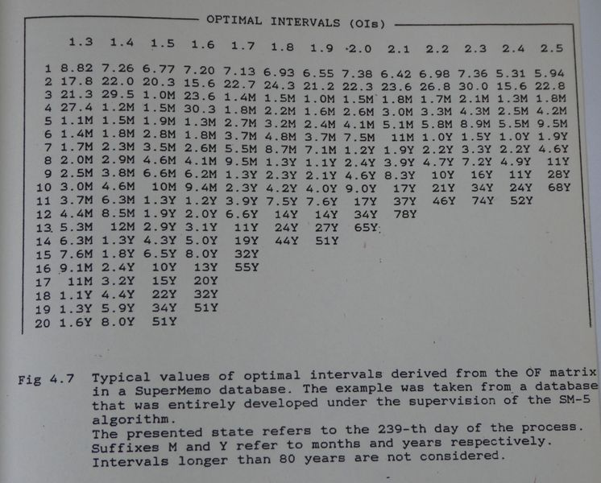
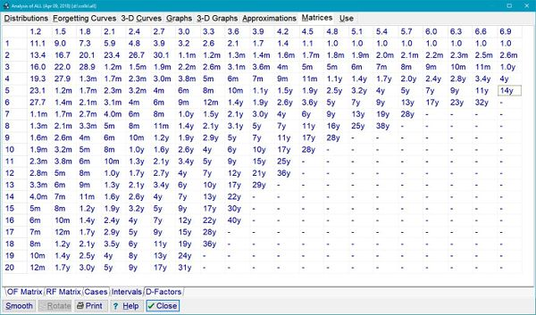
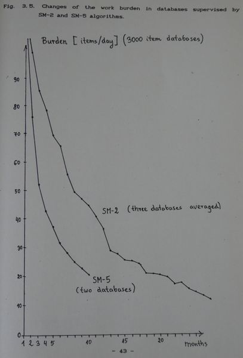

# 1989: SuperMemo 适应用户记忆

[TOC=2,5]

## 引入弹性间隔函数

[SuperMemo 2](https://supermemo.guru/wiki/SuperMemo_2) 很棒。它的简单算法已经在流行的应用程序（如[Anki](https://supermemo.guru/wiki/Anki)或[Mnemosyne](https://supermemo.guru/wiki/Mnemosyne)）中[存活至今](https://supermemo.guru/wiki/exponential_growth_of_the_popular)。然而，该算法是愚蠢的，因为其没有办法修改[最优间隔](https://supermemo.guru/wiki/Optimum_interval)的函数。[1985](https://supermemo.guru/wiki/Birthday_of_SuperMemo) 的发现是板上钉钉的。记忆[复杂度](https://supermemo.guru/wiki/Complexity)和[稳定性增加](https://supermemo.guru/wiki/Stability_increase)用相同的数字表示：[E-factor](https://supermemo.guru/wiki/E-factor)。这有点像在自行车上使用同一个控制杆来改变档位和方向。

单个的[项目](https://supermemo.guru/wiki/Item)可以根据其估计的[难度](https://supermemo.guru/wiki/Complexity)来调整复习的间隔。这些变化可以补偿[最优间隔](https://supermemo.guru/wiki/Optimum_interval)函数中的错误。即使算法收敛速度慢，理论上也是收敛的。主要的缺陷是，在[算法 SM-2](https://supermemo.guru/wiki/Algorithm_SM-2) 中，新项目不会从旧项目的经验中受益。

[算法 SM-2](https://supermemo.guru/wiki/Algorithm_SM-2) 没有适应能力。新[项目](https://supermemo.guru/wiki/Item)不受益于旧项目的经验

算法 SM-4 是第一次尝试用通用的适应性武装 [SuperMemo](https://supermemo.guru/wiki/SuperMemo)。它于 1989 年 2 月竣工。最后，适应性表现得太慢了，但是用算法 SM-4 收集的灵感对于进一步发展是至关重要的，特别是在理解[间隔重复](https://supermemo.guru/wiki/Spaced_repetition)中的稳定性与准确性问题上。简而言之，SM-4 算法太过稳定而不能准确。这在 7 个月后的 SM-5 算法中很快得到了纠正。以下是我的[硕士论文](https://supermemo.guru/wiki/Master's Thesis)的一段摘录。

> 档案警告:[为什么使用文字档案?](https://supermemo.guru/wiki/Why_use_literal_archives%3F)
>
> 本文是 [Piotr Wozniak](https://supermemo.guru/wiki/Piotr_Wozniak) 的《*优化学习*》(1990)的一部分。
>
> [算法 SM-2](https://supermemo.guru/wiki/Algorithm_SM-2) 的主要错误似乎是最优间隔函数的任意形状。虽然在实践中非常有效，并且经过多年的实验重复得到了证实，但是**这个函数并不能被科学地证明其有效性**，也不能检测出最优间隔的几天变化对学习过程的整体影响。考虑到这些缺陷，我决定使用常规的 SuperMemo 重复来验证最优间隔的作用!
>
> 使用那些在寻找[E因子](https://supermemo.guru/wiki/E-Factor)时应用的优化过程，我想让程序在任何时候修正最初提出的函数，只要修正看起来是合理的。
>
> 为了达到这个目的，我把最优间隔的函数列成表。
>
> 
>
> > **图片：**最优间隔矩阵出现在1989年的SuperMemo 4中，并在SuperMemo 17中保留至今，几乎没有变化。在SuperMemo 4中，它是优化间距的信息来源。在SuperMemo 17中，它是由算法SM-15生成的矩阵得到的，同时与算法SM-17使用。这幅图展示了一个来自SuperMemo 5的矩阵，并显示了与原始矩阵值的显著偏离。在SuperMemo 4中，改编的速度要慢得多
>
> 最优间隔矩阵(后来称为OI矩阵)的初始项最初取自算法SM-2中的公式。
>
> SuperMemo 4(1989年2月)实现了新的解决方案，使用OI矩阵来确定重复间隔的值:
>
> > I(n):=OI(n,EF)
> >
> > 上式中：
> >
> > - I(n) - 给定项目的第n次重复间隔(以天为单位)，
> > - EF - 项目的E-Factor，
> > - OI(n,EF) - OI矩阵中对应第 n 次重复和 EF 的项目。
>
> 然而，OI 矩阵并不是固定的。在重复的过程中，矩阵的具体项随着分数的不同而增加或减少。例如，如果项目指出最优的间隔是 X，使用的间隔是 X+Y，而这个间隔之后的等级不低于 4，那么项目的新值将落在 X 和 X+Y 之间。
>
> 因此，处于平衡状态的 OI 项的值应该稳定在一个点上，在这个点上，低保留项流与高保留项流对矩阵的影响相平衡。
>
> 因此，SuperMemo 4 试图给出最优间隔函数的最终定义。

## 刚性 SuperMemo 4

我很快就意识到新算法的验证-校正周期太长了。这与在计算机上运行 [1985 年实验](https://supermemo.guru/wiki/Birth_of_SuperMemo)没有太大的不同。为了确定十年的间隔，我需要十年的时间来测试审查的结果。这导致了七个月后的 [算法 SM-5](https://supermemo.guru/wiki/Algorithm_SM-5)。以下是我在[硕士论文](https://supermemo.guru/wiki/Master's _thesis)中描述的算法 SM-4 的问题:

> 档案警告:[为什么使用文字档案?](https://supermemo.guru/wiki/Why_use_literal_archives%3F)
>
> 本文是 [Piotr Wozniak](https://supermemo.guru/wiki/Piotr_Wozniak) 的《*优化学习*》(1990)的一部分。
>
> 算法 SM-4 在 SuperMemo 4 中实现，并在 1989 年 3 月9 日至 1989 年 10 月 17 日期间使用。虽然修改最优间隔函数的主要概念似乎是向前迈出的一大步，但是算法的实现是失败的。该算法的基本不足似乎源于在修改OI矩阵时应用的公式。
>
> 有两个最明显的缺陷:
>
> - 修改太过细微，无法在合理的短时间内明显地重新排列 OI 矩阵，
> - 对于较长的间隔重复时间，修改的效果需要很长时间才能稳定固定，即需要很长时间才能看到几个月间隔修改的结果，并在必要时进行修正
>
> 在使用 SM-4 算法 7 个月后，特定数据库的 OI 矩阵与它们的初始状态并没有太大的不同。人们可以用我早先关于最优重复间隔真值的预测的正确性来解释这一事实，然而，正如后来用算法SM-5证明的那样，矩阵稳定的实际原因是优化公式中的缺陷。
>
> 就获取率和保留率而言，没有可靠的证据表明 SM-4 算法带来了任何进展。轻微的改进也可能与软件的总体改进和项目制定原则的改进有关。

## SuperMemo4 的残余在新的 SuperMemo 里

有趣的是，你仍然可以在新版本的 SuperMemo 中看到最优间隔矩阵。这个矩阵并没有被算法使用，但是它显示在SuperMemo 统计数据中，因为它告诉用户[复杂性](https://supermemo.guru/wiki/Complexity)对学习过程中项目的前景的影响。

如果你比较一个使用了 8 个月的 [SuperMemo 5](https://supermemo.guru/wiki/SuperMemo_5) 生成的矩阵，你会发现它与使用了 20 年的[算法 SM-8](https://supermemo.guru/wiki/Algorithm_SM-8) 生成的矩阵有显著的相似性：

> **图片：**算法 SM-17 不再使用最优间隔矩阵。但是，仍然可以通过算法 SM-15 的步骤来生成。这些列与以A因子表示的材料的简易度相一致。这些行对应于以重复类别表示的记忆稳定性

## 算法SM-4

以下是我在[硕士论文](https://supermemo.guru/wiki/Master's _thesis)中描述的算法SM-4的概要:：

> 档案警告:[为什么使用文字档案?](https://supermemo.guru/wiki/Why_use_literal_archives%3F)
>
> 本文是 [Piotr Wozniak](https://supermemo.guru/wiki/Piotr_Wozniak)(1990) 的《*优化学习*》的一部分。
>
> **算法SM-4在SuperMemo4.0中的应用**
>
> 4. ### 算法
>
>    1. 将知识分解为最小的卡片
>    2. 所有卡片的 EF 设置为 2.5
>    3. 列出以重复次数和 EF 为索引的 OI 矩阵
>    4. 使用下面的重复间隔来初始化 OI 矩阵：
>       - OI(1,EF)=1
>       - OI(2,EF)=6
>       - for n>2 OI(n,EF)=OI(n-1,EF)*EF
>         - OI(n,EF) - 难度为 EF 的卡片在第 n 次复习时的最优间隔
>    5. 使用 OI 矩阵来确定重复间隔：
>       - I(n, EF) = OI(n, EF)
>         - I(n, EF) - 难度为 EF 的卡片在第 n 次复习时的间隔
>         - OI(n, EF) - OI 矩阵对应 n 和 EF 的值
>    6. 每次重复后都用 0-5 的成绩来给回忆质量打分
>    7. 每次重复后都根据下列公式修改 EF：
>       - $EF'=EF+(0.1-(5-q)\times(0.08+(5-q)\times0.02))$
>         - EF' - EF 的新值
>         - EF - EF 的旧值
>         - q - 回忆质量打分
>       - 如果 EF < 1.3 则令 EF = 1.3
>    8. 每次重复后都修改 OI 矩阵上的相关项
>    9. 一个示例公式如下（SM-4 中实际使用的公式更复杂）：
>       - $OI'=interval+\cfrac{interval\times (1-\cfrac{1}{EF})}{2}\times(0.25\times q-1)$
>       - $OI''=(1-fraction)\times OI+fraction\times OI'$
>         - OI - OI 对应项的旧值
>         - OI' - 计算 OI 对应项新值的辅助值
>         - OI'' - OI 对应项的新值
>         - interval - 之前的间隔
>         - fraction - 调和参数
>         - EF - 重复卡片的 EF
>         - q - 回忆质量评分
>       - 注意，当 q = 4 时 OI 不会改变，当 q = 5 时 OI 增长是 q = 0 时减少的 4 分之一
>    10. 如果回忆质量小于 3，卡片重新开始复习，并且不改变其 EF
>    11. 在某一天的每次重复练习之后，再重复那些在回忆质量评分中得分低于4分的卡片。继续重复，直到所有这些卡片得分至少4分。

## 间隔矩阵的问题

SM-4 表明，除了收敛速度慢以外，使用间隔矩阵会导致一些问题，而用 OF 来替换间隔可以很容易解决。这些额外的缺陷使 SM-5 快速实现。以下是使用最优间隔矩阵的缺陷：

> 档案警告:[为什么使用文字档案?](https://supermemo.guru/wiki/Why_use_literal_archives%3F)
>
> 本文是[Piotr Wozniak](https://supermemo.guru/wiki/Piotr_Wozniak)(1990)的《*优化学习*》的一部分。
>
> - 在重复过程中，可能会发生一个间隔在计算后短与前一个间隔的情况，这与 SuperMemo 的假设不一致。此外，即使可以通过不允许间隔增加或减少超过某值来避免这种情况，但这会极大减慢矩阵的优化过程。
> - 特定卡片的 EF 会不断修改，因此在 OI 矩阵中，一个卡片可以从一个难度类别转移到另一个难度类别。如果卡片重复的次数足够大，将会导致卡片重复过程的严重影响。注意，卡片连续重复次数越大，相邻的 EF 列的最优间隔间的差异就越大。如果 EF 增加，卡片的最优间隔会变得不自然的长，在相反的情况下间隔可能会变得太短。
>
> SM-4 尝试将最优间隔的长度和重复次数相关联。这种方法似乎是不正确的。因为记忆对之前使用的重复间隔长度更敏感，而不是重复次数。

## SuperMemo 5

最优间隔矩阵的概念诞生于 1989 年 2 月 11 日。[SuperMemo](https://supermemo.guru/wiki/SuperMemo)将为不同水平的记忆稳定性和难度保存一组最优间隔。它将根据新数据流修改间隔。1989 年 3 月 1 日，我开始使用 SuperMemo 4 来学习世界语。我很早就注意到这个想法需要全面修改。算法的收敛速度慢得要命。

1989 年 5 月 5 日，我有了一个新想法。从本质上讲，这就是[稳定性增长](https://supermemo.guru/wiki/Stability_increase)函数的诞生，除了在 [SuperMemo](https://supermemo.guru/wiki/SuperMemo) 的最优复习中没有[可提取性](https://supermemo.guru/wiki/Retrievability)维度。新算法将使用[最优因子矩阵](https://supermemo.guru/wiki/Matrix_of_optimum_factors)。它不会记住最优的时间间隔，而是记住需要根据[记忆复杂度](https://supermemo.guru/wiki/memory_复杂性)和当前[记忆稳定性](https://supermemo.guru/wiki/Memory_stability)增加多少时间间隔。算法 SM-4 的缓慢收敛也激发了[随机化间隔](https://supermemo.guru/wiki/History_of_spaced_repetition_(print)#randomization)的需求(1989年5月20日)。

与此同时，SuperMemo](https://supermemo.guru/wiki/SuperMemo) 的进展又一次因为学校的义务而被推迟。在 [Krzysztof Biedalak](https://supermemo.guru/wiki/Krzysztof_Biedalak) 的帮助下，我们决定编写一个程序，用于开发可以与 SuperMemo 一起使用的学校测试。这个项目再次被用来在开明的 Krzysztof 博士的课堂上摆脱其他义务，Krzysztof 现在已经成为 SuperMemo 的支持者。

我花了一个夏天在荷兰进行实践训练，由于各种义务(包括**强制**远足！)进展缓慢。速度慢的主要原因之一是极端节食，这是因为需要存钱来偿还我的PC1512债务。我还希望能多挣些钱给我的电脑买个硬盘。多亏了埃因霍温大学的Peter Klijn的帮助，我的所有工作才得以完成。他只是把他的电脑给了我，让我在整整两个月的时间里私人使用。他不想让我在SuperMemo上出色的工作慢下来。这是我第一次可以把所有的文件都保存在硬盘上，感觉就像是从一辆旧自行车搬到了特斯拉S型车。

直到 1989 年 10 月 16 日，新的算法 SM-5 才完成，我开始使用 SuperMemo 5。我在笔记中写道：“*一场伟大的革命即将到来*”。确实取得了巨大的进展。

我有几个 SuperMemo 2 的用户准备升级到 SuperMemo 5。我只要求一个条件：他们将从初始化为特定值的最优因子矩阵开始。这是为了验证算法，并确保它没有先入为主的偏见。所有预先设定的优化矩阵将很好地快速收敛。这一事实随后被用来主张普遍收敛，该算法在[关于间隔重复算法的第一本出版物](https://supermemo.guru/wiki/Optimization_of_repetition_spacing_in_the_practice_of_learning)中被这样描述。不要读那份出版物！它已经被[同行评审](https://supermemo.guru/wiki/Peer_review)阉割了。阅读下面的内容来理解 SM-5 算法。

## 算法SM-5

[SuperMemo](https://supermemo.guru/wiki/SuperMemo) 使用了一个简单的原则：*“使用、验证和纠正”*。在[重复](https://supermemo.guru/wiki/Repetition)之后，在[OF 矩阵](https://supermemo.guru/wiki/OF_matrix)的帮助下计算一个新的间隔。计算时间间隔的“相关项目”取决于重复(类别)和项目难度。在[间隔时间](https://supermemo.guru/wiki/Interval)过后， SuperMemo 要求下一次重复。使用[成绩](https://supermemo.guru/wiki/Grade)来告诉 SuperMemo 这个间隔“表现”得如何。如果成绩较低，我们有理由相信，间隔太长，[OF 矩阵](https://supermemo.guru/wiki/OF_matrix) 对应的项太大。在这种情况下，我们稍微减少了对应的项。这里的相关项目是之前用于计算间隔(即在间隔开始之前)的项目。换句话说，项目(1)用于计算间隔(n次重复之后)，然后(2)用于纠正[OF 矩阵](https://supermemo.guru/wiki/OF_matrix) (n+1次重复之后)。

以下是我的[硕士论文](https://supermemo.guru/wiki/Master's _thesis)中给出的算法SM-5的概要:

> 档案警告:[为什么使用文字档案?](https://supermemo.guru/wiki/Why_use_literal_archives%3F)
>
> 本文是[Piotr Wozniak](https://supermemo.guru/wiki/Piotr_Wozniak)(1990)的《*优化学习*》的一部分。

**SuperMemo 5算法的最终公式如下(算法SM-5):**

1. 将知识分成尽可能小的项目
2. 所有项目的 [E-Factor](https://supermemo.guru/wiki/E-Factor) 等于 2.5
3. 将不同重复次数和 EF 类别的矩阵制表。使用以下公式：
   1. OF(1,EF):=4
   2. for n>1 OF(n,EF):=EF
   3. 其中：
      1. OF(n,EF) - 对应给定简易度和连续复习次数 n 的最优因子
4. 使用 OF 矩阵确定重复间隔：
   1. I(n,EF)=OF(n,EF)*I(n-1,EF)
   2. I(1,EF)=OF(1,EF)
   3. 其中：
      1. I(n,EF) - 给定 EF 值的卡片的连续第 n 个间隔
      2. OF(n,EF) - OF 矩阵对应给定简易度和连续复习次数 n 的 OF 值
5. 在每次重复之后，在 0-5 级量表中评估[成绩](https://supermemo.guru/wiki/Grade) (cf.算法SM-2)
6. 每次重复后，根据公式修改最近重复项的e因子：
   1. EF':=EF+(0.1-(5-q)\*(0.08+(5-q)\*0.02))
   2. 其中：
      1. EF' -  简易度的新值
      2. EF - 简易度的旧值
      3. q - [quality of the response](https://supermemo.guru/wiki/Grade) in the 0-5 grade scale
   3. 如果 EF 小于 1.3，则将 EF 设置为 1.3
7. 每次重复后修改矩阵的相关项目。任意构造并在修改中使用的示例性公式可以是这样的：
   1. OF':=OF*(0.72+q*0.07)
   2. OF*:=(1-fraction)\*OF+fraction\*OF'*
   3. 其中：
      1. OF *- OF 的新值
      2. OF' -  计算 OF 新值的辅助值
      3. OF - OF 的旧值
      4. fraction - 0~1之间的一个值，越大 OF 改变越大
      5. q - [回忆质量打分](https://supermemo.guru/wiki/Grade) 0 - 5
   4. 请注意，对于 q=4 ，OF 不变。q>4 时增大，q<4 时减小。
8. 如果 q 小于 3，则不改变 EF 的值，项目从头开始复习。
9. 在某一天的每一次重复之后，重复所有在[回忆质量打分](https://supermemo.guru/wiki/Grade)中得分低于 4 分的项目。继续[重复](https://supermemo.guru/wiki/Repetition)，直到所有这些[项目](https://supermemo.guru/wiki/Item)得分至少 4 分

根据之前的观察，[OF 矩阵](https://supermemo.guru/wiki/OF_matrix)的项不允许低于 1.2。在算法 SM-5 中，根据定义，[间隔](https://supermemo.guru/wiki/Interval)不能在连续的[重复](https://supermemo.guru/wiki/Repetition)中变得更短。时间间隔至少是其前身的 1.2 倍。更改 [E-Factor](https://supermemo.guru/wiki/E-Factor) 类别仅增加下一个应用的间隔，增加的倍数与 [OF 矩阵](https://supermemo.guru/wiki/OF_matrix)相应项所需的倍数相同。

## 对 SM-5 算法的批评

[Anki](https://supermemo.guru/wiki/Anki) 手册中包含了一段对 SM-5 算法出乎意料的批评(2018 年 4 月)。这些话特别令人惊讶，因为算法 SM-5 从来没有完整地发表过(上面的版本只是一个粗略的大纲)。尽管批评的话语显然是善意的，但它们暗示了一种可能性，即如果[算法 SM-2](https://supermemo.guru/wiki/Algorithm_SM-2)是优于[算法 SM-5](https://supermemo.guru/wiki/Algorithm_SM-5)，或许它也优于[算法 SM-17](https://supermemo.guru/wiki/Algorithm_SM-17)。如果是这样的话，我就浪费了过去 30 年的研究和编程。时至今日，维基百科还在“批评” “[SM3+](https://supermemo.guru/wiki/SM3%2B)”。“SM3+” 是最初在[Anki](https://supermemo.guru/wiki/Anki)手册中使用的一个标签，已经在网络上的几十个站点使用(特别是那些因其简单性而倾向于坚持使用较旧算法的人)。[这里](https://supermemo.guru/wiki/Universal_metric_for_cross-comparison_of_spaced_repetition_algorithms)比较了算法 SM-2 和算法 SM-17 。希望这不会有任何疑问。

### Anki 手册中的错误声明

我的[硕士论文](https://supermemo.guru/wiki/Master's _thesis)于 1998 年在 [supermemo.com](https://supermemo.com/) 上摘录发表，其中只包括对算法 SM-5 的粗略描述。为了清楚起见，数十个次要程序没有公布。这些程序需要进行大量修改，以确保良好的收敛性、稳定性和准确性。这种修修补补需要几个月的学习和分析相结合。算法 SM-5 从来没有现成的开箱即用版本。

算法SM-5的源代码从未发表或公开过，最初的算法只能在 MS DOS 下由 Supermemo 5 的用户进行测试。SuperMemo 5 在 1993 年成为免费软件。需要注意的是，围绕最优值的随机分散间隔是建立收敛性的关键。如果没有[分散](https://supermemo.guru/wiki/History_of_spaced_repetition_(print)# random_dispersal_of_interval)，算法的进展将会慢得令人痛苦。同样，[矩阵平滑](https://supermemo.guru/wiki/History_of_spaced_repetition_(print)# Matrix_smoothing)对于一致的行为是必要的，独立于为不同级别的[稳定性](https://supermemo.guru/wiki/Stability)和项目[复杂性](https://supermemo.guru/wiki/Complexity)收集的数据的稀缺性。

在 1989 年和之后进行的多次评估表明，在任何研究的度量中，算法 SM-5 和之后的算法毫无疑问地优于[算法 SM-2](https://supermemo.guru/wiki/Algorithm_SM-2)。算法 SM-17 实际上可以用来衡量算法 SM-5 的效率，如果我们有志愿者用我们的[通用度量](https://supermemo.guru/wiki/Algorithm_SM-17)重新实现古老的代码。到目前为止，我们已经对 SM-2 算法进行了比较。实现的成本微不足道。不用说，SM-2 算法在预测能力方面远远落后，特别是在[可提取性](https://supermemo.guru/wiki/Retrievability)的次优水平(在用户没有严格遵守规定时间表的情况下)。

即使对底层模型有基本的了解，也应该清楚一个好的实现将产生巨大的好处。SuperMemo 5 将根据用户的记忆来调整它的间隔函数。SuperMemo 2 是固定不变的。我非常自豪的是，1985年和1987年的大胆猜测经受住了时间的考验，但任何算法都不应该相信一个拥有 2 年间隔重复算法实现经验的卑微学生的判断。相反，Supermemo 4 和所有后续实现进行的猜测越来越少，并且提供了更好、更快的适应性。在所有这些实现中，只有 Supermemo 4 适应速度慢，并在 7 个月内被更好的解决方案取代。

Anki 的批评没有恶意，但如果作者推动实施并迅速转向自学，而不是花时间修补那些似乎不像他预期的那样有效的程序，我不会感到惊讶。相比之下，在1989年，我知道算法SM-2是有缺陷的，我知道算法SM-5是更好的，我将不遗余力地确保新概念被完善到其最大的理论潜力。

Anki手册摘录(2018年4月):

> Anki最初是基于 SuperMemo 的 SM5 算法。然而，Anki 在回答卡片之前显示下一个间隔的默认行为揭示了 SM5 算法的一些基本问题。SM2 于后来修改的算法之间的关键区别是：
>
> - SM2 根据您的一张卡片上的表现来安排该卡片下一次的时间
> - SM3+ 根据您的一张卡片上的表现来安排该卡片，以及类似卡片下一次的时间
>
> 后一种方法不仅考虑了单个卡片的表现，还考虑了作为一个组的表现，从而保证了选择更准确的间隔时间。如果你在学习上非常一致，并且所有的牌都有一个非常相似的难度，这种方法可以很好地工作。然而，一旦在公式中引入了不一致性(不同难度的卡片，不是每天在同一时间学习)，SM3+ 更容易在下一个间隔中出现不正确的猜测——导致牌被安排得太频繁或太遥远。
>
> 此外，当SM3+动态调整“最优因子”表时，经常会出现这样的情况：在一张卡片上回答“困难”比回答“容易”的间隔时间更长。下一次时间在 SuperMemo 中是隐藏的，所以用户永远不会知道这个。
>
> 在对备选方案进行评估之后，Anki 的作者认为，通过模仿 SM2 产生的接近最优间隔要比冒着错误猜测的风险获得最优间隔更好。SM2 方法对用户来说是可预测的和直观的，而 SM3+ 方法对用户隐藏了细节，并要求用户信任系统(即使系统可能在调度中出错)

在所有这些说法中，只有一个是正确的。[SuperMemo 2](https://supermemo.guru/wiki/SuperMemo_2)确实更直观。多年来，这个问题一直困扰着 SuperMemo。每个版本都更复杂，很难向用户隐藏其中的某些复杂性。我们将继续努力。

这就是为什么 Anki 批评是不合理的原因：

- 事实上，SuperMemo 5 利用所有项目的过去表现来最大化新项目的表现，这是一个优势，而不是一个“问题”。更重要的是，这是适应性的关键
- 不一致的评分一直是所有算法的一个问题。平均而言，适应性有助于发现错误评分的平均影响，特别是如果不一致本身是一致的(即用户在相似的情况下不断犯类似的错误)
- 混合的困难被 SuperMemo 5 处理得更好。在 SuperMemo 2 中难度和稳定性增长都是用 EF 编码的，而在 SuperMemo 5 及以后的版本中，这两种记忆特性是分开的
- 间隔预测在 SuperMemo 5 中被证明更优越，而“更容易出错”的说法只能用实现中的错误来解释
- 如果没有实现矩阵平滑，较低的评分可能带来更长的间隔。这部分算法在我的论文中只做了口头描述
- 即使在更简单的实现中(例如，对于手持设备、智能手机等)，间隔和重复日期也总是显著地显示在 SuperMemo 中。没有向用户隐藏任何东西。最重要的是，遗忘指数和工作量的统计数据是完全可见的，并且有可能看到 SuperMemo 是否履行了它承诺的保留，以及在怎样的工作量代价下。
- 算法及其所有细节在 SuperMemo 5 中得到了充分的展示。特别是，在每次重复时将显示对矩阵的更改。对于任何对算法有基本了解的人来说，它的操作都是完全透明的。全面的跟踪也可以在 Anki 或其他应用程序中实现，但可能需要大量的修改。这将是昂贵的。最后，Anki 的选择可能确实很好，因为它很简单(从实现、操作、跟踪、调试、维护、用户直觉等方面来说)。
- “隐藏细节”的抱怨与神经网络在间隔重复方面更优越的主张是截然相反的。与神经网络实现不同，算法SM-5的操作比较容易分析

我们 2011 年在 [supermemopedia.com](http://supermemopedia.com/) 上发表的官方回应今天看来相当准确:

> 档案警告:[为什么使用文字档案?](https://supermemo.guru/wiki/Why_use_literal_archives%3F)

很棒的是，Anki 介绍了自己的创新，同时仍然给予 SuperMemo 应有的赞誉。的确，与莱特纳系统或纸面上的 Supermemo 相比，SuperMemo 的算法 SM-2 工作得很好。然而，SM-5 算法相对于 SM-2 算法的优越性是毋庸置疑的。无论是在实践中还是在理论上都是如此。算法 SM-2 的时间间隔是固定的，并且只依赖于项目的难度，该难度可以用一个启发式公式来近似(即一个基于 1987 年前有限经验得出的猜测的公式)。确实，您不能通过向算法 SM-2 提供错误数据来“破坏”它。之所以如此，只是因为它不具有适应性。您可能更喜欢使用可自定义字体的文字处理程序，尽管您可能会通过应用修饰把文本弄乱。

SM-2算法简单地用一个所谓的 [E-Factor](https://supermemo.guru/wiki/E-Factor) 来粗略地乘以间隔，这是一种表示项目[难度](https://supermemo.guru/wiki/难度)的方法。相反，算法 SM-5 收集用户的表现数据，并相应地修改最优间隔的函数。换句话说，它适应学生的表现。算法 SM-6 甚至更进一步，修改了最优间隔的函数，以达到期望的[知识保留](https://supermemo.guru/wiki/Knowledge_retention)水平。这些新算法的优越性已经通过多种方式得到了验证，例如，通过测量固定大小数据库中工作负载随时间的下降情况。在研究的案例中(小样本)，与使用算法 SM-2 处理的旧数据库(相同类型的材料：英语词汇)相比，使用新算法处理的工作量下降速度几乎是后者的两倍。

所有的 SuperMemo 算法都将项目分成难度类别。算法 SM-2 给每个类别一个严格的间隔集。算法 SM-5 也给了每个类别一组间隔，但是这些间隔是根据用户的表现来调整的，也就是说不是固定不变的。

“糟糕的评分”在算法 SM-5 中确实比在算法 SM-2 中更严重，因为错误的数据会导致“错误的适应”。然而，在 SuperMemo 中给出不真实/作弊的分数总是不好的，无论你使用哪种算法。

在有关记忆的知识不完整的情况下，适应性总是优于僵化的模型。这就是为什么适应一个不精确的平均值(如算法SM-5)要比根据一个不精确的猜测(如算法 SM-2)来确定间隔要好。 毋庸置疑，最后一个词进入算法 SM-8 之后又变了，因为它适应了测得的平均值

### SuperMemo5 的评估（1989）

SuperMemo 5的优势如此明显，以至于我没有收集太多数据来证明我的观点。我只拿我的[硕士论文](https://supermemo.guru/wiki/Master's_thesis)做了几次比较，结果毫无疑问。

档案警告:[为什么使用文字档案?](https://supermemo.guru/wiki/Why_use_literal_archives%3F)

本文是[Piotr Wozniak](https://supermemo.guru/wiki/Piotr_Wozniak)(1990)的《*优化学习*》的一部分。

**3.8.算法 SM-5 的评估**

算法 SM-5 自 1989 年 10 月 17 日开始使用，它提供了一种确定理想的最优间隔函数的有效方法，超出了所有人的预期，从而提高了习得率(在 9 个月内学习了 15,000 个项目)。图 3.5 显示习得速率至少是组合应用 SM-2 和 SM-4 算法的两倍！

> **图片：**在 SM-2 和 SM-5 算法的监督下，数据库中工作负担的变化

对于 10 个月的数据库，知识保留率提高到 96% 左右。下面列出了选定数据库中的一些知识保留率数据，以显示 SM-2 和 SM-5 算法之间的比较：

- 日期 - 测量日期，
- 数据库 - 数据库的名称；ALL 表示所有数据库的平均值
- 间隔 - 数据库中项目使用的平均当前间隔
- 保留率 - 数据库中的知识保留率
- 版本 - 数据库所应用的算法版本

|  Date  | Database | Interval | Retention |       Version       |
| :----: | :------: | :------: | :-------: | :-----------------: |
| Dec 88 |   EVD    | 17 days  |    81%    |        SM-2         |
| Dec 89 |   EVG    | 19 days  |    82%    |        SM-5         |
| Dec 88 |   EVC    | 41 days  |    95%    |        SM-2         |
| Dec 89 |   EVF    | 47 days  |    95%    |        SM-5         |
| Dec 88 |   all    | 86 days  |    89%    |        SM-2         |
| Dec 89 |   all    | 190 days |    92%    | SM-2, SM-4 and SM-5 |

在复习过程中，记录了下列成绩分布情况:

| Quality | Fraction |
| :-----: | :------: |
|    0    |    0%    |
|    1    |    0%    |
|    2    |   11%    |
|    3    |   18%    |
|    4    |   26%    |
|    5    |   45%    |

根据算法 SM-5 的假设，该分布产生的平均回忆质量等于 4。遗忘指数等于 11%(成绩低于 3 的项目被认为是被遗忘的)。请注意，保留率数据表明数据库中只有 4% 的项目没有被记住。因此，遗忘指数超过遗忘项目百分比的 2.7 倍。

在一个 7 个月前的数据库中，发现 70% 的项目在测量之前的重复过程中甚至没有忘记一次，而只有 2% 的项目遗忘次数超过 3 次

### 新算法优越性的理论证明

Anki 对 SuperMemo 5 的批评需要根据现代的[间隔重复](https://supermemo.guru/wiki/Spaced_repetition)理论来做一个简单的证明。我们可以表明，今天的记忆模型可以映射到两种算法基础上的模型：[算法 SM-2](https://supermemo.guru/wiki/Algorithm_SM-2) 和[算法 SM-5](https://supermemo.guru/wiki/Algorithm_SM-5)，两者之间的关键区别是最优间隔函数的适应性缺失(在算法SM-5中由最优因子矩阵表示)。

SInc = f (C、S、R) 是一个[稳定性增长](https://supermemo.guru/wiki/Stability_increase)函数，[复杂性](https://supermemo.guru/wiki/Complexity) C、[稳定](https://supermemo.guru/wiki/Stability) S、[可恢复性](https://supermemo.guru/wiki/Retrievability) R 作为参数。这个函数决定了最优学习中复习[间隔](https://supermemo.guru/wiki/Interval)的递增。

两种算法，SM-2 和 SM-5 都忽略了[可提取性](https://supermemo.guru/wiki/Retrievability)维度。理论上，如果两种算法都能完美运行，我们可以假设它们的目标是 R=0.9。正如可以在 [SuperMemo](https://supermemo.guru/wiki/SuperMemo) 中测量的那样，这两种算法都失败了，因为它们不知道相关的[遗忘曲线](https://supermemo.guru/wiki/Forgetting_curve)。他们只是不收集遗忘曲线数据。这种数据收集的可能性是在 1991 年才在[算法 SM-6](https://supermemo.guru/wiki/Algorithm_SM-6) 中引入的。

然而，如果我们假设 [1985](https://supermemo.guru/wiki/The_birthday_of_spaced_repetition:_July_31，_1985) 和 [1987](https://supermemo.guru/wiki/SuperMemo_1.0_for_DOS_(1987)) 启发式是完美的猜测，在理论上，该算法可以使用SInc=F(C,S)，常数R为90%。

由于 SM-2 使用相同的数字 EF 用于稳定性增加和项目复杂性，对于 SM-2，我们有以 EF=f'(EF,interval) 的形式表示的 SInc=f(C,S) 方程，其中的数据可以很容易地显示 f<>f' 。令人惊讶的是，SM-2 中使用的启发式通过解耦 EF 和项目复杂性之间的实际联系，使这个函数发挥作用。由于数据显示 SInc 随着 S 的增加而不断减少，在算法 SM-2 中，根据定义，如果要用 EF 来表示项的复杂度，那么所有项都需要在每次复习时获得复杂度。在实际应用中，算法 SM-2 使用 EF=f'(EF,interval)，即 SInc(n)=f(SInc(n-1),interval)。

让我们假设 EF=f(EF,interval) 启发式正如 SM-2 算法的支持者所声称的那样，是一个很好的猜想。令 *SInc* 在算法 SM-5 中由 [O-factor](https://supermemo.guru/wiki/O-factor) 表示。然后我们可以将 *SInc*=f(C,S) 表示为 *OF*=f([EF](https://supermemo.guru/wiki/EF),[interval](https://supermemo.guru/wiki/Interval))。

对于算法 SM-2, OF 是常数，等于 EF，在算法 SM-5 中，OF是可适应的，可以根据算法的表现进行修改。很明显，对表现差的算法进行惩罚，降低[OF 矩阵](https://supermemo.guru/wiki/OF_matrix)对应的项，并通过增加对应的项来奖励它，这要优于保持不变。

有趣的是，尽管 SM-2 算法的支持者声称它表现得很好，但神经网络 SuperMemo 算法的支持者却不断指责代数算法：缺乏适应性。实际上，[算法 SM-17](https://supermemo.guru/wiki/Algorithm_SM-17) 的适应性是最好的，因为它是基于最精确的[记忆模型](https://supermemo.guru/wiki/Three_component_model_of_memory)。

可以想象，在 SM-2 中使用的启发法是如此精确，以致于原来对 *OF*=f(EF,interval) 的猜测不需要修改。然而，正如在实际应用中所显示的那样，[OF 矩阵](https://supermemo.guru/wiki/OF_matrix)迅速发展，并收敛到[这篇出版物(Wozniak, Gorzelanczyk 1994)](https://supermemo.guru/wiki/ANE1994)中描述的值。它们与算法 SM-2 中的假设有本质上的不同。

**总结：**

- sm17 (2016): SInc=f(C,S,R)， 3 个变量，f 是有适应性的
- sm5 (1989): SInc=f(C,S,0.9)， 2 个变量，f 是有适应性的
- sm2 (1987): SInc=f(SInc,S,0.9) - 1 个变量，f 是固定的

## 收敛

算法SM-5表现出了快速的收敛性，这很快被以单价[矩阵](https://supermemo.guru/wiki/OF_matrix)开始的用户所证明。这与SM-4算法形成了鲜明的对比。

档案警告:[为什么使用文字档案?](https://supermemo.guru/wiki/Why_use_literal_archives%3F)

本文是[Piotr Wozniak]的《*优化学习*》(https://supermemo.guru/wiki/Piotr_Wozniak)(1990)的一部分。

**3.6.改进最优因子的预定矩阵**

在[矩阵](https://supermemo.guru/wiki/OF_matrix)的转换中应用的优化过程似乎是令人满意的有效的，从而使项目快速收敛到它们的最终值。

然而，在考虑的时期(1989年10月17日- 1990年5月23日)，只有那些以修改-验证周期短(不到3-4个月)为特征的最优因素似乎达到了平衡值。

关于[矩阵](https://supermemo.guru/wiki/OF_matrix)的最终形状，还需要几年的时间才能得出更合理的结论。在分析了7个月大的矩阵后，最有趣的事实是，对于e因子等于2.5的矩阵，第一次重复间隔应该长达5天，对于e因子等于1.3的矩阵，甚至应该长达8天!第二个时间间隔对应的值分别为3周和2周左右。

新得到的[最优间隔]函数(https://supermemo.guru/wiki/Optimal_interval)表达式如下:

> I(1)=8-(EF-1.3)/(2.5-1.3)*3
>
> I(2)=13+(EF-1.3)/(2.5-1.3)*8
>
> for i>2 I(i)=I(i-1)*(EF-0.1)
>
> 上式中：
>
> - I(I) -第I次重复后的间隔(以天为单位)
> - EF - [E-Factor](https://supermemo.guru/wiki/E-Factor)。

为了加速优化过程，应该使用这个新函数来确定矩阵的初始状态(SM-5算法的第3步)。除了第一个间隔外，这个新函数与SM-0到SM-5算法中使用的函数没有显著的区别。人们可以把这一事实归因于优化过程的低效，毕竟，这是由应用预先确定的矩阵的事实所造成的。为了确保这不是事实，我让我的三个同事使用SuperMemo 5.3的实验版本，其中使用了一价矩阵(在两个实验中所有的项目都等于1.5，在剩下的实验中等于2.0)。

虽然实验数据库的使用时间只有2-4个月，但矩阵的收敛速度似乎缓慢地趋近于使用预先确定的矩阵所得到的形式。然而，矩阵的预定继承了E-Factor与相关E-Factor类元素值之间的人工相关性(即对于n>3， (n,EF)的值接近于EF)。这种现象在单叶矩阵中不存在，单叶矩阵倾向于根据算法中任意选择的元素如e因子初值(始终为2.5)、函数重复后修改e因子等要求对矩阵进行更紧密的调整。

## 矩阵平滑

一些[Anki的作者批评](https://supermemo.guru/wiki/History_of_spaced_repetition_(print)#Criticism_of_Algorithm_SM-5)可能是由于没有采用矩阵平滑算法的一个重要组成部分,至今仍用于[算法SM-17](https://supermemo.guru/wiki/Algorithm_SM-17)。

档案警告:[为什么使用文字档案?](https://supermemo.guru/wiki/Why_use_literal_archives%3F)

本文是[Piotr Wozniak]的《*优化学习*》(https://supermemo.guru/wiki/Piotr_Wozniak)(1990)的一部分。

**3.7.变化在最优因子矩阵上的传播**

注意到前面提到的矩阵中各元素之间关系的规律性，我决定通过在矩阵中传播修改来加速优化过程。如果一个最优因子增加或减少，那么我们可以得出结论，与较高的重复次数相对应的因子也应该增加。

这是从(i,EF)= (i+1,EF)的关系得出的，它对所有[e - factor](https://supermemo.guru/wiki/E-Factor)和i>2大致有效。类似地，如果我们记得对于i>2，我们有of (i,EF')= of (i,EF*)\*EF'/EF*(特别是如果EF'和EF*足够接近的话)，我们可以考虑理想的因子变化。我只在还没有被重复反馈修改过的矩阵上使用变化的传播。这证明了特别成功的情况下，一价矩阵适用于SuperMemo的实验版本在前一段提到

所提出的传播方案可以概括为:

1. 执行算法SM-5的第7步后，定位在重复过程中尚未被修改的of矩阵的所有相邻的项，即未进入修改-验证循环的项。相邻项在这里理解为对应重复次数+/- 1和e因素类别+/- 1(即e因素+/- 0.1)的项。

2. 当下列关系之一不成立时，修改相邻的项:

- for i>2 (i,EF)=OF(i+1,EF) for all EFs

- for i>2 OF(i,EF')=OF(i,EF*)\*EF'/EF*

- 因为i=1 OF(i,EF')=OF(i,EF*)*

3. 对于第2步中修改的所有项目，重复查找它们尚未修改的邻居的整个过程。

变化的传播似乎是不可避免的，如果你记得最优间隔的函数取决于这样的参数:

- 学生的能力
- 学生的自我评价习惯(响应质量根据学生的主观意见给出)
- 记忆知识的性质等。

因此，不可能提供一个理想的、预先确定的矩阵，而不使用修改-验证过程和(在较小程度上)传播方案。

时间间隔的随机散布

## 间隔的随机散布

算法SM-5的关键改进之一是间隔的随机散布。一方面，它极大地加快了优化过程，另一方面，它给几乎所有未来版本的SuperMemo的用户造成了极大的困惑:*“为什么相同等级的相同项目每次使用不同的间隔时间?”*。微小的偏差是宝贵的。当“naked”[算法SM-17](https://supermemo.guru/wiki/Algorithm_SM-17)在早期的SuperMemo 17中发布时，这个问题就暴露出来了。可以看出，那些收藏了大量[水蛭](https://supermemo.guru/wiki/Leech)的用户很容易就会遇到“局部极小值”，从此他们再也出不来了。随机离散度在一定的延迟下恢复。“赤裸”这段时间对算法的准确观察是需要的，尤其是在我这样的几十年的学习过程中。

档案警告：为什么使用文献存档？

这篇文章是[Piotr Wozniak]的一部分:“改进学习”(https://supermemo.guru/wiki/Piotr_Wozniak) (1990)

**3.5.最优间隔的随机散布**

为了进一步改进优化过程，引入了一种可能与最优重复间隔原则相矛盾的机制。让我们重新考虑一下算法SM-5的一个重大错误:只有在满足以下条件时，才能对一个最优因子的修改进行正确性验证:

- 修正因子用于计算重复间隔
- 计算的时间间隔过去了，重复的时间间隔产生的响应质量可能表明需要增加或减少最优因子

这意味着即使大量的实例用于修改一个最优因子，也不会显著地改变它，直到新计算的值被用于确定新的间隔，并在它们过去后进行验证。

在重复使用一段时间后对修改过的最优因素进行验证的过程以后将称为修改-验证周期。重复次数越大，修改-验证周期越长，优化过程的慢化程度越大。

为了说明修改约束的问题，让我们考虑图[3.4]中的计算(http://super-memory.com/english/ol/sm5.htm)。

我们可以很容易地得出结论，对于变量INTERVAL_USED大于20，如果质量等于5，那么MOD5的值将等于1.05。当质量=5时，修改器将等于MOD5，即1.05。因此，新提出的最优因子(NEW_OF)只能比前一个(NEW_OF:=USED_OF*MODIFIER)大5%。因此，修改后的最优因子永远不会超过5%的极限，除非USED_OF增加，这相当于将修改后的最优因子应用于计算重复间隔。

考虑到这些事实，我决定在某些情况下让重复间隔与最优间隔不同，以绕过修改-验证周期的约束。

我把这个过程称为最优间隔的随机修正散布。

如果允许一小部分时间间隔更短或更长时间比它应该遵循从矩阵的这些不正常的间隔可以加速最优因素的变化,让他们减少或增加超越极限的机制提出了图(3.4)(http://super-memory.com/english/ol/sm5.htm)。换句话说，当一个最优因子的值与期望的值有很大的差异时，由于响应特性更倾向于促进变化，而不是与之相反，因此由偏差间隔引起的偶然变化不会被标准重复流拉平。

使用最优间隔的另一个好处是消除了SuperMemo用户经常抱怨的一个问题——重复调度的混乱。我所说的重复计划的块块性，是指重复工作在某天的积累，而相邻的日子则相对没有负担。这是由于学生们在一次学习中往往记住了大量的项目，而这些项目往往在接下来的几个月里粘在一起，仅根据他们的电子因素分开。

在最优间隔周围散布间隔消除了块状问题。现在让我们考虑一下最新的SuperMemo软件在散布接近最优值的间隔时所使用的公式。与被认为是最优的间隔(根据矩阵的形式)稍有不同的重复间隔称为接近最优的间隔。近似最优间隔按下式计算:

> NOI=PI+(OI-PI)*(1+m)
>
> 上式中：
>
> - NOI-接近最优间隔
> - PI-使用以前的间隔
> - OI-由矩阵计算的最优间隔(cf.算法SM-5)
> - m-属于<-0.5、0.5>范围的数字(见下文)
>
> 或使用 OF 值：
>
> NOI=PI*(1+(OF-1)*(1+m))
>
> NOI=PI+(OI-PI)*(1+m)

修改器m将确定偏离最优间隔的程度(m =-0.5或m=0.5值的最大偏差，m=0时完全没有偏差)。

为了在加速优化和消除块度(两者都需要很强的分散重复间隔)和高保留(严格应用最优间隔)之间找到一个折衷点，m在大多数情况下应该有一个接近于零的值。

利用以下公式确定修饰语m的分布函数:

- -在<0,0.5>范围内选择一个修饰语的概率应该等于0.5:
- 假设选择一个修饰语m=0的概率是选择m=0.5的概率的100倍:
- 假设概率密度函数为负指数形式，参数a和b在前两个方程的基础上:

上述公式对于以百分比表示的m，则得a=0.04652, b=0.09210。

从分布函数

> 从-m到m的积分a*exp(-b*ab (x))dx = P (P表示概率)

我们可以得到修饰符m的值(对于m>=0):

因此，计算接近最优间隔的最终步骤如下:

> a:=0.047;
>
> b:=0.092;
>
> p:=random-0.5;
>
> m:=-1/b*ln(1-b/a*abs(p));
>
> m:=m*sgn(p);
>
> NOI:=PI*(1+(OF-1)*(100+m)/100);
>
> 其中:
>
> - random - 函数的取值范围 <0,1)，具有均匀分布的概率
> - NOI - 接近最优间隔
> - PI - 以前使用的间隔
> - OF - 矩阵的相关项