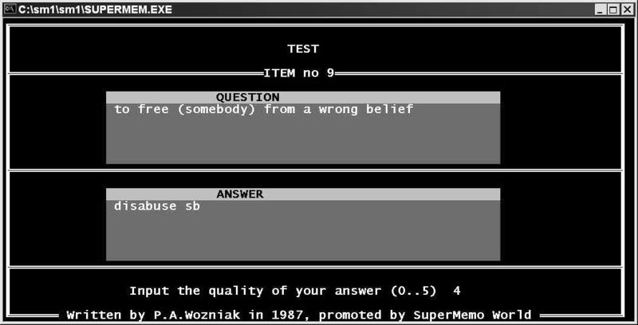

# 1987：DOS 上的 SuperMemo 1.0

[TOC=2,5]

## SuperMemo 1.0: 日志 (1987)

SuperMemo 的历史页面上写着：“*Wozniak 用 16 个晚上写了他的第一版 SuperMemo*”。实际情况要复杂一些。让我用当天的笔记来详细描述一下。

### 为这个想法做准备

我不明白我在 1987 年 7 月 3 日写的“*我有一个革命性的计划，在 SMTests (*SMTests*在这里代表 [SuperMemo on paper](https://supermemo.guru/wiki/SuperMemo_on_paper))中安排我的工作和科学实验*”是什么意思。从纸张到计算机的过渡似乎是显而易见的一步。在这条路上一定有一些思维上的障碍，需要“跳出框框思考”。不幸的是，我没有写下细节。今天，它唯一重要的是，它说明了一个看似显而易见的想法可能会缓慢得令人痛苦。

1987 年 9 月 8 日，我的第一台个人电脑从德国运来(Amstrad PC 1512)。我的热情无与伦比！我睡不着。我工作了一整夜。我计划编写的第一个程序是用于数学近似。SuperMemo 是第二个。

> **图：** 我的版本只有一个磁盘驱动器。操作系统 MS-DOS 必须从一个磁盘加载，Turbo Pascal 3.0 必须从另一个磁盘加载，SuperMemo 必须从又一个磁盘加载。直到 1991 年我有了自己的第一个硬盘前，我的英语集合不得不分成 3000 个部分。我的 39000 条项目被保存在 13 个磁盘上。我有很多其他领域的知识。1997 年 1 月 21 日，SuperMemo World 找到了那台最初的个人电脑，并从它的主人 Jarek Kantecki 手中买了回来。这台个人电脑在整整十年里功能齐全。现在它被埋在公司尘封的档案中。也许我们会在某个时候发布它的照片。图片来自维基百科

1987 年 10 月 16 日，星期五，在 12 个小时内，我用 GW-Basic 写了我的第一个 SuperMemo(719 分钟的不间断编程)。它像蜗牛一样慢，而且很笨重。我不太喜欢它。我没有开始学习。这会是 [SuperMemo](https://supermemo.guru/wiki/SuperMemo) 的终结吗？错误的编程语言选择？在学校忙碌的日子让我忙于无数不重要的事情。典型的学校影响：什么都不学。没有时间去创造和学习。幸运的是，我从未停止使用 [SuperMemo on paper](https://supermemo.guru/wiki/SuperMemo_on_paper)。SuperMemo 的想法不可能消亡。它迟早要自动化。

1987 年 11 月 14 日，纸上的 SuperMemo 迎来了它的第一个用户：[Mike Kubiak](https://supermemo.guru/wiki/Mike_Kubiak)。他非常热情。热情之火一直在燃烧。11 月 18 日，我了解了 Turbo Pascal。它不能在我的电脑上工作。在那些日子里，如果你有一个有问题的显卡，你可能会非常艰难。我没有使用 [Hercules](https://en.wikipedia.org/wiki/Hercules_Graphics_Card)，而是使用了文本单色模式(黑白)[CGA](https://en.wikipedia.org/wiki/Color_Graphics_Adapter)。我设法通过在 RPED 文本编辑器而不是在 Turbo Pascal 环境中编辑程序来解决这个问题。后来我得到了正确版本的 Turbo Pascal 适配我的显卡。顺便提一下，旧的 SuperMemo 是有颜色的。我用深浅不一的灰色来编程，但从来不知道它在颜色模式下到底是什么样子。

### 编写 SuperMemo 1.0

SuperMemo 1.0 大事记：

- 1987 年 11 月 21 日是一个重要的日子。那是一个星期六。不用上学的日子是充满创造力的日子。我本希望早上 9 点起床，但我睡过头了 72 分钟。这不利于[计划](https://supermemo.guru/wiki/Plan)，但这通常对大脑和生产力有好处。我用 [SuperMemo on paper](https://supermemo.guru/wiki/SuperMemo_on_paper)(复习英语、人类生物学、计算机科学等)开始新的一天。当天晚些时候，我读我的连电脑手册，了解 Pascal 和 Prolog，花了一些时间思考人类的皮层如何工作，做了一些锻炼，晚上，略显疲惫的精神状态，然后决定写 [SuperMemo for DOS](https://supermemo.guru/wiki/SuperMemo_for_DOS)。这将是我第二次尝试。然而，这次我选择了 Turbo Pascal 3.0，并没有后悔。直到今天，直接的结果是，[SuperMemo 17](https://supermemo.guru/wiki/SuperMemo_17) 的代码是用 Pascal (Delphi XE3)编写的。SuperMemo 的名字是在很久以后才提出来的。在那些日子里，我把我的程序命名为：*SMTOP* for  *超级记忆测试优化程序* *。1988 年，[Tomasz Kuehn](https://supermemo.guru/wiki/Tomasz_Kuehn) 坚持称其为 *CALOM* for *计算机辅助学习优化方法*。
- 1987 年 11 月 22 日是 11 月 21 日的翻版。我的结论是，我知道大脑皮层是如何工作的，有一天，用类似的原理来建造一台电脑将是件好事(参见 [Jeff Hawkins](https://en.wikipedia.org/wiki/Jeff_Hawkins) 的工作)。事实上，我在深夜回到编程 SuperMemo，也就是非常不适合做创造性工作的时候，似乎表明我的热情还没有开始。
- 1987 年 11 月 23 日看起来一模一样。我不知道为什么我周一没有任何学校的义务，但这可能会拯救 SuperMemo。1987 年 11 月 24 日，我开始兴奋起来，连续工作了 8 个小时(又是晚上)。该程序有一个简单的菜单，可以向数据库添加新项目。
- 1987 年 11 月 25 日被浪费了：我必须去上学，我又累又困。我们上的计算机架构课非常无聊，可能比西方的现状落后了 10 年。
- 11 月 26 日是自由的，我一次又一次地赶上了 SuperMemo 的工作。程序增长到 15400 字节“巨大”。我的结论是，这个程序可能“非常有用”(原文如此！)
- 11 月 27 日，我放学后又增加了 3 个小时的工作时间。
- 11 月 28 日是周六，我可以增加 12 个小时不间断的热情编程。SuperMemo 现在看起来差不多可以使用了。
- 11 月 29 日，星期天，我投票赞成波兰的经济改革和民主化。晚上，我没有取得多大的进步。我必须为英语课准备一篇作文。这篇文章描述了 1982 年的一天，我尝试喝酒。我是个滴酒不沾的人，但作为一名生物学家，我的结论是，我需要知道酒精是如何影响大脑的。
- 11 月 30 日在学校被浪费了，但是我们和 [Biedalak](https://supermemo.guru/wiki/Krzysztof_Biedalak) 一起很愉快地走回家。我们用英语就我们的未来进行了长时间的交谈。那个未来主要是关于科学的，可能在美国。
- Dec 1-4 were wasted at school again. No time for programming. In a conversation with some Russian professor, I realized that I completely forgot Russian in short 6 years. I used to be proudly fluent! I had to channel my programming time into some boring software for designing electronic circuits. I had to do it to credit a class in electronics. I had a deal with the teacher that I would not attend lectures, just write this piece of software. I did not learn anything and to this day I mourn the waste of time. If I was free, I could have invested this energy in SuperMemo.
- 12 月 1 日至 4 日在学校又浪费了。没有时间编程。在与一位俄罗斯教授的交谈中，我意识到我在短短的 6 年时间里完全忘记了俄语。我曾经骄傲地说一口流利的英语！我不得不把我的编程时间用在一些设计电子电路的无聊软件上。我必须这样做才能获得电子学的学分。我和老师说好了我不去上课，只写这款软件。我什么也没学到，直到今天我还在为浪费时间而悲哀。如果我有时间，我可以把这些精力投入到 SuperMemo 中。
- 12 月 5 日是星期六。从学校中解放。万岁！然而，我不得不从浪费 4 个小时在一些“关键代码过程”开始。在那些日子里，甚至破译按键也可能成为一项挑战。然后又浪费了一个小时来更改一些屏幕属性。此外，我还增加了 6 个小时的时间来编写“项目编辑器”。这样，我可以方便地在 SuperMemo 中编辑条目。今天您认为理所当然的事情：左、右、删除、上、回车等，都需要一天的编程。
- 12 月 6 日是一个可爱的星期天。我花了 7 个小时调试 SuperMemo，添加了“[结束练习](https://supermemo.guru/wiki/Final_drill)”等。兴奋之情与日俱增。一周后，我可能会开始使用我的新突破性的快速学习软件。
- 12 月 7 日星期一放学后，我添加了一个删除项目的程序。
- 12 月 8 日，里根和戈尔巴乔夫签署了他们的[核协议](https://en.wikipedia.org/wiki/middle - range_nuclear _forces - treaty)，我添加了一个搜索项目和显示某些项目统计数据的程序。SuperMemo “膨胀”到 43,800 字节。
- 12 月 9 日被学校和电子学课程的编程给毁了。
- 12 月 10 日，我在学校庆祝停电。我可以做一些额外的编程，而不是上无聊的课。
- 12 月 11 日，我们和大学里最有头脑的人之一 Jan Weglarz 教授进行了一次愉快的讲座。他坚持认为他在波兰能做的比在国外更多。这是一个强有力的信息。然而，在 2018 年，他在维基百科上的条目说，他的两阶段方法发现被忽视了，后来在西方被重复了，因为他选择用波兰语出版。Weglarz 教授在 Poznan 创造了一个强大的团队，拥有最优秀的运筹学人才。如果我不转向 [SuperMemo](https://supermemo.guru/wiki/SuperMemo)，我肯定会带着一顶乞求的帽子来找工作。晚上，我添加了一个程序来检查每天要检查的[项目](https://supermemo.guru/wiki/Item)的数量。这是今天的 [**Calendar**](http://help.supermemo.org/wiki/Calendar)(或者旧版本的 **Workload**)。

### 第一次在 SuperMemo 中重复

1987 年 12 月 12 日是星期六。我通过一个等待处理的队列编辑器扩展了 [SuperMemo](https://supermemo.guru/wiki/SuperMemo)，似乎准备开始学习，然而，……12 月 13 日，我被一个炸弹击中：“*内存不足*”。Turbo Pascal 拒绝编译我的程序，因为它太大了。在那些日子里，DOS 中的内存被分割成 64KB 的段，我可能只能使用一个段。我设法通过优化代码来解决这个问题。

我需要添加到 SuperMemo 中的最后一个选项是程序读取日期。在那些日子里，阅读日期是一件大事。如果没有它，我将需要在每天开始使用 [SuperMemo](https://supermemo.guru/wiki/SuperMemo) 时输入当前日期。

终于，在 1987 年 12 月 13 日的下午，我终于能够将我的第一个项目添加到我的人类生物学收藏中：关于自主神经系统的问题。早在 1985 年 7 月 31 日就被认为是[间隔重复](https://supermemo.guru/wiki/Spaced_repetition)的生日。1987 年 12 月 13 日是间隔重复软件诞生的日子。

间隔重复软件诞生于 1987 年 12 月 13 日

到了 1987 年 12 月 23 日，我的论文和[计算机数据库](https://supermemo.guru/wiki/Collection)包含了 3795 个关于人类生物学的问题(其中近 10% 已经存储在我新的 [SuperMemo](https://supermemo.guru/wiki/SuperMemo) 程序数据库中)。遗憾的是，那天我不得不从 SuperMemo 中删除存储完整重复历史的可能性。在 360K 的磁盘上没有足够的空间。间隔重复研究需要再等几年。直到 1996 年，SuperMemo 才重新开始收集重复次数的完整记录。

> **图：** SuperMemo 1.0 for DOS(1987)是第一个使用间隔重复的计算机。它引入的算法 SM-2 在 30 年后仍然很流行

## 算法 SM-2

下面是在 SuperMemo 1.0 for DOS(1987)中使用的算法的描述。这个描述取自我 2.5 年后(1990 年)写的[硕士论文](https://supermemo.guru/wiki/Master's _thesis)。SuperMemo 1.0 很快就被一个更好看的 SuperMemo 2.0 所取代，我把它送给了大学里的朋友们。重复间隔算法在 [SuperMemo](https://supermemo.guru/wiki/SuperMemo) 版本之后被命名为算法 SM-2。这意味着从来没有算法 SM-1。

在使用的头 8 个月里，我掌握了 1000 道生物题。更棒的是，在最初的 365 天里，我准确地记住了一万对英语单词。我平均每天工作 40 分钟。这种学习速度在 SuperMemo 最初的商业时代被用作广告的基准。即使在今天，每天花 40 分钟来掌握[高级英语](https://supermemo.guru/wiki/Advanced_English)也是值得的。

[算法 SM-2 依然流行](https://supermemo.guru/wiki/Exponential_growth_of_the_popularity_of_Algorithm_SM-2)，仍然被一些程序使用，比如[Anki](https://supermemo.guru/wiki/Anki)、[Mnemosyne](https://supermemo.guru/wiki/Mnemosyne)。

档案警告：为什么使用文本存档？

这篇文章是：“改进学习” [Piotr Wozniak](https://supermemo.guru/wiki/Piotr_Wozniak)  (1990) 的一部分

**3.2. 应用计算机对SuperMemo方法的计算结果进行改进**

**我在 1987 年 12 月编写了第一个 SuperMemo 程序(Turbo Pascal 3.0, IBM PC)。它旨在以两种基本方式增强 SuperMemo 方法:**

- 将优化过程应用到尽可能小的[项目](https://supermemo.guru/wiki/Item)（在[基于纸张的 SuperMemo](https://supermemo.guru/wiki/paperbased_supermemo) 中被组织为页面）
- 根据不同的[难度](https://supermemo.guru/wiki/Difficulty)来区分项目。

观察到后续的重复间隔增加了一个近似常数的因子(例如英语词汇量的 SM-0 算法增加了两个)，我决定用下面的公式来计算重复间隔：

> I(1) = 1
>
> I(2) = 2
>
> 当 n > 2 时 I(n) = I(n-1) * EF
>
> 上式中：
>
> - I(n) - 重复 n 次后的重复间隔(以天为单位)
> - EF - 简易因子反映了记忆和记忆一个给定的项目的轻松程度(后来称为[简易度](https://supermemo.guru/wiki/E-Factor))。

简易度允许在最困难的 1.1 和最简单的 2.5 之间变化。在将一个项目引入 SuperMemo 数据库时，它的简易度被假定为 2.5。在重复的过程中，这个值会随着回忆问题的出现而逐渐降低。因此，一个项目在回忆中引起的问题越大，其简易度的降低就越显著。

在第一个 SuperMemo 程序实现后不久，我注意到简易度不应该低于 1.3。简易度低于 1.3 的项目经常被重复使用，而且似乎总是存在固有的缺陷(通常它们不符合[最小信息原则](https://supermemo.guru/wiki/Minimum_information_principle))。因此，不让简易度降至 1.3 以下大大提高了流程的吞吐量，并为需要重新制定的项目提供了一个指标。计算项目新简易度的公式是启发式构造的，在接下来的 3.5 年里，使用基于计算机的 SuperMemo 方法并没有太大的变化。

为了计算一个简易度的新值，学生必须评估他在重复一个项目时回答问题的质量(我的 SuperMemo 程序使用 0-5 级量表——使用数字键盘的人机工程学决定的范围)。公式的一般形式为：

> EF':=f(EF,q)
>
> 上式中：
>
> - EF' - 简易度的新值
> - EF - 简易度的旧值
> - q - 回答的质量
> - f - 用于计算 EF' 的函数。

函数 f 最初具有乘法特性，在 SuperMemo 程序的后续版本中，当简易度的解释发生重大变化时，将其转换为加法因子，而不会显著改变 EF'、EF 和 q 之间的相关性。为简化进一步考虑，仅考虑最新形状的函数 f：

> EF':=EF-0.8+0.28\*q-0.02\*q\*q

这是以下形式的简化形式:

> EF':=EF+(0.1-(5-q)\*(0.08+(5-q)\*0.02))

注意，对于 q=4，简易度没有变化。

现在让我们考虑在 1987 年 12 月 13 日和 1989 年 3 月 9 日之间的 SuperMemo 程序中使用的 SM-2 算法的最终形式，版本 1.0-3.0 (选择 SM-2 是因为 SuperMemo 2.0 是目前实现该算法的最流行的版本)。

基于计算机的 SuperMemo 方法的变体所用的算法 SM-2，涉及对特定项目的简易度的计算：

1. 把知识分成尽可能小的部分。
2. 所有项的简易度都等于 2.5。
3. 使用以下间隔重复项目：
4. 每次重复后用 0-5 级量表评定重复的反馈质量：
5. 每次重复后，根据公式修改最近重复项的简易度。
6. 如果反馈的质量低于 3，那么重复就重新开始，不要改变简易度(即使用间隔 I(1)，I(2) 等，就像重新记忆一样)。
7. 在某一天的所有重复训练之后，重复所有在质量评估中得分低于 4 分的项目。继续重复，直到所有项目至少 4 分。

在使用 SM-2 算法(学习英语词汇)的第一年，我记住了 10255 个单词。创建数据库和重复所需要的时间为每天 41 分钟。这相当于 270 个项目/年/分钟的学习率。整体保留率为 89.3%，但剔除近期记忆(间隔在 3 周以下)没有正确确定简易度后，保留率为 92%。比较 SM-0 和 SM-2 算法，我们必须考虑这样一个事实：在前一种情况下，由于学生在重复给定页面的项目时得到了提示，所以保留率被人为地提高了。问题前面的项目可以很容易地给出正确答案。

因此，算法 SM-2 虽然在定量比较方面并不令人惊叹，但它标志着 SuperMemo 方法在 1985 年引入最佳区间概念后的第二次重大改进。将先前分组在页面中的项目分离和引入简易度是改进算法的两个主要组成部分。SM-2 算法是通过试错法构建的，它在实践中证明了导向其概念的几乎所有基本假设的正确性