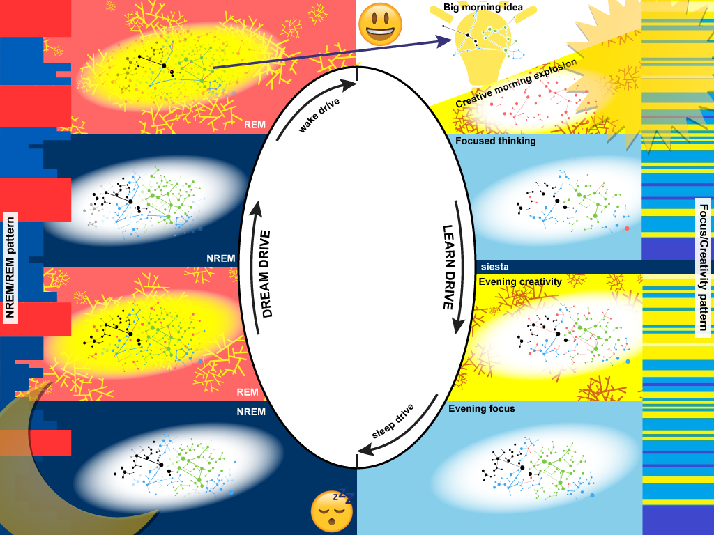

# 12.自然创造力周期

## 12 Natural creativity cycle

## 自然创造力周期

Natural creativity cycle is a repetitive sequence of changes in knowledge stored in memory. Those changes are induced by learning, creative thinking, and [memory optimization in sleep](https://supermemo.guru/wiki/Memory_optimization_in_sleep). Those changes form a cycle rooted in the [circadian rhytm](https://supermemo.guru/wiki/Circadian_cycle).

自然创造力周期是储存在记忆中的知识变化的重复序列。这些变化是由学习、创造性思维和[睡眠中的记忆优化](https://supermemo.guru/wiki/Memory_optimization_in_sleep)引起的。这些变化形成了一个根植于[昼夜节律](https://supermemo.guru/wiki/Circadian_cycle)的周期。

### 12.1 Creativity formula

### 创造力公式

Understanding the creativity cycle is essential for high creativity, good learning, and a happy mind. The following picture explains how the natural creativity cycle works. For details see the [Neural aspects of the creativity cycle](https://supermemo.guru/wiki/I_would_never_send_my_kids_to_school#Neural_aspects_of_the_creativity_cycle).

理解创造力周期对于高创造力、良好的学习和快乐的头脑是必不可少的。下面的图片解释了自然创造力周期是如何运作的。有关详细信息，请参阅[创造力周期的神经方面](https://supermemo.guru/wiki/I_would_never_send_my_kids_to_school#Neural_aspects_of_the_creativity_cycle)。

> **Figure:** In the **natural creativity cycle** there is a regular interplay between the creative processes and the consolidation of knowledge. For high creativity and good learning, those processes must proceed unimpeded. Sleep must come naturally and should never be interrupted. Waking day should also have large blocks protected from interruption, multitasking, and [stress](https://supermemo.guru/wiki/Stress). Starting with the **creative morning explosion**, seeds of activation \(in red\) get gradually converted into a **big idea** that emerges on the next morning. In the meantime, learning, reasoning, and creative activations reshuffle neuronal connections. New connections emerge, get strengthened, weakened, eliminated, or are consolidated for long term storage. All steps are essential for the emergence of the ultimate big idea. For details see: [Neural aspects of the natural creativity cycle](https://supermemo.guru/wiki/Natural_creativity_cycle#Neural_aspects_of_the_creativity_cycle)
>
> **图：**在**自然创造力周期**中，创造过程和巩固知识之间有规律的相互作用。为了获得高度的创造力和良好的学习，这些进程必须畅通无阻地进行。睡眠必须是自然的，不能被打扰。醒着的一天也应该有大块保护免受干扰、多任务处理和[压力](https://supermemo.guru/wiki/Stress)。从**早晨的创意爆炸**开始，激活的种子（红色的）逐渐转化为第二天早上出现的一个**伟大的想法**。同时，学习，推理和创造性的活动重新洗牌神经元连接。新的连接会出现、得到加强、削弱、消除或整合以进行长期存储。所有的步骤对于最终的大想法的出现都是必不可少的。详情见：[自然创造周期的神经方面](https://supermemo.guru/wiki/Natural_creativity_cycle#Neural_aspects_of_the_creativity_cycle)

### 12.2 Natural creativity cycle

### 自然创造力周期

The **natural creativity cycle** is an interplay of neurological processes that occur [in waking and in sleep](https://supermemo.guru/wiki/Circadian_cycle). This natural cycle does not come with much advice that will boost your specific creativity. You only need to know that all creative people must protect the cycle from interference with drugs, distractions, or designer schedules that disrupt individual stages. The most delicate and the most often disrupted component of the cycle is sleep. Typical cycle violations would include morning alarm clock, evening alcohol, medication, or suppressing creativity with multitasking, stress, and disruptions.

**自然创造力周期**是发生在[清醒和睡眠中](https://supermemo.guru/wiki/Circadian_cycle)的神经过程的相互作用。这种自然的循环不会有太多的建议来提高你的特定创造力。你只需要知道，所有创造力的人都必须保护周期不受毒品、干扰或设计计划的干扰，这些干扰扰乱了各个阶段。周期中最微妙、最经常被干扰的部分就是睡眠。典型的违反周期包括早上的闹钟，晚上的酒精，药物，或多任务，压力和干扰抑制创造力。

> **To live up to your intellectual and creative potential, you should respect and protect the natural creativity cycle.**
>
> **为了发挥你的智力和创造潜力，你应该尊重和保护自然创造力周期。**

#### 12.2.1 Day

#### 白天

##### 12.2.1.1 Waking

##### 醒来

The cycle begins with natural waking after a full night of uninterrupted and unmedicated sleep. It is essential that [sleep occur in the optimum circadian framework](http://super-memory.com/articles/sleep.htm). In simplest terms, it means going to sleep when sleepy, waking up naturally, going to sleep daily in a similar time frame, and waking up at sunrise or after sunrise under the influence of natural sunlight.

这一周期始于一整晚不间断、不用药的睡眠后自然醒来。[睡眠必须在最佳的昼夜节律框架内发生](http://super-memory.com/articles/sleep.htm)。简而言之，它意味着在昏昏欲睡的时候睡觉，自然醒来，每天在相似的时间范围内睡觉，以及在自然阳光的影响下在日出或日出后醒来。

##### 12.2.1.2 Morning creativity

##### 晨间创造力

In the natural cycle, for biological reasons, the [best brain performance occurs in the morning](https://supermemo.guru/wiki/Sleep_and_learning#Alertness_vs._learning). This is the time when new ideas start germinating and when best creative learning takes place. Creative learning differs from your typical learning in that the creative process may interfere with the learning process. This may slow down learning while increasing its quality and outcomes. In creative learning, you learn the subject matter and supplement that learning with your own creative enhancement. In other words, while reading a book, in creative learning, you learn the content of the book and what you invent about the book!

在自然周期中，由于生物学上的原因，[最好的大脑表现发生在早晨](https://supermemo.guru/wiki/Sleep_and_learning#Alertness_vs._learning)。这是新思想开始萌芽的时候，也是最好的创造性学习发生的时候。创造性学习与典型的学习的不同之处在于，创造性过程可能会干扰学习过程。这可能会减缓学习的速度，同时提高学习的质量和成果。在创造性学习中，你学习主题，并用你自己的创造性增强来补充学习。换句话说，在阅读一本书的时候，在创造性学习中，你学习这本书的内容以及你对这本书的发明！

##### 12.2.1.3 Focus and creativity cycles

##### 注意力和创造力循环

During the day, there will be two prime oscillations between the competing brain states of focus and creativity:

白天，注意力和创造力这两种相互竞争的大脑状态之间将会有两个主要的振荡：

* circadian oscillation resulting from natural sleep-wake cycle with creativity maximized upon waking, gradual shift towards focused thinking, and ultimate waning of both functions in readiness for the next sleep cycle
* 自然的睡眠-醒来周期产生的昼夜节律振荡，在醒来时创造力达到最大，逐渐转向专注思考，两种功能在为下一个睡眠周期做好准备时都最终减弱。
* procedural oscillation in which learning and thinking interleave \(e.g. focused reading of a sentence in a book, and then thinking about it\)
* 学习和思考交织在一起的程序性振荡（例如专注阅读一本书中的一句话，然后再思考它）

The [diagram](https://supermemo.guru/wiki/I_would_never_send_my_kids_to_school#Neural_aspects_of_the_creativity_cycle) shows a simplified focus and creativity stages for symmetry with nighttime sleep. In reality, they will be interleaved and wane at different speeds depending on the type of brainwork employed.

[图](https://supermemo.guru/wiki/I_would_never_send_my_kids_to_school#Neural_aspects_of_the_creativity_cycle)中显示了一个简化的注意力和创造力阶段的对称与夜间睡眠。实际上，它们会以不同的速度交错和衰减，这取决于所使用的脑力劳动的类型。

Creative and consolidation components of waking and sleep stand in procedural symmetry, but are controlled differently. While there is a dedicated NREM-REM sleep flip-flop control based on specific [brain centers](https://supermemo.guru/wiki/Brain_map), the switch from creative mode to focused thinking is network-based and procedural. When there is a high-value association detected in a chaos of creative activation, it may trigger placing an attentive spotlight on the association, which in turn will result in suppression of all activity associated with the creative mode.

清醒和睡眠的创造性和巩固成分在程序上是对称的，但是被不同地控制。虽然有一个专门的 NREM-REM 睡眠触发器控制基于特定的[大脑中心](https://supermemo.guru/wiki/Brain_map)，从创造性模式到专注思考的转换是基于网络和程序的。当在创造性激活的混乱中检测到一个高价值的关联时，它可能会触发对该关联的关注聚焦，这反过来又会导致与创造性模式相关的所有活动被抑制。

For example, an early morning brain, after a cup of coffee, might be buzzing with ideas in many areas of interest. However, once an important idea is hit, focused analysis will demand suppressing all other ideas to provide for "clear thinking" mode. The best lossless way for tackling the competition between ideas in creative mode is note taking. Depending on the brain and the context, ideas may be too precious to get lost by suppression with focused thinking. They should better be written down before working on them individually. Naturally, in a creative individual, the stream of ideas may be too rich to fully process, and a good balance between invention and implementation is necessary. The best way of achieving that balance is to supplement the brain with [incremental processing](https://supermemo.guru/wiki/Incremental_learning) tools, like [SuperMemo](https://supermemo.guru/wiki/SuperMemo). See: [Tools](https://supermemo.guru/wiki/I_would_never_send_my_kids_to_school#Tools).

例如，清晨喝了一杯咖啡后，大脑可能会在许多感兴趣的领域里嗡嗡作响。然而，一旦一个重要的想法被击中，重点分析将要求压制所有其他想法，以提供「清晰的思维」模式。在创意模式下，解决创意之间竞争的最好方法就是记笔记。根据大脑和环境的不同，想法可能过于珍贵，不会因为专注于思考而被压抑而迷失。在单独处理它们之前，最好先把它们写下来。当然，在一个创造性的个体中，想法流可能过于丰富而无法充分处理，因此在发明和实现之间保持良好的平衡是必要的。实现这种平衡的最好方法是用[渐进处理](https://supermemo.guru/wiki/Incremental_learning)工具来补充大脑，比如 [SuperMemo](https://supermemo.guru/wiki/SuperMemo)。请参见：[工具](https://supermemo.guru/wiki/I_would_never_send_my_kids_to_school#Tools)。

##### 12.2.1.4 Siesta bonus

##### 午睡奖励

Anyone who can afford a siesta should avail of the opportunity. Naptime sleep differs from nighttime sleep, however, it performs vital [homeostatic](https://supermemo.guru/wiki/Homeostatic) function that restores both learning capacity and creative capacity back to baseline. In essence, [biphasic lifestyle](https://supermemo.guru/wiki/Biphasic_life) with a [siesta component](https://supermemo.guru/wiki/Siesta) helps the brain execute two wake creativity sub-cycles in a single day. This is the **first siesta bonus** that can literally double the creative output of an individual.

任何能负担得起午睡的人都应该利用这个机会。睡眠时间不同于夜间睡眠，然而，它执行重要的[自我平衡](https://supermemo.guru/wiki/Homeostatic)功能，使学习能力和创造能力恢复到基线水平。本质上，含[午睡成分](https://supermemo.guru/wiki/Siesta)的[双相生活方式](https://supermemo.guru/wiki/Biphasic_life)可以帮助大脑在一天中执行两个唤醒创造力的子周期。这是**第一午睡奖励**，可以从字面上加倍一个人的创造性产出。

Due to the different nature of naptime sleep and its regulatory mechanisms, there are many unknowns in reference to the impact of napping on creativity. We are not sure if evening creativity is qualitatively different from morning creativity. All differences we see may equally well be explained by the change of context \(e.g. morning creativity might occur in the office, while evening creativity takes place over a desk at home, there is a change in the impact of light, social life, exercise, disruption and more\). As the creative process is highly unpredictable, the possibility of employing two different brain modes might be highly beneficial. This can theoretically provide the **second siesta bonus**: a [different creative mode](https://supermemo.guru/wiki/How_to_solve_any_problem%3F).

由于午睡时间的性质及其调节机制的不同，关于午睡对创造力的影响有许多未知数。我们不能确定晚上的创造力和早晨的创造力是否有质的不同。我们看到的所有差异同样可以用环境的变化来解释（例如，早上的创造力可能发生在办公室，而晚上的创造力则发生在家里的桌子上，光、社交生活、锻炼、干扰等的影响也会发生变化）。由于创造过程是高度不可预测的，使用两种不同的大脑模式的可能性可能是非常有益的。这在理论上可以提供**第二午睡奖励**：一种[不同的创作模式](https://supermemo.guru/wiki/How_to_solve_any_problem%3F)。

#### 12.2.2 Sleep

#### 睡眠

A creative individual does not need to understand what happens in sleep. Those processes are automatic and not fully understood. It is enough to stick to the healthy sleep regimen and the brain will take care of itself in sleep. However, the structure of sleep and the interplay of NREM-REM stages helps one understand the dangers of sleeping in wrong hours, using alarm clock, drinking alcohol before sleep, taking sleeping pills \(incl. seemingly harmless melatonin\), etc.

一个有创造力的人不需要理解在睡眠中会发生什么。这些过程是自动的，不能完全理解。坚持健康的睡眠方式就足够了，大脑会在睡眠中照顾好自己。然而，睡眠的结构和 NREM-REM 阶段的相互作用有助于我们理解错误的睡眠时间、使用闹钟、睡前饮酒、服用安眠药（包括看似无害的褪黑激素）等。

##### 12.2.2.1 NREM sleep

##### NREM 睡眠

Sleep begins with a gradual descent into deep sleep. The actual play of neural circuits in that stage is still be be elucidated. There are many competing models, however, a consensus seems to emerge that NREM sleep is the stage when [memories are consolidated for long-term storage in cortical areas](http://super-memory.com/articles/sleep.htm#NREM_and_memory). This frees working memory structures, such as the hippocampus, for more learning while awake. Without this sleep stage, declarative learning is impeded. This means that in severe sleep deprivation, the things we learned and figured out during the day may become volatile and lost in part or entirely.

睡眠从逐渐进入深度睡眠开始。神经回路在这一阶段的实际作用仍有待阐明。有许多相互竞争的模型，然而，一个共识似乎出现了 NREM 睡眠是一个阶段，这时候记忆以长期存储在皮层地区的方式被巩固。这就释放了工作记忆结构，如海马体，以便在清醒时进行更多的学习。没有这个睡眠阶段，陈述性学习就会受到阻碍。这意味着，在严重睡眠不足的情况下，我们在白天所学到的东西可能会变得不稳定，部分或全部丢失。

##### 12.2.2.2 REM sleep

##### REM 睡眠

REM sleep is a type of sleep that starts dominating later in the night. This might be the most under-appreciated component of the natural creativity cycle. This is the type of sleep when the brain [teaches itself](http://super-memory.com/articles/sleep.htm#REM_as_a_form_of_neural_training) of what it knows with the purpose of optimizing, simplifying, and generalizing knowledge. In simple terms, after REM sleep, the things we know, we start knowing better, and as a result, we start noticing new relationships in knowledge. This reshuffling of knowledge makes it possible to invent in sleep without lifting a finger. The whole process is automatic. All we need to do is sleep. We do not even need to go to sleep with the intention of inventing. It will happen whether we wish or not.

REM 睡眠是一种在晚上晚些时候开始占优势的睡眠类型。这可能是自然创造力循环中最不受重视的部分。这就是当大脑为了优化、简化和概括知识而[自学](http://super-memory.com/articles/sleep.htm#REM_as_a_form_of_neural_training)它所知道的知识时的睡眠类型。简单地说，在快速眼动睡眠后，对我们知道的事情，我们开始更好地了解，因此，我们开始注意到新的关系中的知识。对知识的这种重组使得在睡眠中发明而不用动一根手指成为可能。整个过程是自动的。我们要做的就是睡觉。我们甚至不需要带着发明的意图去睡觉。不管我们愿不愿意，都会发生的。

##### 12.2.2.3 Nighttime inventions

##### 夜间发明

We commit two mortal sins that destroy brain's ability to come up with new ideas in sleep:

1. we damage sleep structure with medication and
2. we cut the REM-rich end of sleep with alarm clocks.

我们犯了两种致命的罪过，破坏了大脑在睡眠中提出新想法的能力：

1. 我们用药物破坏睡眠结构
2. 我们用闹钟切断了富含 REM 的睡眠。

Before sleep, we often take medications, incl. sleep medications. Many people drink alcohol or even smoke weed to get themselves to sleep faster \(or nicer\). All those factors interfere with sleep structure, and REM sleep deprivation might be the most damaging effect. Without NREM sleep we feel awful. This is why few people resort to the extreme form of time-saving: all nighters. However, without REM sleep we are just dumber. This is hard to notice. The pain is less tangible. REM sleep seems dispensable to many. This is why a huge chunk of the population gets up in the morning with the assistance of the alarm clock. I explain elsewhere that [in most cases we can move the sleep phase to earlier hours](https://supermemo.guru/wiki/Curing_DSPS_and_insomnia), and get rid of the alarm clock for good. However, I might as well be crying in the wilderness. Even those who read my texts keep saying that they just can't afford sleeping long \(e.g. using ["_sleep makes me feel bad_" myth](https://supermemo.guru/wiki/Sleep:_myths_and_facts) as an excuse\). Those who save time on sleep often trade their moods and smarts for minor savings in time which they later fritter away through messing around due to tiredness and lesser mental capacity.

睡觉前，我们经常吃药，包括安眠药。许多人喝酒甚至抽大麻都是为了让自己睡得更快（或更好）。所有这些因素都会干扰睡眠结构，而 REM 睡眠剥夺可能是最具破坏性的影响。没有 NREM 睡眠，我们感觉糟透了。这就是为什么很少有人求助于极端形式的节省时间：通宵。然而，如果没有 REM 睡眠，我们就更蠢了。这很难被注意到。疼痛是不那么明显的。对许多人来说，REM 睡眠似乎是可有可无的。这就是为什么大部分人早上在闹钟的帮助下起床的原因。我在其他地方解释说，在大多数情况下，我们可以将睡眠阶段移到更早的时间，并永远摆脱闹钟。不过，我还不如在荒野里哭。即使是那些读过我的短信的人也一直说，他们负担不起睡久一点（例如，用[_「睡眠让我感觉不好」_](https://supermemo.guru/wiki/Sleep:_myths_and_facts)的说法作为借口）。那些节省睡眠时间的人常常用自己的情绪和智慧换取少量的时间节省，后来由于疲劳和智力下降而浪费掉了这些时间。

Natural creativity cycle can easily lose most of its potency by our interference with sleep. Late sleep, stress, alcohol, and alarm clocks are chief culprits here. If you are stuck in a creative groove, if you cannot solve a difficult problem, read this text again, and obey the rules of the natural creativity cycle. A few simple steps maintained for a few weeks can easily double or quadruple your creative potential! The returns on investment are truly exponential!

自然创造力周期很容易因为我们对睡眠的干扰而丧失了它的大部分潜能。晚睡、压力、酒精和闹钟是这里的罪魁祸首。如果你被困在一个创造性的凹槽里，如果你不能解决一个困难的问题，再读一遍这篇文本，并遵守自然创造力周期的规则。几个星期的简单步骤可以很容易地使你的创造潜力翻两番或四倍！投资的回报真的是指数式的！

See: [How to solve any problem?](https://supermemo.guru/wiki/How_to_solve_any_problem%3F)

参见：[怎样解决任何问题？](https://supermemo.guru/wiki/How_to_solve_any_problem%3F)

### 12.3 Neural aspects of the creativity cycle

### 创造力周期的神经方面

This picture presents the progression of the creativity cycle in neural terms. In the diagram, dots represent memories or concepts. Connections between the dots represent associations \(between memories or concepts\). Memories and connections are first formed or activated in red in the process of learning or spontaneous creativity. In successive octants of the diagram, memories and connections can get weakened or consolidated. Darker and thicker connections are most stable and most durable. The picture shows how, in a single cycle of day and night, a new big idea emerges. New connections may form via deterministic inference \(thinking\), or via random activations typical of creativity or REM sleep.

这张图片以神经的方式呈现了创造力循环的进程。在图中，点代表记忆或概念。点之间的连接表示联想（记忆或概念之间）。记忆和联系首先是在学习或自发创造的过程中以红色形成或激活的。在图表的连续八分圆中，记忆和连接可能会被削弱或巩固。较暗和较厚的连接是最稳定和最持久的。这幅图展示了一个新的伟大的想法是如何在白天和黑夜的单周期中出现的。新的连接可能通过确定性的推断（思考），或者通过创造性或 REM 睡眠的随机激活而形成。

The same idea may be represented by a different set of neurons in a different part of the brain. The memory transfer may occur during a single cycle. This is why association of ideas in the diagram should not be understood as specific neural connections in the brain.

同样的想法可能由大脑不同部位的一组不同的神经元所代表。所述记忆转移可在单个周期内发生。这就是为什么图中的联想不应该被理解为大脑中特定的神经连接。

#### 12.3.1 Waking Day

#### 醒来后的白天

**Octant 1: Morning creative explosion:** The day in a natural cycle begins with a creative explosion. The semantic tree of knowledge gets expanded in a highly unpredictable manner. The most important part of that process is random activation of concept neurons associated with ideas. On a good day, the brain should be buzzing with ideas related to one's work, or ideas irrelevant. A cup of coffee can enhance this process. Good mood is also essential as it allows of unconstrained creativity. Modern scourges of [bad sleep](https://supermemo.guru/wiki/Good_sleep), [stress](https://supermemo.guru/wiki/Stress), and haste are prime enemies of morning creativity. In the picture, the underlying existing knowledge tree is not shown. Only new foci of activity are shown in red. New associations are shown as links between activation centers \(edges to the knowledge graph\).

**八分圆之一：早晨创意爆炸：**自然周期中的一天以创意爆炸开始。知识的语义树以一种高度不可预测的方式扩展。这一过程中最重要的部分是与想法相关的概念神经元的随机激活。在美好的一天里，大脑中应该有与工作相关的想法，或者与工作无关的想法。一杯咖啡可以增强这个过程。良好的心情也是必不可少的，因为它允许不受限制的创造力。[糟糕的睡眠](https://supermemo.guru/wiki/Good_sleep)、压力和匆忙等现代祸害是早晨创造力的主要敌人。在图中，未显示基础的现有知识树。只有新的活动焦点显示为红色。新的关联显示为激活中心（知识图的边）之间的链接。

**Octant 2: Focused thinking:** Focused work is more conducive to deductive reasoning in which the knowledge tree gets expanded in a systematic manner. For example, a creative idea, that pops up randomly, may get associated with active leaves of the existing knowledge tree. Those associations will fill the gaps needed to complete the jigsaw puzzle leading to a solution to a problem. Focus and creativity are competitive, but they are not separated into big time-span octants as shown on the picture. Those are only used to illustrate the symmetry with the learn-and-burn cycle of the nighttime NREM-REM pattern. To get a better sense of the interaction of focus and creativity, check the right margin where creativity shows in yellow and keeps waning with waking, while focused time is shown in blue. The actual interplay is even finer and some of the processes occur in parallel. The darker the shade of blue, the more tired the brain, and the less likely it is to make progress in problem solving. Sleep comes to rescue to renew the cycle.

**八分圆之二：专注思考：**专注工作更有利于演绎推理，在这种推理中，知识树得到了系统的扩展。例如，一个随机弹出的创意可能与现有知识树的活动叶相关联。这些联系将填补所需的空白，以完成拼图难题，引导一个问题的解决方案。注意力和创造力是相互竞争的，但它们并不像图中所示的那样被分成大的时间跨度的变量。这些仅用于说明夜间 NREM-REM 模式的学习和燃烧周期的对称性。为了更好地理解注意力和创造力之间的相互作用，请检查以下位置：创造力以黄色显示，并且随着清醒时间不断减弱，而专注时间以蓝色显示。实际的相互作用甚至更精细，其中一些过程是并行发生的。蓝色的阴影越深，大脑就越疲惫，在解决问题方面取得进展的可能性就越小。睡眠是为了解救和更新周期而来的。

**Octants 3-4** will mirror Octants 1-2 in individuals who take a recommended mid-day nap. Naps bring the homeostatic learning capacity back to the baseline. In other words, well executed naps eliminate the network fatigue effect. Biphasic sleepers benefit of maximum creativity, alertness and learning performance in two octants in a single cycle: Octant 1 and Octant 3. In monophasic sleepers, the evening creative mode is undermined by network fatigue, and most of the improved alertness and learning capacity comes from the [impact of circadian variables on the brain](http://super-memory.com/articles/sleep.htm#Monophasic_sleep_with_biphasic_learning). Even if you do not sleep at siesta time, the brain experiences an evening revival after the mid-day slump. The picture assumes that siesta has restored the full creative mode and the main difference between Octant 1 and Octant 3 is that, in the evening, the period of prolific creativity will build upon newly formed structures of knowledge inherited from the first half of the waking day.

**八分圆之三和四**将如同八分圆之一和二，如果个体进行了推荐的午睡。午睡使自稳态学习能力恢复到基线水平。换句话说，良好执行的午睡消除了网络疲劳效应。双相睡眠者在一个周期中的两个八分圆：八分圆之一和八分圆之三中最大限度地发挥创造力、警觉性和学习能力。在单相睡眠者中，夜间的创造模式受到网络疲劳的破坏，大部分提高的警觉性和学习能力来自于[昼夜变化对大脑的影响](http://super-memory.com/articles/sleep.htm#Monophasic_sleep_with_biphasic_learning)。即使你在午睡时不睡觉，在午休之后，大脑也会经历一次晚上的复苏。这幅图假设午睡已经恢复了完全的创造模式，八分圆之一和八分圆之三之间的主要区别是，在晚上，多产的创造力将建立在从醒着的一天的前半部分继承下来的新的知识结构之上。

#### 12.3.2 Night

#### 晚上

**Octant 5: NREM sleep:** Memories get consolidated in the neocortex. The picture does not reflect the fact that the same connections between concepts may move from the switchboard \(hippocampus\) to permanent storage \(neocortex\). Octants 4 and 5 may look the same, but the networks of connections may change their location in the brain. The whole fabric of knowledge becomes stable, consolidated, and gets a ticket on its way to longevity. Memories settled in the cortex will get more and more stable with each review.

**八分圆之五：NREM 睡眠：**记忆在大脑皮层得到巩固。这幅图没有反映出这样一个事实，即概念之间的相同连接可能会从交换台（海马）移动到永久存储（新大脑皮层）。八分圆之四和五可能看起来是一样的，但是连接网络可能会改变它们在大脑中的位置。整个知识结构变得稳定、巩固，并在走向长命的道路上获得了入场券。每一次回顾，大脑皮质中的记忆都会变得越来越稳定。

**Octant 6: REM sleep:** Unlike focus-creativity interplay which is network-procedural in character, NREM/REM pattern operates like a [flip-flop oscillator](http://super-memory.com/articles/sleep.htm#REM_flip-flop). The left margin on the picture shows a typical NREM/REM pattern for a night. For the sake of illustration and symmetry, the picture includes only four separate episodes. Octant 6 is a nighttime equivalent of daytime creativity. Random pattern activation will produce new associations and REM sleep will work like an optimizing trainer for neural networks. When woken up during REM, we often report dreaming. This may be the expression of brain's nighttime work on playing hypothetical scenarios for the sake of memory optimization and discovery. The picture shows transitory areas of red activation, which can later become consolidated into new ideas in successive episodes of NREM sleep, or enhanced in successive episodes of REM sleep.

**八分圆之六：REM 睡眠：**不同于网络-程序的注意力-创造力互动，NREM/REM 模式的运作就像一个触发器振荡器。图中的左边缘显示了一个晚上的典型 NREM/REM 模式。为了说明和对称，这幅画只包括四个单独的插曲。八分圆之六相当于白天的创造力。随机模式激活将产生新的关联，REM 睡眠将像神经网络的优化训练器一样工作。在 REM 期间醒来时，我们经常报告做梦。这可能是大脑为了优化和发现记忆而玩假设性场景的夜间工作的表现。这幅图显示了短暂的红色激活区域，这些区域后来可以在连续的 NREM 睡眠中被巩固成新的想法，或者在连续的 REM 睡眠中增强。

**Octant 7 NREM:** Further consolidation of gains from the day and early REM sleep episodes.

**八分圆之七 NREM：**进一步巩固从一天和早期 REM 睡眠事件的收益。

**Octant 8 REM:** Last part of the night might be most prolific in terms of creativity. This is the time when most of obligatory consolidation and memory transfer has already occurred. This is the time the brain is allowed to play with existing memories and look for patterns and generalizations that crystallize ideas and provide new insights in problems to be solved in waking.

**八分圆之八 REM：**就创造力而言，夜晚的最后一段时间可能是最多产的。这是大多数强制性的巩固和记忆转移已经发生的时候。这是大脑被允许玩现有记忆，寻找模式和概括，使想法具体化，并为醒来时需要解决的问题提供新视角。

#### 12.3.3 Next morning

#### 第二天早上

Finally, back in **Octant 1**, we wake up with a big idea.

最后，回到**八分圆之一**，我们有了一个伟大的想法。

> Those who do not follow the natural creativity cycle are less likely to come up with big ideas and be efficient problem solvers
>
> 那些不遵循自然创造力周期的人不太可能想出大点子，也不太可能成为高效的问题解决者

For the sake of creativity, if only possible, we should go to sleep when sleepy, abandon the alarm clock, give up drugs and medication, avoid evening alcohol, and get as much sleep as the brain demands \(incl. the recommended mid-day nap\).

为了创造力，如果可能的话，我们应该在昏昏欲睡的时候睡觉，放弃闹钟，放弃药物和药物，避免晚上喝酒，并且根据大脑的需要获得尽可能多的睡眠（包括建议的午睡时间）。

The presented picture had three contributors, and their zodiac constellations have been used to assemble the representation of the ultimate big morning idea. You can now follow individual octants to get a general sense how that big idea came to be: starting with a creative chaos of the early morning, focused reasoning, further layers of creative enhancement, nighttime consolidation and comparison with existing memories, nighttime optimization, and nighttime creative expansion via random pattern generation.

提供的图片有三个贡献者，他们的星座已经被用来组装的最终大的早晨想法的代表。现在，您可以跟踪单个八分圆来了解这个大想法是如何形成的：从清晨的创造性混乱开始，专注推理，进一步的创造性增强层，夜间巩固和与现有记忆的比较，夜间优化，以及通过随机模式生成的夜间创造性扩展。

### 12.4 Depression and positive thinking

### 抑郁和积极思考

Nighttime [creativity](https://supermemo.guru/wiki/Creativity) is an anti-depressant. This is not only a matter of neurohormones. You can go to sleep with a gnawing problem only to wake up with a solution. If the problem is unsolvable, you might creatively come up with an optimistic interpretation, or, at the very least, with a stoic interpretation. This can happen only if you obey the creativity cycle and ensure perfect [circadian alignment](https://supermemo.guru/wiki/Circadian_alignment) of nighttime sleep. Departures from optimum sleep timing can [trigger depression](https://www.ncbi.nlm.nih.gov/pmc/articles/PMC2612129/).

夜间[创造力](https://supermemo.guru/wiki/Creativity)是一种抗抑郁药。这不仅仅是神经激素的问题。你可以带着咬人的问题入睡，但醒来的时候却发现了一个解决方案。如果这个问题是无法解决的，你可以创造性地提出一个乐观的解释，或者至少是一个坚忍的解释。只有当你服从创造力周期并确保夜间睡眠的完美[昼夜节律](https://supermemo.guru/wiki/Circadian_alignment)时，这种情况才会发生。偏离最佳睡眠时间会[引发抑郁](https://www.ncbi.nlm.nih.gov/pmc/articles/PMC2612129/)。

Few people realize how important sleep is for moods. People who frequently experience a depressed mood insist that [sleep deprivation](https://supermemo.guru/wiki/Sleep_deprivation) often makes them feel better. A great deal of research confirms that. It is possible that some of that mitigating influence comes from the neural chaos that prevents the runaway effect that underlies depression. However, the link between [sleep deficit](https://supermemo.guru/wiki/Sleep_deficit) and mood may lead to wrong strategies. Cutting down on sleep indiscriminately may have the opposite effect: worsening of the mood. Short sleep indeed correlates with improved moods. However, this is mostly due to that fact that the shortest natural sleep is achieved in conditions where it is timed perfectly in reference to brain needs determined by the [circadian cycle](https://supermemo.guru/wiki/Circadian_cycle). Shortening sleep by delaying bedtime will have a different effect than shortening it with an alarm clock. Both will work differently in different chronotypes and in different forms of circadian misalignment. [Sleep deprivation](https://supermemo.guru/wiki/Sleep_deprivation) caused by circadian disruption can have a negative neurohormonal impact on the brain and trigger a depressed mood instead. Unless fully understood in the circadian dimension, and perfected as a form of chronotherapy, [wake therapy](http://en.wikipedia.org/wiki/Wake_therapy) may go the way of [electroconvulsive shock therapy](https://en.wikipedia.org/wiki/Electroconvulsive_therapy) in the annals of medical history.

很少有人意识到睡眠对情绪有多重要。经常经历抑郁情绪的人坚持认为，[睡眠剥夺](https://supermemo.guru/wiki/Sleep_deprivation)通常会让他们感觉更好。大量的研究证实了这一点。这可能是一些缓解影响来自神经混乱，以防止失控的影响，在抑郁症的基础上。然而，[睡眠不足](https://supermemo.guru/wiki/Sleep_deficit)和情绪之间的联系可能导致错误的策略。不分青红皂白地减少睡眠可能会产生相反的效果：情绪恶化。睡眠不足确实与情绪改善有关。然而，这在很大程度上是由于这样一个事实，即最短的自然睡眠是在与由[昼夜周期](https://supermemo.guru/wiki/Circadian_cycle)决定的大脑需求相适应的情况下实现的。通过推迟睡觉时间来缩短睡眠时间与用闹钟缩短睡眠时间有不同的效果。两者在不同的时型和不同形式的昼夜节律失调中起不同的作用。由昼夜节律紊乱引起的[睡眠剥夺](https://supermemo.guru/wiki/Sleep_deprivation)会对大脑产生负面的神经激素影响，反而会引发抑郁情绪。除非在生物钟维度上有充分的理解，并将其作为一种时间治疗的形式加以完善，否则[唤醒疗法](http://en.wikipedia.org/wiki/Wake_therapy)可能会在医学史上走上[电休克疗法](https://en.wikipedia.org/wiki/Electroconvulsive_therapy)的道路。

When there is no additional interference from stressors, mood changes are best explained by [circadian misalignment](https://supermemo.guru/wiki/Circadian_misalignment) of sleep in reference to the body clock \(see: [Circadian disturbances in depression](https://www.ncbi.nlm.nih.gov/pmc/articles/PMC2612129/). For that reason, well-executed and well-protected [free running sleep](https://supermemo.guru/wiki/Free_running_sleep) might be the simplest and safest sleep therapy in depression.

当没有来自应激源的额外干扰时，情绪变化的最好解释是睡眠与生物钟的昼夜不一致（参见：[抑郁症中的昼夜节律紊乱](https://www.ncbi.nlm.nih.gov/pmc/articles/PMC2612129/)）。正因为如此，良好的执行和良好的保护[自由运行的睡眠](https://supermemo.guru/wiki/Free_running_sleep)可能是最简单和最安全的睡眠治疗抑郁症。

In addition to its impact on re-balancing brain hormones, sleep has a very important impact on positive thinking through its creative effect. The same reality is interpreted differently by optimists and pessimists. The same reality is interpreted differently by the brain in different neurohormonal states and at different stages of the circadian cycle. People with a positive disposition, or brains in the right state, may have a healthy tendency to see the glass half full. This is part of natural defenses against the brutal truths of reality that can propel an optimist through life with a happy face. A vital component of that optimistic interpretation of the world is the creative brain that can actively search for ideas that can make the reality seem more congruent and more friendly. It is the nighttime creativity that helps build up positive interpretation.

睡眠除了影响大脑激素的再平衡外，还通过其创造作用对积极思维产生非常重要的影响。乐观主义者和悲观主义者对同样的现实有不同的解释。在不同的神经激素状态和昼夜周期的不同阶段，大脑对同样的事实有不同的解释。性格积极的人，或者大脑处于正确状态的人，可能会有看到杯子半满的健康倾向。这是对现实残酷事实的自然防御的一部分，这些事实可以推动乐观主义者以一张快乐的脸度过一生。对世界的乐观解释的一个重要组成部分是创造性的大脑，它能够积极地寻找能够使现实看起来更和谐和更友好的想法。正是夜间的创造力帮助建立了积极的解释。

[REM sleep](https://supermemo.guru/wiki/REM_sleep) is the prime time for dreaming. People woken up in REM sleep report dreaming. People who wake up naturally often have no recall of dreaming. Dreams are incongruent and testify to their creative nature. They are often pretty unpleasant. All nightmares serve to arm us with knowledge tools such as solutions to dangerous situations, and positive interpretations of reality. In depressed patients, circadian misalignment my expose "dreaming brain" to wakefulness, which can trigger a positive feedback cascade of dark thoughts. This is why an alarm clock may provide for a difference between a nightmare and a positive solution to a problem.

[REM 睡眠](https://supermemo.guru/wiki/REM_sleep)是做梦的黄金时期。在 REM 睡眠中醒来的人会做梦。自然醒来的人常常不记得做梦。梦是不一致的，证明了它们的创造性。它们常常令人不快。所有的噩梦都是用知识工具武装我们的，例如解决危险局势的方法，以及对现实的积极解释。在抑郁症患者中，昼夜节律失调使我的「梦中大脑」暴露于清醒状态，这可能会触发一系列黑暗思想的正反馈级联。这就是为什么闹钟可以提供噩梦和问题的积极解决方案之间的区别。

This nighttime creative search for positive interpretation is why we say we like to sleep over the worries and take a new look in the morning. This is how we employ brain hormones and creativity to see the world in better colors. Those who neglect sleep, deprive themselves of the chief weapon that might help them improve their mood.

这个晚上创造性地寻找积极的解释，这就是为什么我们说，我们喜欢睡觉，消除烦恼，在早晨采取新的面貌。这就是我们如何利用大脑荷尔蒙和创造力，以更好的颜色看待世界。那些忽视睡眠，剥夺自己的主要武器，可能会帮助他们改善自己的情绪。

### 12.5 Creative cycle control

### 创造力周期控制

The control of the natural creativity cycle is determined by \(1\) [learn drive](https://supermemo.guru/wiki/Learn_drive), \(2\) [sleep drive](http://super-memory.com/articles/sleep.htm#Sleep-wake_flip-flop), \(3\) [dream drive](http://super-memory.com/articles/sleep.htm#REM_flip-flop), \(4\) local neural network control, and \(5\) systemic neurohormonal control.

自然创造力周期的控制取决于\(1\)[学习内驱力](https://supermemo.guru/wiki/Learn_drive)、\(2\)[睡眠内驱力](http://super-memory.com/articles/sleep.htm#Sleep-wake_flip-flop)、\(3\)[梦内驱力](http://super-memory.com/articles/sleep.htm#REM_flip-flop)、\(4\)局部神经网络控制和\(5\)系统神经激素控制。

The learn drive propels [learning, thinking and creativity](https://supermemo.guru/wiki/Learn_drive). The balance between focus and creativity is determined by the operations o the involved networks and brain centers, and modulated by the neurohormonal state of the brain, as well as the network fatigue.

学习内驱力促进[学习、思考和创新](https://supermemo.guru/wiki/Learn_drive)。注意力和创造力之间的平衡是由所涉及的网络和大脑中心的运作决定的，并受大脑的神经激素状态以及网络疲劳的调节。

Sleep drive initiates sleep. It is determined by the following two prime variables:

1. the circadian status that determines sleep propensity and
2. the homeostatic status that depends on the network fatigue.

   睡眠内驱力启动睡眠。它由以下两个主要变量决定：

3. 昼夜节律决定睡眠倾向的生理状态
4. 依赖于网络疲劳的稳态状态。  

Sleep drive makes sure that we fall asleep late in the evening. In a well-managed creativity cycle, sleep drive will also ensure sleep during the siesta period. The system of brain structures governing the sleep drive is pretty complex as depicted in the [Sleep control system](https://supermemo.guru/wiki/Brain_map) diagram.

睡眠内驱力确保我们晚上很晚才睡着。在一个管理良好的创造力循环中，睡眠内驱力也将确保午睡期间的睡眠。控制睡眠内驱力的大脑结构系统相当复杂，如[睡眠控制系统](https://supermemo.guru/wiki/Brain_map)图所示。

The dream drive is based on NREM-REM flip-flop which regulates transitions between two stages of sleep in which the direction of flow of information in the brain reverses to serve consolidation and/or optimization of memories.

梦内驱力是基于 NREM-REM 触发器的，它调节两个睡眠阶段之间的转换，在这两个阶段中，大脑中的信息流动方向发生逆转，以服务于记忆的巩固和优化。

All the control components of the natural creativity cycle, if undisturbed, provide a sure way to discovery.

自然创造力周期的所有控制成分，如果不受干扰，就提供了一种可靠的发现方法。

> **Human brain works like a perfect inventing machine**. It gathers information, converts it into coherent knowledge, creatively expands knowledge \(both in waking and in sleep\), and comes up with solutions to problems, action trajectories, and more.
>
> **人脑就像一台完美的发明机器。**它收集信息，将其转化为连贯的知识，创造性地扩展知识（无论是在清醒时还是在睡眠中），并提出解决问题、行动轨迹等问题的解决方案。

All those goals are achieved using a mass of tissue that takes just 1-2% of the weight of the human body. Human brain is a true miracle of biological evolution. All its asks is a bit of energy to run it and respect for its control mechanisms.

所有这些目标都是通过仅占人体重量 1-2% 的大量组织来实现的。人脑是生物进化的真正奇迹。它所要求的就是一点能量来运行它，并尊重它的控制机制。

### 12.6 Impact of schooling

### 学校教育的影响

Schooling totally destroys the natural creativity cycle in a vast majority of students. There are very few exceptions of kids who are natural early risers, love school, love their teachers, are gifted, love winning, are lucky to attend good schools with good programs and a great degree of freedom, whose parents are tolerant and helpful, and who can manage their evening schedule to their own liking. In my circles, this is extremely rare, perhaps as rare as 1:100. The average is bleak. Kids have no mental power left for their own learning. Their favorite low-brain-energy pastimes range from [computer games](https://supermemo.guru/wiki/Videogames) through music to messing around with friends. Many kids are saved from utter decline by spending long hours in the football field, skatepark, street workout, or on a basketball court. Evenings are devoted to surfing the web, Facebook, YouTube, gaming, and other undemanding forms of cognitive effort.

学校教育完全破坏了绝大多数学生的自然创造力周期。很少有孩子是天生的早起者，热爱学校，热爱老师，有天赋，热爱胜利，幸运地上好学校，有良好的课程和很大程度的自由，他们的父母都是宽容和乐于助人的，他们可以按照自己的喜好管理自己的晚上的日程安排。在我的圈子里，这是非常罕见的，也许像 1:100 那样罕见。平均水平是暗淡的。孩子们已经没有自己学习的脑力了。他们最喜欢的低脑能量消遣，从[电脑游戏](https://supermemo.guru/wiki/Videogames)到音乐，再到和朋友闲逛，不一而足。许多孩子在足球场、溜冰场、街头锻炼或篮球场上度过了漫长的时光，才能从彻底的衰退中解脱出来。晚上主要用于网上冲浪、Facebook、YouTube、游戏和其他简单的认知活动。

The biggest offender in the destruction of the creativity cycle is the [alarm clock](https://supermemo.guru/wiki/Alarm_clock) in the morning. It does not help that the alarm may come from a gentle push from a loving mom. Nighttime [REM](https://supermemo.guru/wiki/REM)-driven creativity is injured. Morning creativity is gone. Daytime learning and creative thinking are lethargic. Without help from napping, evening cycle is tired and uninspired. For those [few who take post-school naps](https://supermemo.guru/wiki/Futility_of_schooling), some good evening learning is possible, but the creative component is limited as most of that evening learning comes from compulsory [homework](https://supermemo.guru/wiki/Homework).

破坏创造力周期的罪魁祸首是早晨的[闹钟](https://supermemo.guru/wiki/Alarm_clock)。闹钟可能来自慈爱的母亲温柔的推动，这也无济于事。夜间 [REM](https://supermemo.guru/wiki/REM) 驱动的创造力受到伤害。早晨的创造力消失了。白天的学习和创造性思维是昏昏欲睡的。如果没有午睡的帮助，晚上的周期会很累，也没有灵感。对于那些[很少在放学后午睡的人](https://supermemo.guru/wiki/Futility_of_schooling)来说，一些好的晚上学习是可能的，但是创造性的部分是有限的，因为大部分晚上的学习来自于强制性的[家庭作业](https://supermemo.guru/wiki/Homework)。

> **For a typical school kid, learn drive is supplanted with teaching-and-homework, creativity is largely absent, and sleep is injured**
>
> **对于一个典型的学龄儿童来说，学习内驱力被教学和家庭作业所取代，创造力很大程度上缺乏，睡眠也受到损害**

### 12.7 Employing the creativity cycle

### 利用创造力周期

If you ever experience a writer's block or wait in vain for inspiration or your artistic muse to come, note that natural creativity cycle, health permitting, makes it possible to experience high creativity on a daily basis. All you need is to understand individual steps and timing. If you look for high creativity in the evening after a hard day's work, you are less likely to find it. Don't mistake high passion and high focus for creativity. Passionate focus is easier to come by even in a tired brain. Kids can do their homework ok in the evening, however, they will never expand creatively on what they get fed in with from textbooks. Their brain will not build new layers of knowledge and understanding. Those extra layers and connections are vital for knowledge to last and expand. Creativity determines the ultimate representation of knowledge at the cortical level. That representation determines how abstract and how applicable knowledge is. In short, without solid creative generalizations, we know things, but we are not that much smarter as a result. In passive learning, the brain is like Google, full of information and short on wisdom. All it takes to make a difference is to employ the post-sleep high creativity stages in learning. In simplest terms, learning on a fresh brain is the only highly efficient form of learning.

如果你曾经历过作家的创作障碍，或徒劳地等待灵感或艺术灵感的到来，请注意，在健康条件允许的情况下，自然创造力周期会使你每天都能体验到高创造力。你所需要的就是了解个人的步骤和时机。如果你在一天辛苦工作后的晚上寻找高创造力，你就不太可能找到它。不要把高度的激情和高度的专注误以为是创造力。即使是在疲惫的大脑中，也很容易找到激情的注意力。孩子们可以在晚上做他们的家庭作业，但是，他们永远不会创造性地扩展他们从教科书中得到的东西。他们的大脑不会建立新的知识层和理解层。这些额外的层次和联系对于知识的延续和扩展是至关重要的。创造力决定了知识在大脑皮层的最终表现。这种表达方式决定了知识的抽象程度和适用程度。简而言之，如果没有扎实的创造性概括，我们知道的事情，但我们并不是那么聪明的结果。在被动学习中，大脑就像谷歌，充满信息，缺乏智慧。要做到这一点，最重要的就是在学习中使用睡眠后的高创造力阶段。简单地说，在新鲜的大脑上学习是唯一高效的学习方式。

[Many good students](https://supermemo.guru/wiki/Best_students_intuitively_follow_the_natural_creativity_cycle) and [most great people](https://supermemo.guru/wiki/Darwin_intuitively_followed_the_natural_creativity_cycle) instinctively follow prescriptions of this text. Years of problem solving make them arrive to similar solutions intuitively. In each creative thinker's mind, those creativity cycle stages will have different names and different associations. Their modelling will differ, but they will all lead to similar actions. Most people intuitively understand the importance of sleep, or absence of distraction in creative thinking. Understanding the biological basis of the creativity cycle, as described herein, should help us be more respectful towards natural powers of the brain.

[许多优秀学生](https://supermemo.guru/wiki/Best_students_intuitively_follow_the_natural_creativity_cycle)和[大多数伟人](https://supermemo.guru/wiki/Darwin_intuitively_followed_the_natural_creativity_cycle)本能地遵循这篇文本的指示。多年的问题解决使他们直观地得出相似的解决方案。在每一个创造性思考者的头脑中，那些创造性周期的阶段将有不同的名字和不同的联想。它们的模型不同，但它们都会导致类似的行为。大多数人直觉地理解睡眠的重要性，或者在创造性思维中不分心。理解创造力周期的生物学基础，如这里所描述的，应该帮助我们更尊重大脑的自然力量。

> **Respect for the natural creativity cycle makes it easy to reproduce high learning and high creativity on a daily basis.**
>
> **对自然创造力周期的尊重使人们很容易在日常生活中复制高水平的学习和创造力。**

### 12.8 Old school: creativity cycles

### 传统学校：创造力周期

Understanding the **natural creativity cycle** is essential for productive brainwork and creativity. The web is populated with hundreds of articles about the "_creativity cycle_". Those articles explain what steps need to be taken to maximize creativity. The problem with a typical "_creativity cycle_" is that it has been artificially concocted by creativity "experts" who provide a rigid formula for decomposing the process into well-delineated stages such as _preparation_, _analysis_, _creativity_, _development_, _implementation_, etc.

理解**自然创造力周期**对于富有成效的脑力工作和创造力是必不可少的。网上充斥着成百上千篇关于「_创造力周期_」的文章。这些文章解释了需要采取哪些步骤才能最大限度地发挥创造力。一个典型的「_创造力周期_」的问题是，它是由创造性「专家」人为编造的，这些“专家”提供了一个严格的公式，将过程分解为精心划定的阶段，如准备、分析、创造、发展、实施等。

Each of thus delineated stages require creativity per se. What "experts" call a "_creative cycle_" should rather be called a "_project cycle_" with no specific prescription for creativity.

这样描述的每一个阶段本身都需要创造性。「专家」所说的「_创造力周期_」，更应该被称为「_项目周期_」，没有具体的创造力指示。

The problem with this traditional approach is that it is motivational and intentional. To improve creative outcomes, we naturally look for simple steps that would encapsulate the best tools and the best strategies. However, creativity is hardly controllable. It is an intrinsic and highly autonomous process that arises in neural networks in the wake of exploration and problem solving. Instead of looking for specific steps towards an achievement, we should rather foster a healthy brain environment for enhanced creativity. The rest is up to the brain itself, hard work, and a random process that calls for a bit of luck.

这种传统方法的问题在于它是有动机的和有目的。为了提高创造性成果，我们自然而然地寻找能够封装最佳工具和最佳策略的简单步骤。然而，创造力是很难控制的。它是一个内在的、高度自治的过程，是神经网络在探索和解决问题的过程中产生的。我们应该营造一个健康的大脑环境，以增强创造力，而不是寻找实现成就的具体步骤。剩下的取决于大脑本身，艰苦的工作，以及需要一点运气的随机过程。

The traditional approach to the "_creative cycle_" will not be too helpful in creative efforts because of two problems:

* each project stage requires creativity on its own
* **creativity is highly unpredictable** and cannot be micromanaged. Its randomness underlies its power. In a creative process, unexpected associations are the source of new value

  由于以下两个问题，传统的“创造周期”方法不会对创造工作有太大帮助：

* 每个项目阶段都需要有自己的创造力。
* **创造力是高度不可预测的**，不能被微观管理。它的随机性是其力量的基础。在创造性的过程中，意外的关联是新价值的来源。  

My formula for enhanced creativity can be summarized as:

1. **respect the natural creativity cycle** rooted in brain science, and
2. keep working on the problem to solve

   我的增强创造力的公式可以概括为：

3. **尊重**植根于脑科学的**自然创造力循环**，
4. 继续努力解决这个问题  

You can use "project cycle" stages, if you find them helpful, or you can just improvise as you feel fit.

你可以使用「项目周期」阶段，如果你发现他们是有帮助的，或者你可以只是即兴发挥，因为你觉得合适。

See also: [How to solve any problem?](https://supermemo.guru/wiki/How_to_solve_any_problem%3F)

另见：[如何解决任何问题？](https://supermemo.guru/wiki/How_to_solve_any_problem%3F)

### 12.9 Tools

### 工具

#### 12.9.1 Learning

#### 学习

One good artificial prop in the natural creativity cycle is the proverbial pen and paper, i.e. any means for extending human memory by making notes. I favor notes made in [SuperMemo](https://supermemo.guru/wiki/SuperMemo). They are best made in a collection dedicated to a specific problem that is to be solved. Later on, those notes can enter the process of [incremental reading](https://supermemo.guru/wiki/Incremental_reading) and propel the natural interplay of focus and creativity in learning.

在自然创造力周期中，一个很好的人工支柱是众所周知的笔和纸，即通过记笔记来扩展人类记忆的任何手段。我喜欢用 [SuperMemo](https://supermemo.guru/wiki/SuperMemo) 写的笔记。它们最好是在一个专门用于要解决的特定问题的集合中制作。后来，这些笔记可以进入[渐进阅读](https://supermemo.guru/wiki/Incremental_reading)的过程，并推动学习中自然的注意力和创造力的相互作用。

#### 12.9.2 Incremental reading

#### 渐进阅读

> SuperMemo insert. [What is SuperMemo?](https://supermemo.guru/wiki/What_is_SuperMemo%3F)
>
> SuperMemo 插入。[什么是SuperMemo ？](https://supermemo.guru/wiki/What_is_SuperMemo%3F)
>
> Incremental learning has been created to naturally support the creativity cycle in stages powered by the learn drive. High load of learning and creative learning provide for rich processing material for the stages powered by the dream drive.
>
> 渐进学习被创造出来，在学习内驱力的推动下，在不同的阶段自然地支持创造力周期。高负荷的学习和创造性的学习为梦内驱力的舞台提供了丰富的加工材料。
>
> Oscillations and transient transitions between focused/analytical and creative/exploratory work are naturally supported by tools that make the learning process incremental, intermittent, interruptible, and dendritic. This means that the student is in full control of the learning pace. This allows of free semantic digressions into multiple branches of knowledge.
>
> 专注/分析性工作和创造/探索性工作之间的振荡和过渡自然得到工具的支持，这些工具可以使学习过程渐进、间歇性、可中断和树突。这意味着学生可以完全控制学习的速度。这允许将语义自由地转移到知识的多个分支中。
>
> In the early morning, in high creativity mode, note taking may take precedence over focused processing. The gradual transition to more analytical mode proceeds naturally and is under full control exerted by the user. In simple terms, this makes it possible to collect morning ideas as notes and then process them serially with maximum attention one by one. They can also be processed in an interleaved incremental mode \(e.g. in parallel with spaced repetition material\).
>
> 在清晨，在高创造力的模式下，记笔记可能优先于专注处理。逐步过渡到更多的分析模式是自然进行的，并在用户的完全控制下进行。简单地说，这样就有可能收集早晨的想法作为笔记，然后以最大的注意顺序逐个处理这些想法。它们还可以在交错渐进模式（例如，与间隔重复材料并行）下进行处理。
>
> [Neural creativity](https://supermemo.guru/wiki/Neural_creativity) is a mutation of [incremental learning](https://supermemo.guru/wiki/Incremental_learning), where some of the creative process is run in software in direct communication with the human memory storage. In the same way as the brain runs the creative process in a semantic network of neural connections, SuperMemo, in neural creativity, explores semantic links between concepts and branches of the knowledge tree to serve new knowledge and new inspirations via a process called **spreading activation**.
>
> [神经创造力](https://supermemo.guru/wiki/Neural_creativity)是[渐进学习](https://supermemo.guru/wiki/Incremental_learning)的一种突变，其中一些创造性过程是在软件中运行的，与人类的记忆存储直接通信。就像大脑在神经连接的语义网络中运行创造性过程一样，在神经创造力中，SuperMemo 探索概念和知识树分支之间的语义联系，通过一个称为**传播激活**的过程来服务新知识和新灵感。
>
> Incremental learning is a good computer metaphor for how the creative processes in the brain dovetails with focused thinking, and learning.
>
> 渐进学习是一个很好的计算机类比，说明大脑中的创造性过程是如何与专注的思维和学习相吻合的。
>
> > **Incremental learning supports learn drive, dream drive, spontaneous creativity, and self-directed expansion of knowledge.**
> >
> > **渐进学习支持学习内驱力、梦内驱力、自发创造力和自我导向的知识扩展。**
>
> Nobody has ever measured the impact of incremental learning on neurogenesis, but I boldly hypothesize that if there are any control mechanisms that we might influence, they would be definitely associated with the neural activity and restorative processes. This would mean that rich learning and creative thought combined with healthy regimen of sleep would provide the basis of the desirable effect on the brain.
>
> 没有人测量过渐进学习对神经发生的影响，但我大胆地假设，如果有任何我们可能影响的控制机制，它们肯定会与神经活动和恢复过程联系在一起。这将意味着丰富的学习和创造性的思维，再加上健康的睡眠方案，将提供对大脑的理想效果的基础。
>
> The present article was written using incremental writing. Incremental writing is a technique, in which learning, creative thinking, and writing become integrated into a continuous incremental learning process. In incremental writing, one can employ a form of "project cycle": \(1\) information gathering, \(2\) writing and expansion, \(3\) clean up and elimination, and \(4\) publishing. All those stages require creativity and should not be confused with the creativity cycle.
>
> 这篇文章是用渐进写作的。渐进写作是一种技术，在这种技术中，学习、创造性思维和写作成为一个持续的渐进学习过程。在渐进写作中，可以采用一种「项目周期」的形式：\(1\)信息收集，\(2\)写作和扩展，\(3\)清理和消除，\(4\)发布。所有这些阶段都需要创造性，不应与创造性周期混为一谈。

#### 12.9.3 SleepChart

#### 睡眠图表

[SleepChart](https://supermemo.guru/wiki/SleepChart) in [SuperMemo](https://supermemo.guru/wiki/SuperMemo) makes it easy to [optimize the timing of brainwork](https://supermemo.guru/wiki/Optimizing_the_timing_of_brainwork):

[SuperMemo](https://supermemo.guru/wiki/SuperMemo) 中的 [SleepChart](https://supermemo.guru/wiki/SleepChart) 使[优化脑力工作的时机](https://supermemo.guru/wiki/Optimizing_the_timing_of_brainwork)变得很容易：

> **Figure:** **Optimizing the timing of brainwork with respect to the circadian cycle.** This exemplary graph was generated with the help of SleepChart on the basis of 3-year-long daily measurements of a free-running sleep rhythm. The horizontal axis expresses the number of hours from awakening \(note that the free running rhythm period is often longer than 24 hours\). Light blue dots are actual sleep episode measurements with timing on the horizontal, and the length on the left vertical axis. **Homeostatic** sleepiness can roughly be expressed as the **ability to initiate sleep**. Percent of the initiated sleep episodes is painted as a thick blue line \(right-side calibrations of the vertical axis\). Adenosine-related homeostatic sleep propensity increases in proportion to mental effort and can be partially cleared by caffeine, stress, etc. **Circadian** sleepiness can roughly be expressed as **the ability to maintain sleep**. Average length of initiated sleep episodes is painted as a thick red line \(left-side calibrations of the vertical axis\). Mid-day slump in alertness is also circadian, but is biologically different and results in short sleep that does not register as red sleep maintenance peak. **Sleep maintenance** circadian component correlates \(1\) negatively with temperature, ACTH, cortisol, catecholamines, and \(2\) positively with: melatonin and REM sleep propensity. Optimum timing of brainwork requires both low homeostatic and circadian sleepiness. There are two quality alertness blocks during the day: first after the awakening and second after the siesta. Both are marked yellow in the graph. For best learning and best creative results use these yellow blocks. Caffeine can only be used to enhance alertness early in this optimum window \(brown\). Later use will affect sleep \(caffeine half-life is about six hours\). Optimum timing of exercise is not marked as it may vary depending on the optimum timing of zeitgebers \(e.g. early morning for DSPS people and evening for ASPS people\). For more details see: [Biphasic nature of human sleep](https://supermemo.guru/wiki/Biphasic_life).
>
> **图：** **根据昼夜周期优化脑力工作的时间。**这个示例性的图表是在睡眠图的帮助下生成的，其基础是对自由活动的睡眠节奏的连续 3 年的每日测量。水平轴表示从醒来开始的小时数（请注意，自由运行的节奏周期通常超过24小时）。浅蓝点是实际的睡眠事件测量，时间在水平方向，长度在左侧垂直轴上。**稳态**睡眠可以粗略地表现为**启动睡眠的能力**。启动的睡眠事件的百分比被绘制为一条粗蓝线（垂直轴的右侧校准）。腺苷相关的稳态睡眠倾向随着脑力的增加而增加，并且可以通过咖啡因、压力等来部分清除。**昼夜**睡眠可以粗略地表现为**维持睡眠的能力**。启动的睡眠事件的平均长度被画成一条粗红线（垂直轴的左侧校准）。午间警觉性下降也是昼夜节律，但生理上是不同的，导致睡眠时间短，不是红色睡眠维持高峰。**睡眠维持**昼夜节律成分\(1\)与体温、ACTH、皮质醇、儿茶酚胺呈负相关；\(2\)与褪黑素、快速眼动睡眠倾向呈正相关。脑力劳动的最佳时机要求低的内稳态和昼夜节律的困倦。白天有两个高质量的警觉性障碍：第一个是在觉醒之后，第二个是在午睡之后。两个都在图中标记为黄色。为了获得最佳的学习和最佳的创造性结果，请使用这些黄色块。咖啡因只能在这个最佳窗口\(棕色\)的早期被用来提高警觉性。以后的使用会影响睡眠\(咖啡因的半衰期约为6小时\)。运动的最佳时间并没有标明，因为它可能会因时代的最佳时间而有所不同（例如，DSPS 的人是清晨，ASPS 的人是晚上）。有关更多细节，请参见：[人类睡眠的双相性](https://supermemo.guru/wiki/Biphasic_life)。

### 12.10 Summary: Natural creativity cycle

### 摘要：自然创造力周期

* adherence to the natural creativity cycle is vital for achieving high creativity on a regular basis
* 坚持自然创造力周期对于定期获得高创造力是至关重要的
* efficient problem solving is not possible without adherence to the natural creativity cycle
* 如果不坚持自然创造力周期，就不可能有效地解决问题
* for high creativity, sleep needs to occur in the [optimum circadian framework](https://supermemo.guru/wiki/Optimizing_the_timing_of_brainwork)
* 为了获得更高的创造力，睡眠需要在[最佳的昼夜节律](https://supermemo.guru/wiki/Optimizing_the_timing_of_brainwork)框架内进行。
* _creativity cycle_ known from creativity literature should rather be called a _project cycle_ with all stages requiring high creativity in the first place
* 从创造力文献中了解到的_创造力周期_应该被称为一个_项目周期_，它的所有阶段首先都需要高度的创造力。
* in a healthy [circadian cycle](https://supermemo.guru/wiki/Circadian_cycle), most creative brain occurs in the morning, or after a siesta
* 在一个健康的[昼夜周期](https://supermemo.guru/wiki/Circadian_cycle)中，大多数创造性的大脑发生在早上或午睡后。
* creativity competes with focus and attention. Those different brain modes are natural and are controlled procedurally by the goals of the mental process
* 创造力与专注和注意力竞争。这些不同的大脑模式是自然的，并且在程序上被心理过程的目标所控制
* morning coffee boosts creativity
* 早间咖啡能增强创造力
* clarity of thinking declines in proportion to mental effort during the waking day
* 清醒的一天，思维的清晰度随着脑力的增加而下降
* good sleep is a natural effortless inventor
* 睡个好觉是个天生的发明家
* sleep can be easily injured with evening medication, alcohol, drugs, stress, and more
* 晚上的药物、酒精、药物、压力等都很容易伤害睡眠。
* memories are shuffled around in the brain during sleep. This is part of natural autonomous creativity
* 在睡眠中，记忆在大脑中来回移动。这是自然自主创造力的一部分。
* REM sleep is a natural optimizer that helps generating night-time creative breakthroughs
* REM 睡眠是一个自然的优化器，有助于产生夜间创造性的突破。
* alarm clocks, cannabis, and alcohol are prime enemies of REM sleep and night-time creativity
* 闹钟、大麻和酒精是 REM 睡眠和夜间创造力的主要敌人。
* great people, self-employed people, and retirees alike, naturally gravitate towards structuring their day around the natural creativity cycle
* 伟大的人，自谋职业的人，和退休人员一样，自然而然地倾向于围绕着自然创造力周期来安排他们的一天。
* sleep can be used as a weapon against depression. Wake therapy can be useful only in conditions of circadian misalignment
* 睡眠可以作为对抗抑郁的武器。只有在昼夜节律失调的情况下，尾流疗法才是有用的。
* optimistic brain creatively re-interprets the reality in sleep
* 乐观的大脑创造性地重新解释睡眠中的现实
* respect for natural creativity cycle protects the inherent property of the brain: drive towards learning and invention
* 尊重自然创造力周期保护大脑的固有特性：学习和发明的动力。
* schooling destroys natural creativity cycle for most kids
* 对大多数孩子来说，学校教育破坏了自然创造力周期。
* free schedules, e.g. in homeschooling, democratic schooling, unschooling, vacation, etc. favor respect for the natural creativity cycle
* 自由课程表，如在家上学、民主学校教育、非学校教育、假期等，尊重自然创造力周期
* [for most kids, creative processes are largely blocked by teaching, homework, structured activities, and home chores](https://supermemo.guru/wiki/Creativity:_abundant_but_suppressed!)
* [对大多数孩子来说，创造性的过程在很大程度上被教学、家庭作业、组织活动和家务活所阻碍](https://supermemo.guru/wiki/Creativity:_abundant_but_suppressed!)
* creativity blocked by schooling results in permanent changes in the brain that undermine future creativity
* 受学校教育阻碍的创造力会导致大脑的永久性变化，从而破坏未来的创造力。
* self-learning and free play are great allies of creativity in childhood and adolescence
* 自学和自由游戏是儿童和青少年创造力的重要盟友。
* [incremental learning](https://supermemo.guru/wiki/Incremental_learning) is an excellent way to control the balance between attention and creativity
* [渐进学习](https://supermemo.guru/wiki/Incremental_learning)是一种很好的方法来控制注意力和创造力之间的平衡
* incremental learning supports learn drive, dream drive, spontaneous creativity, and self-directed expansion of knowledge
* 渐进学习支持学习内驱力、梦内驱力、自发创造力和自我导向的知识扩展
* [SleepChart](https://supermemo.guru/wiki/SleepChart) makes it possible to determine the [optimum timing of brainwork](https://supermemo.guru/wiki/Optimizing_the_timing_of_brainwork)
* 睡眠图使我们有可能确定[脑力劳动的最佳时机](https://supermemo.guru/wiki/Optimizing_the_timing_of_brainwork)
* this [article](https://supermemo.guru/wiki/Problem_of_Schooling) was written using [incremental writing](https://supermemo.guru/wiki/Incremental_writing)
* 这篇[文章](https://supermemo.guru/wiki/Problem_of_Schooling)是用[渐进写作](https://supermemo.guru/wiki/Incremental_writing)写的

