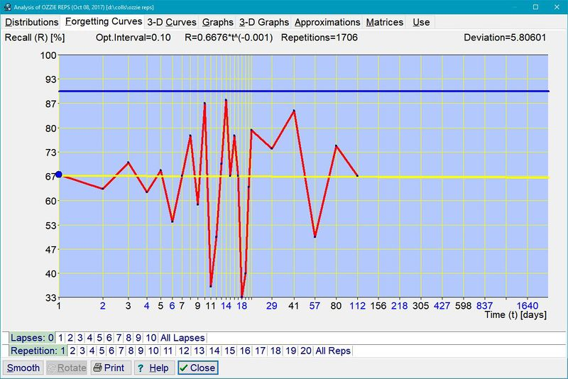
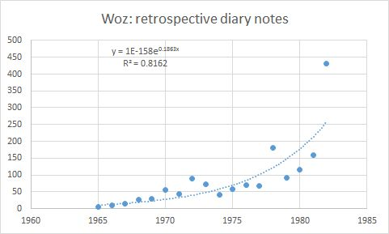
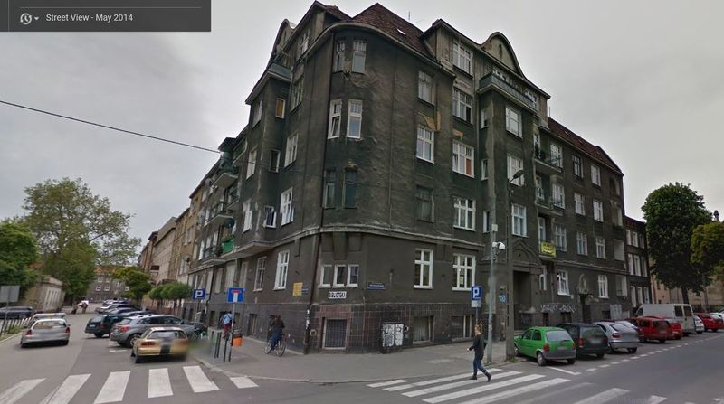

# 16.童年失忆症
[TOC=3,5]
## 16 Childhood amnesia

## 童年失忆症

### 16.1 Introduction

### 介绍

**Childhood amnesia** is the period of the first 2-4 years of life when a child is unable to form memories that might last a lifetime. Interestingly, there is no actual amnesia in a healthy child. Childhood amnesia is a misnomer. I will explain why.

**童年失忆症**是孩子无法形成可能持续一生的记忆的第一个 2 - 4 年的生命期。有趣的是，健康的孩子没有实际的失忆症。童年失忆症是用词不当。我会解释原因。

Childhood amnesia is also often defined as the _inability of adults to recall events from childhood_. This definition is also misleading, because the phenomenon has nothing to do with adulthood beyond the fact that we keep [forgetting](https://supermemo.guru/wiki/Forgetting) memories all the time.

童年失忆症也常被定义为_成年人无法回忆童年时期的事_。这一定义也具有误导性，因为这种现象与成年没有任何关系，除了我们一直在[遗忘](https://supermemo.guru/wiki/Forgetting)记忆这一事实。

Most importantly, childhood amnesia has a monumental impact on learning and development strategies. A large amount of early learning and acceleration programs do more harm than good. A great deal of child development mythology has its roots in childhood amnesia. Introductory school [curricula](https://supermemo.guru/wiki/Curricula) are shaped by the impact of childhood amnesia on reasoning. Understanding and measuring memory in childhood is essential for protecting childhood from misguided intervention that affects millions of kids around the world as we speak.

最重要的是，童年失忆症对学习和发展策略具有重大影响。大量的早期学习和加速计划弊大于利。大量的儿童发展神话源于童年失忆症。学校的入门[课程](https://supermemo.guru/wiki/Curricula)是由童年失忆症对推理的影响所塑造的。在童年时期，理解和衡量记忆对于保护儿童免受误导性干预至关重要，这种干预会影响全世界数百万儿童。

> Understanding childhood amnesia is essential for protecting kids from the harm of early acceleration programs
>
> 了解童年失忆症对于保护儿童免受早期加速计划的伤害至关重要

### 16.2 Measuring amnesia

### 测量失忆症

#### 16.2.1 Methodology problems

#### 方法论问题

Childhood amnesia is known to almost everyone. Except for a few cases of false memory, we do not seem able to recall much or anything from before the age of 3-4. Researchers have for long been interested in the phenomenon hoping it could shed some light on how memory works and how it might benefit learning later in life. The old and tried method of collecting data on childhood amnesia is an interview.

几乎每个人都知道童年失忆症。除了一些虚假记忆的情况，我们似乎无法回忆起 3 - 4 岁之前的任何事情。长期以来，研究人员一直对这种现象感兴趣，希望它能够揭示记忆的运作方式，以及它如何在以后的生活中受益。收集童年失忆症数据的老方法是面谈。

The difficulty in establishing earliest memories by means of interview is compounded by the fact that the interview must be conducted early. Delaying the interview may shift the estimate of the first memory date to later years. The problem is that kids aged 4-5 cannot reliably answer the question "_What is the earliest thing you remember?_". Even the concept of "earliest" might be unclear. Dates are easily confused. Episodes get confused. Interview that does not involve adult witnesses is of little value. The only sensible approach to similar testimony is to assign each report a probability value. Only a large number of reports from early childhood with probabilities assigned to each event may provide a rough approximation of the likely date of the earliest memory.

通过面谈来建立最早的记忆的困难是由于面谈必须尽早进行。推迟面谈可能会将第一次记忆日期的估计值推迟到以后。问题是 4 - 5 岁的孩子无法可靠地回答「_你记得最早的事情是什么？_」 这个问题 。甚至「最早」的概念也可能不清楚。日期很容易混淆。情节变得混乱。不涉及成年证人的面谈没什么价值。对于类似的证词，唯一明智的方法是给每个报告分配一个概率值。只有大量的童年早期的报告，加上每个事件的概率，才能粗略地近似出最早记忆的可能日期。

I asked a 4 year old about memories from her baby times and toddler times. She said "_I vomited egg when I was 1.5 years old_". 1.5 seems way too early to form memories, but the girl was precocious and a little memory genius. However, the testimony of "1.5 years" is highly unreliable when taken from a kid. It might be a form of confused memory, implanted memory, misunderstanding, etc. Kids at 18 months have no concept of 1.5 years, hence the date itself must be an artifact. In this case, probability would have to be near zero and the main value of such a confession would be to warrant further investigation.

我问了一个 4 岁的孩子关于她婴儿时期和幼儿时期的回忆。她说：「_我 1.5 岁的时候就吐了鸡蛋_」。1.5 岁形成记忆似乎太早，但这个女孩是早熟的，有点记忆天才。然而，从孩子身上取下「1.5 岁」的证词是非常不可靠的。它可能是一种混乱的记忆，植入的记忆，误解等等。18 个月大的孩子没有 1.5 岁的概念，因此日期本身一定是人为的。在这种情况下，概率必须接近于零，这种坦白的主要价值将是保证进行进一步调查。

When the father of the girl confirmed that she indeed ate egg at 1.5 and vomited, the probability of that early memory could increase, but still be very low. It could be a case of implanted memory. For example, girl's grandmother might recall at feeding time: "_when you were 1.5 years old, you vomited an egg_". This would plant that "early" memory at later time.

当女孩的父亲证实她确实在 1.5 岁时吃了鸡蛋并呕吐时，早期记忆的可能性可能会增加，但仍然非常低。这可能是植入记忆的一个例子。例如，女孩的祖母可能会在喂食时回忆：「_当你 1.5 岁时，你吐了一个鸡蛋_」。这将在以后植入「早期」记忆。

When family insisted it was not the case, and added a fact that the girl refused to eat egg ever since, the probability would increase further. In this case, the aversion memory appears to be well documented and surviving since early childhood. However, in investigating childhood amnesia we are more interested in abstract declarative memories or episodic memories. Could the girl indeed form a memory of the episode and keep it for 3 long years despite a rapid growth of her brain? Memory reimplantation might simply occur on any day when a child refused to eat egg and someone mentioned the episode of vomiting. Considering the very early age of that memory and possible alternative scenarios, the veracity of the report would still have to be ranked relatively low.

当家人坚称情况并非如此，并补充事实说女孩从此拒绝吃鸡蛋，这种可能性会进一步增加。在这种情况下，厌恶记忆似乎有很好的记录，并从童年早期就存在了。然而，在调查童年失忆症时，我们对抽象的陈述性记忆或情节记忆更感兴趣。这个女孩真的能在大脑快速发育的情况下，对这件事形成记忆并保持 3 年之久吗？记忆重新植入可能只是在孩子拒绝吃鸡蛋和有人提到呕吐的任何一天。考虑到这种记忆的年龄很小，以及可能出现的其他情况，报告的准确性仍然必须排在相对较低的位置。

It seems that for an individual child, only a close caregiver could note a sufficient number of episodes provided with sufficiently reliable documentation and sufficiently high probabilities to provide a good hint on the childhood amnesia window for a particular child. The error rate could still be very high.

似乎对于一个单独的孩子来说，只有一个亲密的照顾者才能注意到足够多的事件，这些事件提供了足够可靠的记录和足够高的概率，从而为特定的孩子提供了童年失忆症窗口期的良好提示。但即使如此，错误率仍然可能很高。

These days, kids have many caregivers, spend a great deal of time in [daycare](https://supermemo.guru/wiki/Daycare), and reliable research would probably require a single parent living with a child in highly controlled conditions. Even then, it would be a result relevant to that child only.

如今，孩子们有很多看护者，他们在[幼儿园](https://supermemo.guru/wiki/Daycare)花费大量时间，可靠的研究可能需要单亲父母与孩子生活在高度受控的环境中。即使这样，结果也只与那个孩子有关。

#### 16.2.2 Forming first memories

#### 形成第一记忆

To find out when lifelong memories begin seems like an interesting question. It might shed some light on how the young brain works. However, if we look at details of the process in which earliest memories are formed, the precise timing becomes far less interesting. It is simply a matter of chance. As such, finding the exact number for an individual is interesting but largely inconsequential. Finding the number for a large number of kids would be far more valuable but very hard to achieve.

要找出终身记忆何时开始，这似乎是一个有趣的问题。它可能会揭示年轻大脑的运作方式。但是，如果我们看一下最早形成记忆的过程的细节，那么精确的时间就不那么有趣了。这只是偶然的问题。因此，找到一个人的确切数字很有意思，但在很大程度上是无关紧要的。找到大量孩子的数字将更有价值，但很难实现。

Here is a sequence of events that should lead to the formation of the earliest memory lasting a lifetime \(for more details see [Childhood amnesia: Mechanism](https://supermemo.guru/wiki/I_would_never_send_my_kids_to_school#Childhood_amnesia:_Mechanism)\):

以下是一系列事件，应该会导致形成一生中最早的记忆（更多细节见[童年失忆症：机制](https://supermemo.guru/wiki/I_would_never_send_my_kids_to_school%23Childhood_amnesia:_Mechanism#Childhood_amnesia:_Mechanism) ）：

* a traumatic, stressful, or highly exciting event would form a set of episodic memories
* 创伤，压力或激动人心的事件会形成一系列情节记忆
* those memories should survive for a while by involvement of sufficiently many connections that would resist forgetting and be restored by pattern completion
* 那些记忆应该留存一段时间，通过足够多的连接来抵抗遗忘并通过模式完成来恢复
* complete forgetting would be prevented by a form of review, which may be a conversation, or more likely, a return to a memory by thinking about it or recalling it in similar contexts
* 完全遗忘可以通过一种形式的复习来防止，这可能是一种对话，或者更可能是通过在类似情境中思考或回忆它来回到记忆中
* due to the involvement of a larger number of synapses, the memory would mutate, re-mold, transform, and get restored over and over again to take new shapes. All we need is the core meaning of the underlying event to survive
* 由于大量突触的参与，记忆会发生变异、重新塑造、转化，并一遍又一遍地恢复，变成新的形状。我们所需要的只是留存下来的潜在事件的核心意义

The above scenario shows that the formation of earliest memories will depend on random chance events such as a specific trauma or an exhilarating experience. It will then be contingent on further review which may depend on environmental cues that may or may not be helpful in retaining memories. Finally, earliest memories, once determined, may actually be forgotten in mere months or even years. In that sense, the estimate made at the age of 4 may look better \(younger\) than the same estimate made at the age of 7.

上述情景表明，最早记忆的形成将取决于随机事件，如特定创伤或令人振奋的经历。然后，它将取决于进一步的复习，这可能依赖于环境线索，而这些线索可能对记忆的保留有帮助，也可能没有帮助。最后，最早的记忆，一旦确定，可能会在短短几个月甚至几年的时间里被遗忘。从这个意义上说，4 岁时的估计值可能比 7 岁时的估计值更好（更年轻）。

The most important underlying process, which is the [speed of forgetting](https://supermemo.guru/wiki/Forgetting_curve), will be of consequence, but the timing of the earliest memory might change by several months or even years by sheer chance.

最重要的潜在过程，即[遗忘的速度](https://supermemo.guru/wiki/Forgetting_curve)，将是重要的，但最早记忆的时间可能会在几个月甚至几年的时间内发生改变，这完全是偶然的。

### 16.3 Neurogenesis hypothesis

### 神经发生假说

The old thinking about childhood amnesia is hat it was either a storage problem or a retrieval problem. It is neither. Memories are stored ok, and can be retrieved ok until they can not.

关于童年失忆症的旧观点是，它要么是一个存储问题，要么是一个检索问题。它两者都不是。记忆可以很好地存储，也可以很好地检索，直到它们不能。

#### 16.3.1 Observing a child

#### 观察孩子

To investigate infantile amnesia, the ideal setting would be a single parent with a single child living in some isolated mountain hut under close supervision of cameras. To make the research meaningful, we might need dozens of similar setups to investigate individual variability.

为了调查婴儿失忆症，理想的场景应该是单亲妈妈带着一个孩子住在孤立的山间小屋，在摄像机的密切监视下。为了使研究有意义，我们可能需要几十个类似的设置来调查个体的可变性。

A single parent in isolation is ideal. Adding a second parent to the picture may make the documentation harder. It is impossible for one parent to perfectly communicate to the other parent about all interactions with a child. However, it might help if both parents were neuroscientists.

单独的单亲家庭是理想的。向图景中添加第二个父母可能会使记录更加困难。父母中的一方不可能与另一方就与孩子的所有互动进行完美的沟通。然而，如果父母都是神经科学家，这可能会有所帮助。

[Sheena Josselyn](http://www.sickkids.ca/Research/AbouttheInstitute/Profiles/NMH/profile-josselyn.html) and Paul Frankland are an unusual pair of neuroscientists. There are interested in how memories form and the role of neurogenesis in that process. They are also married and have a daughter Charlotte \(see [picture](https://www.thestar.com/content/dam/thestar/life/sick_kids/2010/05/05/research_becomes_a_family_affair/sheena1.jpeg.size.custom.crop.1086x724.jpg)\).

[Sheena Josselyn](http://www.sickkids.ca/Research/AbouttheInstitute/Profiles/NMH/profile-josselyn.html) 和 Paul Frankland 是一对不同寻常的神经科学家。他们感兴趣的是记忆是如何形成的以及在这个过程中神经发生的作用。他们也结婚了，有一个女儿夏洛特（见[图](https://www.thestar.com/content/dam/thestar/life/sick_kids/2010/05/05/research_becomes_a_family_affair/sheena1.jpeg.size.custom.crop.1086x724.jpg)）。

Jesselyn and Frankland do not live in an isolated hut, but they live in the second best place for research: science labs. Charlotte has spent her first five months [at work with her parents](https://www.thestar.com/life/sick_kids/2010/05/05/research_becomes_a_family_affair.html).

Jesselyn 和 Frankland 并不住在一个孤立的小屋里，但他们生活在第二个最适合研究的地方：科学实验室。夏洛特度过了她的前五个月[和她的父母一起工作](https://www.thestar.com/life/sick_kids/2010/05/05/research_becomes_a_family_affair.html) 。

#### 16.3.2 Neurogenesis hypothesis

#### 神经发生假说

Charlotte Frankland made history when she was mentioned in an important paper which hypothesizes on the [role of neurogenesis in infantile amnesia](https://supermemo.guru/wiki/Infantile_amnesia_caused_by_neurogenesis).

Charlotte Frankland 创造了历史，她在一篇关于[神经发生在婴儿失忆症中的作用](https://supermemo.guru/wiki/Infantile_amnesia_caused_by_neurogenesis)的重要论文中被提到。

That paper explains why brain growth and memories are incompatible, and why long-lasting childhood amnesia might actually be an indicator of long-lasting brain development, i.e. a good thing.

那篇论文解释了为什么大脑发育和记忆不相容，以及为什么长期的童年失忆症实际上可能是长期大脑发育的一个指标，即一件好事。

The neurogenesis hypothesis:

神经发生假说：

> **Rapid growth of the brain in early development involves neurogenesis and other processes that interfere with survival of early memories.**
>
> **早期发育中大脑的快速生长包括神经发生和其他干扰早期记忆留存的过程。**

The young hippocampus is in constant flow. Memories stored in the cortex may lose their access wiring as a result of that fast growth. They can no longer be accessed, which means accelerated biochemical forgetting at the synaptic level after the actual forgetting at the neural level.

年轻的海马体不断流动。由于大脑皮层的快速增长，储存在大脑皮层的记忆可能会失去通路。它们不再能被获取，这意味着在神经层面的实际遗忘之后，突触层面的生化遗忘会加速。

Nobel winning icon of memory research, [Dr Eric Kandel](https://en.wikipedia.org/wiki/Eric_Kandel) agrees: "_The hippocampus matures slowly and probably doesn’t reach any reasonable maturity until we’re 3 or 4. While 2- and 3-year-olds can remember things for a short time, the hippocampus is required for long-term storage of those memories_".

诺贝尔记忆研究奖得主 [Eric Kandel 博士](https://en.wikipedia.org/wiki/Eric_Kandel)同意：「_海马体成熟缓慢，可能要到我们 3 岁或 4 岁时才会达到合理的成熟。虽然 2 岁和 3 岁的孩子能在短时间内记住事情，但海马体是长期储存这些记忆所必需的_」。

#### 16.3.3 Future research

#### 未来研究

Paul Frankland hopes to verify some of his hypotheses using research on kids suffering from brain cancer. In chemotherapy, drugs that slow down neurogenesis without actually damaging nerve cells may turn out to improve memory in childhood. If this research confirms Frankland's prediction, it will provide a harrowing proof that good memory isn't always a good thing in early childhood.

Paul Frankland 希望通过对患有脑癌的孩子的研究来验证他的一些假设。在化疗中，减缓神经发生而不会实际损害神经细胞的药物可能会改善儿童时期的记忆力。如果这项研究证实了 Frankland 的预测，它将提供一个令人痛苦的证据，即良好的记忆在儿童早期并不总是一件好事。

#### 16.3.4 Kids have no long-term memory

#### 孩子们没有长期记忆

Let's re-examine childhood amnesia as a retrieval failure in the context of the neurogenesis hypothesis. It is possible that due to neurogenesis, some cortical connection might become inaccessible. However, calling it retrieval failure would be a misnomer as it would suggest memories might somehow be retrieved given favorable circumstances. Those abandoned memories are like seeds of wheat on a desert: bereft and useless. They are a likely target of [synaptic elimination in sleep](https://supermemo.guru/wiki/Memory_optimization_in_sleep). Little kids virtually have no declarative long-term memory for semantic knowledge. Declarative recall in 6 months comes from review \(e.g. names "milk" and "bottle" survive well with daily review\). Episodic recall in 6 months comes also mostly from review, e.g. due to a traumatic nature of a memory, or in a specific repeated context \(e.g. passing the same landmark on the way to daycare\). Those kids that do have a genuine memory of a span of months might be precocious, but memory precocity may also imply shorter period for brain growth. If precocity is achieved by any form of acceleration or [stress](https://supermemo.guru/wiki/Stress_resilience), this may spell the possibility of never growing up to one's true potential.

让我们在神经发生假说的背景下，重新审视儿童失忆症作为一种检索失败。可能是由于神经发生，一些皮质连接可能变得不可接近。然而，称其为检索失败是一个错误的名称，因为它表明，在有利的环境下，记忆可能会以某种方式被检索。那些被遗弃的记忆就像是沙漠上的小麦种子：丧失了生命，没有用处。它们很可能是[睡眠中突触消除](https://supermemo.guru/wiki/Memory_optimization_in_sleep)的目标 。对于语义知识来说，小孩几乎没有陈述性的长期记忆。6 个月内的陈述性召回来自复习（例如，名称「牛奶」和「瓶子」在每日复习中留存得很好）。6 个月内的情节回忆也主要来自回忆，例如由于记忆的创伤性质，或者在特定的重复背景下（例如在去幼儿园的路上传递相同的地标）。那些确实记忆了几个月的孩子可能是早熟的，但记忆早熟也可能意味着大脑发育的时间缩短。如果早熟是通过任何形式的加速或[压力](https://supermemo.guru/wiki/Stress_resilience)实现的，这可能意味着永远无法达到一个人真正的潜力。

#### 16.3.5 Plasticity-vs-stability trade off

#### 可塑性与稳定性的权衡

Plasticity and forgetfulness come hand in hand. Memory [stability](https://supermemo.guru/wiki/Stability) is essential to prevent [forgetting](https://supermemo.guru/wiki/Forgetting). It is also an essential property of neural networks. As much as biological networks use stability for the purpose of high reasoning, artificial neural networks may use the same trick to allow of sequential learning without the side effect of catastrophic forgetting. Plasticity is vital for learning. Stability is vital for intelligence.

可塑性和遗忘是并驾齐驱的。记忆的稳定性是防止[遗忘](https://supermemo.guru/wiki/Forgetting)的关键。这也是神经网络的一个基本特性。正如生物网络使用稳定性来进行高推理一样，人工神经网络也可以使用同样的技巧来进行顺序学习，而不会产生灾难性遗忘的副作用。可塑性对学习至关重要。稳定性对智力至关重要。

During development, brain growth and plasticity are at a premium. This is why kids can afford to live many years with increased rates of forgetting. Before they [become experts](https://supermemo.guru/wiki/Knowledge_in_creative_problem_solving), kids got a great deal of learning to do. A huge part of that learning is structural. Structural learning implies [interference](https://supermemo.guru/wiki/Interference) and, paradoxically, increased forgetting as well. I argue throughout [this book](https://supermemo.guru/wiki/Problem_of_schooling) that the longer we let the brain grow, the better the ultimate outcome.

在发育过程中，大脑生长和可塑性非常重要。这就是为什么孩子们可以承受多年的遗忘率增加。在成为[成为专家](https://supermemo.guru/wiki/Knowledge_in_creative_problem_solving)，孩子们学到了很多东西。这种学习的很大一部分是结构性的。结构学习意味着[干扰](https://supermemo.guru/wiki/Interference)，矛盾的是，也增加了遗忘。我在[整本书](https://supermemo.guru/wiki/Problem_of_schooling)中都认为，我们让大脑成长的时间越长，最终结果就越好。

The rate of neurogenesis might not provide a complete picture in that developmental trade-off. There is also an issue of [dendritic spine turnover](https://supermemo.guru/wiki/Dendritic_spine_turnover_is_high_early_in_development). This turnover may underlie [structural plasticity](https://supermemo.guru/wiki/Two_component_model_of_memory_stability). In youth, dendritic spine turnover is high and results in a net loss of dendritic spines. In the neocortex, dendritic spines may contribute to memory [stability](https://supermemo.guru/wiki/Stability). As a result, a child is a great structural learning machine, while still being a poor declarative learner \(e.g. from the point of view of the demands posed by [schooling](https://supermemo.guru/wiki/Problem_of_schooling)\).

神经发生的速度可能不能提供发育权衡的完整图景。还有一个[树突状脊柱转换](https://supermemo.guru/wiki/Dendritic_spine_turnover_is_high_early_in_development)的问题。这种转变可能是[结构可塑性](https://supermemo.guru/wiki/Two_component_model_of_memory_stability)的基础。在青年时期，树突棘的周转率很高，导致树突棘的净损失。在新皮质中，树突棘可能有助于记忆的[稳定性](https://supermemo.guru/wiki/Stability)。因此，一个孩子是一个伟大的结构学习机器，但仍然是一个糟糕的陈述性学习者（例如，从[学校教育](https://supermemo.guru/wiki/Problem_of_schooling)的要求来看）。

The illusory absence of declarative memory may extend up to the age of 6 or 7, and should be interpreted as an indicator of brain development, i.e. a welcome phenomenon. If your kid can't recall the alphabet, it is not a reason for scolding. The following [forgetting curve](https://supermemo.guru/wiki/Forgetting_curve) graph collected with [SuperMemo](https://supermemo.guru/wiki/SuperMemo) illustrates the plasticity-stability trade off at a preschool age \(more details [here](https://supermemo.guru/wiki/SuperMemo_does_not_work_for_kids)\):

虚假的陈述性记忆缺失可能延续到 6 或 7 岁，应该被解释为大脑发育的指标，即一种受欢迎的现象。如果你的孩子不记得字母表，那就不是责骂的理由。下面这张由 [SuperMemo](https://supermemo.guru/wiki/SuperMemo) 收集的[遗忘曲线](https://supermemo.guru/wiki/Forgetting_curve)图展示了学龄前儿童的可塑性和稳定性之间的平衡关系（更多细节请看[这里](https://supermemo.guru/wiki/SuperMemo_does_not_work_for_kids)）：



> **Figure:** A forgetting curve from a preschooler's SuperMemo collection. The absence of forgetting indicates the absence of intentional declarative learning. The decay constant is nearly zero which makes optimum interval meaningless. 1706 repetition cases have been recorded. This flat forgetting curve would go unnoticed in older versions of SuperMemo due to the adult-centric assumption that on Day=0, retrievability is 100%. Overtime, this forgetting curve will lean down to produce a graph typical of adult learning
>
> **数字：** 来自学龄前儿童的 SuperMemo 集合中的遗忘曲线。遗忘的缺失表明有意陈述性学习的缺失。衰减常数几乎为零，这使得最佳间隔毫无意义。已记录 1706 个重复案例。由于以成人为中心的假设是，当 Day = 0 时，可恢复性为 100％，因此这个平坦的遗忘曲线在旧版本的 SuperMemo 中不会被注意到。随着时间的推移，这条遗忘曲线将向下倾斜，形成一个典型的成人学习曲线图
>
> Before puberty, brain development is more about structural crystallization than about declarative learning. This is why play and exploration should receive priority over schooling
>
> 在青春期之前，大脑发育更多地是关于结构结晶，而不是关于陈述性学习。这就是为什么玩耍和探索应该优先于学校教育

### 16.4 Measuring infantile amnesia with SuperMemo

### 用 SuperMemo 测量婴儿失忆症

[SuperMemo](https://supermemo.guru/wiki/SuperMemo) is an excellent tool for studying memory. However, it cannot be used for studying childhood amnesia because amnesia refers to episodic memories that are not a typical subject of intentional review in SuperMemo. Moreover, SuperMemo would instantly evoke an observer effect in which duration of memory is artificially impacted by the measurement \(review\).

[SuperMemo](https://supermemo.guru/wiki/SuperMemo) 是研究记忆的绝佳工具。然而，它不能用于研究童年失忆症，因为失忆症是指情节记忆，而不是 SuperMemo 中有意复习的典型主题。此外，SuperMemo 会立即引起观察者效应，其中记忆的持续时间受到测量（复习）的人为影响。

Here are the reasons while SuperMemo does not fit the bill:

以下是 SuperMemo 不符合要求的原因：

* SuperMemo is not considered useful in retaining episodic memories, it is used for declarative memories that are useful but not too easy to remember
* SuperMemo 被认为在保留情景记忆方面没有什么用处，它被用于陈述性记忆，这类记忆很有用，但不太容易记住
* by definition, review in SuperMemo contradicts the notion of earliest memories that should survive in child's mind as lasting memories without artificial support
* 根据定义，SuperMemo 中的复习与最早的记忆概念相矛盾，早期记忆应该在孩子的头脑中作为持久的记忆而存在，不需要人为的支持
* we have little SuperMemo data from children. Very few parents opt to use SuperMemo at young ages, and we actually discourage the practise as possibly harmful
* 我们几乎没有来自儿童的 SuperMemo 数据。很少有父母在孩子很小的时候就选择使用 SuperMemo，我们实际上不鼓励这种做法，因为它可能是有害的

On the other hand, the most interesting component of childhood amnesia is memory turnover and resulting forgetting. Forgetting in childhood is so fast that we can easily interpret it as a result of interference associated with the fast growth of the brain. In that sense, SuperMemo would be an excellent measure of the quality of young memory, except we would need to depart from the currently accepted notion of childhood amnesia.

另一方面，童年失忆症中最有趣的部分是记忆的转换和由此导致的遗忘。在童年时期遗忘是如此之快，以至于我们可以很容易地将其解释为与大脑快速增长相关的干扰的结果。从这个意义上说，SuperMemo 将是衡量年轻记忆质量的一个很好的方法，只是我们需要摒弃目前公认的童年失忆症的概念。

Declarative semantic memories subject to [spaced repetition](https://supermemo.guru/wiki/Spaced_repetition) are an excellent material to show the progression of long-term memory capacity with age. For example, longest inter-repetition interval achieved can be tracked over time. In SuperMemo, "best interval" is the longest interval that terminates with a pass grade.

[间隔重复](https://supermemo.guru/wiki/Spaced_repetition)的陈述性语义记忆是显示长期记忆能力随年龄增长的极好材料。例如，最长的重复间隔可以随时间跟踪。在 SuperMemo 中，「最佳间隔」是以及格分数结束的最长间隔。

In the following graph, we can see that until the age of 2, the child could hardly form memories reaching 2 months.

在下面的图表中，我们可以看到，直到 2 岁，孩子几乎不能形成 2 个月的记忆。


Naturally, in [SuperMemo](https://supermemo.guru/wiki/SuperMemo), best interval is also a function of the period in which the program had been in use \(it takes years to produce intervals on the order of decades\). For this reason, best interval graph is interesting, but it is not revealing.

当然，在 [SuperMemo](https://supermemo.guru/wiki/SuperMemo) 中，最佳间隔也是程序已经使用的时间段的函数（生成几十年的间隔需要数年的时间）。由于这个原因，最佳间隔图很有趣，但它并不能说明问题。

A better measure of amnesia is to compare best interval ratios between two users: a child and an adult. In the graph, the starting point of 30% \(for child's capacity\) is an overestimate due the fact that the adult is initially limited not by his memory, but by the length of intervals achievable early in SuperMemo.

一个更好的衡量失忆症的方法是比较两个使用者之间的最佳间隔比率：儿童和成人。在图中，30% 的起点（儿童容量）是高估的，因为成人最初不受记忆的限制，而是受 SuperMemo 早期可达到的间隔长度的限制。


> **Figure:** We can measure the relative extent of childhood amnesia, by comparing the increase in the span of long-term memories in a child and in an adult. In the presented graph, an average student is compared with a single child in a period between the ages of 1.0 and 3.5 years. The horizontal axis refers to the child's age in years. The vertical axis shows the child-to-adult ratio of the maximum memory stability achieved in the learning process. While an adult shows a rapid progression in developing long-term memories, a child may struggle to form memories lasting beyond a month \(assuming no review\). In the presented example, it takes some 3-4 years before a child's performance approaches the adult levels. However, even then, the comparison may be distorted by the natural limit to the increase in memory stability \(data was collected with SuperMemo that imposes function constraints for the sake of efficient use in learning\). Similarly, the starting point of 30% in child/adult ratio is an overestimate due the fact that the adult is initially limited not by his memory, but by the length of intervals achievable early in spaced repetition. Moreover, adults also differ by a wide margin in their ability to formulate well-structured questions in the learning process. A comparison with an excellent adult student might keep children at a disadvantage even in their teen years
>
> **数字：** 我们可以通过比较儿童和成人长期记忆跨度的增加来衡量儿童遗忘的相对程度。在所呈现的图表中，将平均学生与年龄在 1.0 到 3.5 岁之间的单个孩子进行比较。横轴是指儿童的年龄。纵轴表示在学习过程中实现的最大记忆稳定性的儿童与成人之比。虽然成年人在发展长期记忆方面表现出快速进展，但是孩子可能很难形成持续超过一个月的记忆（假设没有复习）。在所提供的示例中，在孩子的表现接近成人水平之前需要大约 3 - 4 年。然而，即使这样，比较也可能因记忆稳定性增加的自然限制而失真（使用 SuperMemo 收集数据为了有效地用于学习而强加功能约束）。类似地，儿童/成人比率的 30％ 的起点是高估的，因为成年人最初不是受他的记忆限制，而是受间隔重复早期可达到的间隔长度的限制。此外，成年人在学习过程中制定结构良好的问题的能力差异很大。与优秀的成年学生进行比较可能会使孩子在青少年时期处于不利地位

In addition, a 1 year old toddler may learn "obvious" things like "a car", which soon become "fixed" memory, which can be retained with or without SuperMemo.

此外，一个 1 岁的孩子可能会学习「明显」的东西，比如「汽车」，很快就会变成「固定的」记忆，可以在有或没有 SuperMemo 的情况下保留。

The fact that a 3.5 year old can compete with an adult is already much better a reflection of memory properties. It needs to be emphasized strongly that adults also differ by a wide margin due to the differences in their ability to [formulate well-structured questions](https://supermemo.guru/wiki/20_rules) in the learning process. A comparison with an excellent student might keep kids at a disadvantage for much longer. Even up to their teens years.

一个 3.5 岁的孩子可以和一个成年人竞争，这一事实已经是记忆特性的一个更好的反映。需要强烈强调的是，由于在学习过程中[制定结构良好的问题](https://supermemo.guru/wiki/20_rules)的能力的不同，成年人也存在很大的差异。与优秀的学生进行比较可能会让孩子在更长的时间内处于不利地位。甚至到了他们十几岁的时候。

### 16.5 Measurement example

### 测量示例

Every parent can attempt to contribute to the measurements of childhood amnesia. If you happen to follow the prescription below, please do not forget to mail your results to [me](https://supermemo.guru/wiki/Piotr_Wozniak).

每个家长都可以尝试对童年失忆症的测量做出贡献。如果您碰巧遵循下面的方法，请不要忘记将您的结果邮寄给[我](https://supermemo.guru/wiki/Piotr_Wozniak)。

Here is a simple algorithm:

这是一个简单的算法：

* elect the minimum memory survival distance that qualifies for a data point. For example, 6-month period seems like a good yardstick. Events recalled with a 3-month delay might easily be classified as "candidates" due to the fact that amnesia does not end with the first remembered event, but with the first memorable event that can survive forgetting via incidental episodic review \(e.g. through contextual reminiscence\)
* 选择符合数据点的最短记忆留存距离。例如，6 个月的时间似乎是一个很好的尺度。延迟3个月回忆的事件可能很容易被归类为「候选人」，因为失忆症不会以第一个记住的事件结束，而是以第一个可以通过偶然的情景回忆（例如，通过语境回忆）而不被遗忘的难忘事件结束。
* document each data point as a triple: event date, recall date, and probability \(e.g. 0.35 would mean there is a 65% chance that the recall could be hinted to or caused by factors other than actual surviving memory\); naturally, each data point should get a detailed description of the episode because the data may need to be verified in the future
* 将每个数据点记录为一个三元组：事件日期，回忆日期和概率（例如 0.35 表示回忆可能被暗示或由实际留存记忆以外的因素引起的概率为 65％）; 当然，每个数据点都应该得到该事件的详细描述，因为将来可能需要验证数据
* keep sorting data point by the earliest recall date
* 按最早的回忆日期排序数据点
* for each data point, starting with the earliest, compute the distance from earliest memory and the expected distance using the formula:
* 对于每个数据点，从最早开始，使用以下公式计算距最早记忆和预期距离的距离：

```text
CL(i)=CL(i-1)+(1-CL(i-1))*P(i)
ED(i)=CL(i-1)*ED(i-1)+(1-CL(i-1))*D(i)
```

where:

这里：

* `D` - distance \(i.e. recall date minus the earliest recorded remembered episode date\)
* `D` - 距离（即回忆日期减去最早记录的记忆片段日期）
* `P` - probability \(i.e. chances that the recall of the episode is not an artifact\)
* `P` - 概率（即对事件的回忆不是人为的）
* `ED` - expected distance \(i.e. the best prediction of the distance to the earliest recalled episode in days\)
* `ED` - 期望距离（即以天为单位对最早回忆事件的距离的最佳预测）
* `CL` - confidence level \(i.e. cumulative chances that the recall is not an artifact\)
* `CL` - 置信水平（即回忆不是人为的累积机会）

In above formulas D\(1\)=0, ED\(1\)=0, and CL\(1\)=P\(1\). The end of amnesia is marked by the age computed from the date of the first recorded episode plus the expected distance \(at a given confidence level\).

在上式中，D（1）= 0，ED（1）= 0，CL（1）= P（1）。失忆症的结束由从第一次记录的事件的日期加上预期的距离（在给定的置信水平）计算的年龄来标记。

An exemplary picture \(actual data\) based on 9 data points, and cut-off point of 8 months makes it possible to state with confidence of 90% that childhood amnesia lasted for the first 2.65 years of a child's life. The experiment could safely end at the age of 5 as confidence level on the end of amnesia was approaching 1.00, and the expected date of amnesia end was 2.84 \(i.e. age of the first episode recorded plus the expected distance\). Interestingly, at the end of childhood amnesia determined using a similar approach, outwardly, the child may still seem unable to remember beyond a week. This might explain why a high emotional content is essential for the memorable event to break through an average survival of episodic memories.

基于 9 个数据点和 8 个月的截止点的示例性图片（实际数据）使得有可能以 90％ 的置信度表明童年失忆症持续了儿童生命的前 2.65 年。该实验可以安全地在 5 岁结束，因为失忆症结束时的置信水平接近 1.00，并且失忆症结束的预期日期是 2.84（即记录的第一个事件的年龄加上预期距离）。有趣的是，在儿童时期结束时，使用类似的方法确定失忆症，从外表看，孩子可能仍然无法记住超过一周。这也许可以解释为什么高度的情感内容对于令人难忘的事件来说是必不可少的，以突破情景记忆的平均留存。


Obviously, measuring amnesia is a hazy science. Minimum memory survival is arbitrary. Confidence levels are wild approximations. Memories registered as "earliest" today may be forgotten in a year or in 10 years. New data points may show up at any time, even at teen age. New technologies make it easy to document events accurately even though verification of recall is always inexact science.

显然，测量失忆症是一种朦胧的科学。最小记忆留存是任意的。置信水平是猜测的近似值。今天记录为「最早」的记忆可能会在一年或十年内被遗忘。即使在青少年时期，新数据点也可能随时出现。即使回忆的验证总是不精确的科学，新技术也可以轻松准确地记录事件。

Dating amnesia at the age of 5 is interesting, revisiting the same data at the age of 10 can bring an entirely different result. Earliest memories can get lost. Testing recall of an older child should shift the actual boundary to a later age, but might also be more prone to false memories \(e.g. implanted by a parent, recalled via pictures or videos, or resulting from conglomeration of memories\).

测定失忆症在 5 岁很有趣，重新审视 10 岁时的相同数据会带来完全不同的结果。最早的记忆可能被遗失。测试对年龄较大的孩子的回忆应该将实际边界转移到较晚的年龄，但也可能更容易出现错误记忆（例如，由父母植入，通过图片或视频回忆，或者由记忆的聚集产生）。

### 16.6 Retrospective recall curve

### 回顾性回忆曲线

Rubin and Schulkind in 1997 showed two phases of amnesia in the first decade of life using [autobiographical memories](https://supermemo.guru/wiki/How_autobiographical_memories_fade_in_time). Those phases should easily be explained as a gradual process in which the capacity of long-term memory increase and interference related to brain growth is diminished \(see: [graph](http://learnmem.cshlp.org/content/19/9/423/F1.expansion.html)\).

Rubin 和 Schulkind 在1997年用[自传记忆](https://supermemo.guru/wiki/How_autobiographical_memories_fade_in_time)证明了在生命的头十年里有两个阶段的失忆。这些阶段应该很容易解释为一个渐进的过程，在这个过程中，长期记忆的能力增加，与大脑生长相关的干扰减少（见：[图](http://learnmem.cshlp.org/content/19/9/423/F1.expansion.html)）。

I was able to produce a similar graph using my own autobiographical memories. In an unrelated project, which I call "retrospective diary", I tried to collect all remembered memories from my childhood and adolescence. I started writing down those memories at the age of 13, and continue the process until this day. Most of events from the 1960s and the 1970s, I documented via recall that occurred in the early 1980s. I largely run out of new episodes to document by the 1990s. New data points are burdened with very low reliability. These might be planted memories or sheer fantasies and delusions. The greatest value of that effort comes from my meticulous effort to document all things I could recall. It was not a timed one-off effort. It was a continual lifelong effort in which I might interrupt my activities at any point in time only to jot down a recall of memories from primary school. The graph becomes meaningless after 1981 when my "retrospective diary" became serious and extended to all episodic memories from the times of college. Hence the explosion in the number of documented events. They were documented immediately after occurring. This is unfair to early memories, however, the last point in the graph can serve as a reflection of the snapshot of memories from a given point in time when we remember lots of recent events anyway.

我能用我自己的自传记忆做出一个类似的图表。在一个我称之为「回忆日记」的无关项目中，我试图收集我童年和青春期的所有记忆。我从 13 岁开始写下这些记忆，并一直坚持到今天。我通过回忆，记录了 20 世纪 60 年代和 70 年代发生的大多数事件，这些事件发生在 20 世纪 80 年代初。到 20 世纪 90 年代，我基本上已经没有新的事件可以记录了。新数据点的可靠性非常低。这些可能是植入的记忆或纯粹的幻想和妄想。这种努力最大的价值来自于我一丝不苟地记录下我能回忆起的所有事情。这不是一次有时间的一次性努力。这是一个持续一生的努力，我可能会在任何时候中断我的活动，只为了草草记下对小学的回忆。1981 年之后，我的「回忆日记」变得严肃起来，延伸到大学时代的所有情景记忆，这张图表就变得毫无意义了。因此，记录在案的事件数量暴增。它们在发生后立即被记录下来。这对早期的记忆是不公平的，然而，图表中的最后一点可以作为一个快照的记忆，从一个给定的时间点，当我们记得很多最近的事件。



Interestingly, on multiple occasions I documented forgetting of episodes recalled earlier. A primary school memory recalled at 20, might be forgotten at 30, or even at 50. Exhaustive recall documentation will then bring different results at different ages. If I was to begin this project at later ages, the result would differ. The number of documented episodes would drop significantly and the shape of the curve would be different. In other words, the recall curve in adulthood keep being reshaped by forgetting.

有趣的是，在很多情况下，我都记录了自己对之前回忆的事情的遗忘。20 岁时回忆的小学记忆可能会在 30 岁甚至 50 岁时被遗忘。详尽的回忆文档将在不同的年龄带来不同的结果。如果我在晚些时候开始这个项目，结果会有所不同。记录的事件数量会显著下降，曲线的形状也将不同。换句话说，成年人的记忆曲线不断被遗忘重塑。

Earliest memories carry strong persistence, which probably comes from the badge of being the earliest memory.

最早的记忆带有强烈的持久性，这可能来自最早记忆的徽章。

### 16.7 Childhood amnesia: Mechanism

### 童年失忆症：机制

There is no actual amnesia in healthy childhood. Childhood amnesia is a misnomer.

健康的童年没有真正的失忆症。童年失忆症是用词不当。

The child begins forming memories as a fetus. Some of those are structural memories based on physical connections between brain cells, some affect entire pathways, and some will last for life. The child will never "forget" how to control its gastric functions or its heart rate using the central nervous system.

孩子开始形成胎儿的记忆。其中一些是基于脑细胞之间物理连接的结构记忆，一些影响整个途径，一些将持续终生。孩子永远不会「忘记」如何使用中枢神经系统控制其胃功能或心率。

A good visual pattern recognition that makes it possible to recognize a bottle of milk, or mom's face is also based on memory. This type of memory will rather not fade. Recognition of sounds of one's native language is another unfading or low-fading example. Those networks form in a [critical period](https://en.wikipedia.org/wiki/Critical_period), and neglect or denial will have a lasting effect.

一个良好的视觉模式识别，可以识别一瓶牛奶或妈妈的脸也是基于记忆。这种类型的记忆不会褪色。对母语声音的识别是另一个不褪色或低褪色的例子。这些网络形成于一个[关键时期](https://en.wikipedia.org/wiki/Critical_period)，忽视或否认将产生持久影响。

The child also starts forming declarative memories early. Naming that bottle of milk would definitely be a specific declarative memory based on specific connections that should be retained in a longer term.

孩子也很早就开始形成陈述性记忆。给那瓶牛奶命名肯定是一种特定的陈述性记忆，它基于应该长期保存的特定连接。

Those early declarative memories will rely on molecular changes in existing synapses. Some of those memories may also survive for life, however, we have no good way of knowing it. The problem is that there is a tremendous turnover of declarative memories in a developing brain. As a result, we have noticed that baby memories have a very short duration. That observable lifespan will increase gradually in proportion to a slowing turmoil of rewiring in the young brain.

这些早期的陈述性记忆依赖于现存突触的分子变化。这些记忆中的一些也可能会存在一生，然而，我们没有很好的方法去了解它。问题是，在一个正在发育的大脑中，陈述性记忆发生了巨大的转变。因此，我们注意到婴儿的记忆持续时间很短。这个可观察到的持续时间将随着年轻大脑重新布线的缓慢混乱而逐渐增加。

There is little chance for using [SuperMemo](https://supermemo.guru/wiki/SuperMemo) for those early declarative memories. They are volatile and keep reshuffling. Good score in SuperMemo might equally well be a result of reviewing the term in real life a day before. The algorithm makes little sense when memories get destroyed by fast growth.

对于那些早期的陈述性记忆，几乎没有机会使用 [SuperMemo](https://supermemo.guru/wiki/SuperMemo) 。它们不稳定并且不断改组。在 SuperMemo 中取得好成绩也可能是前一天在现实生活中复习这个词的结果。当记忆被快速增长摧毁时，这个算法就没什么意义了。

A two year old toddler might find it difficult to remember things beyond a month. This span will be hugely dependent on temperament, health, upbringing, environment, etc. It can be annoyingly short in some toddlers, it can be "genius-level" in others. Paradoxically, long memories in a young child may be a sign of brain growth slowing down. The longer the period of growth and rewiring, the bigger and better the effect of child's "bad memory".

一个两岁大的小孩可能会发现很难记住超过一个月的事情。这个跨度将在很大程度上取决于气质、健康、教养、环境等。在一些蹒跚学步的孩子身上，它可能短得令人烦恼，而在另一些孩子身上，它可能是「天才级别」。矛盾的是，年幼孩子的长期记忆可能是大脑发育放缓的标志。成长和重新布线的时间越长，孩子的「糟糕记忆」的影响就越大、越好。

There is no actual amnesia. The term refers to a window of time in which a recall of childhood memories is unlikely. For most kids that window spans from 2 to 4 years. There is nothing amnestic about that window. The window is only a matter of competition between six primary processes: \(1\) forming memories, \(2\) forgetting memories, \(3\) memory interference, \(4\) brain re-wiring, \(5\) exposure to memorable events, and \(6\) post exposure review.

没有真正的失忆症。该术语指的是一段不太可能回忆起童年记忆的时间窗口。对于大多数孩子来说，这个窗口的时间跨度为 2 到 4 年。那个时间窗口没有什么可以让人忘记的。窗口只是六个主要过程之间的竞争问题：（1）形成记忆，（2）忘记记忆，（3）记忆干扰，（4）大脑重新布线，（5）暴露于难忘事件，以及（6）接触后复习。

To form the first memory that can survive the lifetime, the following scenario must occur \(memory process classes in bold\):

要形成可以在生命周期中留存的第一个记忆，必须发生以下方案（记忆进程类以粗体显示）：

* the child encounters an event that is particularly memorable or traumatic, e.g. trip to Disneyland \(**exposure to memorable events** and **forming memories**\)
* 孩子遇到特别令人难忘或创伤的事件，例如迪士尼乐园之旅（ **接触难忘的事件** 和 **形成记忆** ）
* that memory must survive the turmoil of brain growth. The younger the child, the faster the growth, the less likely the survival of the memory \(**brain re-wiring**\)
* 记忆必须在大脑发育的动荡中留存下来。孩子越年轻，成长越快，记忆的留存率越低（ **大脑重新接线** ）
* the event must be memorable enough to come back to child's mind in some circumstances, e.g. mention of Donald Duck on TV \(**post exposure review**\)
* 在某些情况下，这个活动必须足够令人难忘，以回到孩子的脑海，例如在电视上提及唐老鸭（ **接触后的复习** ）
* the frequency of re-exposure to that prompted recall must be high enough to meet the criteria set by the [3-component model of long-term memory](https://supermemo.guru/wiki/3-component_model_of_long-term_memory) derived from [spaced repetition](https://supermemo.guru/wiki/Spaced_repetition) [experiments](http://www.super-memory.com/english/ol/beginning.htm). In short, review must be frequent enough to prevent forgetting via decay \(**forgetting memories**\)
* 重新接触到这种提示性回忆的频率必须足够高，以满足由[间隔重复](https://supermemo.guru/wiki/Spaced_repetition)[实验](http://www.super-memory.com/english/ol/beginning.htm)得出的[长期记忆 3 分量模型](https://supermemo.guru/wiki/3-component_model_of_long-term_memory)所设定的标准。简而言之，复习必须足够频繁，以防止记忆衰退而遗忘（**遗忘记忆**）
* brain growth will interfere with the core assumption of the 3-component model of memory: the neural substrate of memory is constant. The model is based entirely on forgetting via the decay of memory traces. The interference from brain growth will wane over time \(**brain re-wiring**\)
* 大脑生长将干扰 3 分量记忆模型的核心假设：记忆的神经基质是恒定的。该模型完全基于通过记忆痕迹的衰减而遗忘。大脑生长的干扰会随着时间的推移而减弱（ **大脑重新接线** ）
* high volume learning interferes with old memories. In a child, the volume is high due to a high novelty exposure and a high forgetting rate in a growing brain \(**memory interference**\). Newly formed neural patterns are subject to interference. Interference is massive. The disruptive brain growth component of interference will wane, the novelty component will wane too, however, knowledge interference is a factor that affects children and students for life. There is an effective remedy to interference. This remedy depends on [knowledge formulation](https://supermemo.guru/wiki/20_rules), and can be reduced with automated learning techniques such as [incremental reading](https://supermemo.guru/wiki/Incremental_reading). Last but not least, lifelong self-directed learning is the best form of training in avoiding interference. Lifelong learning is the best formula for lifelong memories.
* 高容量学习会干扰旧记忆。在儿童中，由于接触新鲜事物的频率高，以及大脑发育（ **记忆干扰** ）中遗忘率高 ，所以容量很大。新形成的神经模式受到干扰。干扰是巨大的。干扰的破坏性大脑生长成分将减弱，新奇成分也将减弱，然而，知识干扰是影响儿童和学生一生的一个因素。对干扰有一种有效的补救措施。这种补救方法依赖于[知识的制定](https://supermemo.guru/wiki/20_rules)，可以通过自动学习技术（如[渐进阅读](https://supermemo.guru/wiki/Incremental_reading)）加以减少。最后但同样重要的是，终身自主学习是避免干扰的最佳培训形式。终身学习是终身记忆的最佳方式。

The above scenario explains why with each passing day, the chances of forming the first lifelong memory increases. The string of memorable events is unceasing and might increase with brain maturity \(baby pram is not a good place for memorable encounters\). Brain growth is slowing, which favors memory survival. Novelty level and the resulting interference is decreasing. At some point, a memorable event will stick and this moment in time closes the window termed childhood amnesia.

上面的场景解释了为什么随着时间的流逝，形成第一个终生记忆的机会越来越大。一连串令人难忘的事件是不断发生的，而且可能随着大脑的成熟而增加（婴儿车不是一个产生让人难忘的邂逅的好地方）。大脑发育正在放缓，这有利于记忆的保存。新颖性水平和由此产生的干扰正在降低。在某一时刻，一件值得纪念的事情将会发生，而这一刻将会关闭一扇被称为童年失忆症的窗口。

The memory that we will label as "earliest memory" is not a memory that naturally lasts for 6-8 decades, but the one that is memorable enough to be reviewed often enough.

我们将其标记为「最早的记忆」的记忆不是一个自然持续 6 到 8 年的记忆，而是一种足够令人难忘的足以经常复习的记忆。

Sadly, the earliest recalled event isn't usually the trip to Disneyland. Traumatic or unpleasant events are more likely to survive. This is why so many adults bring up daycare events as their first memory. The unpleasant memory may also come from unexpected direction. See how [birthday candles contributed to the novel hypothetical neural mechanism explaining childhood amnesia](https://supermemo.guru/wiki/Infantile_amnesia_caused_by_neurogenesis).

可悲的是，最早被回忆的事件通常不是迪斯尼乐园之旅。创伤或不愉快的事件更有可能留存下来。这就是为什么这么多成年人将幼儿园活动作为他们的第一记忆。令人不快的记忆也可能来自意想不到的方向。看看[生日蜡烛是如何帮助解释婴儿失忆症的新型假想神经机制的](https://supermemo.guru/wiki/Infantile_amnesia_caused_by_neurogenesis)。

All parents of boys who are late to speak, or late to ride a bike are told that "_boys are slower than girls_". This is true. This primarily boils down to testosterone and its impact on the brain. Slow development in boys is actually good news. Their brain growth window might be more turbulent. In addition to the proverbial glass ceiling facing all girls, there is still some advantage to slow-growing male brains. It will be males who will largely populate math and physics departments. They will rein in chess or even in Nobel Prize awards. Naturally, Judith Polgar or Marie Curie prove that all ceilings can be shattered with self-discipline and persistence.

所有说话较晚或骑自行车较晚的男孩的父母都被告知「_男孩比女孩慢_」。这是真的。这主要归结为睾丸激素及其对大脑的影响。男孩发展缓慢实际上是个好消息。他们的大脑发育窗口可能更加动荡。除了所有女孩都面临着众所周知的玻璃天花板之外，男性大脑发育缓慢仍有一些优势。男性将在很大程度上占据数学系和物理系。他们将控制国际象棋，甚至诺贝尔奖。当然，Judith Polgar 或 Marie Curie 证明，自律和坚持可以打破所有的天花板。

### 16.8 Childhood amnesia mythology

### 童年失忆症迷思

There is a rich childhood amnesia mythology. Even the scientific community is permeated by erroneous interpretation of the phenomenon. I won't give Freud ideas a mention beyond his contribution to coining the term: _infantile amnesia_. First solid research on the increased rate of forgetting in childhood came from before I was born. However, this still does not prevent new interpretations spawning on a regular basis. Childhood amnesia is nothing more than faster forgetting in childhood. As such it should not even be called amnesia. It is not a disorder. Memories get formed. We just lose them faster.

有一个丰富的童年失忆症迷思。甚至科学界也充斥着对这一现象的错误解释。除了弗洛伊德对创造_婴儿失忆症_这个词的贡献之外，我不会再提他的想法。第一个关于儿童遗忘率增加的可靠研究来自于我出生前。但是，这仍然不能阻止定期产生新的解释。童年失忆症只不过是在童年时期更快忘记。因此，它甚至不应被称为失忆症。这不是一种疾病。记忆已经形成。我们只是更快失去它们。

The whole array of falsehoods begins with reports of recall from the cradle or even from the womb. False memories can form easily even in adulthood. False or distorted memories from childhood are so prevalent that everyone could probably come with one with some effort. Those memories may come with or without the evidence of being false.

所有的谎言都始于从摇篮里甚至从子宫里回忆的报告。即使在成年时期，错误的记忆也很容易形成。童年时期错误或扭曲的记忆是如此普遍，以至于每个人都可能付出一些努力就能拥有这样的记忆。这些记忆可能是假的，也可能不是。

There is a hypothesis which says that childhood amnesia ends with the development of verbal memory, which helps the survival of episodic memories. In reality, there is a link between the two, but it is only causal. Both episodic and verbal memories face the same developmental obstacles in a fast growing brain. It so happens that soon after speech develops, first lifetime episodic memories might form. It may also happen that speech develops slowly enough to lose that race. However, the early memories are unlikely to have a form of a story presented in words. They are more likely to be non-verbal. The assistance of language in retaining early episodic memories is probably limited. Early memories can be adorned with verbal interpretations later in life. Rats experience the same bad memory as little pups and their amnesia goes away fast with brain development without the need to rely on speech.

有一种假说认为，童年失忆症随着语言记忆的发展而结束，这有助于情景记忆的留存。在现实中，两者之间有联系，但只是因果关系。在快速增长的大脑中，情景记忆和语言记忆都面临着同样的发展障碍。在语言发展后不久，可能会形成第一个情景记忆。也有可能发生的是，语言发展缓慢到足以输掉这场比赛。然而，早期的记忆不太可能有文字形式的故事。他们更可能是非语言的。语言在保留早期情景记忆方面的帮助可能是有限的。早期的记忆可以在以后的生活中通过口头解释加以修饰。老鼠的记忆力和小狗一样差，它们的失忆症随着大脑的发育而迅速消失，不需要依赖语言。

In the area of amnesia research, we can see a problem of small samples, unreliable reports or even incorrect interpretation of the data. Graphs that I include in this text are also an illustration of the small sample problem. They are interesting but not definite.

在失忆症研究领域，我们可以看到一个小样本的问题，不可靠的报告，甚至不正确的数据解释。我在本文中包含的图表也是小样本问题的一个例子。它们很有趣但不确定。

Popular culture uses misleading terminology like "_to suffer from childhood amnesia_" as if it was a disease or abnormality. It also associates childhood amnesia with adulthood in admissions like "_I must have childhood amnesia. I remember little of my childhood_". Wikipedia begins with defining amnesia as "_inability of adults_". Amnesia has nothing to do with adulthood. "_Inability of adults_" is technically true but misleading. It is as if saying "_a car crash is a situation that results in a need to go to a mechanic_". The essence of a crash is the collision, not the need to repair cars. Even Psychology Today contains suggestive texts like "_children are not as amnesic about their early lives as adults are_", which again is technically true. However, adults are not amnesic beyond just being forgetful. They simply do not happen to magically recall things they forgot in childhood. On the other hand, it is the kids that are more "amnesic". It is the kids who show a faster rate of forgetting.

流行文化使用误导性的术语，如「_患有童年失忆症_」，好像它是一种疾病或异常。它还将童年失忆症与成年期联系在一起，例如「_我一定有有儿童失忆症。我几乎不记得我的童年了_」。维基百科开始将失忆症定义为「 _成年人无能_ 」。失忆与成年无关。「 _成年人的无能_ 」在技术上是正确的，但具有误导性。这就像是说「_撞车是一种需要去找修理工的情况_ 」。撞车的本质是碰撞，而不是需要修理汽车。即使是今天的心理学也包含一些暗示性的文本，比如「_儿童不像成年人那样对他们的早期生活失忆_」，这在技术上也是正确的。然而，成年人除了遗忘之外并没有失忆。他们只是不会神奇地回忆起他们在童年时忘记的事情。另一方面，是孩子们更容易「失忆」。是孩子们表现出更快的遗忘速度。

Research in rats has suggested that early memories [might somehow be retrieved](https://supermemo.guru/wiki/Can_childhood_memories_be_retrieved%3F). However, the correct interpretation is less optimistic: seemingly forgotten memories can be retrieved until they cannot be retrieved at all \(in any way\). It is hard to understand why anyone would believe that walking and speech are good indicators of things we remember from childhood. Walking and speech are constantly practiced and reviewed. Procedural memories involved in walking should not even be a consideration in childhood amnesia. As for semantic memories involved in speech, they get recycled dozens or hundreds of times while growing up.

对老鼠的研究表明，早期记忆[可能以某种方式被检索](https://supermemo.guru/wiki/Can_childhood_memories_be_retrieved%3F)。然而，正确的解释不那么乐观：可以检索看似遗忘的记忆，直到它们完全无法（以任何方式）检索。很难理解为什么有人会相信走路和讲话是我们从童年起就记得的事情的良好指标。行走和讲话是不断练习和复习的。走路中涉及的程序性记忆甚至不应成为童年失忆症的考虑因素。至于语言中涉及的语义记忆，它们在成长过程中会被重复使用数十次或数百次。

In the context of schooling, an interesting small-sample research was carried out by Bauer and Larkina in which [accelerated forgetting was observed at around the age of 7](https://supermemo.guru/wiki/Schooling_contributes_to_childhood_amnesia). This immediately sparked misleading headlines like "_At what age do we start forgetting childhood memories?_", or "_Childhood amnesia occurs at the age of 7_". I did not see anyone notice that beyond growing permanent teeth there is only one major developmental discontinuity occurring at around the age of 7: This is the beginning of school for many kids around the world. Increased learning leads to increased forgetting via [interference](https://supermemo.guru/wiki/Interference). Increased [stress](https://supermemo.guru/wiki/Stress_resilience) contributes further to obliterating early episodic memories that might have also been stress induced. Poor quality [coercive schooling](https://supermemo.guru/wiki/Coercion_in_learning) undermines [knowledge coherence](https://supermemo.guru/wiki/Knowledge_coherence), which further accelerates [forgetting](https://supermemo.guru/wiki/Forgetting).

在学校教育的背景下，Bauer 和 Larkina 进行了一项有趣的小样本研究，他们[在 7 岁左右观察到加速遗忘](https://supermemo.guru/wiki/Schooling_contributes_to_childhood_amnesia)。这立即引发了诸如「_我们什么时候开始忘记童年记忆？_」，或者「_童年失忆症发生在 7 岁_」。我没有看到任何人注意到，除了长恒牙之外，在 7 岁左右只发生了一次重大的发育不连续现象：这是世界上许多孩子上学的开始。通过[干扰](https://supermemo.guru/wiki/Interference)，学习的增加导致遗忘的增加。[压力](https://supermemo.guru/wiki/Stress_resilience)的增加会进一步抹杀可能也是由压力引起的早期情景记忆。低质量的[强制教育](https://supermemo.guru/wiki/Coercion_in_learning)破坏了[知识的连贯性](https://supermemo.guru/wiki/Knowledge_coherence)，从而进一步加速了[遗忘](https://supermemo.guru/wiki/Forgetting)。

> Early schooling is likely to cause an accelerated loss of childhood memories
>
> 早期教育可能会导致童年记忆的加速丧失

### 16.9 My first memories

### 我的第一个回忆

> Personal anecdote. [Why use anecdotes?](https://supermemo.guru/wiki/Why_use_anecdotes%3F)
>
> 个人轶事。[为什么要使用轶事？](https://supermemo.guru/wiki/Why_use_anecdotes%3F)
>
> My earliest memory is about begging my mom not to take me to daycare. This is a typical type of unpleasant memory that is likely to get etched for life. My wild estimate is that I might have been three at that time. The hour was early and the street was dark. The year was probably 1965. I was able to find this place, more or less, five decades later on Google Maps. To this day this place seems gloomy to me \(see below\). My mom was dragging me by hand to daycare via Jackowskiego street and I totally did not enjoy the prospect. She would do that before going to work. The doomsday feeling of the time was partly caused by early waking and darkness. Partly it was about the dry atmosphere of daycare packed with unhappy sleepy kids crowded in small places. Daycare definitely did not feel like a good thing to me. In those days, in communist and not-so-rich Poland, those facilities looked more like a chicken farm:
>
> 我最早的记忆是求妈妈不要带我去幼儿园。这是一种典型的不愉快的记忆，很可能会在生活中留下印记。我的粗略估计是那时我可能已经三岁了。时间还早，街上一片漆黑。那一年大概是 1965 年。大约 50 年后，我在谷歌地图上找到了这个地方。直到今天，这个地方在我看来还是阴森森的（见下图）。我妈妈拉着我从 Jackowskiego 街走到幼儿园，我完全不喜欢这样的景象。她会在上班前做那件事。当时的末日感觉部分是由早起和黑暗造成的。部分原因是幼儿园枯燥的气氛，小地方挤满了不开心、昏昏欲睡的孩子。对我来说，幼儿园绝对不是一件好事。当时，在共产主义和不那么富裕的波兰，这些设施看起来更像一个养鸡场:
>
> 
>
> I am not sure why I could not stay at home with my beloved granny. I only know that granny would live at times in a village with her other daughter. Mom was a sole bread winner for her 3 kids.
>
> 我不知道为什么我不能呆在家里和我心爱的奶奶在一起。我只知道奶奶有时会和她的另一个女儿住在村子里。母亲是她三个孩子唯一的经济支柱。
>
> My second earliest memory is about daycare itself. In compulsory nap periods, I was not sleepy. Perhaps it was a wrong time, or I was a type of kid that grew out of napping at an early age. The kids were marched to beds after lunch and the supervisor would make sure they all had eyes closed. As I was not sleepy, I pretended to close my eyes and watched the room around. The supervisor barked: "_Wozniak! I can see your eyes are not closed!_". This seems like a monumental waste of time, wasted opportunity for learning and exploration and the first taste of the need to comply with authorities. This is the anti-thesis of healthy unconstrained development.
>
> 我的第二个最早的记忆是关于幼儿园本身。在强制午睡期间，我并不困倦。也许这是一个错误的时间，或者我是那种从小就不午睡的孩子。孩子们午饭后被押到床上，主管会确保他们都闭上眼睛。因为我不困，我假装闭上眼睛，环顾四周。主管咆哮道：「 _Wozniak！我能看见你的眼睛没有闭上！_ 」这似乎是对时间的巨大浪费，对学习和探索的机会的浪费，以及对服从权威的第一次尝试。这是健康无约束发展的对立面。
>
> I have lots of other memories from that period, but I suspect they might have been planted in my head later by reviewing family pictures. Those less pleasant memories, e.g. of bullying, seem to have survived best. This is exactly what theory says: early stress accelerates development of memory. This leads to many short-sighted strategies employed in child development. Early memory may often mean shorted time for development.
>
> 那段时间我还有很多其他的记忆，但我怀疑它们可能是后来通过看家庭照片植入我脑海的。那些不太愉快的记忆，比如被欺凌的记忆，似乎保存得最好。这正是理论所说的：早期压力会加速记忆的发展。这导致在儿童发展中采用许多短视的策略。早期记忆通常意味着短时间的发育。

### 16.10 Conclusions for parents

### 给父母的结论

Childhood amnesia has wide implications for parenting strategies. These are top conclusions I suggest be taken home from this text:

童年失忆症对父母育儿策略有广泛的影响。以下是我建议大家从本文中得出的最重要的结论：

* **all forms of early instruction must be approached with caution**. Declarative memories do not survive long in the period corresponding with childhood amnesia. Memorizing capitals of the world at the age of 2 is likely to be wasted time. Until the age of 3-5, for most kids, best learning is learning via play. Child's brain [knows best](https://supermemo.guru/wiki/Learn_drive) what serves it well
* **必须谨慎对待所有形式的早期教学**。陈述性记忆在与童年失忆相对应的时期内不能留存很久。在 2 岁时记住世界各国首都可能是浪费时间。对于大多数孩子来说，在 3 - 5 岁之前，最好的学习方式是通过玩耍来学习。孩子的大脑[最清楚](https://supermemo.guru/wiki/Learn_drive)什么对它有好处
* [**stress accelerates learning**](https://supermemo.guru/wiki/Learning_acceleration_via_stress) but this is not the type of acceleration that is welcome in development
* [**压力加速学习**](https://supermemo.guru/wiki/Learning_acceleration_via_stress)，但这不是发育中受欢迎的加速类型          
* **stress slows down neurogenesis** and favores memory survival. Parents should never celebrate acceleration of development coming from daycare. This is the type of "acceleration" that actually undercuts child's long-term development potential
* **压力减缓神经发生**，有利于记忆的留存。父母不应该庆祝来自幼儿园的加速发展。这种「加速」实际上削弱了儿童的长期发展潜力             
* **stress accelerates synaptic pruning**. Parents should never celebrate acceleration coming from daycare or early tutoring. If it comes from stressful settings, it will fix the child's brain at the earlier developmental stage. It will prejudice child's position in life, her reactions, and her preferences
* **压力加速突触修剪**。父母不应该庆祝来自幼儿园或早期辅导的加速。如果它来自压力环境，它将在早期发育阶段固定孩子的大脑。它会损害孩子的生活中的姿态、反应和喜好             
* **stress of learning can lead to toxic memories** \(at any age\)
* **学习压力会导致毒性记忆**（在任何年龄）   
* **boys are slow to learn and develop**. Boys are unruly and hard to discipline. Boys need extra patience and should not be brought down to heel. Freedom is essential for development. Paradoxically, bad behavior today may translate to high creativity decades later
* **男孩学习和发展缓慢**。男孩子不守规矩，很难管教。男孩们需要额外的耐心，不应该就范。发展离不开自由。矛盾的是，今天的不良行为可能会在几十年后转化为高创造力
* all "techniques" aimed at improving memory, learning, and concentration in early childhood are largely aimed at stifling natural behaviors that may favor long-term development and learning. Memorization and discipline can wait. **Parents should focus on quality sleep, nutrition, exercise, love, and plenty of playtime**
* 所有旨在改善儿童早期记忆、学习和注意力的「技巧」主要是为了扼杀可能有利于长期发展和学习的自然行为。记忆和纪律可以等待。**父母应该注重优质的睡眠、营养、锻炼、爱和充足的游戏时间**             

All the above points can be met by ceding some authority and entrusting kid with more decision-making. Child's brain has a great deal of ["magic" powers](https://supermemo.guru/wiki/Learn_drive)in determining what's best for its development.

以上几点都可以通过放弃一些权威，让孩子做更多的决定来实现。孩子的大脑在决定什么是最好的发展方面有很多[「神奇」的力量](https://supermemo.guru/wiki/Learn_drive)。

### 16.11 Summary: Childhood amnesia

### 摘要：童年失忆症

* children rarely recall memories from before the age of 2-3
* 孩子很少回忆起 2 - 3 岁之前的记忆
* retrospective recall shows exponential decline back in time and approaches zero around the age of 3
* 回顾性回忆在时间上呈指数递减，在 3 岁左右趋于零
* children form episodic and declarative memories from birth. The term "childhood amnesia" refers to rapid memory turnover in childhood
* 孩子从出生就形成了偶然和陈述的记忆。术语「童年失忆症」是指童年时期的快速记忆转换
* [neurogenesis, i.e. birth of new neurons in the brain, is one of the reasons for childhood amnesia](https://supermemo.guru/wiki/Infantile_amnesia_caused_by_neurogenesis)
* [神经发生，即大脑中新神经元的诞生，是童年失忆症的原因之一](https://supermemo.guru/wiki/Infantile_amnesia_caused_by_neurogenesis)             
* before puberty, [net loss of dendritic spines](https://supermemo.guru/wiki/Dendritic_spine_turnover_is_high_early_in_development) in the cortex indicates a rapid structural adaptation of memory
* 在青春期之前，大脑皮层[中树突棘的净损失](https://supermemo.guru/wiki/Dendritic_spine_turnover_is_high_early_in_development)表明记忆结构的快速适应
* lifetime survival of early memories depends on \(1\) memory formation, \(2\) forgetting, \(3\) interference, \(4\) re-wiring, \(5\) exposure to memorable events, and \(6\) post exposure review
* 早期记忆的终身留存取决于（1）记忆形成，（2）遗忘，（3）干扰，（4）重新布线，（5）接触难忘事件，以及（6）接触后复习             
* earliest memories are often unpleasant \(e.g. related to daycare\). [Stress tends to improve learning](https://supermemo.guru/wiki/Stress_reduces_neurogenesis), and undermine brain growth
* 最早的记忆往往令人不愉快（例如与幼儿园有关）。[压力往往会改善学习](https://supermemo.guru/wiki/Stress_reduces_neurogenesis)，并破坏大脑的成长             
* with declarative memory span from 1 to 6 months, toddlers and young children have virtually no long-term declarative memory
* 陈述性记忆的时间跨度从 1 个月到 6 个月不等，婴儿和幼儿几乎没有长期的陈述性记忆          
* interviewing children for memories marking the end of childhood amnesia is hardly ever possible. Only a close caregiver can provide highly unreliable record that can be used in research
* 面谈儿童寻找记忆童年失忆症结束的记忆几乎是不可能的。只有密切的护理人员才能提供可用于研究的高度不可靠的记录
* children memory may start approaching adult performance slowly between ages 5-15. Exact numbers are hard to obtain. [SuperMemo](https://supermemo.guru/wiki/SuperMemo) can be used in such comparisons
* 儿童记忆可能会在 5 - 15 岁之间慢慢接近成人表现。确切的数字很难获得。[SuperMemo](https://supermemo.guru/wiki/SuperMemo) 可用于此类比较   
* poor declarative memories in children imply that formal instruction should best be delayed until the age of 7-9
* 儿童陈述性记忆不佳意味着正式教学最好延迟到 7 - 9 岁      
* children learn best via self-directed play and exploration
* 孩子们通过自我指导的游戏和探索学习得最好

