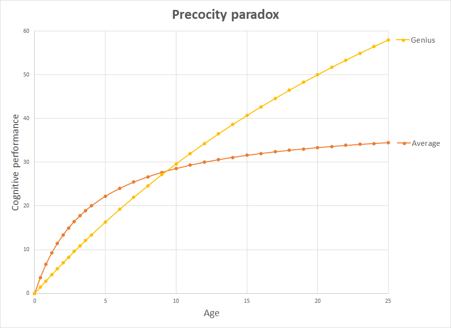

# 15.婴儿的大脑怎样不起作用
[TOC=3,5]
## 15 How baby brain does not work

## 婴儿的大脑怎样不起作用

### 15.1 Accelerating development

### 加速发展

We shape the future of this planet by shaping baby brains.

我们通过塑造婴儿的大脑来塑造这个星球的未来。

These days, we begin the educational effort even before the pregnancy. Active moms exercise while pregnant, and play Mozart to babies in the womb. Active dads begin an exercise and training regimen from the cradle. We make babies speak sentences at 6 months. Master phones and tablets before they can speak. Make them read at 2 years old. Play piano at 3. Speak languages at 5. Enroll at the university at 8, and hope for an early PhD in their teens as well. The only problem with that eager approach is that it may all be wrong.

如今，我们甚至在怀孕前就开始了教育工作。活跃的妈妈在怀孕期间运动，并给在子宫内的婴儿放莫扎特。积极的父亲从摇篮里就开始锻炼和训练。我们让宝宝在 6 个月时说句子。在说话前掌握手机和平板电脑。让他们在 2 岁时阅读。3 岁时弹钢琴。5 岁时讲语言。8 岁时就读大学，并希望在青少年时期获得早期博士学位。这种热切方法的唯一问题是它可能都是错的。

### 15.2 Perfect forgetting machines

### 完美的遗忘机器

You will often hear from your pediatrician that a child's brain is a perfect learning machine, or that in the first 3 years of life we learn more than in the entire adulthood. Those well-intentioned statements are misleading and may lead to wrong strategies.

您经常会从您的儿科医生那里听到，孩子的大脑是一个完美的学习机器，或者在生命的前 3 年，我们比整个成年期学到的更多。那些善意的陈述具有误导性，可能导致错误的策略。

Considering our adult standards, we should rather see babies as [perfect forgetting machines](https://supermemo.guru/wiki/Childhood_amnesia). Long term-memory capacity develops [very slowly](https://supermemo.guru/wiki/Linear_increase_in_memory_retention). To be precise, there is nothing inherently immature about baby memory except that the brain changes so fast. Baby [forgetting](https://supermemo.guru/wiki/Forgetting_curve) occurs because baby brains are most accurately described as incredible growing machines. These are complex organs that embark on a long trajectory that leads to becoming incredible learning machines years later. Early in the process, in terms of declarative memories, toddlers are far better at [forgetting](https://supermemo.guru/wiki/Forgetting_curve). We hear the myth of child learning marvel perpetuated by every single loving mother with no exceptions: "_My kid just keeps surprising me. She learns those things I never thought she knows or understands. Every day something new. This little brain is just so stunning, so marvellous. She is a smartie cutie_".

考虑到我们的成人标准，我们应该把婴儿视为[完美的遗忘机器](https://supermemo.guru/wiki/Childhood_amnesia)。长期记忆容量发展[很慢](https://supermemo.guru/wiki/Linear_increase_in_memory_retention)。确切地说，除了大脑变化如此之快之外，婴儿记忆本身并不成熟。宝宝[遗忘](https://supermemo.guru/wiki/Forgetting_curve)因为婴儿的大脑被最准确地描述为令人难以置信的成长机器。这些是复杂的器官，走上了一条长长的轨道，导致多年后成为令人难以置信的学习机器。在这个过程的早期，就陈述性记忆而言，蹒跚学步的孩子更善于[遗忘](https://supermemo.guru/wiki/Forgetting_curve)。我们听到儿童学习奇迹的错误观念，每一位慈爱的母亲都没有例外地说：「_我的孩子一直让我惊讶。她学到了我从未想过她知道或理解的东西。每天都有新的东西。这个小脑子真是太棒了，太棒了。她是一个聪明的小可爱_」。

Then there are adults who add to the mythology saying "_I am too old to learn languages. When I look how fast those kids learn, I just lose all my steam. It will never happen for me_".

然后有成年人补充错误观念，说「_我太老了，不能学习语言。当我看到这些孩子学得多快时，我就失去了所有的热情。这对我来说永远不会发生。_」

The truth is that if you put a kid and an adult in a learning competition, it is the adult brain that wins most of the time. It is better at processing information, at short-term memory, at mnemonics, and, most of all, it is unbeatable in long-term memory. I investigate those processes for a living, so [I have a lot of data to look at](https://supermemo.guru/wiki/Childhood_amnesia).

事实是，如果你把一个孩子和一个成年人放在一个学习竞赛中，大部分情况下成人大脑会赢。它更擅长处理信息，短期记忆，助记符，而且最重要的是，它在长期记忆中是无与伦比的。我调查这些过程是为了生活，所以[我有很多数据要看](https://supermemo.guru/wiki/Childhood_amnesia)。

Why do kids keep winning the learning battle in the long run? They just overwhelm the adults with the time they invest in learning. When learning her native language, the kid soaks in new information from dawn to dusk. It invests 10-14 hours of its waking day in this learning quest. The lazy adult, in the meantime, has a 20 min. peek at his foreign language textbook, listens to a short audiotape, and perhaps puts 4-5 new words in [SuperMemo](https://supermemo.guru/wiki/SuperMemo). Adult advantages do not count much because the kid's investment in learning is 10-50 times greater!

从长远来看，为什么孩子们会继续赢得学习之战呢？他们只是在投入学习的时间上压倒成年人。在学习母语时，孩子会从黎明到黄昏浸泡新信息。它在这个学习任务中投入了 10 - 14 个小时的清醒日。在此期间，懒惰的成年人有 20 分钟。偷看他的外语教科书，听一个短的录音带，或许可以放 4 - 5 个新单词到 [SuperMemo](https://supermemo.guru/wiki/SuperMemo)。成人优势并不重要，因为孩子在学习上的投入要高出 10 - 50 倍！

Some researchers claim that kids learn more in the first 3-5 years of life than they ever will. This depends on how we measure learning. In terms of neural revolutions within, this is true. In terms of declarative knowledge, this is wildly untrue. The speed of acquiring vocabulary may indeed be staggering between ages 3 and 6. It is powered by all-day-long learning. The slow deceleration at later ages does not come from the loss of learning capacity. It comes from the saturation of needs typical of the asymptotic learning curve. In the meantime, learning capacity keeps increasing. With the employment of tools like [incremental learning](https://supermemo.guru/wiki/Incremental_learning) that capacity may keep increasing even at my age \(i.e. above fifty\).

一些研究人员声称，孩子们在生命的前 3 - 5 年里学到的东西比以往任何时候都多。这取决于我们如何衡量学习。就内在的神经革命而言，这是事实。就陈述性知识而言，这是非常不真实的。获得词汇的速度在 3 到 6 岁之间确实可能是惊人的。它由全天学习提供动力。后期的缓慢减速并非来自学习能力的丧失。它来自渐近学习曲线典型的需求饱和。与此同时，学习能力不断提高。随着工具的使用[渐进学习](https://supermemo.guru/wiki/Incremental_learning)即使在我这个年龄（即超过五十岁），这种能力也可能不断增加。

### 15.3 Infantile amnesia

### 婴儿失忆症

There is a concept called "_infantile amnesia_". We generally do not remember things that happened to us before the age of 3 or so. If you claim recall from the age of 2, you are almost certainly wrong. It would take a different article to explain how we know that. Some traumatic or emotional memories may be recalled by coming back to mind very often, some memories might be re-told by parents, or remembered by watching things on home video, etc. This is why chances are you will disagree using yourself as an example. Scientists are not entirely sure why we suffer from infantile amnesia. Some believe that kids "misplace" information in their memory. In other words, kids learn a lot, information stays with them for years to come, but they cannot retrieve it later on.

有一个名为「_婴儿失忆症_」的概念 。我们通常不记得在 3 岁左右之前发生在我们身上的事情。如果您提出从 2 岁开始的回忆，那几乎肯定是错的。需要一篇不同的文章来解释我们如何知道这一点。一些创伤或情感记忆可能会经常回忆起来，一些记忆可能会被父母重新讲述，或者通过观看家庭视频中的事物等而被记住。这就是为什么你有可能不同意使用自己作为一个例子。科学家们并不完全确定为什么我们患有婴儿失忆症。有些人认为孩子们在他们的记忆中「错放」了信息。换句话说，孩子们学到了很多东西，信息会在未来几年与他们保持一致，但他们以后无法检索。

I can tell you **exactly** what happens to those memories. They are gone! Usually, they are gone in less than a month. This proves that kids are **perfect forgetting machines**. It is not that they "misplace" information. The information evaporates almost as fast as it comes in. I know that for sure because I have lots of data to prove it. The kid can learn and forget the same thing dozens or hundreds of times. It is literally one ear in, and out another.

我可以告诉你这些记忆**究竟**会发生什么。他们走了！通常情况下，它们会在不到一个月的时间内消失。这证明了孩子们是**完美的遗忘机器**。并不是他们「错放」信息。信息消失得几乎和它进入的速度一样快。我知道这是肯定的，因为我有很多数据可以证明这一点。孩子可以学习并忘记相同的事情数十次或数百次。它实际上是一个耳朵进，另一个耳朵出。

For more see: [Childhood amnesia](https://supermemo.guru/wiki/Childhood_amnesia)

欲了解更多信息： [童年失忆症](https://supermemo.guru/wiki/Childhood_amnesia)

### 15.4 Brain rewiring

### 大脑重新布线

How can then kids master a language? Or learn to walk? Or ride a bike? How can they bring up durable skills in a brain that keeps forgetting at a staggering speed?

孩子怎么能掌握一门语言？学会走路？骑自行车？他们怎么能在一个以惊人的速度不断遗忘的大脑中培养出持久的技能呢？

First, we need to separate procedural learning, like learning to walk, and declarative learning, like remembering names. It is the declarative learning that stays weak for years. However, once the long-term memory sets in, there is no other animal that can compete with the human brain.

首先，我们需要将程序性学习（如学习走路）和陈述性学习（如记忆名称）分开。陈述性学习多年来一直保持弱势。然而，一旦长期记忆形成，就没有其他动物可以与人类大脑竞争。

The main difference between the young brain and the adult brain is that the kid brain keeps growing and evolving. It keeps changing its structure. It keeps chiselling new pathways. In addition to procedural learning, the main goal of those dynamic processes is the **optimization of controllability and pattern recognition**. This is quite different from declarative learning at adulthood. A child's brain builds new synaptic connections and those keep acquiring new memories. This process proceeds at a stunning rate. The faster the little brain grows the bigger the revolution down at the lowest synaptic and molecular level. In this storm of change, [individual memories stand little chance of surviving](https://supermemo.guru/wiki/Infantile_amnesia_caused_by_neurogenesis). Forgetting is not only a molecular decay process like in the adult brain. Learning interference from new incoming information is far larger due to the volume of learning the young brain is exposed to. Forgetting is also a structural process. New connections are made and lost. High rate of recycling makes forming stable memories almost impossible. Instead of just forming granular memories, the kid is forging pathways and highways in the white matter of the brain. The kids may forget fast what an orange is, however, it may effectively chisel out networks and pathways needed to recognize the color of orange. It will re-learn or at least re-consolidate the word "orange" over and over again. Perhaps 10-50 times in the first 4-6 years of its life \(e.g. depending on how often she eats oranges\). The same happens with speech. Networks needed to recognize sounds or produce sounds will settle down early. They are badly needed in speech. Here indeed the kid will quickly prove superior to an adult. If the kid fails to learn to produce and recognize certain sounds early, he or she will be affected for life. If she does not get exposure to Korean early in childhood, she may never sound like a Korean. Here comes the adult frustration: why can my kid learn Korean "fast" while I just can't get it? This frustration is justified.

年轻的大脑和成年人大脑之间的主要区别在于，孩子的大脑不断成长和发展。它不断改变其结构。它一直在凿开新的途径。除了程序性学习之外，这些动态过程的主要目标是**优化可控性和模式识别**。这与成年期的陈述性学习完全不同。孩子的大脑会建立新的突触联系，并不断获得新的记忆。该过程以惊人的速度进行。小脑变得越快，在最低的突触和分子水平下旋转越大。在这场变革风暴中，[个人记忆几乎没有幸存的机会](https://supermemo.guru/wiki/Infantile_amnesia_caused_by_neurogenesis)。忘记不仅是成人大脑中的分子衰变过程。由于年轻大脑的学习量很大，学习来自新传入信息的干扰要大得多。忘记也是一个结构过程。新的连接已经建立并丢失。高回收率使得形成稳定的记忆几乎是不可能的。这个孩子不仅仅是形成颗粒状的记忆，而是在大脑的白质中锻造通路和高速公路。孩子们可能会快速忘记橘子是什么，但是，它可以有效地凿出识别橙色所需的网络和路径。它会一遍又一遍地重新学习或至少重新整合「橙色」这个词。也许在其生命的前 4 - 6 年中有 10 - 50 次（例如，取决于她吃橘子的频率）。说话也是如此。识别声音或发出声音所需的网络将尽早安定下来。他们在说话中非常需要。确实，这个孩子很快就会证明自己优于成年人。如果孩子未能学会早期生成和识别某些声音，他或她将终身受到影响。如果她在童年早期没有接触过韩国人，她可能永远不会像韩国人一样。成年人感到沮丧：为什么我的孩子可以「快速」学习韩语，而我却无法得到它？这种沮丧是有道理的。

Young brains grow fast. They learn by changing their structure. By forging new pathways. This is why we may harbor the illusion that some memories stay with the kid for ever. For the sake of argument, I will claim these are not "memories", these are skills, characteristics, procedures, etc. **All the early investment in learning should shape the character, not specific memories**. In neural network terms, the change affects structures and controllability, not individual synapses. Simple declarative memories do not last in a fast growing brain. They need to be re-memorized over and over again.

年轻的大脑快速成长。他们通过改变结构来学习。通过锻造新的途径。这就是为什么我们可能会怀念一些记忆永远留在孩子身上的错觉。为了论证，我会声称这些不是「记忆」，这些是技能，特征，程序等。**所有早期的学习投入都应该塑造品格，而不是特定的记忆**。在神经网络术语中，变化影响结构和可控性，而不影响单个突触。简单的陈述性记忆不会在快速增长的大脑中持续。他们需要被一遍又一遍地重新记忆。

### 15.5 Precocity and stress

### 早熟和压力

The bombshell conclusion coming from the above picture is that precocity may not necessarily be a welcome quality. Look at a little kitten, it will walk and play ages ahead of your baby, but it will be your baby who will join NASA one day.

从上图中得出的重磅结论是，早熟可能不一定是受欢迎的品质。看看一只小猫，它会在你的宝宝前走路和玩耍年龄，但有一天你的宝宝会加入美国宇航局。

In short, we want to give the little brain maximum space and time for growth. All forms of natural training are welcome. All forms of "acceleration" must be taken with caution.

简而言之，我们希望为小脑提供最大的增长空间和时间。欢迎所有形式的自然训练。必须谨慎采取所有形式的「加速」。

[One of the prime chiselling factors affecting how the brain shapes up is stress](https://supermemo.guru/wiki/Learning_acceleration_via_stress). From the evolutionary point of view, this makes a lot of sense. All forms of traumatic experience in childhood should have an extra ability to leave a mark on the brain. If you toss out a toddler in cold dark woods to fend for itself, he or she will need to speed up that growth process to survive. Cortisol is a stress hormone that has a well documented effect on [neurogenesis](https://supermemo.guru/wiki/Stress_reduces_neurogenesis). Stress will result in structural changes in the brain. Baby rats deprived of maternal care show a remarkable increase in their ability to remember. Their long-term memories "improve" dramatically.

[压力是影响大脑形成的主要因素之一。](https://supermemo.guru/wiki/Learning_acceleration_via_stress)。从进化的角度来看，这很有道理。童年时期所有形式的创伤经历都应该具有在大脑上留下痕迹的额外能力。如果你在寒冷的黑暗树林里抛弃一个小孩来照顾自己，他或她将需要加快这个成长过程以求生存。皮质醇是一种应激激素，具有良好的记录作用[神经发生](https://supermemo.guru/wiki/Stress_reduces_neurogenesis)。压力会导致大脑结构发生变化。被剥夺了母亲照顾的小鼠显示出他们的记忆能力显着提高。他们的长期记忆「大大改善」。

This might be why kindergartens are so good at accelerating development \(e.g. speech\). This is also why there might be an illusion of accelerating self-dependence. However, it might also be true that [daycare actually limits long-term development options](https://supermemo.guru/wiki/Daycare_misery), esp. in brain development. There must be the optimum timing for the exposure to all individual stressors, and probably the best timing should always come after the main brain growth spurt window.

这可能就是为什么幼儿园如此擅长加速发展（例如说话）。这也是为什么可能存在加速自我依赖的错觉。但是，[幼儿园实际上限制了长期发展选择](https://supermemo.guru/wiki/Daycare_misery)也可能是真的，尤其是在大脑发育。一定有一个暴露于所有个体压力源的最佳时机，并且可能最佳时机始终存在于主要的大脑生长突增窗口之后。

The major lesson and warning for all parents is that we do not want to use stress as an accelerator in learning. We do not want to whip our kids to faster development. Unfortunately, this is happening all the time as I write these words. This is a universal mistake made by nearly all parents. Parents get "rewarded" by seeing their kids shape up early, so they try more of the same bad medicine. Some parents will yell at their kids for being slow. Others will marvel at an "incredible acceleration" caused by daycare, which should rather be labelled "the effect of maternal separation". It is maternal separation that "improves" baby rat memories. Fast development may mean shorter growth span. This is trading minor short-term gains for major long-term harm!

对所有家长的主要教训和警告是，我们不希望将压力作为学习的加速器。我们不想让我们的孩子更快地发展。不幸的是，当我写这些文字时，这种情况一直在发生。这是几乎所有父母都犯的普遍错误。父母看到他们的孩子早早地长大就会得到「奖励」，所以他们尝试更多相同的坏药方。有些父母会因为孩子的速度慢而对他们大喊大叫。其他人会惊讶于幼儿园引起的「令人难以置信的加速」，应该将其标记为「产妇分离的影响」。正是母亲的分离「改善」幼宝的记忆。快速发展可能意味着更短的增长期。这是用微小的短期收益换取重大的长期损害！

### 15.6Precocious genius

### 早熟的天才

We are marvelling at Mozart composing his first pieces at the age of 2. Why can't our kids do that? Perhaps some early classes in piano or violin can help? Wait! Wikipedia says Mozart started composing at 3? That's one year more. Perhaps that tablet app will make a difference? Perhaps we can double that piano time and she can still do it? Then we hear on ABC News that Mozart rather started composing at 4? The actual age at which Mozart produced his first simple compositions might actually be 5. That's still mighty impressive. His incredible start might have come from a combination of precocity and the impact of his father. A perfect storm of smarts and ideal upbringing. For all hopeful parents, the message should be clear: great parenting makes a world of difference. However, no parent should impose a timeline on achievement. If it does not come at 5, it might come at 7, and it might come better. Acceleration cannot come with the use of a whip. Slow growing brains may grow further.

我们惊叹于莫扎特在 2 岁时创作了他的第一件作品。为什么我们的孩子不能这样做？也许钢琴或小提琴的早期课程可以提供帮助吗？等等！维基百科称莫扎特 3 岁开始创作？那还有一年。也许这款平板电脑应用会有所作为？也许我们可以将钢琴时间翻倍，她还能做到吗？然后，我们听到 ABC 新闻，莫扎特 4 岁开始创作？莫扎特制作他的第一部简单作品的实际年龄可能实际上是 5 岁。这仍然令人印象深刻。他令人难以置信的开始可能来自早熟与父亲的影响。完美的智慧风暴和理想的成长经历。对于所有充满希望的父母来说，信息应该是清楚的：伟大的养育方式会让世界变得与众不同。然而，任何父母都不应该对成就强加时间表。如果它不是 5 岁，它可能会在 7 岁，它可能会变得更好。使用鞭子不能加速。生长缓慢的大脑可能会进一步增长。

As for playing Mozart music to a baby in the womb, it might rather scare the baby or just wake her up. Fetuses may have a good hearing, but their memory isn't too good. Research show they are able to form some memories, but consider that they will start recognizing their name only at 5-7 months old. Mozart will do little to their development. Considering the brain growth stages, this will definitely have no effect on anyone's chances of bringing up a Mozart's successor. Nothing will work better for the latter than instilling a **passion** for music early. And when I say "early", I do not mean a newborn or perhaps even a toddler. Whatever you do before the brain is ready will likely be wasted time. And if the passion for music does not come, some [other passion will](https://supermemo.guru/wiki/Passion_and_memory).

至于在子宫里给婴儿播放莫扎特音乐，它可能会吓到婴儿或者只是叫醒她。胎儿可能有良好的听力，但他们的记忆力不太好。研究显示他们能够形成一些记忆，但考虑到他们将在 5 - 7 个月后开始识别他们的名字。莫扎特对他们的发展几乎没有什么作用。考虑到大脑发育阶段，这绝对不会影响任何人培养莫扎特继任者的机会。对于后者来说，没有什么比及早灌输对音乐的**热情**更好的了。当我说「早」时，我并不是指新生儿或甚至是幼儿。无论你在大脑准备好之前做了什么，都可能浪费时间。如果对音乐的热情没有到来，有些[其他激情会](https://supermemo.guru/wiki/Passion_and_memory)来。

### 15.7 Precocity paradox

### 早熟悖论

Kids with astronomical IQs tend to grow up to be successful but otherwise pretty normal, or dare I say, average adults. There is only a weak correlation between IQs above 120 \(i.e. smart\) and the degree of success in life. On the other hand, people with genius accomplishments often appear to be pretty ordinary while at school. It is the principle of slow but unrestrained growth that may explain the child prodigy paradox. Why so many prodigies burn out before reaching their adult peak? There have been a lot of hypotheses on the phenomenon:

拥有天文智商的孩子往往会长大成功，但在其他方面非常正常，或者我敢说，普通成年人。智商在 120 以上（即聪明）与生活成功程度之间的相关性较弱。另一方面，具有天才成就的人在学校时往往看起来很普通。这是缓慢但不受限制的成长原则，可能解释了神童悖论。为什么这么多神童在达到他们的成年高峰之前就已经精疲力尽了？对这种现象有很多假设：

* unmet expectations
* 未满足的期望
* lost passions
* 失去了激情
* excess parental ambition and frustration
* 过度的父母抱负和沮丧
* the sense of losing ground to those who catch up at later years \(see: [Dangers of being a Straight A student](https://supermemo.guru/wiki/Dangers_of_being_a_Straight_A_student)\)
* 被那些在晚年赶上来的人赶超的感觉（见：[成为全 A 学生的危险](https://supermemo.guru/wiki/Dangers_of_being_a_Straight_A_student)）
* disappointment with how the society works
* 对社会如何运作感到失望
* inadequacy of childhood IQ measurements
* 童年时智商测量不足
* our fascination with memory as opposed to true talent
* 我们对记忆的迷恋与真正的人才相对
* in music, lack of correlation between instrumental proficiency and music genius, etc.
* 在音乐方面，乐器熟练程度和音乐天才之间缺乏相关性等。

Very often the explanation may be simpler and not that optimistic. The explanation is rooted in understanding how the young brain develops:

通常，解释可能更简单，也不那么乐观。解释的根源在于了解年轻大脑是如何发展的：

> **Those who accelerate early may peak early**
>
> **早期加速的人可能会提前达到巅峰**

> **Figure: Precocity paradox** explains why early acceleration may also result in an early stagnation. Slow and rich brain growth will prolong a set of unwelcome side effects of neurogenesis such as childhood amnesia. This may lead to an illusion that early academic training improves long-term developmental prospects. In reality, early acceleration may be a result of the crystallizing effect of stress on the brain structures. Kids who bloom late may bloom better. The best way to assist a healthy brain development is freedom and access to rich environments
>
> **图：早熟悖论**解释了为什么早期加速也可能导致早期停滞。缓慢而丰富的大脑发育会延长神经发生的一系列不受欢迎的副作用，如童年失忆症。这可能会导致一种错觉，即早期的学术培训可以改善长期的发展前景。在现实中，早期加速可能是应力对大脑结构的结晶效应的结果。开花晚的孩子可能会开花得更好。帮助大脑健康发展的最好方法是自由和进入丰富的环境

### 15.8 Nigeria rules the world!

### 尼日利亚统治世界！

I am a great fan of African football. I always celebrate when "my" players bring home another world cup. Africa rules the world! If you are not too deep into football, you probably ask _"World Cup? When? It is Germany and Brazil who seem to always win the Cup!"_. The fact is that Nigeria won the world cup 5 times. More than any other nation in history. Ghana won it 3 times. It all happened at the youth level. This is a happy story of precocity. If you look at those young African teams, they are not only more physical and stronger. They jump higher, run faster, and fear no bone-breaking challenge. They are also smarter. You can see that in their every move, decision, and their teamwork. They are happy. They play happy. Why didn't we have an African world champion at the senior level? It is because of the fact that precocity does not always translate to adult genius. West Africans reap a lot of benefit from accelerated motor development and early puberty. They are the best sprinters. Usain Bolt is of the same lineage. It is at the senior level, when the [Prussian discipline](https://en.wikipedia.org/wiki/Prussian_education_system) takes over and we grind to the peak of human achievement. Perhaps this is why Germany is the current title holders \(2016\). I have no doubt Africa's time is to come soon. Africans need to take better care of the precocious young before sending them out for exploitation in Europe? Africa needs to inject some Prussian planning and smart management. Precocity cannot be exploited. It must be managed in kid gloves.

我是非洲足球的超级球迷。我总是庆祝「我的」球员带回家的另一个世界杯。非洲统治世界！如果你不是太深入足球，你可能会问「_世界杯？什么时候？德国队和巴西队似乎总是赢得冠军！_」。事实是尼日利亚队 5 次赢得世界杯冠军。比历史上任何其他国家都多。加纳赢了 3 次。这一切都发生在青年层面。这是一个关于早熟的快乐故事。如果你看看那些年轻的非洲球队，他们不仅身体更强壮。他们跳得更高，跑得更快，并且不怕骨折的挑战。他们也更聪明。你可以在他们的一举一动，决定和团队合作中看到这一点。他们很高兴。他们玩得开心。为什么我们没有高级别的非洲世界冠军？这是因为早熟并不总能转化为成年后的天才。西非人从加速运动发育和早期青春期中获益良多。他们是最好的短跑运动员。尤塞恩·博尔特也有同样的血统。在高级阶段，[普鲁士的纪律](https://en.wikipedia.org/wiki/Prussian_education_system)接管了一切，我们逐渐达到人类成就的顶峰。也许这就是为什么德国是目前的冠军得主（ 2016 年）。我毫不怀疑非洲的时间即将到来。非洲人在把他们送到欧洲去剥削之前，需要更好地照顾早熟的年轻人吗？非洲需要注入一些普鲁士的计划和聪明的管理。早熟是不能被利用的。必须小心翼翼地管理。

Africa's early success is a good metaphor for brain development in education. Accelerated development does not always translate to peak performance at adulthood. Just the opposite, many a great physicist or mathematician started out with seemingly troubled childhood. Speaking late, suspected autism, monothematic interests, strange behavior, social issues, ostracism, troublemaking, [bullying](https://supermemo.guru/wiki/Bullying), [ADHD](https://supermemo.guru/wiki/Confusing_creativity_with_ADHD), OCD, etc. This is often the price of a brain that keeps growing and fails to congeal its structure early. If your child is healthy but behind some targets, this might actually be a good thing.

非洲的早期成功是教育中大脑发展的一个很好的比喻。加速发展并不总能转化为成年期的最佳表现。恰恰相反，许多伟大的物理学家或数学家开始时似乎陷入了困境。说话较晚、疑似自闭症、单一主题的兴趣、奇怪的行为、社会问题、排斥、制造麻烦、[欺凌](https://supermemo.guru/wiki/Bullying)、[注意力缺陷多动症](https://supermemo.guru/wiki/Confusing_creativity_with_ADHD)、强迫症等。这通常是大脑不断增长并且不能及早凝结其结构的代价。如果你的孩子是健康的，但落后于某些目标，这实际上可能是一件好事。

### 15.9 Summary: baby brain problems

### 摘要：婴儿大脑的问题

* children have a very bad long-term memory
* 孩子的长期记忆非常糟糕
* bad long-term memory in children results from fast growth, and [re-structuring of the brain](https://supermemo.guru/wiki/Infantile_amnesia_caused_by_neurogenesis)
* 儿童的长期记忆力不好是由于快速增长和[重建大脑](https://supermemo.guru/wiki/Infantile_amnesia_caused_by_neurogenesis)所致
* the myth of children as perfect learning machines comes from their ability to store information in short-term memory
* 儿童作为完美学习机器的错误观念来自于他们将信息存储在短期记忆中的能力
* children store a lot of information in short-term memory because they spend all their days learning new things
* 孩子们在短期记忆中存储了大量信息，因为他们花了很多时间学习新事物
* children can use words and phrases in the long term because they keep relearning things they use often
* 孩子们可以长期使用单词和短语，因为他们会经常重新学习他们经常使用的东西
* slow development based on unrestricted brain growth may produce better outcomes in the long-term
* 基于不受限制的大脑发育的缓慢发展可能会在长期内产生更好的结果
* early acceleration in development does not need to translate to success in adulthood
* 发展的早期加速不需要转化为成年期的成功
* all forms of "accelerated learning" should be taken with caution
* 所有形式的「加速学习」都应谨慎对待
* kids should **never** be made to learn if they show no interest or refuse \(see: [Learn drive](https://supermemo.guru/wiki/Learn_drive), [Pleasure of learning](https://supermemo.guru/wiki/Pleasure_of_learning), and [Push zone](https://supermemo.guru/wiki/Push_zone)\)
* 如果孩子没有兴趣或拒绝学习，就永远**不要**让他们学习（见：[学习内驱力](https://supermemo.guru/wiki/Learn_drive)，[学习的乐趣](https://supermemo.guru/wiki/Pleasure_of_learning)，和[推动区](https://supermemo.guru/wiki/Push_zone)）
* [stress](https://supermemo.guru/wiki/Stress_resilience) accelerates learning \(which is bad for long-term development\)
* [压力](https://supermemo.guru/wiki/Stress_resilience)加速学习（这对长期发展不利）
* maternal separation [improves memories via stress hormones](https://supermemo.guru/wiki/Learning_acceleration_via_stress). This may limit brain's growth potential
* 母亲分离[通过压力荷尔蒙改善记忆](https://supermemo.guru/wiki/Learning_acceleration_via_stress)。这可能会限制大脑的增长潜力
* development acceleration induced by [daycare may turn out to be harmful](https://supermemo.guru/wiki/Daycare_misery)
* 由幼儿园引起的发展加速[可能会被证明是有害的](https://supermemo.guru/wiki/Daycare_misery)
* [infantile amnesia](https://supermemo.guru/wiki/Infantile_amnesia) means that children hardly ever remember things from before the age of three
* [婴儿失忆症](https://supermemo.guru/wiki/Infantile_amnesia)意味着孩子们几乎不记得三岁以前的事情
* child prodigies often experience burnout at adolescence or early adulthood. This may be an expression of the early peak in development
* 神童经常在青春期或成年早期出现倦怠感。这可能是发展早期高峰的表现
* playing Mozart to a womb is more likely to scare the baby than to produce a music genius
* 在子宫里演奏莫扎特更有可能吓到婴儿，而不是产生音乐天才
* math and physics geniuses often come from troubled childhood
* 数学和物理天才常常来自困难重重的童年

