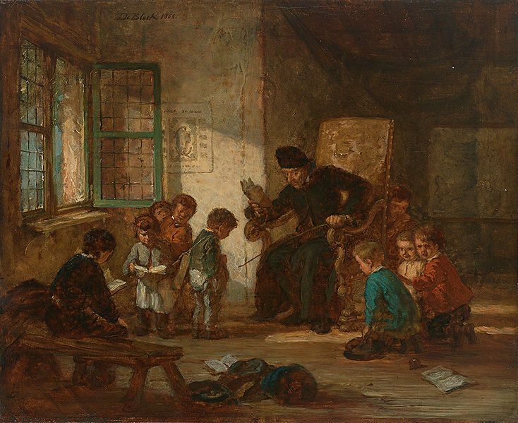

# 07.学习内驱力与习得性无助

## 7 Learn drive vs. learned helplessness

## 学习内驱力与习得性无助

### 7.1 Loss of learn drive with age

### 学习内驱力随年龄增长而丧失

The claim that we lose the [learn drive](https://supermemo.guru/wiki/Learn_drive) with age is dangerous. We accept the fact that students get gradually less passionate about learning. This perpetuates the parasitic myth that learning is hard, school is boring, and that these facts should be accepted like death and taxes. We are supposed to hate school as much as we hate our jobs. We are supposed to grin-and-bear it \(see: [The grind is the glory](https://supermemo.guru/wiki/The_grind_is_the_glory)\)! This myth is stealing youth from the young generation and the love of life from millions of people. The effects of lost [learn drive](https://supermemo.guru/wiki/Learn_drive) do their damage deep into adulthood.

有人声称，随着年龄的增长，我们失去了[学习内驱力](https://supermemo.guru/wiki/Learn_drive)，这种说法是危险的。我们接受这样一个事实：学生对学习的热情逐渐降低。这就延续了一个寄生的错误观念，即学习很难，学校很无聊，这些事实应该像死亡和税收一样被接受。我们应该讨厌学校就像我们讨厌我们的工作一样。我们应该露齿而笑，忍受它（参见：[磨难是光荣](https://supermemo.guru/wiki/The_grind_is_the_glory)）！这一错误观念正在夺走年轻一代的青春和千百万人对生活的热爱。失去[学习内驱力](https://supermemo.guru/wiki/Learn_drive)的影响会在成年后造成伤害。

It is a matter of time when the world can see the folly behind unhappy schooling. We will recover! Roman Empire was not that fortunate. Humanity tends to optimize itself into dead corners. It happened to many extinct human civilizations. Anyone who is tempted to say I exaggerate should look at the mental health of students, e.g. as expressed by the school shooting epidemic, or psychiatric problems experienced by students \(see also: [ADHD epidemic](https://supermemo.guru/wiki/Confusing_creativity_with_ADHD)\).

世界会看到令人不快的学校教育背后的愚蠢，这只是个时间问题。我们会恢复的！罗马帝国就没那么幸运了。人类倾向于把自己优化成死角。它发生在许多已灭绝的人类文明中。任何想说我夸大其词的人都应该看看学生的心理健康状况，例如学校枪击案的流行，或学生所经历的精神问题\(另见：[ADHD 流行病](https://supermemo.guru/wiki/Confusing_creativity_with_ADHD)\)。

We are too smart to let this dangerous course derail progress. We know too much, and knowledge dissemination is too efficient now. Keep spreading the word, or my optimism will be as good as that of pacifists before the first world war!

我们太聪明了，以至于无法让这些危险的课程破坏进程。我们知道的太多了，现在的知识传播效率也太高了。继续传播这个消息，否则我的乐观情绪将和第一次世界大战前和平主义者的乐观情绪一样好！

The school system is inherently dangerous as it includes a number of mechanisms that extinguish novelty seeking, kill the love of learning, and stifle young passions with consequences that my extend to the end of life.

学校系统本身就是危险的，因为它包含了一系列机制，这些机制扼杀了对新奇事物的追求，扼杀了对学习的热爱，扼杀了年轻人的激情，其后果延伸到了我生命的尽头。

When studying depression, scientists employ the concept of **learned helplessness**. They use rats and a forced swim test to explore it. When rats are closed in a tub of water with no route of escape, they tend to swim around for several minutes in search of an exit. After a while they give up. In repeated tests, they tend to swim less and less. They learn the situation is beyond their control and there is no point in trying. The timing of such tests may determine the extent of long-term consequences, e.g. in the function of the amygdala, which may result in depression in adolescence. The rule of the thumb is that the lower the age of abuse, the longer the extent of the consequences. A milder form of such adaptation is what students experience in a classroom. A healthy, 5 year old will violently oppose boredom. Exposed to schooling and monodrome lecturing, the kid disciplined into sitting still in a bench will gradually behave like a rat in a forced swim test. Apathy will set it. The kid will experience behavioral shutdown. Schooling becomes a form of training where tolerance of the absence of novelty is trained into the young brain. This is the opposite what educators should aim at. We should strive at keeping kids impatient and rebellious. Give them the sense of entitlement for knowledge. Boredom should be intolerable. Knowledge can be a form of entertainment, and school should be fun. Entitlement to fun is nothing wrong!

在研究抑郁症时，科学家们采用了**习得性无助**的概念。他们用老鼠和强迫的游泳试验来探究。当老鼠被关在没有逃生路线的水盆里时，它们往往会游上几分钟来寻找出口。过了一会儿它们就放弃了。在反复的测试中，它们倾向于游得更少。它们认识到情况超出了它们的控制范围，且没有必要去尝试。这类测试的时机可能决定长期后果的程度，例如杏仁核的功能，可能导致青春期抑郁。根据经验法则，受虐待时的年龄越小，后果就越严重。学生在课堂上经历的是这种适应的较为温和的形式。一个健康的 5 岁的孩子会强烈反抗无聊。在学校教育和单调的讲课环境下，被训练成坐在凳子上一动不动的孩子，会逐渐表现得像被迫参加游泳试验的老鼠。漠不关心将会产生这个后果。孩子的行为会被封闭。学校教育成为一种训练形式，在这种训练中，对无聊的容忍被灌输到年轻的大脑中。这与教育者应该追求的相反。我们应该努力让孩子们保持不耐烦和叛逆。让他们有获得知识的权利。无聊应该是难以忍受的。知识可以是一种娱乐，学校应该是有趣的。享受乐趣并不是错的！

### 7.2 Neural withering

### 神经萎缩

Learned helplessness is at the core of the adverse classroom conditioning. However, in addition, schooling creates a perfect storm of other adverse conditions, of which violations of sleep hygiene and exposure to stress are most important. Those in turn entail a chain of wide-ranging consequences such as depression, obesity, addictions, risk-taking, aggression, cruelty, etc. This is a perfect storm for inducing [neural withering](https://supermemo.guru/wiki/Stress_reduces_neurogenesis). Young brains are conditioned in a bath of hormones that stifle neurogenesis and promote unfortunate synaptic pruning. This is a type of conditioning that is aimed against the penalties of helplessness. This conditioning results in extinction of behaviors targeted at exploration. This is a formula for setting an apathetic brain in stone. When kids leave school, their brains are set for life of conformity and unhappiness. In that light, it is surprising that some kids are still able to thrive. I explain elsewhere what makes for a model of a happy student. However, that model will suit only a few. There is also a rebellious student who tends to ignore the system and survive ok.

习得性无助是不利的课堂条件的核心。然而，不仅如此，学校教育创造了雪上加霜的其他不利条件，其中最重要的是违反睡眠卫生和暴露在压力之下。这些反过来又带来一系列影响广泛的后果，如抑郁、肥胖、上瘾、冒险、侵略、残暴等等。这对诱导[神经萎缩](https://supermemo.guru/wiki/Stress_reduces_neurogenesis)雪上加霜。年轻的大脑处于荷尔蒙的沐浴中，这些荷尔蒙扼杀了神经的发生，并促进了不当的突触修剪。这是一种针对无助惩罚的条件反射。这种条件导致了以探索为目标的行为消失殆尽。这是一个将冷漠的大脑固定在石头上的方法。当孩子们离开学校的时候，他们的大脑就开始了顺从和不快乐的生活。从这个角度来看，令人惊讶的是，一些孩子仍然能够茁壮成长。我在其他地方解释了什么是一个快乐学生的模式。然而，这种模式只适用于少数人。还有一个叛逆的学生倾向于无视这个系统并且能够幸存下来。

**In the conveyor belt of mass education, most of students get the short end of the stick**.

**在大众教育的流水线中，大多数学生受到坏的影响。**

### 7.3 Learned helplessness at school

### 学校里的习得性无助

There are many ways brains adapt to the environment.

大脑适应环境的方式有很多。

When you travel to a mountain resort and return to a big city, you are probably instantly struck with the unhealthy smell of a polluted metropolis. If you know a thing or two about the impact of pollution on longevity, this can be a horrifying feeling. Within minutes though, you stop sensing the difference and may happily return to your routine. This phenomenon is called an olfactory fatigue, and the underlying process is based on neural adaptation. Neural adaptation may have many forms. It may be instant and it may re-shape your brain over the period of months and years.

当你到一个山区度假胜地，回到一个大城市，你可能会立即遭到受污染的大都市的不健康气味侵袭。如果你了解污染对寿命的影响，这可能是一种可怕的感觉。但是在几分钟内，你就不再感觉到差别了，你可能会很高兴地回到你的日常生活中去。这一现象被称为嗅觉疲劳，其潜在的过程是基于神经适应的。神经适应可能有多种形式。它可能是瞬间的，它也可能会在几个月或几年的时间里重新塑造你的大脑。

If you take on narcotic drugs, you will quickly develop tolerance that will call for higher doses. Tolerance has many aspects. It is based on metabolic adaptations, receptor downregulations, neurological changes, behavioral adaptations, and more.

如果你服用麻醉药品，你将很快发展出需要更高剂量的耐受性。容忍有很多方面。它是基于代谢适应，受体下调，神经变化，行为适应，等等。

Concentration camp survivors employed a whole range of psychological defenses to cope with the horrors of the camp. To a mere mortal, a day in Auschwitz may seem like an unbearable experience that no human mind could survive undamaged. However, camp survivors often returned to normal lives with seemingly limited scars.

集中营的幸存者使用了一系列的心理防御来应对集中营的恐怖。对于一个凡人来说，在奥斯威辛的一天似乎是一种难以忍受的经历，任何人的思想都不可能不受伤害地存活下来。然而，集中营幸存者往往恢复正常生活，带着似乎有限的伤疤。

There are many aspects of biological desensitization and habituation. They form natural regulatory and defence mechanisms in nearly all aspects of human physiology. In school setting, those defenses can be dangerous and can change a student's brain for life.

生物脱敏和习惯有许多方面。它们在人类生理学的几乎所有方面形成自然的调节和防御机制。在学校环境中，这些防御措施可能是危险的，会改变一个学生的大脑一生。

The whole host of adaptations at molecular, cellular, and network levels will result in helping a student develop a tolerance for low arousal, low novelty, and low inflow of valuable knowledge. This is how the [learn drive](https://supermemo.guru/wiki/Learn_drive) gets extinguished. Those "well adapted" students might be classified by a teacher as focused, patient, and well-behaved. These kids are perfect for the classroom setting and they do indeed focus better and learn better at the moment and on demand \(see: [Dangers of being a Straight A student](https://supermemo.guru/wiki/Dangers_of_being_a_Straight_A_student)\). However, their dulled craving for novelty and diminished [learn drive](https://supermemo.guru/wiki/Learn_drive) take a long-term toll. Intellectual curiosity may be diminished and creativity extinguished. Some of those changes may leave a long-term imprint on personality. Reversal and recovery should be possible but may never be complete. Some of the human potential is lost in the process for ever.

在分子、细胞和网络水平上的整体适应将会帮助学生对低唤醒、低新颖性和低价值知识的流入形成一种宽容的态度。这就是[学习内驱力](https://supermemo.guru/wiki/Learn_drive)被扑灭的原因。那些「适应良好的」学生可能会被老师归类为专注、耐心和行为端正的学生。这些孩子是完美的教室布置，在那时候他们确实更专注、学得更好、达到要求（参见：[成为一个优秀学生的危险](https://supermemo.guru/wiki/Dangers_of_being_a_Straight_A_student)）。然而，他们对新奇事物迟钝的渴望和[学习内驱力](https://supermemo.guru/wiki/Learn_drive)的减少会造成长期的损失。求知欲可能会减弱，创造力可能会消失。这些变化中的一些可能会在性格上留下长期的印记。逆转和恢复应该是可能的，但可能永远不会完全。在这一过程中，人类的一些潜力永远地丧失了。

> **Figure:** Schoolchildren in German painting by Eugène-François de Block, 1866 \(source: Wikipedia\)
>
> **图：**1866年 Eugène-François de Block 在德国的绘画作品（资料来源：维基百科）

Educators keep forgetting that **focus and creativity stand in opposition and a great mind needs both in the right proportion**. In the chapter on [Natural creativity cycle](https://supermemo.guru/wiki/Natural_creativity_cycle), I show that the best segregator of the two is the circadian cycle, which naturally harnesses rampant creativity and channels it into focused productive [problem solving](http://help.supermemo.org/wiki/Incremental_learning#Incremental_problem_solving).

教育工作者总是忘记，**专注和创造力是对立的，而伟大的头脑需要正确比例的两者**。在关于[自然创造力周期](https://supermemo.guru/wiki/Natural_creativity_cycle)的一章中，我证明了这两个周期中最好的分隔是昼夜周期，它自然地利用奔放的创造力，并将其引导到集中的生产性[问题解决](http://help.supermemo.org/wiki/Incremental_learning#Incremental_problem_solving)中去。

**Learned helplessness** is the mechanism by which students gain classroom focus **at the cost of creativity**. In the process, they gradually **lose their learn drive**.

**习得性无助**是学生**以创造力为代价**获得课堂注意力的机制。在这个过程中，他们逐渐**失去学习内驱力**。

### 7.4 Kids in a container

### 牢笼里的孩子

[John Taylor Gatto](https://en.wikipedia.org/wiki/John_Taylor_Gatto) is a world famous critic of compulsory schooling. He was an award-winning teacher who quit in 1991 in protest against the way "school made him [hurt children](https://supermemo.guru/wiki/John_Taylor_Gatto:_I_refuse_to_hurt_children)".

[John Taylor Gatto](https://en.wikipedia.org/wiki/John_Taylor_Gatto) 是世界著名的义务教育批评家。他曾是一位屡获殊荣的教师，1991 年为了抗议「[学校让他伤害孩子](https://supermemo.guru/wiki/John_Taylor_Gatto:_I_refuse_to_hurt_children)」而辞职。

Gatto uses a dramatic example to illustrate the operations of a school system. For fleas to be trained for a flea circus, [their spirit needs to be broken first](https://youtu.be/Wl9PPOVQ8wI). A simple formula for breaking the will of a flea is to put it in a glass container with a lid. Each time a flea jumps, it hits the transparent ceiling. After a while, fleas stop jumping. Their will is broken via learned helplessness. They cannot stop hitting the barrier, so they stop jumping.

Gatto 用一个戏剧性的例子来说明学校系统的运作。要为跳蚤马戏团训练跳蚤，[首先需要粉碎它们的精神](https://youtu.be/Wl9PPOVQ8wI)。打破跳蚤意志的一个简单的方法是把它放在一个带盖子的玻璃容器里。跳蚤每跳一次，就会撞到透明的天花板上。过了一会儿跳蚤就不跳了。它们的意志因习得性无助而破碎。它们不能停止撞击障碍，所以他们停止了跳跃。

Gatto, who spend 3 decades as a teacher, felt like he was hired to act as a lid on a container from which kids are supposed to learn never to escape.

Gatto 做了 30 年的教师，他觉得自己是被雇来充当一个容器的盖子，孩子们应该从中学习如何永不逃脱。

> **Figure:** Even if children [hate school](https://supermemo.guru/wiki/Why_kids_hate_school) they accept their fate via [learned helplessness](https://supermemo.guru/wiki/Learned_helplessness). This destroys their [natural love of learning](https://supermemo.guru/wiki/Pleasure_of_learning), suppresses natural creativity, deprives of independence, and may lead to mental disorders later in life \(picture source: Wikipedia\)\*
>
> **图：**即使儿童[讨厌学校](https://supermemo.guru/wiki/Why_kids_hate_school)，他们也会通过[习得性无助](https://supermemo.guru/wiki/Learned_helplessness)来接受自己的命运。这破坏了他们[天生的求知欲](https://supermemo.guru/wiki/Pleasure_of_learning)，压制了天生的创造力，剥夺了他们的独立性，并可能在以后的生活中导致精神障碍（图片来源：维基百科）

### 7.5 Learned helplessness at daycare

### 幼儿园里的习得性无助

The same scary process may already begin in daycare where kids learn to overcome separation anxiety "disorder". Separation anxiety is a normal instinctive reaction to the absence of the primary caregiver, esp. in the natural breastfeeding window. That window is not your textbook 6 months. It might be as long as 3-5 years. We just never seem to see it in modern world that intervenes even in that most intimate process. As a population, we have no idea that natural weaning may take that many years! We need to look at [hunter-gatherer societies](https://supermemo.guru/wiki/Hunter-gatherer_childhood) to find the truth. When late weaning happens in the western world, it is seen as an aberration. Even a [sexual aberration](https://supermemo.guru/wiki/Breastfeeding_as_sexual_perversion).

同样可怕的过程可能已经在幼儿园开始了，在那里孩子们学会了克服分离焦虑的「障碍」。分离焦虑是一种正常的对主要照顾者缺席的本能反应，特别是在自然哺乳期。这段时间不是你的教科书上的 6 个月。这可能需要 3 到 5 年的时间。即使是在最亲密的过程中，我们似乎也从未在现代世界中看到过这种情况。作为一个整体，我们不知道自然断奶可能需要这么多年！我们需要观察[狩猎采集社会](https://supermemo.guru/wiki/Hunter-gatherer_childhood)来寻找真相。当断奶过晚发生在西方世界时，它被视为一种反常现象，[甚至是性变态](https://supermemo.guru/wiki/Breastfeeding_as_sexual_perversion)。

Behavioral therapy can overcome separation anxiety to a degree. Kids can naturally overcome separation at their circadian prime. They cope much worse before sleep or at prime feeding time. In daycare, however, a 2 year old copes with separation anxiety primary by learned helplessness. Tons of self-help books have been written on how to gently separate a child from his mother at that stage, and they all prove that is it possible \(in a healthy child\). Except, this is always harmful. [Raymond Moore](https://www.amazon.com/Raymond-S.-Moore/e/B001IODEXC) warns that [_the earlier you institutionalize your kid, the earlier it will institutionalize you_](https://supermemo.guru/wiki/Raymond_Moore:_On_early_institutionalization).

行为疗法可以在一定程度上克服分离焦虑。孩子们能自然地克服在生理高峰期的分离。他们在睡前或最佳摄食时间应对得更差。然而，在幼儿园里，一名 2 岁的孩子由于习得性无助而患上了初发的分离焦虑症。关于如何在这个阶段温和地把孩子和他的母亲分开的自助书籍已经有很多了，它们都证明了这是可能的（在一个健康的孩子身上）。但是，这总是有害的。[Raymond Moore](https://www.amazon.com/Raymond-S.-Moore/e/B001IODEXC) 警告说，[_你越早把你的孩子制度化，他就会越早把你制度化_](https://supermemo.guru/wiki/Raymond_Moore:_On_early_institutionalization)。

The second layer of learned helplessness comes with discipline. Child freedoms are limited and tolerance to limits on freedom is increased. Ideally, the kid should have a wide cognitive space opened to its explorations. The borders of that space should be set firmly at areas that entail danger to life or health of the child, well-being of others, property, etc. Children must obey the rules and obeyance must be consistently enforced along the principles of efficient conditioning. However, rules are costly. They use resources in learning, execution, confusion, violations, inconsistencies, stress, etc. It is easier to keep fewer rules. If rules are innumerous, they can be clearer and stronger. Rules should be adapted to cognitive capacities of a child and introduced slowly. Running a kid through a narrow gauntlet of rules is possible, but the narrower the channel the more conformity training is required. Conformity is largely based on learned helplessness. A child may disobey a loving parent, but may easily be pushed into submission when faced with an unwelcoming face of a supervisor or peer pressure. Hence the "magic" of daycare \(see: [Learning acceleration via stress](https://supermemo.guru/wiki/Learning_acceleration_via_stress)\).

第二层习得性无助是伴随着纪律而来的。儿童的自由受到限制，对自由限制的容忍程度提高。理想的情况下，孩子应该有一个广阔的认知空间供其探索。该空间的边界应牢固地定在对儿童的生命或健康、他人的福利、财产等造成危险的领域。孩子们必须遵守规则，并且必须按照有效的条件反射的原则始终如一地遵守这些规则。然而，规则代价高昂。他们在学习、执行、困惑、违规、矛盾、压力等方面使用资源。遵守较少的规则比较容易。如果规则不多，它们就会更清晰、更有力。规则应适应孩子的认知能力，并慢慢引入。通过狭隘的规则来管理孩子是可能的，但是渠道越窄，需要更多的整合训练。整合在很大程度上是基于习得性无助。孩子可能不服从慈爱的父母，但当面对上司或同龄人的压力时，孩子很容易被逼迫屈服。因此，幼儿园的「魔力」就在于此（参见：[通过压力加速学习](https://supermemo.guru/wiki/Learning_acceleration_via_stress)）。

Instead, I advocate large [behavioral spaces](https://supermemo.guru/wiki/Behavioral_space). A securely attached caregiver is only needed for reassurance while exploration proceeds unimpeded. A caregiver should seem invisible and intervene only in extreme situations \(e.g. when child safety is compromised\). Whereas a kid under parental supervision may explore the world, investigate, play, and have fun. The same toddler in daycare may be engaged in a battle for survival. Battling other kids. Disobeying orders. Submitting to the authority. Following a rigid schedule that does not match interests or the circadian cycle, wrongly timed learning, wrongly timed running, wrongly timed compulsory napping, and even limits on the freedom of the bladder and the bowel!

与之相反，我提倡广阔的[行为空间](https://supermemo.guru/wiki/Behavioral_space)。当探索不受阻碍地进行时，只需要一个安全可靠的看护人来保证。看护人应该是隐形的，只在极端情况下（例如，儿童安全受到威胁时）进行干预。而在父母的监督下，孩子可以探索世界，调查，玩耍，并享受乐趣。在幼儿园里的这个蹒跚学步的孩子可能正在为生存而战。和其他孩子打架。违抗命令。服从权威。遵循与兴趣或生理周期不匹配的严格时间表，错误地安排学习时间，错误地安排跑步时间，错误地安排强制午睡时间，甚至限制膀胱和肠道的自由！

Child's optimum nap time depends on the natural waking time. If natural waking is gone, the optimum nap time may be gone too, and naps may compound the mess in the sleep cycle. Some kids do not want to nap. Others might refuse to nap in day care for factors that are hard to comprehend to caregiver with 10-20 others subjects to take care of.

孩子的最佳午睡时间取决于自然醒来的时间。如果自然醒来的时间消失了，那么最佳的午睡时间也可能会消失，而午睡可能会加剧睡眠周期中的混乱。有些孩子不想打盹。有些孩子可能会拒绝在幼儿园中打盹，因为还有 10 到 20 个其它孩子需要照顾，看护者很难理解这些因素。

The bigger the cognitive space the lesser the need for adaptations that will limit future explorations. The bigger the space the bigger the rewards from explorations via the [novelty seeking guidance system](https://supermemo.guru/wiki/Learn_drive). Most parents love well-disciplined kids who obey orders, follow the rules, and minimize disruption. This is achieved well at daycare and this is often met with delight. However, those procedures limit exploratory nature of the young brain and [may also result in worse long-term outcomes](https://supermemo.guru/wiki/Learning_acceleration_via_stress). All parents should be aware that **less discipline may be good for a thriving brain**. The term "spoilt brat" should be retained solely for kids who violate the basic rules of decency. Otherwise, **let your kid be spoilt until its brain is strong enough to become a model citizen. This process may take three decades!**

认知空间越大，对限制未来探索的适应需求就越小。空间越大，通过[猎奇性引导系统](https://supermemo.guru/wiki/Learn_drive)进行探索的奖励就越大。大多数父母都喜欢纪律严明的孩子，他们服从命令，遵守规则，最大限度地减少干扰。幼儿园很好地做到了这一点，而且经常能得到满意的结果。然而，这些过程限制了年轻大脑的探索性，[也可能导致更糟糕的长期后果](https://supermemo.guru/wiki/Learning_acceleration_via_stress)。所有的父母都应该意识到，**对于蓬勃发展的大脑来说，较少的纪律可能是有益的**。「被宠坏的孩子」一词只应保留给那些违反基本礼仪规则的孩子。否则，**让你的孩子被宠坏，直到他的大脑足够强大，成为一个模范公民。这个过程可能需要三十年！**

### 7.6 Your brain is great!

### 你的大脑很棒！

My writing about learned helplessness may sound a bit dramatic or even depressing. I hope it is taken to heart by parents and teachers. However, if you strive at high creative achievement, and recognize some stories or symptoms in yourself, this is not the time to slow down and look for your own limitations. I write elsewhere about the magic extent of the adaptive powers of the human brain. With hard work you can restore a great deal of your [learn drive](https://supermemo.guru/wiki/Learn_drive), creativity, or zest for brainwork. Some of the potential might have been lost. Lost brain connection will never be the same. However, for the brain, where one door closes, another opens. Lost skills get compensated in new areas. Personality changes can make you suitable for new and different occupations. It is conceivable that things we consider "_bad for the brain_" may actually turn your life for the better in some circumstances. Do not slow down.

我写的关于习得性无助的文章可能听起来有点戏剧化，甚至令人沮丧。我希望家长和老师都能把这件事放在心上。然而，如果你努力取得较高的创造性成就，并认识到自己身上的一些故事或症状，现在不是放慢脚步、寻找自己的局限的时候。我在其他地方写到人类大脑适应能力的神奇程度。通过努力工作，你可以恢复大量的[学习内驱力](https://supermemo.guru/wiki/Learn_drive)、创造力或对脑力劳动的兴趣。有些潜力可能已经丧失了。失去的大脑连接将不再是原来的样子。然而，对于大脑来说，一扇门关闭，另一扇门打开。失去的技能在新的领域得到补偿。个性的改变可以使你适应新的和不同的职业。可以想象，在某些情况下，我们认为「对大脑有害」的事情可能会使你的生活变得更好。别慢下来。

### 7.7 Summary: School and learn drive

### 摘要：学校和学习内驱力

* Compulsory schooling suppresses the [learn drive](https://supermemo.guru/wiki/Learn_drive)
* 义务教育抑制[学习内驱力](https://supermemo.guru/wiki/Learn_drive)
* Most kids adapt to the compulsion of schooling via learned helplessness
* 大多数孩子通过习得性无助来适应学校教育的强迫
* Classroom focus is maximized by suppression of creativity via learned helplessness
* 最大化课堂注意力是以通过习得性无助抑制创造力为代价
* Learned helplessness may lead to problems such as depression, obesity, addictions, risk-taking, aggression, bullying, cruelty, etc.
* 习得性无助可能导致抑郁、肥胖、上瘾、冒险、攻击、欺凌、残暴等问题
* As experience shapes the brain, inaction in the wake of learned helplessness, is bound to stunt cognitive abilities of children
* 经验塑造大脑，习得性无助后的不作为，必然会阻碍儿童的认知能力
* Learned helplessness begins with forceful weaning \(natural weaning may take 3-4 years\)
* 习得性无助始于强行断奶（自然断奶可能需要 3 到 4 年）
* Learned helplessness continues in daycare with a rigid regiment of rules enforced by strangers
* 由于陌生人强制执行的严格管制规则，习得性无助在幼儿园持续存在
* Large [behavioral spaces](https://supermemo.guru/wiki/Behavioral_space) with fewer rules are beneficial in cognitive development
* 规则较少的广阔[行为空间](https://supermemo.guru/wiki/Behavioral_space)有利于认知发展
* Unrestrained development of personality may take three decades. Accelerating that process limits human cognitive powers
* 个性的自由发展可能需要三十年。加速这一过程限制了人类的认知能力

