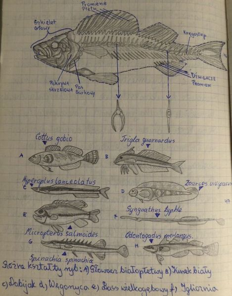

# 19.童年的激情

## 19 Childhood passions

## 童年的激情

### 19.1 Childhood passions

### 童年的激情

Parents often dream of choosing a career for a child. They often understand that a good passion is the best formula for a good career. However, seeding passions is not easy. The most productive passions are those that arise naturally. Like in [childhood amnesia](https://supermemo.guru/wiki/Childhood_amnesia), passions are subject to similar processes of [forgetting](https://supermemo.guru/wiki/Forgetting), and [interference](https://supermemo.guru/wiki/Interference). A new passion can obscure an old passion. All passions should be cherished as they drive development. If the passion does not meet adult criteria for "worthwhile pursuit", all efforts at redirection must stay within the [push zone](https://supermemo.guru/wiki/Push_zone). In the end, the kid should decide. All passions are of value: [videogames](https://supermemo.guru/wiki/Videogames), [hip hop](https://supermemo.guru/wiki/Hip_hop), or even boxing. They should never be mocked, disrupted, or neglected. Great passions require a great investment of time and energy. In youth, those are primarily stolen by [schooling](https://supermemo.guru/wiki/Schooling). However, even limited time for passions is of little value if there is a deficit in the level of the [learn drive](https://supermemo.guru/wiki/Learn_drive) that may be [suppressed by schooling](https://supermemo.guru/wiki/Schools_suppress_the_learn_drive) \(e.g. due to stress or bad sleep\).

父母常常梦想为孩子选择一个职业。他们常常明白，一个有益的激情是一个良好职业生涯的最佳方案。然而，播种激情并不容易。最富有成效的激情是那些自然产生的激情。和[童年失忆症](https://supermemo.guru/wiki/Childhood_amnesia)一样，激情也会经历类似的[遗忘](https://supermemo.guru/wiki/Forgetting)和[干扰](https://supermemo.guru/wiki/Interference)过程。新的激情可以掩盖旧的激情。我们要珍惜一切推动发展的激情。如果这种激情不符合成年人对「有价值的追求」的标准，所有重新定向的努力都必须停留在「[推动区](https://supermemo.guru/wiki/Push_zone)」之内。最后，孩子应该做出决定。所有的激情都是有价值的：[电子游戏](https://supermemo.guru/wiki/Videogames)，[嘻哈](https://supermemo.guru/wiki/Hip_hop)，甚至拳击。他们不应该被嘲笑、扰乱或忽视。伟大的激情需要投入大量的时间和精力。在青年时期，这些时间和精力主要是被[学校教育](https://supermemo.guru/wiki/Schooling)偷走的。然而，如果[学校教育抑制](https://supermemo.guru/wiki/Schools_suppress_the_learn_drive)（例如压力或糟糕的睡眠）了[学习内驱力](https://supermemo.guru/wiki/Learn_drive)的水平，那么即使是给激情有限的时间也没有什么价值。

> **One of the greatest sins of schooling is that it destroys passions by undermining the learn drive**
>
> **学校教育最大的罪恶之一就是通过破坏学习内驱力来摧毁激情**

### 19.2 School notebooks

### 学校笔记本

I love to review children's notebooks. They give me an insight into kid interests, passions, motivations, and learning. Some notebooks are messy and hard to read, some are spotless, some seem a mindless rendition of teacher's orders, while others seem to tell a better story: kids are passionate students of the natural world. The practice of making notes is in decline. Why bother with notes if all knowledge is available at fingertips on the web? This week I saw 9-year-olds talk about a fantasy movie. Someone confused a minotaur with a centaur. A girl pulled out a phone and issued a Google voice query in Polish "_What is a minotaur?_". She got an answer from Wikipedia in milliseconds and could boast of her knowledge to others. In seconds, all kids knew that a minotaur was a mythical figure with a body of a man and the head of a bull.

我喜欢看儿童的笔记本。它们让我了解到孩子的兴趣、激情、动机和学习。有些笔记本凌乱难读，有些一尘不染，有些似乎是对老师命令的无意识演绎，而另一些似乎讲述了一个更好的故事：孩子们是充满激情的自然世界的学生。做笔记的习惯正在减少。如果所有的知识都在网上触手可及，为什么还要费心记笔记呢？这周我看到 9 岁的孩子在谈论一部奇幻电影。有人把人身牛头怪和人头马混淆了。一个女孩拿出手机，用波兰语发出了一个谷歌语音查询：「_牛头怪是什么？_」。她在几毫秒内就从维基百科上得到了答案，并且可以向别人夸耀她的知识。几秒钟后，所有的孩子都知道牛头怪是一个神话人物，有一个男人的身体和一头公牛的头。

Some teachers specifically instruct kids to keep no notes and focus on the class. This seems to improve attention. The great advantage of the decline in note-taking is that heavy back-breaking school bags are slowly retiring to history. The great disadvantage is the decline in handwriting skills. I use handwriting only when I have no access to a computer. The loss of my own handwriting skills is so bad that if I do not read my notes fast, I cannot decode them. My hand-written notes are generally not readable. These days kids use a pen less and less often. Perhaps electronic pens will remedy that decline in handwriting?

有些老师特别教导孩子们不要记笔记，专心听讲。这似乎能提高注意力。记笔记减少的最大好处是沉重的书包正在慢慢地退出历史。最大的缺点是书写技能的下降。我只有在没有电脑的时候才用手写。我自己的书写技能的丧失是如此糟糕，如果我不能快速阅读笔记，我就无法破译它们。我手写的笔记一般看不懂。现在孩子们用笔越来越少了。也许电子笔能弥补手写能力的下降？

### 19.3 Notes in pictures

### 图片中的标注

Look at the picture! It is a page from a 6 grader's biology notebook. Doesn't it show how beautiful, fun, and inspirational schooling can be? What if I told you that this notebook had 66 similar meticulously handcrafted images? Wouldn't you expect that paintwork to have a significant impact on child's mind and on learning? Even better, what if I told you the kid can still vividly recall those pictures and associated stories 40 years later?

看这幅画！这是一个六年级学生生物笔记本上的一页。这难道不表明学校教育是多么美好、有趣和鼓舞人心吗？如果我告诉你这个笔记本有 66 个类似的精心制作的图像呢？你不认为绘画作品会对孩子的思维和学习产生重大影响吗？更棒的是，如果我告诉你，40 年后这个孩子还能生动地回忆起那些照片和相关的故事，那会怎么样？

> **Figure:** A page from a passionate 6-grader's school notebook in biology
>
> **图：**一个充满激情的六年级学生的生物课笔记本上的一页

The conclusions for this case seem clear:

这个案例的结论似乎很清楚：

* school is fun
* 学校很有趣
* school is motivational
* 学校能鼓舞学生
* school is effective
* 学校是有效的
* school makes a big impact
* 学校有很大的影响

The only problem with these conclusions is that they are false. The picture smuggles a big lie. I know the lie for a fact, because the picture is mine. It tells a story of a passion that was nearly lost. The school is not a hero in this story. It is a villain!

这些结论的唯一问题是它们是错误的。这幅画偷偷地撒了个弥天大谎。我知道这是谎话，因为这张照片是我的。它讲述了一个几乎失去激情的故事。学校在这个故事里不是英雄。而是个恶棍！

### 19.4 Single event can spark a passion

### 单个事件可以激发激情

At the age of 5, Albert Einstein had a chance to play with a compass. This started his lifelong passion for understanding the physical universe. Nearly all great inventors and discoverers can trace their passions to early childhood events. The same is true of hobbyists, collectors, artist, sports fans, and people with all imaginable passions in life. Passions developed later in life rarely have the same power. It is kids with seemingly infinite amounts of time on their hands who can turn passions into thousands of hours of learning.

5 岁时，Albert Einstein 有机会玩指南针。这开启了他毕生对理解物理宇宙的热情。几乎所有伟大的发明家和发现者都能追溯他们的激情到童年早期的事件。同样的道理也适用于业余爱好者、收藏家、艺术家、体育迷，以及生活中充满激情的人。在人生后期发展起来的激情很少有同样的力量。孩子们似乎拥有无限的时间，他们可以把激情转化为数千小时的学习。

> Personal anecdote. [Why use anecdotes?](https://supermemo.guru/wiki/Why_use_anecdotes%3F)
>
> 个人轶事。[为什么使用轶事？](https://supermemo.guru/wiki/Why_use_anecdotes%3F)
>
> My brother was a forest inspector. When I was still in kindergarten, he showed me the wonders of the natural world. This affected the course of my entire life. In March 1973, my teacher of Polish came to school with a baby turtle. It was a red-eared slider turtle. It was super-cute. She put the turtle on a bench. Surrounded by kids, the cute animal, scared to death, flapped its baby legs and rushed towards the bench edge. This 3 minute demo was one of the most influential moments of schooling I recall. The same day, I visited a pet shop at Rybaki street in the city of Poznan. Baby turtles were priced at less than a dollar. Unfortunately, I lost half of my cash for a tram fare. I was a habitual fare dodger, and never spent precious coins on tram rides, but on this unlucky day I spotted a guard checking tickets. I had to backtrack home and beg my mom for more money. When chatting with the shop owner, he became suspicious: "Do you only plan to set up an aquarium now?". "No. I have it all ready" - I lied. Back at home, we had a major quarrel with my mom. We did not know anything about turtles. She wanted the baby to swim in a jar. I told her it must be placed in a terrarium with sand and only a small pool of water. Looking back, I am amazed this little reptile survived its first days with ignorant human oppressors. Luckily, I quickly learned more about turtles from books, experience, and from talking to a pet shop owner, one Mr Skubel. Baby slider soon developed a good appetite for meat, lettuce and tubifex, and survived for 24 years with my family. It died "peacefully in sleep" on Mar 21, 1997.
>
> 我哥哥是一名森林督察。当我还在幼儿园的时候，他给我展示了大自然的奇观。这影响了我的一生。1973 年 3 月，我的波兰老师带着一只小乌龟来到学校。那是一只红耳滑龟，超级可爱。她把乌龟放在凳子上。在孩子们的包围下，这只可爱的动物吓得要死，拍打着它幼小的腿，冲向板凳边缘。这个 3 分钟的演示是我记忆中上学最具影响力的时刻之一。同一天，我参观了波兹南市瑞巴克街的一家宠物店。小海龟的价格不到一美元。不幸的是，我失去一半现钱用来买电车车票。我是个惯于逃票的人，从来没有在乘电车时花过宝贵的硬币，但在这个倒霉的日子里，我看见一个警卫在检票。我不得不回到家里，向妈妈要更多的钱。当和店主聊天时，他开始怀疑：「你现在只打算建一个水族馆吗？」「没有。我已经准备好了」——我撒了个谎。回到家，我们和妈妈大吵了一架。我们对海龟一无所知。她想让小海龟在罐子里游泳。我告诉她必须把它放在一个只有沙子和一小池水的玻璃容器里。回顾过去，我很惊讶这只小爬行动物能在无知的人类压迫者的陪伴下存活下来。幸运的是，我很快就从书中、从经验中、从与宠物店老板 Skubel 的交谈中，对海龟有了更多的了解。小海龟很快就对肉、生菜和水丝蚓产生了良好的食欲，并与我的家人一起生活了 24 年。1997 年 3 月 21 日，它在睡梦中平静地死去。
>
> This baby turtle started a passion for breeding fish, plants, turtles, hamsters, and more. My home became a menagerie. Instead of shopping, I would go to a nearby lake. I would experiment with various algae, snails, and crustaceans. My aquariums were always full of exuberant life and algal growth.
>
> 这只小海龟打开了我对繁殖鱼类、植物、海龟、仓鼠等的激情。我的家变成了一个动物园。我将不去购物，而是去附近的一个湖。我会用各种藻类、蜗牛和甲壳类动物做实验。我的水族馆总是充满了生机勃勃的生命和藻类生长。
>
> In parallel, in my biology class, all things related to zoology seemed super-interesting. For each class, I would prepare 2-3 nice pictures of animals, their anatomy, physiology or life cycle. Like in the presented picture, I would add a page or two of nice descriptions. It was not homework. The teacher did not ask for my work. It was all coming from within. Even worse, I recall bending over backwards to impress the teacher. All I could get back was a yawn. That would not matter though. The passion served some inner need. It did not serve anyone in the world. It satisfied my [learn drive](https://supermemo.guru/wiki/Learn_drive), which is its own reward.
>
> 与此同时，在我的生物课上，所有与动物学有关的东西似乎都非常有趣。每节课，我会准备 2 - 3 张动物的图片，它们的解剖，生理或生命周期。就像在展示的图片中一样，我会添加一两页漂亮的描述。这不是家庭作业。老师没有要求我做作业。一切都来自内心。更糟糕的是，我回忆起为了给老师留下深刻印象而竭尽全力。我所能得到的只是一个呵欠。不过这并不重要。激情满足了某种内在的需求。它不为世界上任何人服务。它满足了我的[学习内驱力](https://supermemo.guru/wiki/Learn_drive)，这是它自己的奖励。
>
> I saw my baby turtle at school. I could have seen it anywhere. It would not matter. School was not fun. School was not motivational. School did not play a role. It was the beauty of the natural world that had an effect on a young curious mind. If anything, school kept my passions suppressed by stealing a big portion of my day on things I did not care about \(e.g. my school fights\)
>
> 我在学校看到我的小乌龟。我可以在任何地方看到它。这无关紧要。上学一点也不好玩。学校不能激励。学校没有发挥作用。大自然的美对一个好奇的年轻人产生了影响。如果说有什么不同的话，那就是学校把我的大部分时间都用在了我不关心的事情上（比如在学校打架），从而压抑了我的热情。

### 19.5 Remembering for half-a-century

### 记住半个世纪

How can knowledge be retained for 43 years?

知识如何能保存 43 年？

> Personal anecdote. [Why use anecdotes?](https://supermemo.guru/wiki/Why_use_anecdotes%3F)
>
> 个人轶事。[为什么使用轶事？](https://supermemo.guru/wiki/Why_use_anecdotes%3F)
>
> I had a lot of contact with zoology in youth. I took part in Biology Olympics in high school. I also took a zoology course at the university with a comprehensive exam \(9 years after buying the turtle\). That would serve as solid review for my zoology knowledge. One might presume that the seeds had been sown in the 6th grade \(1973\), reinforced in high school \(1976-1980\), and consolidated at the university \(1982\). This might then look like a textbook case of lifetime knowledge! However, I severed all my links with zoology by 1984. All my animal collection, incl. my growing turtle, was taken over by younger members of my family. No more animals, no more exams.
>
> 我年轻时接触过很多动物学。我在高中参加了生物奥赛。我还在大学里修了一门动物学课程，参加了综合考试（买海龟 9 年后）。这将作为我动物学知识的坚实复习。人们可能会认为，这些种子是在六年级（1973 年）播下的，在高中（1976 - 1980 年）得到强化，在大学（1982 年）得到巩固。这可能看起来像教科书上的终身知识案例！然而，我在1984 年切断了与动物学的所有联系。我所有的动物收藏，包括我正在长大的乌龟，都被我家里的年轻成员接管了。不再有动物，不再有考试。
>
> How could I have remembered things for 32 more years without review? From 1984 till now \(2016\)!
>
> 如果没有复习，我怎么能再记住 32 年呢？1984 年至今（2016 年）！
>
> One big clue comes from the fact that my 6-grade notes sound to me as if written in a foreign language! Anatomy charts are familiar. Life cycles are familiar. However, words that describe pictures are alien! Long after my last zoology exam, when I decided to keep all my notes in the computer, I also decided to switch to using English \(rather than original native Polish\). English is global. English is the language of science. English is easier to search through on a computer. English knowledge resources are richer and more reliable. etc. The list of advantages of English is endless. I decided to make a switch in 1987. The fact that I hardly recall the terminology used in my own primary school notebook is a clear proof that my knowledge of zoology, seeded early, had to be refreshed outside schooling. I can actually trace each single animal I know, and each single word related to zoology in my own computer. I can tell you when I learned a given fact, or word, or picture, how many times I reviewed those facts, and how my memory gradually got stronger \(or weaker\). The credit goes to SuperMemo
>
> 一个重要的线索来自于我的 6 年级笔记听起来像是用外语写的！解剖图很熟悉。生命周期是熟悉的。然而，描述图片的词是陌生的！上次动物学考试后很久，我决定把所有的笔记都放在电脑里，我也决定改用英语（而不是波兰语）。英语是全球性的，英语是科学的语言，在电脑上搜索英语更容易，英语知识资源更加丰富可靠，等等。英语的优点数不胜数。1987 年我决定换工作。我几乎记不起我小学时笔记本上使用的术语，这一事实清楚地证明，我的动物学知识，早在播种之初，必须在校外重新学习。我可以在自己的电脑里追踪我认识的每一种动物，以及每一个与动物学相关的单词。我可以告诉你，当我学习一个给定的事实、单词或图片时，我复习了多少次这些事实，以及我的记忆力是如何逐渐增强（或减弱）的。这要归功于 SuperMemo
>
> SuperMemo insert. [What is SuperMemo?](https://supermemo.guru/wiki/What_is_SuperMemo%3F)
>
> SuperMemo 插入。[SuperMemo 是什么？](https://supermemo.guru/wiki/What_is_SuperMemo%3F)
>
> I keep all my knowledge in [SuperMemo](https://supermemo.guru/wiki/SuperMemo). I do not need to remember the name "horse". We all remember horses. We see horses daily on TV, on the net, or even in real life. However, to remember names of horse colors or horse breeds, I need SuperMemo. Those do not show up often enough to stay in memory. After 1990, my knowledge of zoology survived largely due to [SuperMemo](https://supermemo.guru/wiki/SuperMemo). If I devoted a fraction of time wasted on commuting to school on SuperMemo, my knowledge would increase by an order of magnitude. Mobile technology would only help fractionally because [incremental learning](https://supermemo.guru/wiki/Incremental_learning) does not fare well on the go. There is an exponential increase in the return on investment with all marginal improvements to the adherence to the [natural creativity cycle](https://supermemo.guru/wiki/Natural_creativity_cycle). Only "mindless" repetitions would work on a bus. If I did not have to go to school, I could use most of my day on passionate learning. My knowledge might still be one-sided and monothematic for a longer while. However, I have proven that [I would open that history book sooner or later](https://supermemo.guru/wiki/Learning_history:_school_vs._self-directed_learning#How_I_started_liking_history). The extra time saved by not going to school might accelerate the process of broadening of my horizons. I am sure that **instead of being helpful, school slowed my progress**.
>
> 我把所有的知识都记在 [SuperMemo](https://supermemo.guru/wiki/SuperMemo) 里。我不需要记住「马」这个名字。我们都记得马。我们每天都能在电视上、网上甚至现实生活中看到马。然而，要记住马的颜色或马的品种，我需要 SuperMemo。它们并不经常出现在记忆中。1990 年以后，我对动物学的了解很大程度上得益于 [SuperMemo](https://supermemo.guru/wiki/SuperMemo)。如果我将上学路上浪费一小部分时间用于 SuperMemo，我的知识就会增长一个数量级。移动技术只会略微有所帮助，因为[渐进学习](https://supermemo.guru/wiki/Incremental_learning)的进展并不顺利。投资回报呈指数级增长，所有对坚持[自然创造力周期](https://supermemo.guru/wiki/Natural_creativity_cycle)的边际改善都是如此。在公共汽车上，只有「无意识」的重复才能奏效。如果我不用上学，我可以把我的大部分时间用在充满激情的学习上。在很长一段时间内，我的知识可能仍然是片面和单一的。然而，我已经证明，[我迟早会翻开那本历史书](https://supermemo.guru/wiki/Learning_history:_school_vs._self-directed_learning#How_I_started_liking_history)。不上学节省的额外时间可能会加快我开阔视野的进程。我确信**学校非但没有帮助我，反而减缓了我的进步**。

### 19.6 Schooling can easily kill passions

### 学校教育很轻易地扼杀激情

> Personal anecdote. [Why use anecdotes?](https://supermemo.guru/wiki/Why_use_anecdotes%3F)
>
> 个人轶事。[为什么使用轶事？](https://supermemo.guru/wiki/Why_use_anecdotes%3F)
>
> If I saw a kid like myself at 10-12 years old, I might easily think it is a great material for a future scientist. Like little Darwin, I collected all things related to the living world: from a collection of feathers to dried up and smelly dead animals or body parts. Our big old apartment smelled of my extensive menagerie and death. I used to walk slowly through Poznan zoo, cage by cage, observing, making notes, for hours, for months! This documentary obsession followed closely in time the most shameful chapters of my youth. First, I was a hooligan and a harmless criminal. Not much later, I was an observer of the natural world. To this day, I find this transition difficult to comprehend. One might think that such a speedy transformation in a good direction should give birth to a passion that might send me on a healthy trajectory towards some research position at some university. It was not to be.
>
> 如果我在 10 - 12 岁的时候看到一个像我这样的孩子，我很容易就会认为这是未来科学家的好材料。就像小达尔文一样，我收集了所有与生命世界有关的东西：从羽毛到干枯、发臭的死动物或身体部位。我们那间又大又旧的公寓里弥漫着我丰富的动物群和死亡的气息。我过去常常慢慢地走过波兹南动物园，一个笼子一个笼子地观察，做笔记，几个小时，几个月！这种对纪录片的痴迷紧跟着我年轻时代最可耻的篇章。首先，我是个流氓，是个没有恶意的罪犯。不久之后，我成了一个自然世界的观察者。直到今天，我仍然很难理解这种转变。有人可能会认为，如此快速的向好的方向转变，应该会产生一种激情，可能会让我走上一条健康的轨道，进入某所大学的某个研究岗位。这是不可能的。
>
> In this modern world, young minds are bombarded from all directions with new ideas, and temptations. It is hard to be well-focused on a single problem or passion. The days of 17-19 century science are gone. For comfort, at least we die a bit later and have more time to crystallize and explore.
>
> 在这个现代世界里，年轻人的思想受到来自四面八方的新思想和诱惑的轰击。很难把注意力完全集中在一个问题或激情上。17 - 19 世纪的科学时代已经一去不复返了。为了寻求安慰，至少我们会晚一点死去，有更多的时间去具体化和探索。
>
> Events that changed me from a [bad student to a good student](https://supermemo.guru/wiki/Socialization:_Personal_stories) also dealt a big blow to my zoological passions. I was thrown away from my old school for bad behavior. This coincided with my mom's moving to a small apartment in a nicer district closer to a better school \(Winogrady in Poznan, primary school 30\). I had to cut down on the size of my animal collection and give away most of my 30+ strong hamster family. There was not enough room in the new apartment. My mom also disposed of a great deal of my "Darwinian specimen collection". It was too big and it smelled too bad. We would choke! At the same time, new school rewarded me with good grades. Instead of following passions, I got involved in a "grade race". Luckily, [meeting the chemistry teacher Mrs Kaczmarek helped me continue my interest in science and also gain a great deal of confidence in my own abilities](https://supermemo.guru/wiki/Great_teachers_change_the_world).
>
> 把我从[一个坏学生变成一个好学生](https://supermemo.guru/wiki/Socialization:_Personal_stories)的事件也对我的动物学激情造成了巨大的打击。我因为行为不端而被学校开除了。与此同时，我妈妈搬到了一个更漂亮的小区，离一所更好的学校更近（Poznan Winogrady 第 30 小学）。我不得不缩减我的动物收藏的规模，把我 30 多只强壮的仓鼠家族的大部分都捐了出去。新公寓没有足够的房间。我妈妈也处理了我的大量「达尔文标本收藏」。它太大了，闻起来也太难闻了。我们会窒息！与此同时，新学校以优异的成绩奖励我。我没有追随自己的激情，而是参加了一场「成绩竞赛」。幸运的是，[遇见化学老师 Kaczmarek 夫人帮助我继续我对科学的兴趣，也让我对自己的能力有了很大的信心](https://supermemo.guru/wiki/Great_teachers_change_the_world)。
>
> When I entered high school, the passion for zoology was still surviving. It was now enhanced by my new strength in chemistry. Our home library had a nice book: [Peter Karlson's Biochemistry](https://www.amazon.com/Introduction-Modern-Biochemistry-Fourth-Karlson/dp/0123997313). This was a savior of my interests, esp. in the light of ever growing dislike of school, early waking, tests, homework, and pressure. During summer vacations, I studied biochemistry. This learning time helped me later get to the university despite having few other strengths or qualifications.
>
> 当我进入高中时，对动物学的激情仍然存在。现在我在化学方面的新优势使它得到了加强。我们的家庭图书馆有一本好书：[Peter Karlson 的《生物化学》](https://www.amazon.com/Introduction-Modern-Biochemistry-Fourth-Karlson/dp/0123997313)。这是我兴趣的救星，尤其是在我越来越讨厌上学、早起、考试、家庭作业和压力的情况下。暑假期间，我学习了生物化学。这段学习时间帮助我后来进入了大学，尽管我没有其他优势或资格。
>
> In 1977, aged 15, I almost killed my passion for science. I joined a boxing club, but that "career" was cut short by 1980 due to shortsightedness. At the same time, my sister gave me a tape recorder. I recorded a few songs from the radio, and discovered that I love music. When I saw Stevie Wonder perform funky _Superstition_, I dreamt of being equally proficient with the piano keyboard. For eight long years, music became my biggest obsession. Partly, I blame school. After school, sleep deprived, I did not have any power or interest in learning. I did not know it at the time, but I was probably showing early signs of [DSPS](https://supermemo.guru/wiki/DSPS). This made waking early a torture. Even classes at 10 am seemed too early. In the evening, all I could do was to listen to music. During summer vacations, as if by magic, I would get good sleep and get back to learning. During school year, it was mostly music. Additionally, I devoted 2-3 afternoons per week to boxing. The magic of music seemed irresistible. However, I was somehow able to find harmony in summer: learning, exercise, and much less music. **If I did not have summer vacations, my interest in biochemistry would have died**. If I did not have school, I would probably find time for all passions. My life would be harmonious and productive.
>
> 1977 年，年仅 15 岁的我几乎扼杀了对科学的热情。我加入了一个拳击俱乐部，但到 1980 年，由于近视，这个「职业」被缩短了。同时，我姐姐给了我一台录音机。我从收音机里录了几首歌，发现我喜欢音乐。当我看到 Stevie Wonder 表演《funky Superstition》时，我梦想自己也能熟练使用钢琴键盘。在长达八年的时间里，音乐成为我最大的爱好。部分原因要归咎于学校。放学后，由于睡眠不足，我没有任何学习的动力和兴趣。当时我并不知道，但我可能已经出现了早期的 [DSPS](https://supermemo.guru/wiki/DSPS) 症状。这使得早起成为一种折磨。甚至上午 10 点的课似乎也太早了。晚上，我能做的就是听音乐。暑假期间，就像变魔术一样，我能睡个好觉，重新开始学习。在学校里，主要是音乐。此外，我每周花 2 - 3 个下午打拳击。音乐的魔力似乎不可抗拒。然而，不知怎么的，我在夏天找到了和谐：学习，锻炼，更少的音乐。**如果我没有暑假，我对生物化学的兴趣就会消失**。如果我没有上学，我可能会找到时间去做所有的事情。我的生活会和谐而富有成效。
>
> If I am to verdict on how my early science passions survived the high school, I would definitely credit my character. My natural rebelliousness made me refuse early waking, refuse homework, and refuse compulsory reading: the most significant thief of time at high school. This in turn minimized the damage to my learn drive, which powered my summer learning. In addition, with each passing year, my maturity kept increasing. Slowly, I gave higher priority to rational pursuits \(science\) over pleasurable pursuits \(music\). By 1984, when I finally had some success in the field of music, one by one, I quit all three bands I was involved in. Each separation was excruciatingly painful, and accompanied by a lengthy rationale letter to my fellow musician friends. Those steps were necessary for me to continue with science and research. Youthful passions survived despite schooling, immaturity, and multiple temptations of the modern world. It was a touch and go. On a sad note, I totally lost my painting skills through neglect.
>
> 如果让我来评判我早期对科学的激情是如何从高中时代延续下来的，我肯定会相信我的性格。我天生的叛逆使我拒绝早起，拒绝做作业，拒绝强制阅读：这是高中最浪费时间的行为。这反过来又使我的学习内驱力受到的损害最小化，而正是这种内驱力为我的暑期学习提供了动力。此外，随着年龄的增长，我的成熟度也在不断提高。慢慢地，我把理性的追求（科学）置于快乐的追求（音乐）之上。1984 年，当我终于在音乐领域取得一些成功时，我一个接一个地退出了我所参与的三个乐队。每一次分离都是极其痛苦的，并伴随着一封给我的音乐家朋友们的长信。这些步骤对我继续从事科学研究是必要的。尽管学校教育、不成熟以及现代世界的种种诱惑，年轻人的激情依然存在。这是一次冒险。遗憾的是，由于忽视，我完全丧失了绘画技巧。

I see lots of 8-10 year olds with fantastic passions. It does not really matter if these are planets, dolphins, painting, or football cards. Those passions should be cherished. My own story makes me fear that a vast majority of that potential will go to waste. I have lots of sad observational and anecdotal evidence. Lots of my young friends with humongous potential get sucked into the ruthless machinery of modern nine-to-five living. They are not happy. Each young man's potential wasted is a loss for mankind.

我看到很多 8 - 10 岁的孩子都充满激情。无论这些是行星、海豚、绘画还是足球卡片，其实都无关紧要。我们应该珍惜这些激情。我自己的经历让我担心，这些潜力中的绝大部分将被浪费掉。我有很多可悲的观察和轶事证据。我的许多有巨大潜力的年轻朋友都被现代朝九晚五的残酷生活所吸引。他们不快乐。每个年轻人潜在的浪费对人类来说是一种损失。

> From decade to decade we crank up the pressure of schooling. We push kids harder and harder to achieve more and more. In the process, **schools are highly efficient killers of childhood passions and the learn drive**. This is highly detrimental to further progress of mankind
>
> 十年又十年，我们加大了上学的压力。我们督促孩子们越来越努力，取得越来越多的成绩。在这个过程中，**学校是扼杀童年激情和学习内驱力的高效杀手**。这对人类的进一步进步是极为不利的

### 19.7 Summary: Childhood passions

### 摘要：童年的激情

* minor events in childhood can turn into lifelong passions
* 童年的小事情可以变成一生的激情
* child passions have a dramatic positive impact on the power of the [learn drive](https://supermemo.guru/wiki/Learn_drive)
* 孩子的激情对[学习内驱力](https://supermemo.guru/wiki/Learn_drive)有着巨大的积极影响
* child passions should be cherished and protected
* 应该珍惜和保护儿童的激情
* true passions do not need to be stoked up; they serve an inner need
* 真正的激情不需要被点燃；它们服务于内心的需求
* childhood passions can easily get lost due to preoccupation with schooling
* 童年的激情很容易因为对上学的专注而丧失
* schools can easily produce an illusion of learning and an illusion of long-term memory
* 学校很容易产生学习和长期记忆的错觉
* schools take away time from passions that shape the mind and direct lives
* 学校把时间从塑造思想和指导生活的激情中抽走
* schools suppress the [learn drive](https://supermemo.guru/wiki/Learn_drive)
* 学校抑制了[学习内驱力](https://supermemo.guru/wiki/Learn_drive)

