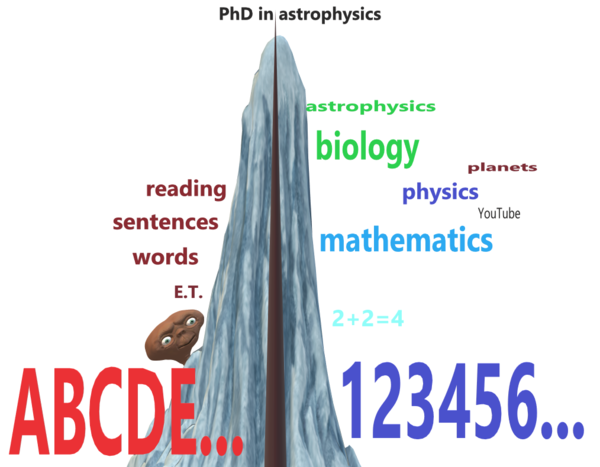

# 21.爬山类比
[TOC=3,5]
## 21 Mountain climb metaphor

## 爬山类比

### 21.1 Education is a mountain to climb

### 教育是一座待攀登的山峰

The **mountain climb metaphor** is helpful to understand why the concept of [schooling](https://supermemo.guru/wiki/Schooling) is so pervasive despite being highly harmful. The metaphor explains that we cannot improve upon optimization without using optimization tools. The metaphor extends to many areas of life. It extends to many ailments that torment humankind today.

**爬山的类比**有助于理解为什么学校教育的概念是如此普遍，尽管它是非常有害的。这个类比解释说，如果不使用优化工具，我们就不能在优化上有所改进。这个类比延伸到生活的许多领域。它延伸到今天折磨人类的许多疾病上。

A popular saying says _"hindsight is 20/20"_. However, there is a monumental snag in the process when we reach goals via optimization, and then attempt to lead others to reproduce the feat. Using hindsight, we are tempted to improve upon the trajectory without doing the actual computation that would verify the new trajectory's viability.

俗话说_「后见之明是完美的」_。然而，当我们通过优化达到目标，然后试图带领其他人重现这一壮举时，这个过程中存在一个巨大的障碍。事后看来，我们倾向于在不做实际计算以验证新轨道可行性的情况下对轨道进行改进。

> Metaphor. [Why use metaphors?](https://supermemo.guru/wiki/Why_use_metaphors%3F)
>
> 类比。[为什么使用类比?](https://supermemo.guru/wiki/Why_use_metaphors%3F)
>
> Imagine you climb a mountain. In the process, you look for best paths, possible dangers, time-wasting obstacles, shortcuts, feeding points, cliffs, shelters, rock falls, and so on. Once you find your optimum path, and you get to the top, you may feel euphoric elation. It is only natural that you want to help others reproduce your feat. Let others experience your joy. When you look back from the mountain top, you suddenly realize that your path was tortuous, winding, and complex. From the mountain top, you can see a simpler path that is more of a straight line. You scream to people at the foot of the mountain to let them know your "improved" straight line pathway. Inadvertently, you may lead them into an abyss, deep stream, bear cave, or stray in a densely wooded area with loss of visibility. At the mountain top, it is easy to imagine one knows better. It is easy to forget the pains and troubles of the climb
>
> 想象你在爬山。在这个过程中，你要寻找最佳路径、可能的危险、浪费时间的障碍、捷径、补充点、悬崖、遮蔽处、落石等等。一旦你找到了自己的最佳路径，到达了顶峰，你可能会兴高采烈。这时想帮助别人复制你的成就是很自然的。让别人体验你的快乐。当你从山顶回望，你突然意识到你的道路是曲折的、蜿蜒的、复杂的。从山顶上，你可以看到一条更简单的路，这条路更直。你向山脚下的人们大喊，让他们知道你「改进」的直线路径。不经意间，你可能会把他们带进一个深渊、深溪、熊洞，或迷失在一个失去了能见度的茂密森林地区。在山顶，很容易想象一个人知道得更多，也很容易忘记攀登的痛苦和烦恼

In [schooling](https://supermemo.guru/wiki/Schooling), adults have a distorted version of their own learning path. From the mountaintop it all seems so easy: first the alphabet and counting, then reading and simple calculations, and then a simple straight path to wisdom \(see also: [Crystallization metaphor](https://supermemo.guru/wiki/Crystallization_metaphor)\). This approach nearly never works as intended. In case of schooling, it causes unnecessary torment, and time-wasting all around the world.

在[学校教育](https://supermemo.guru/wiki/Schooling)中，成年人有他们自己学习路径的失真版本。从山顶上看，一切似乎都很容易：首先是字母表和数数，然后是阅读和简单的计算，然后是一条简单的通向智慧的直道（另见：[结晶类比](https://supermemo.guru/wiki/Crystallization_metaphor)）。这种方法几乎从来没有达到预期的效果。就学校教育而言，它在世界各地造成不必要的折磨和时间浪费。

A child's brain is different than an adult's brain. For [neurobiological reasons](https://supermemo.guru/wiki/Childhood_amnesia), the adult has no way of remembering the difference. The adult cannot empathize with a child's learning process, and must step away to let it [run naturally](https://supermemo.guru/wiki/Free_learning). The shortcuts proposed by adults are counterproductive. The first thing we should learn at school or in life are the wonders of the world. In terms of the [curriculum](https://supermemo.guru/wiki/Curriculum), chemistry should precede the alphabet, physics should precede counting sequences, biology should precede reading. We turn it all upside down, and then poison the chalice by making it all compulsory. In a mix with authoritarian parenting, this is a path to the loss of [love of learning](https://supermemo.guru/wiki/Pleasure_of_learning), [hate of school](https://supermemo.guru/wiki/Why_kids_hate_school%3F), hate of people, [bullying](https://supermemo.guru/wiki/Bullying), depression, drugs, mental disorders, and more. Kids without freedom make as much progress as inmates in a tough prison: instead of re-socializing, they get worse.

儿童的大脑不同于成年人的大脑。由于[神经生物学上的原因](https://supermemo.guru/wiki/Childhood_amnesia)，成年人没有办法记住这些差别。成年人不能理解儿童的学习过程，他们必须走到一边，让孩子[自然地学习](https://supermemo.guru/wiki/Free_learning)。成年人提出的捷径是适得其反的。无论是在学校还是在生活中，我们首先要学习的就是世界奇迹。就[课程](https://supermemo.guru/wiki/Curriculum)而言，化学应先于字母表，物理应先于计数顺序，生物应先于阅读。我们把一切都颠倒过来，然后通过强制把这一切变成毒药。与威权教育相结合，这是一条失去[对学习的爱](https://supermemo.guru/wiki/Pleasure_of_learning)，产生[对学校的仇恨](https://supermemo.guru/wiki/Why_kids_hate_school%3F)、对人的仇恨，以及[欺凌](https://supermemo.guru/wiki/Bullying)、抑郁、毒品、精神错乱等等的道路。没有自由的孩子和在艰苦的监狱里的囚犯一样进步：他们不是重新融入社会，而是变得更糟。

### 21.2 Hindsight is not 20/20

### 后见之明并非完美

In terms of [schooling](https://supermemo.guru/wiki/Schooling), _"hindsight is blurry while appearing to be 20/20"_. It comes from a typical illusion that affects the post-factum perception of neural optimization, or optimization in general. It comes from the [curse of knowledge](https://supermemo.guru/wiki/Curse_of_knowledge). All things that used to be difficult in the past, now may seem simple.

就[学校教育](https://supermemo.guru/wiki/Schooling)而言，_「后见之明是不清楚的，似乎是完美的」_。它来自于一种典型的错觉，这种错觉会影响神经优化或一般优化的后因子感知。它来自[知识的诅咒](https://supermemo.guru/wiki/Curse_of_knowledge)。过去的一切困难事情，现在看来似乎都很简单。

Starting the school from reading and counting is an artifact of adult-centric view of education

上学从阅读和数数开始是一种以成年人为中心的教育观的产物

Early instruction is the degradation of the beauty of the world to the basic abstract ingredients that are unpalatable to young minds. The ABCs should be a natural consequence of exploratory learning. The kids can quickly discover the empowering value of reading. The elation of first reading is most delicious when it comes from self-discovery. It is nearly impossible to enter the world of computer games without a good number sense. Math is sweetest when it is used as a tool on the way to a great goal. Only math connoisseurs can love math for the math sake. Usually, it takes decades to become a connoisseur.

早期教育是把世界之美退化成年轻人所不喜欢的基本抽象成分。基础知识应该是探索性学习的自然结果。孩子们很快就能发现阅读的力量。当第一次阅读的喜悦来自于自我发现时，它是最美妙的。如果没有良好的数感，进入计算机游戏的世界几乎是不可能的。当数学被用作通往伟大目标的工具时，它是最惹人喜爱的。只有数学行家才会为了数学而热爱数学。通常，成为一个行家需要几十年的时间。

The never-ending drive to begin academic instruction at ever earlier ages is simply cruel.

在更早的年龄就开始接受学术教育无休止的驱使简直是残酷的。

> Early academic instruction without the consent of the child is inhumane and a violation of a child's rights
>
> 未经儿童同意的早期学术教育是不人道的，这是对儿童权利的侵犯

### 21.3 Mountain climb example

### 爬山的例子

#### 21.3.1 Cultivating childhood passions

#### 培养童年激情

The [Mountain climb metaphor of schooling](https://supermemo.guru/wiki/Mountain_climb_metaphor_of_schooling) explains how the optimization of education can lead to a blind path of inefficient learning.

[学校教育的爬山类比](https://supermemo.guru/wiki/Mountain_climb_metaphor_of_schooling)解释了教育的优化如何通往低效学习的迷途。

The picture below illustrates an exemplary emergence of the illusion of the benefits of schooling. All high achievement in the area of human creativity begin with a passion. The most productive passions begin early in life. The education system has an adverse affect on childhood passions \(see: [Childhood passions](https://supermemo.guru/wiki/Childhood_passions)\). In addition to destroying the love of learning, the impact of schooling on early passions might be one of the worst side effects of the [Prussian education system](https://supermemo.guru/wiki/Prussian_education_system).

下面的图片说明了一个典型的关于学校教育好处的错觉的出现。人类创造力领域的所有重要成就都始于激情。最富有成效的激情始于人生的早期。教育制度对儿童的激情有不利影响（参见：[童年的激情](https://supermemo.guru/wiki/Childhood_passions)）。除了摧毁对学习的热爱之外，学校教育对早期激情的影响可能是[普鲁士教育制度](https://supermemo.guru/wiki/Prussian_education_system)最严重的副作用之一。

The example flowchart of passionate and prolific learning begins at the time of watching a Spielberg's movie _"E.T. the Extra-Terrestrial"_ in the early childhood. As of that point, passions and interests spread dendritically and culminate with a PhD in astrophysics. As of that point, graduates are usually free to explore, and their further success depends on knowledge, talent, opportunities, etc. I posit that the survival of childhood passions may be the most important ingredient in further high achievement.

激情和高产学习的例子流程图始于孩童时期看 Spielberg 的电影_「E.T.」_。在这一点上，激情和兴趣像树一样蔓延开来，并最终以获得天体物理学博士学位达到顶峰。在这一点上，毕业生通常是自由探索，他们的进一步成功取决于知识、人才、机会等。我认为童年激情的存续可能是取得更高成就的最重要因素。

> **Figure:** Childhood passions may meander from an ET movie, via YouTube and planets, to various branches of science. They may culminate in a PhD in astrophysics and a career in science. On the way, the child may pick up the alphabet, reading skills, algebra and other necessary basics. The road to knowledge is based on exploratory learning. The joy starts in childhood and, ideally, continues well into the retirement age
>
> **图：**童年的激情可能从一部 ET 电影，通过 YouTube 和行星，到达不同的科学分支。他们可能最终获得天体物理学博士学位和科学生涯。在路上，孩子可以学习字母表、阅读技巧、代数和其他必要的基础知识。知识之路是以探索性学习为基础的。这种快乐从童年开始，最理想的是一直持续到退休年龄。

Spielberg's movie may initiate interest in the biological aspects of the extraterrestrial life. This in turn may spark interest in life on Mars. Mars may then extend to an interest in other planets. In modern era, a child can quickly cultivate a passion for planets with YouTube. Through the YouTube recommendation system, it is easy to branch out into many directions, including the interest in general biology and the ABC of physics.

Spielberg 的电影可能会引起人们对外星生命生物学方面的兴趣。这反过来可能会引起人们对火星上生命的兴趣。对火星的兴趣随后可能扩展到对其他行星的兴趣。在现代，孩子们可以在 YouTube 上迅速培养出对行星的热情。通过 YouTube 的推荐系统，很容易扩展到多个方向，包括对一般生物学和物理学基础知识的兴趣。

Mixing reality with fiction is a norm at this stage. This confusion is predominantly harmless. Interest in the signs of zodiac might be an example. All contradictions are resolved in the process of neural generalization. This occurs spontaneously. This is part of [knowledge crystallization](https://supermemo.guru/wiki/Knowledge_crystallization).

在这一阶段，现实与虚构的混合是一种常态。这种混乱在很大程度上是无害的。对十二生肖的兴趣可能就是一个例子。所有的矛盾都在神经泛化的过程中得到了解决。这是自发发生的。这是[知识结晶](https://supermemo.guru/wiki/Knowledge_crystallization)的一部分。

Importantly, all those interests in astronomy and physics can and should occur at preliterate stage and can also contribute to the interest in symbols. This way, instead of the usual curricular approach of early school that begins with the alphabet and counting, the child may being with the interest in star types such as G2V or M3V. This can lead to better knowledge of the letters of the alphabet, and later reading. In [democratic schools](https://supermemo.guru/wiki/Democratic_school) with no [curriculum](https://supermemo.guru/wiki/Curriculum) reading can emerge at 3 or at 10 depending on the child and his interests. It is always a resultant of a competition and synergy between multiple interests. Knowledge of physics and biology can be based on a good understanding of scientific models. Those can, for example, be cultivated with the assistance of [PhET simulations](https://supermemo.guru/wiki/PhET_simulations).

重要的是，所有这些对天文学和物理学的兴趣可以而且应该发生在识字之前的阶段，也可以有助于对符号的兴趣。通过这种方式，孩子可能会对诸如 G2V 或 M3V 之类的星星类型感兴趣，而不是像入学初期那样以字母和数数开始的常规课程。这可能有助于更好地了解字母表中的字母和之后的阅读。在没有[课程](https://supermemo.guru/wiki/Democratic_school)的[民主学校](https://supermemo.guru/wiki/Democratic_school)，阅读可以在 3 岁或 10 岁出现，这取决于孩子和他的兴趣。这总是多种兴趣之间的竞争和协同作用的结果。物理学和生物学的知识可以建立在对科学模型的良好理解上。例如，可以借助 [PhET 模拟](https://supermemo.guru/wiki/PhET_simulations)来培养这种理解。

[Childhood passions](https://supermemo.guru/wiki/Childhood_passions) can germinate and branch out in many directions. All they need is a conducive exploratory environment. Passions feed on time, love, and access to knowledge. The latter is pretty easy in the era of the Internet

[童年的激情](https://supermemo.guru/wiki/Childhood_passions)可以在很多方面发芽和发展。他们所需要的只是一个有利的探索环境。激情来源于时间、爱和获取知识的途径。后者在互联网时代是相当容易的。

In children with rich interests, passions can quickly cover many areas of the typical high school curriculum. The coverage may be highly superficial in terms of the specific material. However, only the actual long-term knowledge matters in the comparison. With that in mind, knowledge of [homeschoolers](https://supermemo.guru/wiki/Homeschooling) and [unschoolers](https://supermemo.guru/wiki/Unschooling) is usually vastly superior in terms of [stability](https://supermemo.guru/wiki/Stability) and [coherence](https://supermemo.guru/wiki/Coherence). This is the kind of knowledge that boasts a high degree of applicability. This is the knowledge that makes the difference in life. Our exemplary student with the ultimate PhD in astrophysics will retain her [childhood passions](https://supermemo.guru/wiki/Childhood_passions) and pursue a career, e.g. in science, with zeal and joy.

在富有兴趣的儿童中，激情可以迅速涵盖典型的高中课程的许多领域。就特定材料而言，涵盖内容可能过于肤浅。然而，只有实际的长期知识才是比较重要的。考虑到这一点，[在家上学的孩子](https://supermemo.guru/wiki/Homeschooling)和[非学校教育的孩子](https://supermemo.guru/wiki/Unschooling)的知识通常在[稳定性](https://supermemo.guru/wiki/Stability)和[连贯性](https://supermemo.guru/wiki/Coherence)方面要优越得多。这种知识具有很高的适用性。这就是使生活与众不同的知识。我们的例子中的学生最终获得天体物理学博士学位，她将保持[童年的激情](https://supermemo.guru/wiki/Childhood_passions)，并满怀热情和喜悦地从事科学等职业。

#### 21.3.2 Replicating passions at school

#### 在学校复现激情

The problem may begin when [curriculum](https://supermemo.guru/wiki/Curriculum) designers try to trace backwards the development of an expert in astrophysics. It is instantly tempting to skip the ET movie, exoplanets, and ban signs of zodiac as superstitious. YouTube may not be included as it is full of potential distractions. Monothematic focus is the key to the method and a straight path to boredom. First months at school are spent on drilling the letters of the alphabet: 3 days per letter. It is easy to deprive the [curriculum](https://supermemo.guru/wiki/Curriculum) from all vestiges of extraneous material that could spark new passions. High volume of learning, high [interference](https://supermemo.guru/wiki/Interference), high degree of [coercive learning](https://supermemo.guru/wiki/Coercive_learning), can quickly lead to the loss of the [learn drive](https://supermemo.guru/wiki/Learn_drive) via [learned helplessness](https://supermemo.guru/wiki/Learned_helplessness). Some kids may still enjoy long days devoted to learning the alphabet \(e.g. through the talents of the early teacher\). Few will retain their love for mathematics by the age of 10. Most will [hate their schooling experience](https://supermemo.guru/wiki/Why_kids_hate_school%3F) by the time they are 15. There will always be some time reserved for movies, but the experience can easily be ruined by a tired brain: _"You can watch that movie once your homework is done!"_. Some of the high school graduates may still opt for a career in astrophysics. However, without a true passion, this kind of joyless pursuit in bound to result in fewer breakthrough achievements.

当[课程](https://supermemo.guru/wiki/Curriculum)设计人员试图追溯天体物理学专家的发展时，问题可能就开始了。跳过 ET 电影、系外行星，并将生肖视为迷信禁止是非常诱人的。YouTube 可能不包括在内，因为它充满了潜在的干扰。专注单一主题是这种方法的关键，也是通向无聊的直接途径。在学校的头几个月是用来练习字母表中的字母：每个字母 3 天。我们很容易从[课程](https://supermemo.guru/wiki/Curriculum)中去除所有可能激发新激情的多余材料。高学习量、高[干扰](21.mountain-climb-metaphor-pa-shan-lei-bi.md)和高[强迫性学习](https://supermemo.guru/wiki/Coercive_learning)会通过[习得性无助](https://supermemo.guru/wiki/Learned_helplessness)迅速导致[学习内驱力](https://supermemo.guru/wiki/Learn_drive)的丧失。一些孩子可能仍然喜欢花很长时间学习字母表（例如，通过初期老师的才能）。很少人会在 10 岁时保持对数学的热爱。当他们 15 岁的时候，大多数人都会讨厌他们的[学校教育经历](https://supermemo.guru/wiki/Why_kids_hate_school%3F)。总会有一些时间留给电影，但这种经历很容易被一个疲惫的大脑所破坏：_「你做完作业就可以看那部电影了！」_。一些高中毕业生可能还会选择天体物理学的职业。然而，如果没有真正的激情，这种无趣的追求必然会导致更少的突破性成果。

> **Figure:** When coercive learning based on a curriculum attempts to replicate a success of a child who follows its passions to a PhD in astrophysics, exploratory learning is diminished. It is replaced with linear learning devoid of passion. Knowledge loses on coherence. Comprehension is poor. Poor stability undermines the longevity of knowledge. Career in science is hardly possible. When such career is undertaken, it may be joyless and low on creative fruits
>
> **图：**当基于课程的强制性学习试图复制一个追随自己的热情攻读天体物理学博士的孩子的成功时，探索性学习就会减少。取而代之的是缺乏激情的线性学习。知识失去连贯性。理解能力很差。不稳定会破坏知识的持久性。从事科学工作几乎是不可能的。当从事这样的职业时，它可能是无趣的，缺乏创造性的成果

### 21.4 Parody of the future

### 未来的拙劣模仿

If the evolution of the school system proceeds at the present rate in the present direction, we will soon teach newborns to read books about the subject of walking. This will ensure they master the theory of walking before the practice of walking. Overtime, we might even defer actual walking to later ages, or even adulthood. This is what we seem to be doing with independence and creative thinking. We defer all the challenges to the time beyond college. And then we send kids out to the world to sink at the deep end of the pool.

如果学校系统按目前的速度朝着现在的方向发展，我们很快就会教新生儿阅读有关走路的书籍。这将确保他们在实践走路之前先掌握走路的理论。久而久之，我们甚至可能把实际走路的年龄推迟到更大，甚至是成年。这就是我们用独立和创造性思维所做的事情。我们把所有的挑战都推迟到大学以后。然后我们把孩子们送到世界上，在游泳池的最深处沉入水中。

> Schooling defers the need for independent and creative thinking till adulthood
>
> 学校教育将独立和创造性思维的需要推迟到成年

